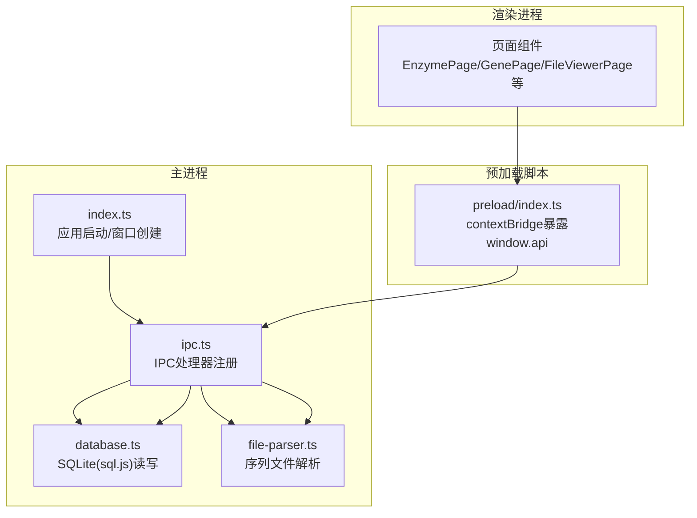
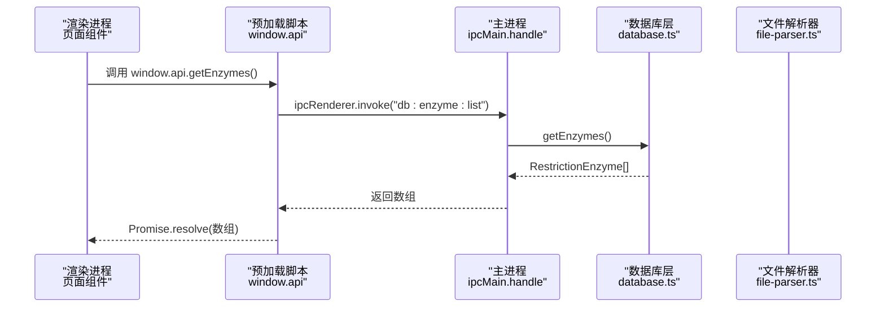
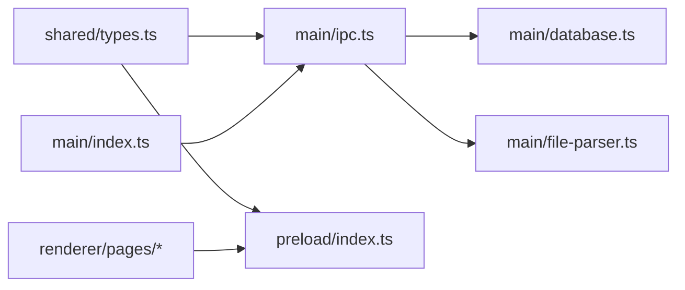

# API参考

<cite>
**本文引用的文件**
- [src/main/index.ts](file://gene-engineering-tool/src/main/index.ts)
- [src/main/ipc.ts](file://gene-engineering-tool/src/main/ipc.ts)
- [preload/index.ts](file://gene-engineering-tool/preload/index.ts)
- [src/shared/types.ts](file://gene-engineering-tool/src/shared/types.ts)
- [src/main/database.ts](file://gene-engineering-tool/src/main/database.ts)
- [src/main/file-parser.ts](file://gene-engineering-tool/src/main/file-parser.ts)
- [package.json](file://gene-engineering-tool/package.json)
</cite>

## 目录
1. [简介](#简介)
2. [项目结构](#项目结构)
3. [核心组件](#核心组件)
4. [架构总览](#架构总览)
5. [详细组件分析](#详细组件分析)
6. [依赖关系分析](#依赖关系分析)
7. [性能考虑](#性能考虑)
8. [故障排查指南](#故障排查指南)
9. [结论](#结论)
10. [附录](#附录)

## 简介
本API参考文档面向基因工程辅助软件的IPC通信接口，覆盖以下范围：
- IPC通道定义与请求/响应规范（基于Electron的ipcMain/ipcRenderer）
- 预加载脚本暴露的安全API方法清单
- 数据模型与字段说明
- 错误处理约定与常见错误码
- 客户端集成指南与最佳实践
- 版本管理与向后兼容性说明

注意：本项目未实现RESTful HTTP服务或WebSocket实时通信。所有对外能力均通过进程内IPC通道提供。

## 项目结构
- 主进程负责应用生命周期、数据库初始化、IPC处理器注册与窗口创建
- 预加载脚本通过contextBridge安全暴露API给渲染进程
- 共享类型定义统一约束IPC参数与返回值
- 数据库层使用sql.js在本地持久化数据
- 文件解析器支持GenBank与FASTA格式

图表来源
- [src/main/index.ts:1-59](file://gene-engineering-tool/src/main/index.ts#L1-L59)
- [src/main/ipc.ts:1-145](file://gene-engineering-tool/src/main/ipc.ts#L1-L145)
- [src/main/database.ts:1-439](file://gene-engineering-tool/src/main/database.ts#L1-L439)
- [src/main/file-parser.ts:1-243](file://gene-engineering-tool/src/main/file-parser.ts#L1-L243)
- [preload/index.ts:1-46](file://gene-engineering-tool/preload/index.ts#L1-L46)

章节来源
- [src/main/index.ts:1-59](file://gene-engineering-tool/src/main/index.ts#L1-L59)
- [package.json:1-37](file://gene-engineering-tool/package.json#L1-L37)

## 核心组件
- IPC通道常量集中定义于共享类型模块，确保主/渲染端一致
- 预加载脚本将API以Promise风格暴露为window.api
- 主进程根据通道名分发到对应业务逻辑（数据库或文件解析）

章节来源
- [src/shared/types.ts:93-132](file://gene-engineering-tool/src/shared/types.ts#L93-L132)
- [preload/index.ts:1-46](file://gene-engineering-tool/preload/index.ts#L1-L46)
- [src/main/ipc.ts:1-145](file://gene-engineering-tool/src/main/ipc.ts#L1-L145)

## 架构总览
下图展示了从渲染进程调用到主进程处理并返回结果的完整流程。

图表来源
- [preload/index.ts:4-11](file://gene-engineering-tool/preload/index.ts#L4-L11)
- [src/main/ipc.ts:9-12](file://gene-engineering-tool/src/main/ipc.ts#L9-L12)
- [src/main/database.ts:141-143](file://gene-engineering-tool/src/main/database.ts#L141-L143)

## 详细组件分析

### 数据类型与模型
以下为所有IPC接口使用的核心数据结构。字段含义与取值范围详见各小节。

- 限制性内切酶
  - id: number
  - name: string
  - source_organism: string
  - recognition_sequence: string
  - cut_position: number
  - optimal_temp: number
  - is_palindromic: boolean

- 载体
  - id: number
  - name: string
  - type: 'plasmid' | 'phage' | 'cosmid' | 'bac' | 'yac' | 'other'
  - size_bp: number
  - description: string
  - sequence: string
  - backbone_id: number | null

- 载体-酶切位点
  - id: number
  - vector_id: number
  - enzyme_id: number
  - position: number
  - is_unique: boolean
  - enzyme?: RestrictionEnzyme

- 基因序列
  - id: number
  - gene_name: string
  - type: 'mrna' | 'cdna' | 'genomic' | 'protein'
  - species: string
  - sequence: string
  - accession_number: string
  - description: string

- 基因关系
  - id: number
  - gene_id: number
  - related_gene_id: number
  - relation_type: string

- 实验室载体
  - id: number
  - vector_id: number
  - name: string
  - insert_gene_id: number | null
  - empty_vector_id: number | null
  - notes: string
  - created_at: string
  - vector?: Vector
  - insert_gene?: GeneSequence
  - empty_vector?: LabVector

- GenBank记录
  - name: string
  - description: string
  - sequence: string
  - size: number
  - features: GenBankFeature[]
  - accession: string
  - version: string
  - topology: 'linear' | 'circular'

- GenBank特征
  - type: string
  - location: string
  - start: number
  - end: number
  - strand: 1 | -1
  - qualifiers: Record<string, string>

- FASTA记录
  - id: string
  - description: string
  - sequence: string

章节来源
- [src/shared/types.ts:1-92](file://gene-engineering-tool/src/shared/types.ts#L1-L92)

### IPC通道与方法清单

说明：
- 所有方法均为异步Promise风格，由预加载脚本封装后暴露为window.api.*
- 请求参数与返回类型严格遵循共享类型定义
- 未显式声明的参数均为可选；若需要必填，将在“参数”列标注

#### 通用约定
- 成功响应：直接返回数据对象或数组
- 失败响应：抛出异常（见“错误处理约定”）
- 空结果：返回空数组或null（视具体接口而定）

#### 酶（Restriction Enzyme）
- 列表查询
  - 通道：db:enzyme:list
  - 请求参数：无
  - 响应：RestrictionEnzyme[]
  - 示例路径：[src/main/ipc.ts:10-12](file://gene-engineering-tool/src/main/ipc.ts#L10-L12)
- 按ID获取
  - 通道：db:enzyme:get
  - 请求参数：id: number
  - 响应：RestrictionEnzyme | undefined
  - 示例路径：[src/main/ipc.ts:14-16](file://gene-engineering-tool/src/main/ipc.ts#L14-L16)
- 搜索
  - 通道：db:enzyme:search
  - 请求参数：query: string
  - 响应：RestrictionEnzyme[]
  - 示例路径：[src/main/ipc.ts:18-20](file://gene-engineering-tool/src/main/ipc.ts#L18-L20)
- 新增
  - 通道：db:enzyme:create
  - 请求参数：data: Omit<RestrictionEnzyme, 'id'>
  - 响应：number（新记录id）
  - 示例路径：[src/main/ipc.ts:22-24](file://gene-engineering-tool/src/main/ipc.ts#L22-L24)
- 更新
  - 通道：db:enzyme:update
  - 请求参数：id: number, data: Partial<RestrictionEnzyme>
  - 响应：void
  - 示例路径：[src/main/ipc.ts:26-28](file://gene-engineering-tool/src/main/ipc.ts#L26-L28)
- 删除
  - 通道：db:enzyme:delete
  - 请求参数：id: number
  - 响应：void
  - 示例路径：[src/main/ipc.ts:30-32](file://gene-engineering-tool/src/main/ipc.ts#L30-L32)

章节来源
- [src/main/ipc.ts:9-32](file://gene-engineering-tool/src/main/ipc.ts#L9-L32)
- [src/main/database.ts:141-180](file://gene-engineering-tool/src/main/database.ts#L141-L180)
- [src/shared/types.ts:1-10](file://gene-engineering-tool/src/shared/types.ts#L1-L10)

#### 载体（Vector）
- 列表查询
  - 通道：db:vector:list
  - 请求参数：无
  - 响应：Vector[]
  - 示例路径：[src/main/ipc.ts:35-37](file://gene-engineering-tool/src/main/ipc.ts#L35-L37)
- 按ID获取
  - 通道：db:vector:get
  - 请求参数：id: number
  - 响应：Vector | undefined
  - 示例路径：[src/main/ipc.ts:39-41](file://gene-engineering-tool/src/main/ipc.ts#L39-L41)
- 新增
  - 通道：db:vector:create
  - 请求参数：data: Omit<Vector, 'id'>
  - 响应：number
  - 示例路径：[src/main/ipc.ts:43-45](file://gene-engineering-tool/src/main/ipc.ts#L43-L45)
- 更新
  - 通道：db:vector:update
  - 请求参数：id: number, data: Partial<Vector>
  - 响应：void
  - 示例路径：[src/main/ipc.ts:47-49](file://gene-engineering-tool/src/main/ipc.ts#L47-L49)
- 删除
  - 通道：db:vector:delete
  - 请求参数：id: number
  - 响应：void
  - 示例路径：[src/main/ipc.ts:51-53](file://gene-engineering-tool/src/main/ipc.ts#L51-L53)
- 获取载体上的酶切位点
  - 通道：db:vector:enzyme-sites
  - 请求参数：vectorId: number
  - 响应：VectorEnzymeSite[]
  - 示例路径：[src/main/ipc.ts:55-57](file://gene-engineering-tool/src/main/ipc.ts#L55-L57)

章节来源
- [src/main/ipc.ts:34-57](file://gene-engineering-tool/src/main/ipc.ts#L34-L57)
- [src/main/database.ts:184-238](file://gene-engineering-tool/src/main/database.ts#L184-L238)
- [src/shared/types.ts:12-30](file://gene-engineering-tool/src/shared/types.ts#L12-L30)

#### 基因序列（Gene Sequence）
- 列表查询（可按类型过滤）
  - 通道：db:gene:list
  - 请求参数：type?: 'mrna' | 'cdna' | 'genomic' | 'protein'
  - 响应：GeneSequence[]
  - 示例路径：[src/main/ipc.ts:60-62](file://gene-engineering-tool/src/main/ipc.ts#L60-L62)
- 按ID获取
  - 通道：db:gene:get
  - 请求参数：id: number
  - 响应：GeneSequence | undefined
  - 示例路径：[src/main/ipc.ts:64-66](file://gene-engineering-tool/src/main/ipc.ts#L64-L66)
- 搜索（可结合类型过滤）
  - 通道：db:gene:search
  - 请求参数：query: string, type?: 'mrna' | 'cdna' | 'genomic' | 'protein'
  - 响应：GeneSequence[]
  - 示例路径：[src/main/ipc.ts:68-70](file://gene-engineering-tool/src/main/ipc.ts#L68-L70)
- 新增
  - 通道：db:gene:create
  - 请求参数：data: Omit<GeneSequence, 'id'>
  - 响应：number
  - 示例路径：[src/main/ipc.ts:72-74](file://gene-engineering-tool/src/main/ipc.ts#L72-L74)
- 更新
  - 通道：db:gene:update
  - 请求参数：id: number, data: Partial<GeneSequence>
  - 响应：void
  - 示例路径：[src/main/ipc.ts:76-78](file://gene-engineering-tool/src/main/ipc.ts#L76-L78)
- 删除
  - 通道：db:gene:delete
  - 请求参数：id: number
  - 响应：void
  - 示例路径：[src/main/ipc.ts:80-82](file://gene-engineering-tool/src/main/ipc.ts#L80-L82)
- 获取关联关系
  - 通道：db:gene:relations
  - 请求参数：geneId: number
  - 响应：GeneRelation[]
  - 示例路径：[src/main/ipc.ts:84-86](file://gene-engineering-tool/src/main/ipc.ts#L84-L86)

章节来源
- [src/main/ipc.ts:59-86](file://gene-engineering-tool/src/main/ipc.ts#L59-L86)
- [src/main/database.ts:242-317](file://gene-engineering-tool/src/main/database.ts#L242-L317)
- [src/shared/types.ts:32-50](file://gene-engineering-tool/src/shared/types.ts#L32-L50)

#### 实验室载体（Lab Vector）
- 列表查询
  - 通道：db:lab-vector:list
  - 请求参数：无
  - 响应：LabVector[]
  - 示例路径：[src/main/ipc.ts:89-91](file://gene-engineering-tool/src/main/ipc.ts#L89-L91)
- 按ID获取
  - 通道：db:lab-vector:get
  - 请求参数：id: number
  - 响应：LabVector | undefined
  - 示例路径：[src/main/ipc.ts:93-95](file://gene-engineering-tool/src/main/ipc.ts#L93-L95)
- 新增
  - 通道：db:lab-vector:create
  - 请求参数：data: Omit<LabVector, 'id' | 'created_at'>
  - 响应：number
  - 示例路径：[src/main/ipc.ts:97-99](file://gene-engineering-tool/src/main/ipc.ts#L97-L99)
- 更新
  - 通道：db:lab-vector:update
  - 请求参数：id: number, data: Partial<LabVector>
  - 响应：void
  - 示例路径：[src/main/ipc.ts:101-103](file://gene-engineering-tool/src/main/ipc.ts#L101-L103)
- 删除
  - 通道：db:lab-vector:delete
  - 请求参数：id: number
  - 响应：void
  - 示例路径：[src/main/ipc.ts:105-107](file://gene-engineering-tool/src/main/ipc.ts#L105-L107)

章节来源
- [src/main/ipc.ts:88-107](file://gene-engineering-tool/src/main/ipc.ts#L88-L107)
- [src/main/database.ts:321-370](file://gene-engineering-tool/src/main/database.ts#L321-L370)
- [src/shared/types.ts:52-64](file://gene-engineering-tool/src/shared/types.ts#L52-L64)

#### 文件操作与解析
- 打开系统文件对话框并自动解析
  - 通道：file:open
  - 请求参数：无
  - 响应：{ type: 'genbank' | 'fasta', data: GenBankRecord | FastaRecord[], filePath: string } | null
  - 说明：仅支持gb/gbk/genbank与fasta/fa/fna扩展名；解析失败或取消则返回null
  - 示例路径：[src/main/ipc.ts:110-135](file://gene-engineering-tool/src/main/ipc.ts#L110-L135)
- 解析GenBank内容
  - 通道：file:parse-genbank
  - 请求参数：content: string
  - 响应：GenBankRecord
  - 示例路径：[src/main/ipc.ts:137-139](file://gene-engineering-tool/src/main/ipc.ts#L137-L139)
- 解析FASTA内容
  - 通道：file:parse-fasta
  - 请求参数：content: string
  - 响应：FastaRecord[]
  - 示例路径：[src/main/ipc.ts:141-143](file://gene-engineering-tool/src/main/ipc.ts#L141-L143)

章节来源
- [src/main/ipc.ts:109-143](file://gene-engineering-tool/src/main/ipc.ts#L109-L143)
- [src/main/file-parser.ts:6-130](file://gene-engineering-tool/src/main/file-parser.ts#L6-L130)
- [src/main/file-parser.ts:199-242](file://gene-engineering-tool/src/main/file-parser.ts#L199-L242)
- [src/shared/types.ts:66-91](file://gene-engineering-tool/src/shared/types.ts#L66-L91)

### 预加载脚本暴露的安全API
- 暴露方式：通过contextBridge.exposeInMainWorld('api', api)
- 可用方法（与IPC通道一一对应）：
  - 酶：getEnzymes, getEnzyme, searchEnzymes, createEnzyme, updateEnzyme, deleteEnzyme
  - 载体：getVectors, getVector, createVector, updateVector, deleteVector, getVectorEnzymeSites
  - 基因：getGenes, getGene, searchGenes, createGene, updateGene, deleteGene, getGeneRelations
  - 实验室载体：getLabVectors, getLabVector, createLabVector, updateLabVector, deleteLabVector
  - 文件：openFile, parseGenBank, parseFasta
- 调用方式：window.api.<method>(...args).then(...)

章节来源
- [preload/index.ts:4-43](file://gene-engineering-tool/preload/index.ts#L4-L43)

### 认证机制与安全考虑
- 当前未实现任何认证或鉴权机制
- 安全边界：
  - 渲染进程无法直接访问Node.js环境（nodeIntegration: false）
  - 上下文隔离开启（contextIsolation: true），仅通过预加载脚本暴露的方法访问主进程能力
  - 外部链接在新窗口中打开（shell.openExternal），避免在主窗口中导航至不受控URL
- 建议：
  - 如需多用户或多租户，可在主进程侧增加会话与权限校验
  - 对敏感操作（如删除）增加二次确认与审计日志

章节来源
- [src/main/index.ts:17-22](file://gene-engineering-tool/src/main/index.ts#L17-L22)
- [src/main/index.ts:29-32](file://gene-engineering-tool/src/main/index.ts#L29-L32)

### 错误处理约定
- 异常传播：主进程处理器抛出的异常会沿ipcRenderer.invoke回传到渲染进程，表现为Promise.reject
- 常见错误场景与建议处理：
  - 数据库不可用或损坏：捕获异常并重试或提示用户修复数据库
  - 非法参数（如缺失必填字段）：在业务层进行前置校验，返回明确错误信息
  - 文件解析失败：捕获异常并提示文件格式不正确
- 错误码：当前未定义结构化错误码，建议在后续迭代中引入统一错误对象（含code/message）

章节来源
- [src/main/ipc.ts:1-145](file://gene-engineering-tool/src/main/ipc.ts#L1-L145)

### 客户端集成指南与最佳实践
- 基本用法
  - 在渲染进程中直接调用window.api.*方法
  - 使用async/await或Promise链式处理
- 典型流程（以打开文件为例）
  - 调用openFile
  - 判断返回的type分支处理GenBank或FASTA数据
  - 展示解析结果
- 最佳实践
  - 对长列表查询进行分页或按需加载（当前为全量返回）
  - 对大文件解析进行进度反馈与超时控制
  - 对频繁搜索进行防抖处理
  - 对写操作（增删改）进行乐观更新与失败回滚策略

章节来源
- [src/renderer/pages/FileViewerPage.tsx:12-45](file://gene-engineering-tool/src/renderer/pages/FileViewerPage.tsx#L12-L45)
- [src/renderer/pages/EnzymePage.tsx:19-68](file://gene-engineering-tool/src/renderer/pages/EnzymePage.tsx#L19-L68)
- [src/renderer/pages/GenePage.tsx:33-71](file://gene-engineering-tool/src/renderer/pages/GenePage.tsx#L33-L71)

### API版本管理与向后兼容性
- 当前版本：0.1.0（参见package.json）
- 通道命名采用“资源:动作”形式，便于未来扩展
- 向后兼容建议：
  - 新增字段时保持旧字段不变，默认值需合理
  - 废弃字段保留一段时间并提供迁移工具
  - 对破坏性变更升级主版本号并在发布说明中明确

章节来源
- [package.json:1-37](file://gene-engineering-tool/package.json#L1-L37)

## 依赖关系分析
- 主进程依赖：
  - Electron（app、BrowserWindow、ipcMain、dialog、shell）
  - sql.js（本地SQLite）
  - fs/path（文件系统）
- 预加载脚本依赖：
  - electron（contextBridge、ipcRenderer）
- 共享类型：
  - 被主进程、预加载脚本与渲染进程共同引用，保证契约一致性

图表来源
- [src/shared/types.ts:93-132](file://gene-engineering-tool/src/shared/types.ts#L93-L132)
- [src/main/ipc.ts:1-145](file://gene-engineering-tool/src/main/ipc.ts#L1-L145)
- [preload/index.ts:1-46](file://gene-engineering-tool/preload/index.ts#L1-L46)
- [src/main/index.ts:1-59](file://gene-engineering-tool/src/main/index.ts#L1-L59)

章节来源
- [src/main/index.ts:1-59](file://gene-engineering-tool/src/main/index.ts#L1-L59)
- [src/main/ipc.ts:1-145](file://gene-engineering-tool/src/main/ipc.ts#L1-L145)
- [src/main/database.ts:1-439](file://gene-engineering-tool/src/main/database.ts#L1-L439)
- [src/main/file-parser.ts:1-243](file://gene-engineering-tool/src/main/file-parser.ts#L1-L243)
- [preload/index.ts:1-46](file://gene-engineering-tool/preload/index.ts#L1-L46)
- [src/shared/types.ts:1-132](file://gene-engineering-tool/src/shared/types.ts#L1-L132)

## 性能考虑
- 数据库
  - 使用WAL模式提升并发写入性能
  - 针对常用字段建立索引（名称、识别序列、类型等）
- 文件解析
  - 大文件解析可能阻塞主线程，建议分块解析或Web Worker（当前为主进程同步解析）
- 前端交互
  - 列表与搜索建议加入分页与防抖
  - 大序列显示采用虚拟滚动或分段渲染

章节来源
- [src/main/database.ts:62-64](file://gene-engineering-tool/src/main/database.ts#L62-L64)
- [src/main/database.ts:129-134](file://gene-engineering-tool/src/main/database.ts#L129-L134)
- [src/main/file-parser.ts:6-130](file://gene-engineering-tool/src/main/file-parser.ts#L6-L130)

## 故障排查指南
- 常见问题
  - 无法打开文件：检查文件扩展名是否在允许列表中
  - 解析结果为空：确认文件格式是否符合GenBank/FASTA标准
  - 数据库为空：首次运行会自动种子部分限制酶数据，若仍为空请检查userData目录下的数据库文件是否可读
- 定位步骤
  - 在主进程控制台查看异常堆栈
  - 在渲染进程捕获Promise.reject并打印错误信息
  - 验证IPC通道名称是否与共享类型一致

章节来源
- [src/main/ipc.ts:110-143](file://gene-engineering-tool/src/main/ipc.ts#L110-L143)
- [src/main/database.ts:49-65](file://gene-engineering-tool/src/main/database.ts#L49-L65)
- [src/main/database.ts:374-438](file://gene-engineering-tool/src/main/database.ts#L374-L438)

## 结论
本项目的API体系围绕Electron IPC构建，通过预加载脚本安全地暴露受限能力给渲染进程。当前版本聚焦于酶、载体、基因序列、实验室载体以及序列文件的读取与解析。后续可在现有基础上扩展认证、错误码、分页与实时通信能力，以满足更复杂的协作与可视化需求。

## 附录

### RESTful与WebSocket说明
- 本项目未实现HTTP REST服务与WebSocket通信
- 所有能力通过IPC通道提供，适合桌面端本地使用场景

### 快速上手示例（路径指引）
- 打开文件并展示：[src/renderer/pages/FileViewerPage.tsx:12-45](file://gene-engineering-tool/src/renderer/pages/FileViewerPage.tsx#L12-L45)
- 酶CRUD调用：[src/renderer/pages/EnzymePage.tsx:19-68](file://gene-engineering-tool/src/renderer/pages/EnzymePage.tsx#L19-L68)
- 基因CRUD与关系查询：[src/renderer/pages/GenePage.tsx:33-71](file://gene-engineering-tool/src/renderer/pages/GenePage.tsx#L33-L71)