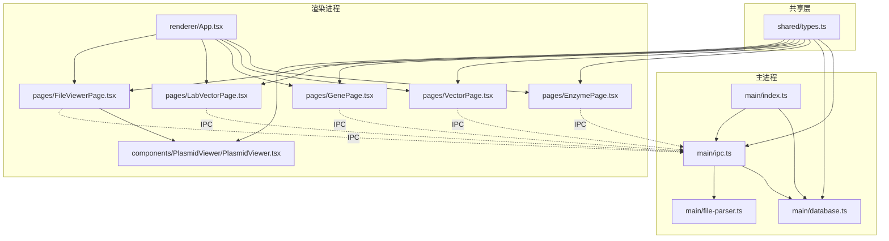
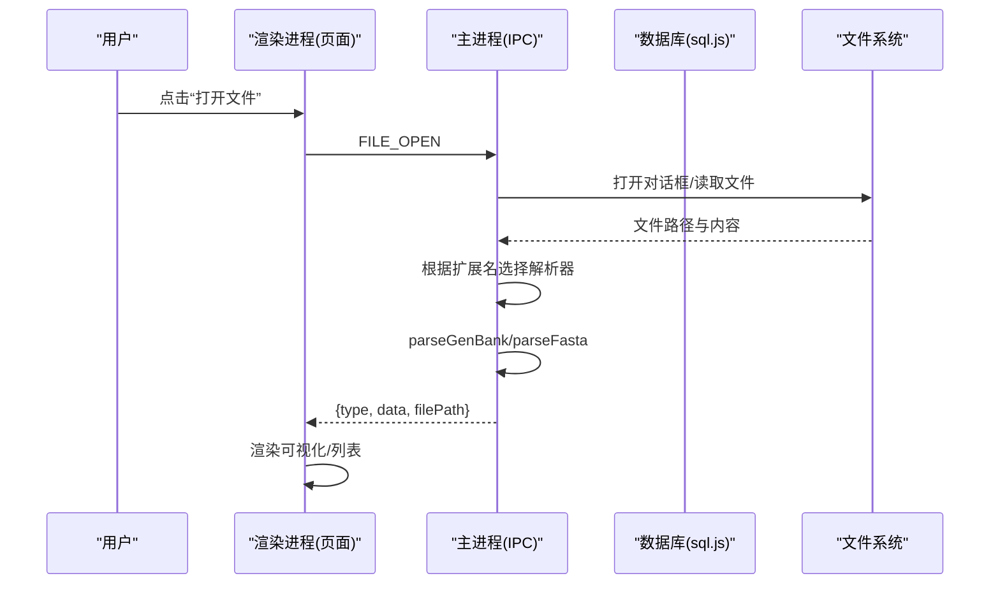
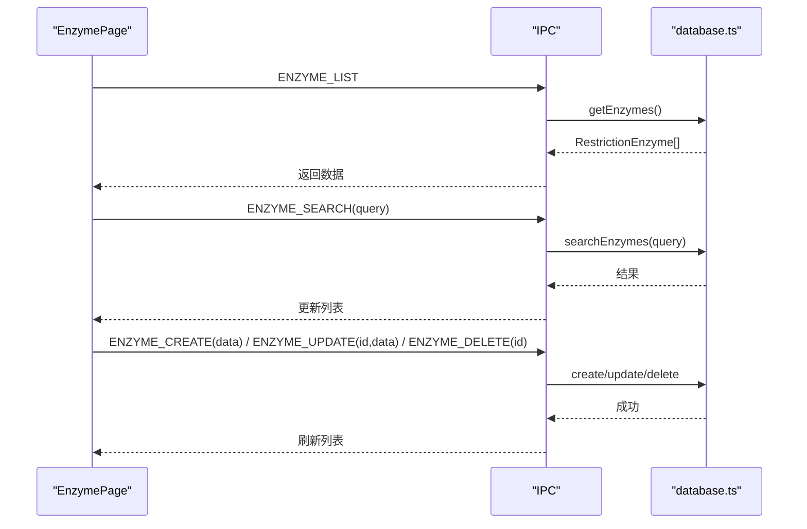
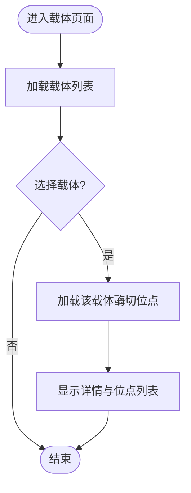
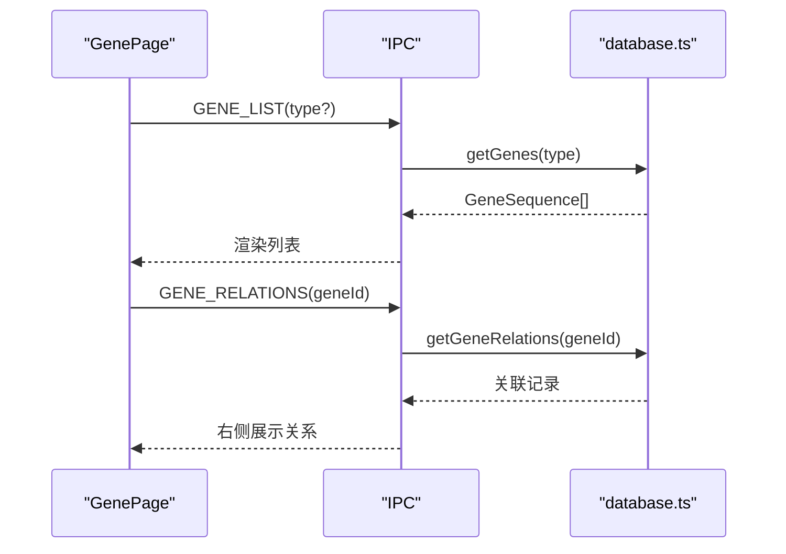
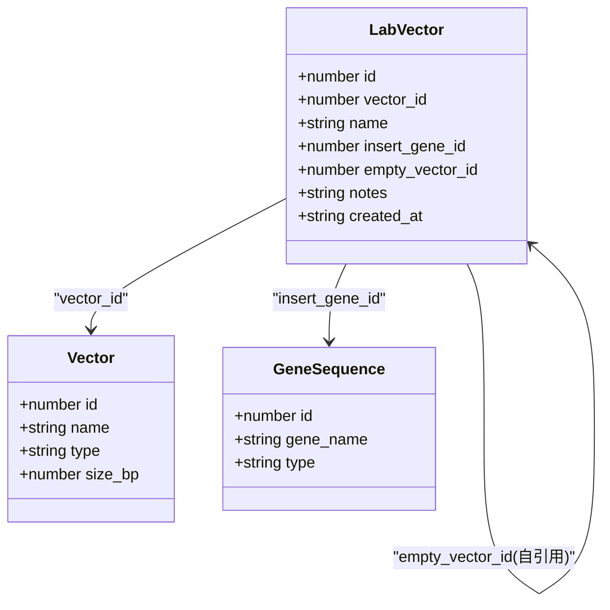
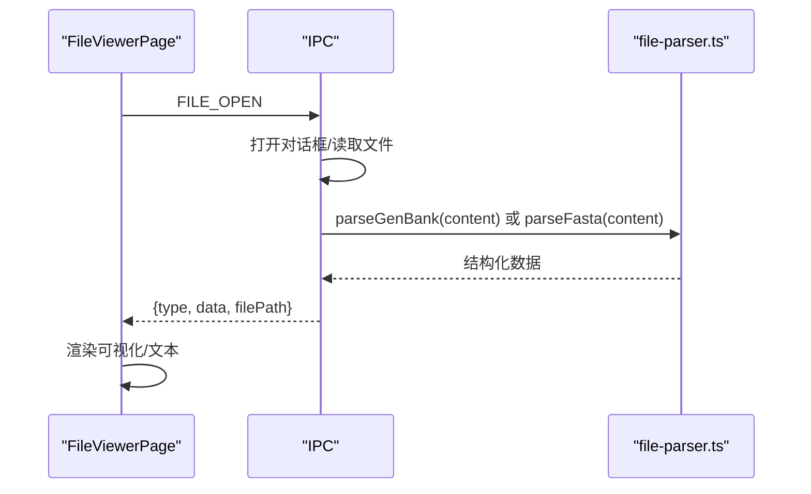
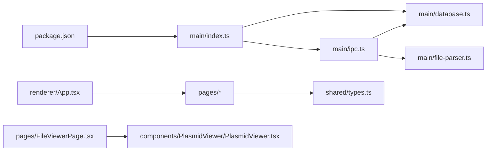

# 功能模块

<cite>
**本文引用的文件**   
- [package.json](file://gene-engineering-tool/package.json)
- [src/main/index.ts](file://gene-engineering-tool/src/main/index.ts)
- [src/main/database.ts](file://gene-engineering-tool/src/main/database.ts)
- [src/main/ipc.ts](file://gene-engineering-tool/src/main/ipc.ts)
- [src/main/file-parser.ts](file://gene-engineering-tool/src/main/file-parser.ts)
- [src/shared/types.ts](file://gene-engineering-tool/src/shared/types.ts)
- [src/renderer/App.tsx](file://gene-engineering-tool/src/renderer/App.tsx)
- [src/renderer/pages/EnzymePage.tsx](file://gene-engineering-tool/src/renderer/pages/EnzymePage.tsx)
- [src/renderer/pages/VectorPage.tsx](file://gene-engineering-tool/src/renderer/pages/VectorPage.tsx)
- [src/renderer/pages/GenePage.tsx](file://gene-engineering-tool/src/renderer/pages/GenePage.tsx)
- [src/renderer/pages/LabVectorPage.tsx](file://gene-engineering-tool/src/renderer/pages/LabVectorPage.tsx)
- [src/renderer/pages/FileViewerPage.tsx](file://gene-engineering-tool/src/renderer/pages/FileViewerPage.tsx)
- [src/renderer/components/PlasmidViewer/PlasmidViewer.tsx](file://gene-engineering-tool/src/renderer/components/PlasmidViewer/PlasmidViewer.tsx)
</cite>

## 目录
1. [简介](#简介)
2. [项目结构](#项目结构)
3. [核心组件](#核心组件)
4. [架构总览](#架构总览)
5. [详细组件分析](#详细组件分析)
6. [依赖关系分析](#依赖关系分析)
7. [性能与可用性建议](#性能与可用性建议)
8. [故障排查指南](#故障排查指南)
9. [结论](#结论)
10. [附录：常见工作流与最佳实践](#附录常见工作流与最佳实践)

## 简介
本使用文档面向基因工程辅助软件的功能模块，覆盖以下能力：
- 限制性内切酶管理：浏览、搜索、添加、编辑、删除
- 载体数据库管理：载体类型、序列与酶切位点管理
- 基因序列库：多类型序列（mRNA/cDNA/genomic/protein）与关系图谱展示
- 实验室载体管理：实验流程集成（关联载体、插入基因、空载体对照）
- 文件查看器：导入 GenBank/FASTA 并可视化（环形/线性视图）

本工具基于 Electron + React 构建，主进程使用 sql.js 提供本地 SQLite 数据库，渲染进程通过 IPC 调用后端服务。

## 项目结构
应用采用前后端分层组织：
- 主进程（Electron main）：初始化窗口、数据库、IPC 处理器、文件解析
- 渲染进程（React）：页面级路由与交互，侧边栏导航到各功能页
- 共享类型定义：统一的数据模型与 IPC 通道常量
- 组件：通用可视化组件（质粒图）

图示来源
- [src/main/index.ts:1-59](file://gene-engineering-tool/src/main/index.ts#L1-L59)
- [src/main/ipc.ts:1-145](file://gene-engineering-tool/src/main/ipc.ts#L1-L145)
- [src/main/database.ts:1-439](file://gene-engineering-tool/src/main/database.ts#L1-L439)
- [src/main/file-parser.ts:1-243](file://gene-engineering-tool/src/main/file-parser.ts#L1-L243)
- [src/shared/types.ts:1-132](file://gene-engineering-tool/src/shared/types.ts#L1-L132)
- [src/renderer/App.tsx:1-106](file://gene-engineering-tool/src/renderer/App.tsx#L1-L106)
- [src/renderer/pages/EnzymePage.tsx:1-252](file://gene-engineering-tool/src/renderer/pages/EnzymePage.tsx#L1-L252)
- [src/renderer/pages/VectorPage.tsx:1-191](file://gene-engineering-tool/src/renderer/pages/VectorPage.tsx#L1-L191)
- [src/renderer/pages/GenePage.tsx:1-219](file://gene-engineering-tool/src/renderer/pages/GenePage.tsx#L1-L219)
- [src/renderer/pages/LabVectorPage.tsx:1-172](file://gene-engineering-tool/src/renderer/pages/LabVectorPage.tsx#L1-L172)
- [src/renderer/pages/FileViewerPage.tsx:1-152](file://gene-engineering-tool/src/renderer/pages/FileViewerPage.tsx#L1-L152)
- [src/renderer/components/PlasmidViewer/PlasmidViewer.tsx:1-362](file://gene-engineering-tool/src/renderer/components/PlasmidViewer/PlasmidViewer.tsx#L1-L362)

章节来源
- [src/main/index.ts:1-59](file://gene-engineering-tool/src/main/index.ts#L1-L59)
- [src/renderer/App.tsx:1-106](file://gene-engineering-tool/src/renderer/App.tsx#L1-L106)
- [src/shared/types.ts:1-132](file://gene-engineering-tool/src/shared/types.ts#L1-L132)

## 核心组件
- 数据模型与通道
  - 共享类型定义了内切酶、载体、基因序列、实验室载体、GenBank/FASTA 记录以及所有 IPC 通道名。
- 数据库层
  - 使用 sql.js 在用户数据目录下创建持久化数据库，包含表结构与索引；首次启动时注入常用内切酶种子数据。
- IPC 层
  - 将前端请求映射到数据库操作与文件解析逻辑，屏蔽底层实现细节。
- 文件解析
  - 支持 GenBank 与 FASTA 格式解析，提取名称、描述、拓扑、长度、特征区域与序列内容。
- 可视化
  - 质粒查看器支持环形与线性两种视图，按元件类型着色，显示方向箭头与刻度。

章节来源
- [src/shared/types.ts:1-132](file://gene-engineering-tool/src/shared/types.ts#L1-L132)
- [src/main/database.ts:1-439](file://gene-engineering-tool/src/main/database.ts#L1-L439)
- [src/main/ipc.ts:1-145](file://gene-engineering-tool/src/main/ipc.ts#L1-L145)
- [src/main/file-parser.ts:1-243](file://gene-engineering-tool/src/main/file-parser.ts#L1-L243)
- [src/renderer/components/PlasmidViewer/PlasmidViewer.tsx:1-362](file://gene-engineering-tool/src/renderer/components/PlasmidViewer/PlasmidViewer.tsx#L1-L362)

## 架构总览
系统采用“渲染进程 UI + 主进程服务”的架构。渲染进程通过 window.api 调用 IPC 通道，主进程处理业务逻辑并访问本地数据库或文件系统。

图示来源
- [src/main/ipc.ts:109-144](file://gene-engineering-tool/src/main/ipc.ts#L109-L144)
- [src/main/file-parser.ts:6-130](file://gene-engineering-tool/src/main/file-parser.ts#L6-L130)
- [src/main/file-parser.ts:199-242](file://gene-engineering-tool/src/main/file-parser.ts#L199-L242)
- [src/renderer/pages/FileViewerPage.tsx:12-45](file://gene-engineering-tool/src/renderer/pages/FileViewerPage.tsx#L12-L45)

## 详细组件分析

### 限制性内切酶管理系统
功能特性
- 浏览：表格列出所有酶，支持高亮识别序列与切割位置，右侧面板展示详细信息与互补链。
- 搜索：支持按名称、物种、识别序列模糊匹配。
- 添加/编辑/删除：弹窗表单完成增删改，保存后刷新列表。

界面与交互要点
- 左侧为列表区，右侧为详情区，顶部有搜索框与“添加”按钮。
- 识别序列以字符为单位渲染，并在切割位处加下划线提示。
- 表单字段包括名称、来源物种、识别序列、切割位置、最适温度、是否回文。

操作步骤
- 浏览：进入“内切酶库”，默认加载全部酶；点击行查看详情。
- 搜索：输入关键词后回车或点击“搜索”。
- 添加：点击“添加”，填写必填项（名称、识别序列），保存。
- 编辑：点击行内“编辑”，修改后保存。
- 删除：点击行内“删除”，确认后移除。

数据流
- 渲染进程通过 IPC 调用 ENZYME_* 通道，主进程执行数据库 CRUD。

图示来源
- [src/renderer/pages/EnzymePage.tsx:19-68](file://gene-engineering-tool/src/renderer/pages/EnzymePage.tsx#L19-L68)
- [src/main/ipc.ts:10-32](file://gene-engineering-tool/src/main/ipc.ts#L10-L32)
- [src/main/database.ts:141-180](file://gene-engineering-tool/src/main/database.ts#L141-L180)

章节来源
- [src/renderer/pages/EnzymePage.tsx:1-252](file://gene-engineering-tool/src/renderer/pages/EnzymePage.tsx#L1-L252)
- [src/main/ipc.ts:10-32](file://gene-engineering-tool/src/main/ipc.ts#L10-L32)
- [src/main/database.ts:141-180](file://gene-engineering-tool/src/main/database.ts#L141-L180)

### 载体数据库管理系统
功能特性
- 载体类型：质粒、噬菌体、黏粒、BAC、YAC、其他。
- 基本信息：名称、大小、描述、序列片段预览。
- 酶切位点管理：查看某载体的所有酶切位点，标注唯一或多位点。

界面与交互要点
- 列表含名称、类型、大小、描述；右侧面板显示类型、大小、描述、空载体关联、酶切位点列表与序列片段。
- 新增/编辑表单支持类型下拉、大小、描述、序列文本。

操作步骤
- 浏览：进入“载体数据库”，点击行查看详情与酶切位点。
- 添加：点击“添加”，选择类型、填写大小与描述，可粘贴序列。
- 编辑/删除：行内操作。
- 查看酶切位点：选中载体后右侧自动加载位点列表。

数据流
- 渲染进程通过 VECTOR_* 通道与数据库交互；选中载体后调用获取酶切位点接口。

图示来源
- [src/renderer/pages/VectorPage.tsx:16-27](file://gene-engineering-tool/src/renderer/pages/VectorPage.tsx#L16-L27)
- [src/main/ipc.ts:34-57](file://gene-engineering-tool/src/main/ipc.ts#L34-L57)
- [src/main/database.ts:184-238](file://gene-engineering-tool/src/main/database.ts#L184-L238)

章节来源
- [src/renderer/pages/VectorPage.tsx:1-191](file://gene-engineering-tool/src/renderer/pages/VectorPage.tsx#L1-L191)
- [src/main/ipc.ts:34-57](file://gene-engineering-tool/src/main/ipc.ts#L34-L57)
- [src/main/database.ts:184-238](file://gene-engineering-tool/src/main/database.ts#L184-L238)

### 基因序列库
功能特性
- 多类型支持：mRNA、cDNA、Genomic、Protein。
- 列表与筛选：按类型标签页切换，支持名称、物种、编号、描述模糊搜索。
- 关系图谱展示：选中基因后加载与其双向关联的其他序列。

界面与交互要点
- 顶部标签页切换类型；表格显示名称、类型、物种、编号、序列长度；右侧面板展示详情与关联序列列表。
- 新增/编辑表单包含类型、物种、编号、描述、序列等字段。

操作步骤
- 浏览：选择标签页或“全部”，点击行查看详情。
- 搜索：输入关键词回车或点击“搜索”。
- 添加/编辑/删除：弹窗表单完成操作。
- 查看关系：选中基因后右侧显示关联序列及类型。

数据流
- 渲染进程通过 GENE_* 通道查询与检索；选中后调用关系接口。

图示来源
- [src/renderer/pages/GenePage.tsx:25-31](file://gene-engineering-tool/src/renderer/pages/GenePage.tsx#L25-L31)
- [src/main/ipc.ts:59-86](file://gene-engineering-tool/src/main/ipc.ts#L59-L86)
- [src/main/database.ts:242-317](file://gene-engineering-tool/src/main/database.ts#L242-L317)

章节来源
- [src/renderer/pages/GenePage.tsx:1-219](file://gene-engineering-tool/src/renderer/pages/GenePage.tsx#L1-L219)
- [src/main/ipc.ts:59-86](file://gene-engineering-tool/src/main/ipc.ts#L59-L86)
- [src/main/database.ts:242-317](file://gene-engineering-tool/src/main/database.ts#L242-L317)

### 实验室载体管理
功能特性
- 实验流程集成：将载体、插入基因、空载体对照进行组合记录，便于追踪实验进度与版本。
- 关联信息：显示关联载体名称、插入基因名称、空载体名称与备注、创建时间。

界面与交互要点
- 列表显示名称、载体、插入基因、空载体、创建时间；右侧面板展示详细信息。
- 新增/编辑表单可从下拉中选择已存在的载体、基因与空载体。

操作步骤
- 浏览：进入“实验室载体”，点击行查看详情。
- 添加：点击“添加”，选择载体、插入基因、空载体，填写备注。
- 编辑/删除：行内操作。

数据流
- 渲染进程通过 LAB_VECTOR_* 通道与数据库交互，查询时联表返回名称等信息。

图示来源
- [src/shared/types.ts:52-64](file://gene-engineering-tool/src/shared/types.ts#L52-L64)
- [src/main/database.ts:319-370](file://gene-engineering-tool/src/main/database.ts#L319-L370)
- [src/renderer/pages/LabVectorPage.tsx:18-27](file://gene-engineering-tool/src/renderer/pages/LabVectorPage.tsx#L18-L27)

章节来源
- [src/renderer/pages/LabVectorPage.tsx:1-172](file://gene-engineering-tool/src/renderer/pages/LabVectorPage.tsx#L1-L172)
- [src/main/ipc.ts:88-107](file://gene-engineering-tool/src/main/ipc.ts#L88-L107)
- [src/main/database.ts:319-370](file://gene-engineering-tool/src/main/database.ts#L319-L370)

### 文件查看器与序列可视化
功能特性
- 导入：支持 GenBank(.gb/.gbk/.genbank) 与 FASTA(.fasta/.fa/.fna) 格式。
- 解析：主进程解析文件并返回结构化数据。
- 可视化：质粒查看器支持环形与线性视图，按元件类型着色，显示方向箭头与刻度；FASTA 以文本形式展示多条记录。

操作步骤
- 打开文件：点击侧边栏“打开文件”或页面内“选择文件”，选择目标文件。
- 查看 GenBank：左侧为 SVG 可视化，右侧为元件列表；可在顶部切换环形/线性视图。
- 查看 FASTA：下方逐条展示标题与序列，自动判断 bp/aa。

数据流
- 渲染进程触发 FILE_OPEN，主进程弹出对话框并读取文件，根据扩展名调用对应解析器，返回结果供渲染。

图示来源
- [src/renderer/pages/FileViewerPage.tsx:12-45](file://gene-engineering-tool/src/renderer/pages/FileViewerPage.tsx#L12-L45)
- [src/main/ipc.ts:109-144](file://gene-engineering-tool/src/main/ipc.ts#L109-L144)
- [src/main/file-parser.ts:6-130](file://gene-engineering-tool/src/main/file-parser.ts#L6-L130)
- [src/main/file-parser.ts:199-242](file://gene-engineering-tool/src/main/file-parser.ts#L199-L242)

章节来源
- [src/renderer/pages/FileViewerPage.tsx:1-152](file://gene-engineering-tool/src/renderer/pages/FileViewerPage.tsx#L1-L152)
- [src/renderer/components/PlasmidViewer/PlasmidViewer.tsx:1-362](file://gene-engineering-tool/src/renderer/components/PlasmidViewer/PlasmidViewer.tsx#L1-L362)
- [src/main/ipc.ts:109-144](file://gene-engineering-tool/src/main/ipc.ts#L109-L144)
- [src/main/file-parser.ts:6-130](file://gene-engineering-tool/src/main/file-parser.ts#L6-L130)
- [src/main/file-parser.ts:199-242](file://gene-engineering-tool/src/main/file-parser.ts#L199-L242)

## 依赖关系分析
- 外部依赖
  - electron、electron-vite、react、zustand、sql.js、electron-store、lucide-react 等。
- 内部依赖
  - 渲染页面依赖 shared/types 定义；IPC 层依赖 database 与 file-parser；主入口负责初始化数据库、种子数据与 IPC 注册。

图示来源
- [package.json:1-37](file://gene-engineering-tool/package.json#L1-L37)
- [src/main/index.ts:1-59](file://gene-engineering-tool/src/main/index.ts#L1-L59)
- [src/main/ipc.ts:1-145](file://gene-engineering-tool/src/main/ipc.ts#L1-L145)
- [src/main/database.ts:1-439](file://gene-engineering-tool/src/main/database.ts#L1-L439)
- [src/main/file-parser.ts:1-243](file://gene-engineering-tool/src/main/file-parser.ts#L1-L243)
- [src/renderer/App.tsx:1-106](file://gene-engineering-tool/src/renderer/App.tsx#L1-L106)
- [src/renderer/pages/FileViewerPage.tsx:1-152](file://gene-engineering-tool/src/renderer/pages/FileViewerPage.tsx#L1-L152)
- [src/renderer/components/PlasmidViewer/PlasmidViewer.tsx:1-362](file://gene-engineering-tool/src/renderer/components/PlasmidViewer/PlasmidViewer.tsx#L1-L362)

章节来源
- [package.json:1-37](file://gene-engineering-tool/package.json#L1-L37)
- [src/main/index.ts:1-59](file://gene-engineering-tool/src/main/index.ts#L1-L59)
- [src/renderer/App.tsx:1-106](file://gene-engineering-tool/src/renderer/App.tsx#L1-L106)

## 性能与可用性建议
- 大数据量优化
  - 对大序列（如 >20kb）的可视化，当前已按规模自适应刻度间隔；如需进一步流畅，可考虑虚拟滚动或分块渲染。
- 数据库性能
  - 已启用 WAL 模式与外键约束，并对常用字段建立索引；建议在大规模导入时批量写入以减少磁盘 I/O。
- 内存占用
  - 大文件解析在主进程完成，避免渲染进程阻塞；对于超大 GenBank/FASTA，建议限制单次解析长度或分页展示。
- 用户体验
  - 增加加载状态与错误提示；对长序列提供缩放与平移控件；为常用操作提供快捷键。

[本节为通用建议，不直接分析具体文件]

## 故障排查指南
- 无法打开文件
  - 检查文件扩展名是否在过滤器中；确认文件可读权限。
- 解析失败
  - 确认文件格式符合 GenBank/FASTA 规范；检查 LOCUS/DEFINITION/FEATURES/ORIGIN 等关键字段是否存在。
- 数据库异常
  - 检查用户数据目录下的数据库文件是否损坏；必要时重置数据库或删除后重启应用。
- 界面无响应
  - 浏览器控制台查看是否有 JS 错误；检查 IPC 通道是否正确注册。

章节来源
- [src/main/ipc.ts:109-144](file://gene-engineering-tool/src/main/ipc.ts#L109-L144)
- [src/main/file-parser.ts:6-130](file://gene-engineering-tool/src/main/file-parser.ts#L6-L130)
- [src/main/database.ts:49-65](file://gene-engineering-tool/src/main/database.ts#L49-L65)

## 结论
本软件围绕“酶—载体—基因—实验载体—文件可视化”构建了完整的基因工程辅助工作流。通过清晰的模块化设计与 IPC 通信机制，实现了本地化、可扩展且易用的桌面体验。后续可在导入自动化、高级可视化与协作同步方面持续增强。

[本节为总结性内容，不直接分析具体文件]

## 附录：常见工作流与最佳实践

- 工作流一：从 GenBank 构建载体与酶切位点
  1) 打开文件查看器，导入 GenBank 文件，查看元件与拓扑。
  2) 在载体数据库中新增载体，填入名称、类型、大小与序列。
  3) 在载体详情中查看或维护酶切位点，标记唯一/多位点。
  4) 在实验室载体中创建实验记录，关联载体与插入基因。

- 工作流二：构建基因关系图谱
  1) 在基因序列库中添加 mRNA/cDNA/genomic/protein 序列。
  2) 通过关系接口建立双向关联（如同源、剪接变体）。
  3) 在详情页查看关联列表，辅助设计引物或克隆策略。

- 最佳实践
  - 命名规范：载体与基因使用稳定命名，保留版本号。
  - 数据校验：录入前检查序列字母集与长度一致性。
  - 备份策略：定期导出数据库文件，防止数据丢失。
  - 注释完善：为关键元件补充描述与来源，便于团队协作。

[本节为概念性指导，不直接分析具体文件]