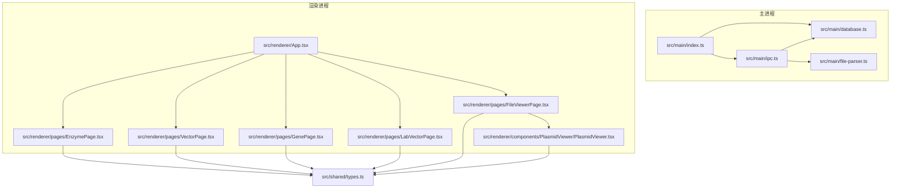
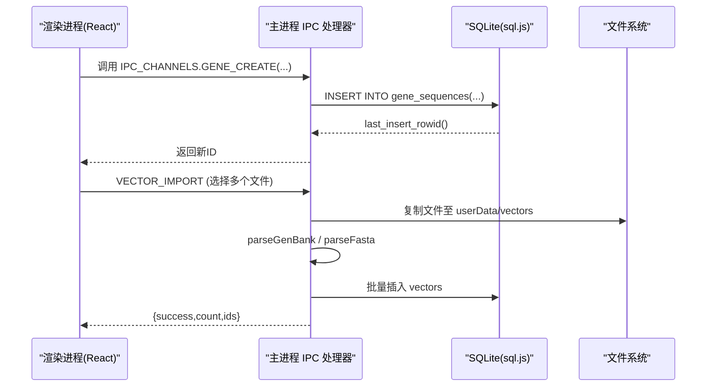
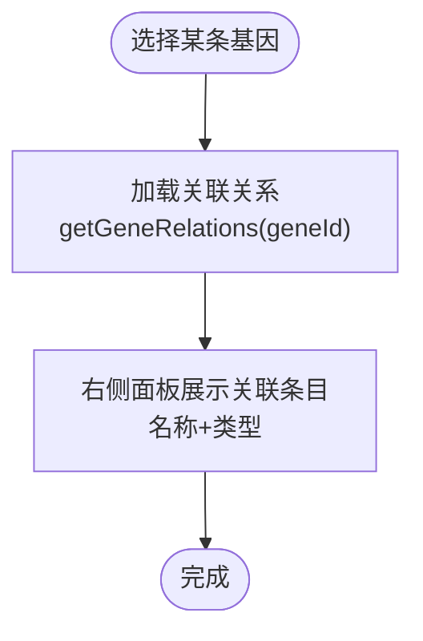
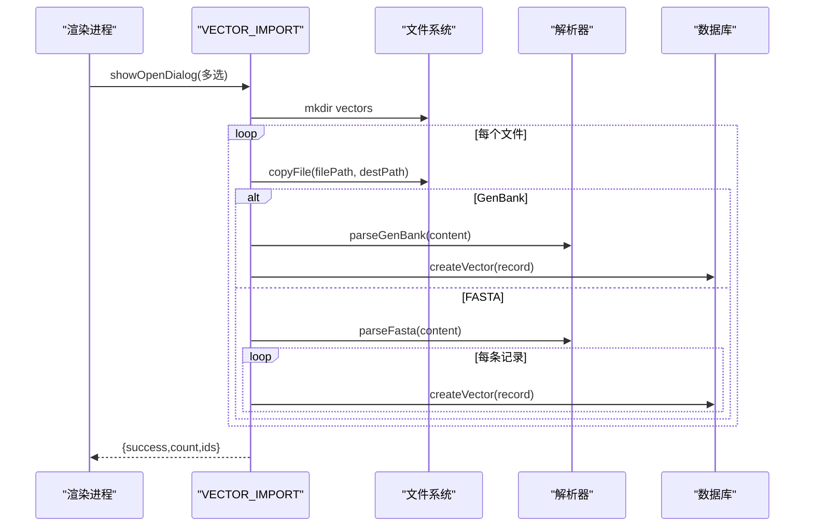
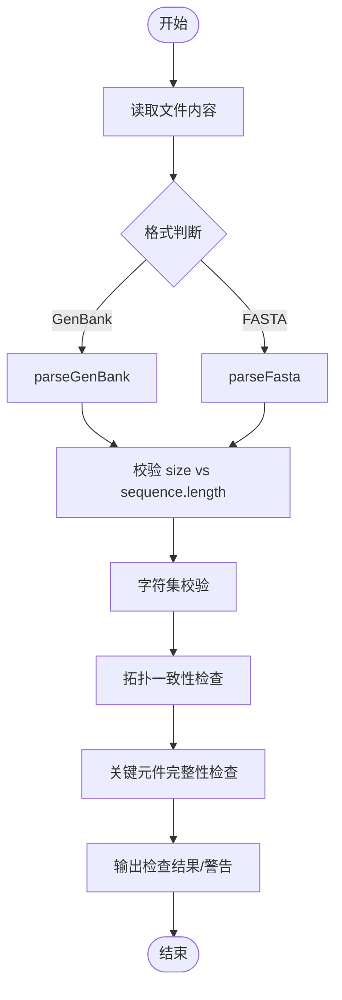
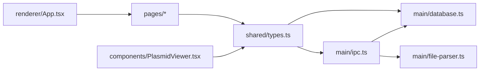

# 基因序列库管理

<cite>
**本文引用的文件**
- [package.json](file://gene-engineering-tool/package.json)
- [src/main/index.ts](file://gene-engineering-tool/src/main/index.ts)
- [src/main/database.ts](file://gene-engineering-tool/src/main/database.ts)
- [src/main/ipc.ts](file://gene-engineering-tool/src/main/ipc.ts)
- [src/main/file-parser.ts](file://gene-engineering-tool/src/main/file-parser.ts)
- [src/shared/types.ts](file://gene-engineering-tool/src/shared/types.ts)
- [src/renderer/App.tsx](file://gene-engineering-tool/src/renderer/App.tsx)
- [src/renderer/pages/EnzymePage.tsx](file://gene-engineering-tool/src/renderer/pages/EnzymePage.tsx)
- [src/renderer/pages/VectorPage.tsx](file://gene-engineering-tool/src/renderer/pages/VectorPage.tsx)
- [src/renderer/pages/GenePage.tsx](file://gene-engineering-tool/src/renderer/pages/GenePage.tsx)
- [src/renderer/pages/LabVectorPage.tsx](file://gene-engineering-tool/src/renderer/pages/LabVectorPage.tsx)
- [src/renderer/pages/FileViewerPage.tsx](file://gene-engineering-tool/src/renderer/pages/FileViewerPage.tsx)
- [src/renderer/components/PlasmidViewer/PlasmidViewer.tsx](file://gene-engineering-tool/src/renderer/components/PlasmidViewer/PlasmidViewer.tsx)
</cite>

## 目录
1. [简介](#简介)
2. [项目结构](#项目结构)
3. [核心组件](#核心组件)
4. [架构总览](#架构总览)
5. [详细组件分析](#详细组件分析)
6. [依赖关系分析](#依赖关系分析)
7. [性能与可扩展性](#性能与可扩展性)
8. [故障排查指南](#故障排查指南)
9. [结论](#结论)
10. [附录：API 与数据模型](#附录api-与数据模型)

## 简介
本系统为“基因工程辅助软件”，面向分子生物学实验场景，提供限制性内切酶、载体、基因序列与实验室载体的全生命周期管理。支持 GenBank 与 FASTA 文件的导入与可视化展示，内置序列关系图谱的构建与查看能力，并提供基础的序列质量检查与分析工具（如长度统计、碱基组成校验、特征元件解析等）。

## 项目结构
应用采用 Electron + React 技术栈，主进程负责数据库初始化、IPC 通道注册与文件操作；渲染进程提供用户界面与交互逻辑；共享类型定义贯穿前后端。

图表来源
- [src/main/index.ts:1-59](file://gene-engineering-tool/src/main/index.ts#L1-L59)
- [src/main/database.ts:1-490](file://gene-engineering-tool/src/main/database.ts#L1-L490)
- [src/main/ipc.ts:1-227](file://gene-engineering-tool/src/main/ipc.ts#L1-L227)
- [src/main/file-parser.ts:1-243](file://gene-engineering-tool/src/main/file-parser.ts#L1-L243)
- [src/shared/types.ts:1-154](file://gene-engineering-tool/src/shared/types.ts#L1-L154)
- [src/renderer/App.tsx:1-106](file://gene-engineering-tool/src/renderer/App.tsx#L1-L106)
- [src/renderer/pages/EnzymePage.tsx:1-252](file://gene-engineering-tool/src/renderer/pages/EnzymePage.tsx#L1-L252)
- [src/renderer/pages/VectorPage.tsx:1-191](file://gene-engineering-tool/src/renderer/pages/VectorPage.tsx#L1-L191)
- [src/renderer/pages/GenePage.tsx:1-219](file://gene-engineering-tool/src/renderer/pages/GenePage.tsx#L1-L219)
- [src/renderer/pages/LabVectorPage.tsx:1-172](file://gene-engineering-tool/src/renderer/pages/LabVectorPage.tsx#L1-L172)
- [src/renderer/pages/FileViewerPage.tsx:1-152](file://gene-engineering-tool/src/renderer/pages/FileViewerPage.tsx#L1-L152)
- [src/renderer/components/PlasmidViewer/PlasmidViewer.tsx:1-362](file://gene-engineering-tool/src/renderer/components/PlasmidViewer/PlasmidViewer.tsx#L1-L362)

章节来源
- [src/main/index.ts:1-59](file://gene-engineering-tool/src/main/index.ts#L1-L59)
- [src/renderer/App.tsx:1-106](file://gene-engineering-tool/src/renderer/App.tsx#L1-L106)
- [package.json:1-37](file://gene-engineering-tool/package.json#L1-L37)

## 核心组件
- 数据库层（SQLite in-memory via sql.js）
  - 表：restriction_enzymes、vectors、vector_enzyme_sites、gene_sequences、gene_relations、lab_vectors
  - 索引：按名称、识别序列、类型等建立常用查询索引
  - 迁移：启动时自动为 vectors 表补齐新增字段
- IPC 通信层
  - 统一通道名常量，封装增删改查与批量导入接口
- 文件解析器
  - GenBank 解析：LOCUS/DEFINITION/ACCESSION/VERSION/FEATURES/ORIGIN 等标准段
  - FASTA 解析：多记录合并行序列
- 前端页面
  - 内切酶库、载体数据库、基因序列库、实验室载体、文件查看器
  - 质粒/线性视图 SVG 可视化

章节来源
- [src/main/database.ts:71-173](file://gene-engineering-tool/src/main/database.ts#L71-L173)
- [src/main/ipc.ts:1-227](file://gene-engineering-tool/src/main/ipc.ts#L1-L227)
- [src/main/file-parser.ts:1-243](file://gene-engineering-tool/src/main/file-parser.ts#L1-L243)
- [src/renderer/pages/EnzymePage.tsx:1-252](file://gene-engineering-tool/src/renderer/pages/EnzymePage.tsx#L1-L252)
- [src/renderer/pages/VectorPage.tsx:1-191](file://gene-engineering-tool/src/renderer/pages/VectorPage.tsx#L1-L191)
- [src/renderer/pages/GenePage.tsx:1-219](file://gene-engineering-tool/src/renderer/pages/GenePage.tsx#L1-L219)
- [src/renderer/pages/LabVectorPage.tsx:1-172](file://gene-engineering-tool/src/renderer/pages/LabVectorPage.tsx#L1-L172)
- [src/renderer/pages/FileViewerPage.tsx:1-152](file://gene-engineering-tool/src/renderer/pages/FileViewerPage.tsx#L1-L152)
- [src/renderer/components/PlasmidViewer/PlasmidViewer.tsx:1-362](file://gene-engineering-tool/src/renderer/components/PlasmidViewer/PlasmidViewer.tsx#L1-L362)

## 架构总览
系统遵循“渲染进程 UI -> IPC -> 主进程业务 -> SQLite”的分层架构。所有持久化操作均通过 SQL 语句执行并落盘到 userData 下的 .db 文件。

图表来源
- [src/main/ipc.ts:60-139](file://gene-engineering-tool/src/main/ipc.ts#L60-L139)
- [src/main/database.ts:318-342](file://gene-engineering-tool/src/main/database.ts#L318-L342)
- [src/main/file-parser.ts:6-130](file://gene-engineering-tool/src/main/file-parser.ts#L6-L130)
- [src/main/file-parser.ts:199-242](file://gene-engineering-tool/src/main/file-parser.ts#L199-L242)

## 详细组件分析

### 支持的序列类型与应用场景
- mRNA：成熟转录本，常用于表达载体设计与引物设计参考
- cDNA：逆转录产物，去内含子，适合原核表达
- Genomic：基因组序列，含内含子/外显子结构，用于真核表达或调控区研究
- Protein：氨基酸序列，用于蛋白表达、翻译后修饰位点分析

章节来源
- [src/shared/types.ts:53-64](file://gene-engineering-tool/src/shared/types.ts#L53-L64)
- [src/renderer/pages/GenePage.tsx:5-11](file://gene-engineering-tool/src/renderer/pages/GenePage.tsx#L5-L11)

### 序列录入、编辑与管理
- 基因序列
  - 列表展示：支持按类型筛选、关键词搜索（名称/物种/编号/描述）
  - 新增/编辑：表单包含名称、类型、物种、编号、描述、序列
  - 删除：二次确认后删除
  - 详情面板：显示基本信息与部分序列预览
- 载体
  - 列表展示：名称、类型、大小、描述
  - 新增/编辑：基础信息与序列
  - 关联酶切位点：右侧面板展示唯一/多位点标记
- 内切酶
  - 列表展示：名称、来源、识别序列、最适温度
  - 新增/编辑：识别序列高亮切割位置，显示互补链
- 实验室载体
  - 将载体、插入基因、空载体组合成实验级克隆体，便于追踪

章节来源
- [src/renderer/pages/GenePage.tsx:13-71](file://gene-engineering-tool/src/renderer/pages/GenePage.tsx#L13-L71)
- [src/renderer/pages/VectorPage.tsx:5-57](file://gene-engineering-tool/src/renderer/pages/VectorPage.tsx#L5-L57)
- [src/renderer/pages/EnzymePage.tsx:5-68](file://gene-engineering-tool/src/renderer/pages/EnzymePage.tsx#L5-L68)
- [src/renderer/pages/LabVectorPage.tsx:5-57](file://gene-engineering-tool/src/renderer/pages/LabVectorPage.tsx#L5-L57)

### 序列关系图谱的构建与可视化
- 关系建模
  - gene_relations 表维护双向关联，支持任意 relation_type
- 查询与展示
  - 根据选中基因 ID 查询与其相关的所有记录（正向与反向），在详情面板中列出
- 可视化建议
  - 可基于当前关系数据扩展为图节点与边，使用力导向布局展示网络拓扑

图表来源
- [src/main/database.ts:344-368](file://gene-engineering-tool/src/main/database.ts#L344-L368)
- [src/renderer/pages/GenePage.tsx:27-31](file://gene-engineering-tool/src/renderer/pages/GenePage.tsx#L27-L31)

章节来源
- [src/main/database.ts:123-129](file://gene-engineering-tool/src/main/database.ts#L123-L129)
- [src/renderer/pages/GenePage.tsx:165-175](file://gene-engineering-tool/src/renderer/pages/GenePage.tsx#L165-L175)

### 批量导入导出功能
- 批量导入
  - 支持 GenBank(.gb/.gbk/.genbank) 与 FASTA(.fasta/.fa/.fna)
  - 流程：打开对话框 -> 复制到 userData/vectors -> 解析内容 -> 写入 vectors 表 -> 返回导入结果
- 导出
  - 当前未实现直接导出按钮，可通过“文件查看器”打开本地文件进行浏览；如需导出，可在后续扩展导出为 GenBank/FASTA

图表来源
- [src/main/ipc.ts:60-139](file://gene-engineering-tool/src/main/ipc.ts#L60-L139)
- [src/main/file-parser.ts:6-130](file://gene-engineering-tool/src/main/file-parser.ts#L6-L130)
- [src/main/file-parser.ts:199-242](file://gene-engineering-tool/src/main/file-parser.ts#L199-L242)

章节来源
- [src/main/ipc.ts:60-139](file://gene-engineering-tool/src/main/ipc.ts#L60-L139)

### 序列数据的质量控制与验证机制
- 输入格式校验
  - GenBank：解析 LOCUS/FEATURES/ORIGIN 等关键段落，提取 name、size、topology、features、sequence
  - FASTA：按 > 头分割，合并多行序列
- 基本质量检查（可在前端或主进程扩展）
  - 长度一致性：对比 LOCUS.size 与实际 sequence.length
  - 字符集校验：核酸序列仅允许 A/T/G/C/U/N 等；蛋白序列仅允许 20 种氨基酸字母
  - 环状/线性拓扑：根据 topology 字段与序列首尾一致性提示
  - 特征完整性：CDS/gene/promoter 等关键元件是否缺失
- 可视化辅助
  - 文件查看器提供环形/线性视图，快速定位异常区域

图表来源
- [src/main/file-parser.ts:6-130](file://gene-engineering-tool/src/main/file-parser.ts#L6-L130)
- [src/main/file-parser.ts:199-242](file://gene-engineering-tool/src/main/file-parser.ts#L199-L242)
- [src/renderer/pages/FileViewerPage.tsx:85-114](file://gene-engineering-tool/src/renderer/pages/FileViewerPage.tsx#L85-L114)

章节来源
- [src/main/file-parser.ts:6-130](file://gene-engineering-tool/src/main/file-parser.ts#L6-L130)
- [src/main/file-parser.ts:199-242](file://gene-engineering-tool/src/main/file-parser.ts#L199-L242)
- [src/renderer/pages/FileViewerPage.tsx:85-114](file://gene-engineering-tool/src/renderer/pages/FileViewerPage.tsx#L85-L114)

### 序列分析的基本工具与示例
- 基础统计
  - 长度统计：bp/aa 计数
  - 碱基/氨基酸组成：计算各残基占比
  - GC 含量：对核酸序列计算 G+C 比例
- 序列比对与检索
  - 局部匹配：查找 motif 出现位置
  - 反向互补：生成互补链（核酸）
- 示例用法（概念说明）
  - 在“文件查看器”中打开 GenBank，切换环形/线性视图，观察 CDS、promoter、terminator 等元件分布
  - 在“基因序列库”中查看序列长度与类型，结合“关系图谱”了解同源或衍生序列

[本节为通用指导，不直接分析具体代码文件]

## 依赖关系分析
- 外部依赖
  - sql.js：嵌入式 SQLite
  - electron-store：可选配置存储（当前未直接使用）
  - zustand：状态管理（当前未直接使用）
  - react/react-dom/router/lucide-react：UI 与图标
- 内部模块耦合
  - IPC 层集中暴露 API，降低前后端耦合度
  - 文件解析器独立于数据库，便于复用与测试

图表来源
- [src/shared/types.ts:1-154](file://gene-engineering-tool/src/shared/types.ts#L1-L154)
- [src/main/database.ts:1-490](file://gene-engineering-tool/src/main/database.ts#L1-L490)
- [src/main/ipc.ts:1-227](file://gene-engineering-tool/src/main/ipc.ts#L1-L227)
- [src/main/file-parser.ts:1-243](file://gene-engineering-tool/src/main/file-parser.ts#L1-L243)
- [src/renderer/App.tsx:1-106](file://gene-engineering-tool/src/renderer/App.tsx#L1-L106)
- [src/renderer/components/PlasmidViewer/PlasmidViewer.tsx:1-362](file://gene-engineering-tool/src/renderer/components/PlasmidViewer/PlasmidViewer.tsx#L1-L362)

章节来源
- [package.json:12-20](file://gene-engineering-tool/package.json#L12-L20)
- [src/main/index.ts:41-45](file://gene-engineering-tool/src/main/index.ts#L41-L45)

## 性能与可扩展性
- 数据库
  - 启用 WAL 模式提升并发读写性能
  - 针对常用字段建立索引（名称、识别序列、类型）
- 文件处理
  - 大文件导入建议分块解析与异步反馈进度（可扩展）
- 可视化
  - SVG 渲染在大型序列上可能卡顿，可引入虚拟滚动或按需绘制策略（可扩展）

[本节为通用指导，不直接分析具体代码文件]

## 故障排查指南
- 常见问题
  - 无法打开文件：确认文件格式为 .gb/.gbk/.genbank 或 .fasta/.fa/.fna
  - 导入失败：检查文件编码为 UTF-8，确保 GenBank 头部完整
  - 数据库损坏：userData 下 .db 文件损坏时可备份后重建
- 定位方法
  - 查看 IPC 返回值与错误信息
  - 在“文件查看器”中打开同一文件，确认解析结果是否正确

章节来源
- [src/main/ipc.ts:191-226](file://gene-engineering-tool/src/main/ipc.ts#L191-L226)
- [src/main/file-parser.ts:6-130](file://gene-engineering-tool/src/main/file-parser.ts#L6-L130)

## 结论
本系统以清晰的模块化架构实现了基因序列库的核心管理能力，涵盖多类型序列管理、关系图谱、批量导入与可视化展示。在此基础上，可进一步扩展质量控制规则、高级分析工具与导出功能，以满足更复杂的科研需求。

[本节为总结性内容，不直接分析具体代码文件]

## 附录：API 与数据模型

### IPC 通道一览（节选）
- 内切酶
  - ENZYME_LIST / ENZYME_GET / ENZYME_SEARCH / ENZYME_CREATE / ENZYME_UPDATE / ENZYME_DELETE
- 载体
  - VECTOR_LIST / VECTOR_GET / VECTOR_CREATE / VECTOR_UPDATE / VECTOR_DELETE / VECTOR_ENZYME_SITES / VECTOR_IMPORT
- 基因序列
  - GENE_LIST / GENE_GET / GENE_SEARCH / GENE_CREATE / GENE_UPDATE / GENE_DELETE / GENE_RELATIONS
- 实验室载体
  - LAB_VECTOR_LIST / LAB_VECTOR_GET / LAB_VECTOR_CREATE / LAB_VECTOR_UPDATE / LAB_VECTOR_DELETE
- 文件操作
  - FILE_OPEN / FILE_PARSE_GENBANK / FILE_PARSE_FASTA

章节来源
- [src/shared/types.ts:114-154](file://gene-engineering-tool/src/shared/types.ts#L114-L154)
- [src/main/ipc.ts:10-226](file://gene-engineering-tool/src/main/ipc.ts#L10-L226)

### 核心数据模型（节选）
- RestrictionEnzyme：内切酶元数据与识别序列
- Vector：载体元数据、序列、拓扑、来源文件路径等
- GeneSequence：基因序列（mRNA/cDNA/genomic/protein）
- GeneRelation：序列间关系
- LabVector：实验级载体组合（载体+插入基因+空载体）
- GenBankRecord/FastaRecord：文件解析结果

章节来源
- [src/shared/types.ts:1-113](file://gene-engineering-tool/src/shared/types.ts#L1-L113)