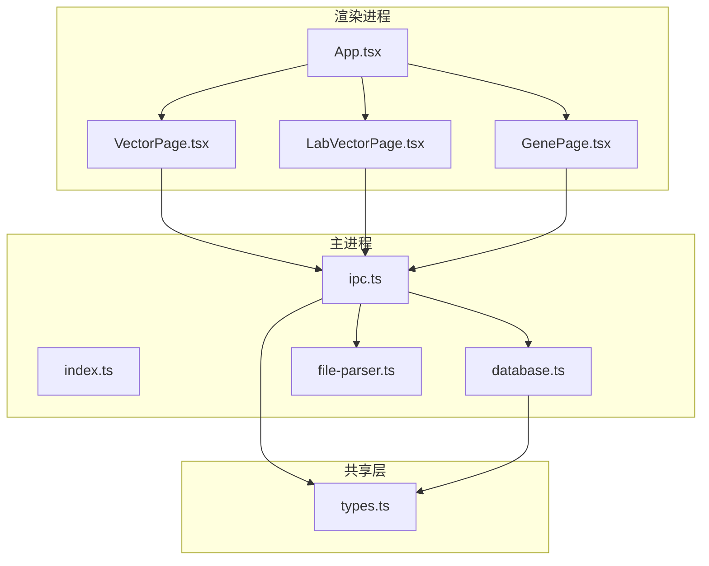
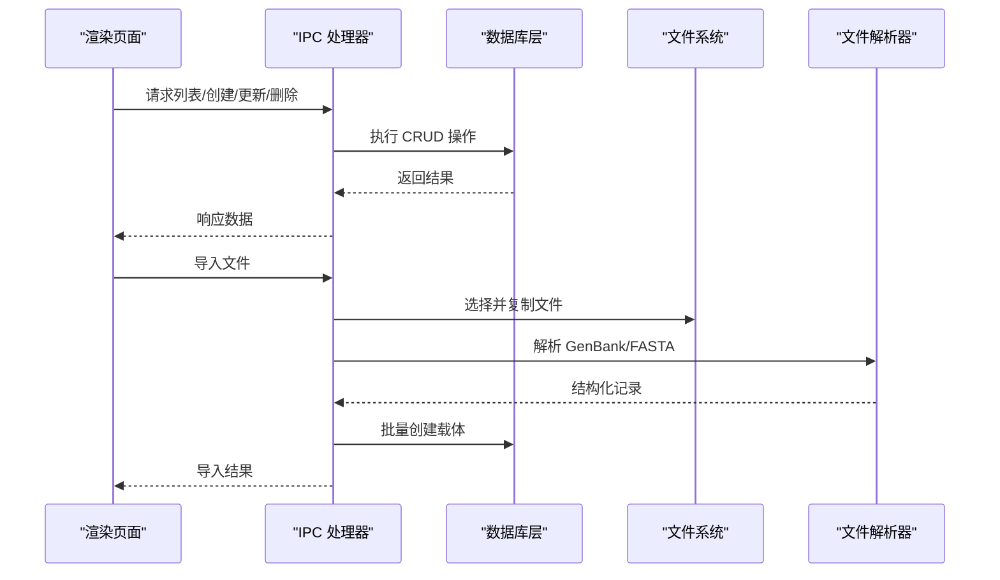
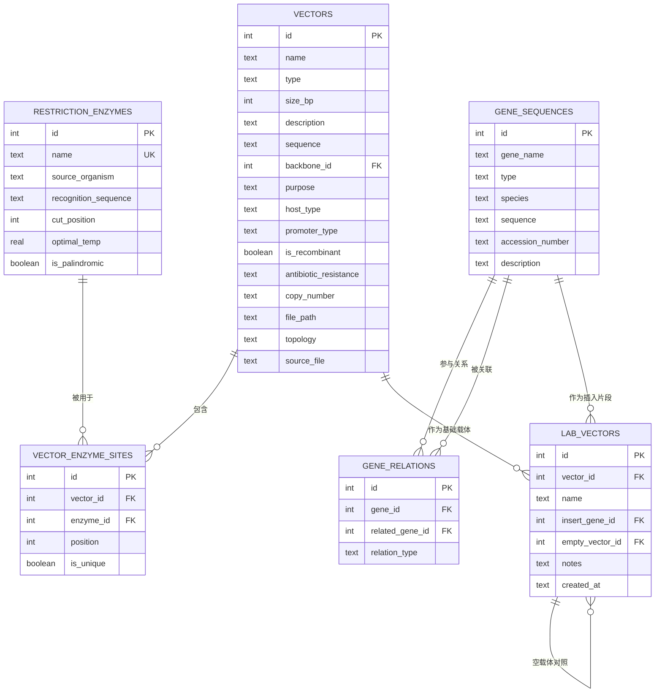
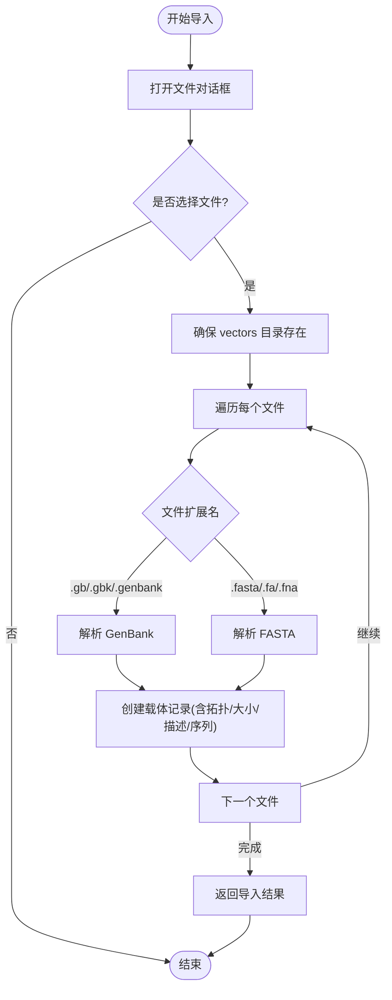
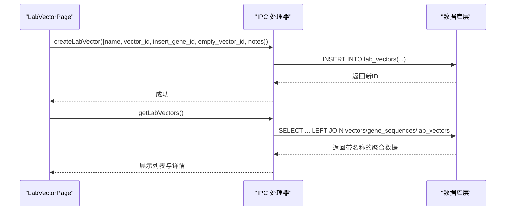
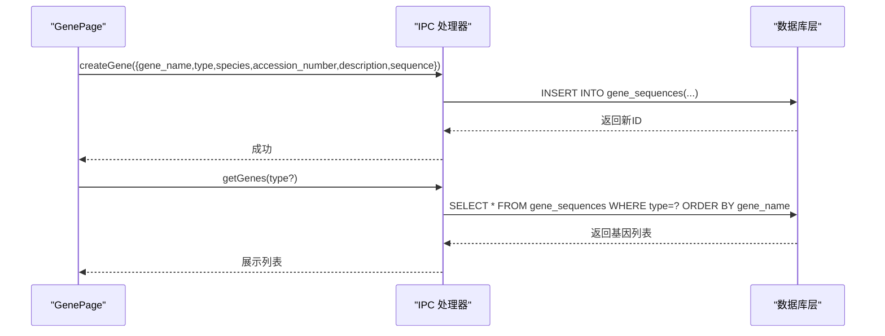
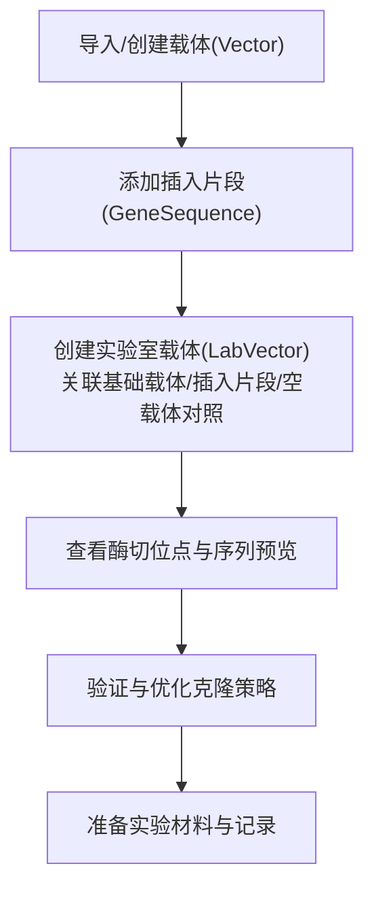
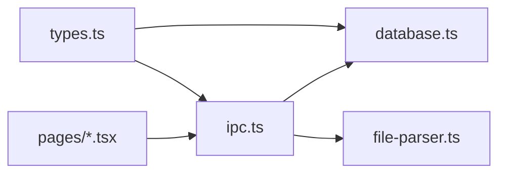

# 实验室载体管理

<cite>
**本文引用的文件**   
- [src/shared/types.ts](file://src/shared/types.ts)
- [src/main/index.ts](file://src/main/index.ts)
- [src/main/database.ts](file://src/main/database.ts)
- [src/main/ipc.ts](file://src/main/ipc.ts)
- [src/main/file-parser.ts](file://src/main/file-parser.ts)
- [src/renderer/App.tsx](file://src/renderer/App.tsx)
- [src/renderer/pages/VectorPage.tsx](file://src/renderer/pages/VectorPage.tsx)
- [src/renderer/pages/LabVectorPage.tsx](file://src/renderer/pages/LabVectorPage.tsx)
- [src/renderer/pages/GenePage.tsx](file://src/renderer/pages/GenePage.tsx)
- [package.json](file://package.json)
</cite>

## 目录
1. [简介](#简介)
2. [项目结构](#项目结构)
3. [核心组件](#核心组件)
4. [架构总览](#架构总览)
5. [详细组件分析](#详细组件分析)
6. [依赖关系分析](#依赖关系分析)
7. [性能与扩展建议](#性能与扩展建议)
8. [故障排查指南](#故障排查指南)
9. [结论](#结论)
10. [附录：命名规范与文件组织建议](#附录：命名规范与文件组织建议)

## 简介
本文件为“实验室载体管理系统”的功能文档，聚焦以下目标：
- 实验载体的创建流程与空载体的关联管理
- 插入片段的添加与配置过程
- 实验载体的版本控制与历史记录（现状说明与演进建议）
- 实验载体的验证与分析能力（现状说明与演进建议）
- 从设计到实验的完整工作流程指导
- 命名规范与文件组织建议

该系统基于 Electron + React + SQL.js 构建，提供内切酶库、载体数据库、基因序列库、实验室载体管理与文件查看器等功能模块。数据持久化采用 SQLite（内存 WASM 实现），通过 IPC 通道在渲染进程与主进程之间通信。

## 项目结构
系统采用分层组织方式：
- 共享类型定义位于 shared 层
- 主进程负责数据库、IPC 处理与文件解析
- 渲染进程以 React 页面组织功能模块

图表来源
- [src/renderer/App.tsx:1-106](file://src/renderer/App.tsx#L1-L106)
- [src/renderer/pages/VectorPage.tsx:1-346](file://src/renderer/pages/VectorPage.tsx#L1-L346)
- [src/renderer/pages/LabVectorPage.tsx:1-172](file://src/renderer/pages/LabVectorPage.tsx#L1-L172)
- [src/renderer/pages/GenePage.tsx:1-219](file://src/renderer/pages/GenePage.tsx#L1-L219)
- [src/main/index.ts:1-59](file://src/main/index.ts#L1-L59)
- [src/main/ipc.ts:1-227](file://src/main/ipc.ts#L1-L227)
- [src/main/database.ts:1-490](file://src/main/database.ts#L1-L490)
- [src/main/file-parser.ts:1-243](file://src/main/file-parser.ts#L1-L243)
- [src/shared/types.ts:1-154](file://src/shared/types.ts#L1-L154)

章节来源
- [src/renderer/App.tsx:1-106](file://src/renderer/App.tsx#L1-L106)
- [src/main/index.ts:1-59](file://src/main/index.ts#L1-L59)
- [src/main/ipc.ts:1-227](file://src/main/ipc.ts#L1-L227)
- [src/main/database.ts:1-490](file://src/main/database.ts#L1-L490)
- [src/main/file-parser.ts:1-243](file://src/main/file-parser.ts#L1-L243)
- [src/shared/types.ts:1-154](file://src/shared/types.ts#L1-L154)

## 核心组件
- 内切酶库：维护常用限制性内切酶信息，支持搜索、增删改。
- 载体数据库：存储质粒等载体元数据与序列，支持导入 GenBank/FASTA、编辑、查看酶切位点。
- 基因序列库：管理 mRNA/cDNA/genomic/protein 序列及关系。
- 实验室载体：将载体与插入片段、空载体对照进行组合管理，形成可执行的实验方案实体。
- 文件查看器：打开并解析 GenBank/FASTA 文件，辅助设计与导入。

章节来源
- [src/shared/types.ts:1-154](file://src/shared/types.ts#L1-L154)
- [src/main/database.ts:1-490](file://src/main/database.ts#L1-L490)
- [src/main/ipc.ts:1-227](file://src/main/ipc.ts#L1-L227)
- [src/renderer/pages/VectorPage.tsx:1-346](file://src/renderer/pages/VectorPage.tsx#L1-L346)
- [src/renderer/pages/LabVectorPage.tsx:1-172](file://src/renderer/pages/LabVectorPage.tsx#L1-L172)
- [src/renderer/pages/GenePage.tsx:1-219](file://src/renderer/pages/GenePage.tsx#L1-L219)

## 架构总览
系统遵循典型的 Electron 应用架构：
- 渲染进程通过 window.api 调用 IPC 通道
- 主进程路由至 database.ts 或 file-parser.ts 执行逻辑
- 数据持久化使用 SQL.js 的 SQLite 实例，WAL 模式提升并发写入性能
- 启动时初始化数据库并注入种子数据

图表来源
- [src/main/ipc.ts:1-227](file://src/main/ipc.ts#L1-L227)
- [src/main/database.ts:1-490](file://src/main/database.ts#L1-L490)
- [src/main/file-parser.ts:1-243](file://src/main/file-parser.ts#L1-L243)

章节来源
- [src/main/index.ts:1-59](file://src/main/index.ts#L1-L59)
- [src/main/ipc.ts:1-227](file://src/main/ipc.ts#L1-L227)
- [src/main/database.ts:1-490](file://src/main/database.ts#L1-L490)
- [src/main/file-parser.ts:1-243](file://src/main/file-parser.ts#L1-L243)

## 详细组件分析

### 数据模型与关系
- 内切酶 RestrictionEnzyme：名称、来源物种、识别序列、切割位置、最适温度、是否回文
- 载体 Vector：名称、类型、拓扑、大小、描述、序列、骨架引用、目的、宿主、启动子、重组标记、抗性、拷贝数、文件路径、来源文件
- 载体酶切位点 VectorEnzymeSite：与载体和内切酶的关联，位置与唯一性标记
- 基因序列 GeneSequence：名称、类型、物种、序列、编号、描述
- 基因关系 GeneRelation：自引用关系表，表达相关性与同源性等
- 实验室载体 LabVector：关联基础载体、插入基因、空载体对照、备注与创建时间

图表来源
- [src/main/database.ts:71-173](file://src/main/database.ts#L71-L173)
- [src/shared/types.ts:1-154](file://src/shared/types.ts#L1-L154)

章节来源
- [src/shared/types.ts:1-154](file://src/shared/types.ts#L1-L154)
- [src/main/database.ts:71-173](file://src/main/database.ts#L71-L173)

### 载体导入与解析流程
- 支持 GenBank(.gb/.gbk/.genbank) 与 FASTA(.fasta/.fa/.fna)
- 导入时将文件复制到用户数据目录下的 vectors 文件夹，并生成载体记录
- GenBank 解析提取 LOCUS/DEFINITION/ACCESSION/VERSION/FEATURES/ORIGIN 等信息
- FASTA 解析按 > 头分割多条序列

图表来源
- [src/main/ipc.ts:60-139](file://src/main/ipc.ts#L60-L139)
- [src/main/file-parser.ts:6-130](file://src/main/file-parser.ts#L6-L130)
- [src/main/file-parser.ts:199-242](file://src/main/file-parser.ts#L199-L242)

章节来源
- [src/main/ipc.ts:60-139](file://src/main/ipc.ts#L60-L139)
- [src/main/file-parser.ts:6-130](file://src/main/file-parser.ts#L6-L130)
- [src/main/file-parser.ts:199-242](file://src/main/file-parser.ts#L199-L242)

### 实验载体的创建流程与空载体关联管理
- 在“实验室载体”页面中，可为一个基础载体（Vector）添加名称、插入基因（GeneSequence）、空载体对照（另一个 LabVector）以及备注
- 空载体对照用于对比实验，指向同一 lab_vectors 表的自引用字段
- 表单提交后，后端创建 LabVector 记录，并可在详情面板查看关联信息

图表来源
- [src/renderer/pages/LabVectorPage.tsx:51-57](file://src/renderer/pages/LabVectorPage.tsx#L51-L57)
- [src/main/ipc.ts:179-189](file://src/main/ipc.ts#L179-L189)
- [src/main/database.ts:398-421](file://src/main/database.ts#L398-L421)
- [src/main/database.ts:372-396](file://src/main/database.ts#L372-L396)

章节来源
- [src/renderer/pages/LabVectorPage.tsx:1-172](file://src/renderer/pages/LabVectorPage.tsx#L1-L172)
- [src/main/ipc.ts:170-189](file://src/main/ipc.ts#L170-L189)
- [src/main/database.ts:372-421](file://src/main/database.ts#L372-L421)

### 插入片段的添加与配置过程
- 在“基因序列库”页面中添加目标片段（mRNA/cDNA/genomic/protein），填写名称、类型、物种、编号、描述与序列
- 在“实验室载体”页面中选择已存在的基因序列作为插入片段
- 支持按类型筛选与全文检索

图表来源
- [src/renderer/pages/GenePage.tsx:65-71](file://src/renderer/pages/GenePage.tsx#L65-L71)
- [src/main/ipc.ts:154-156](file://src/main/ipc.ts#L154-L156)
- [src/main/database.ts:318-324](file://src/main/database.ts#L318-L324)
- [src/main/database.ts:293-298](file://src/main/database.ts#L293-L298)

章节来源
- [src/renderer/pages/GenePage.tsx:1-219](file://src/renderer/pages/GenePage.tsx#L1-L219)
- [src/main/ipc.ts:141-168](file://src/main/ipc.ts#L141-L168)
- [src/main/database.ts:293-342](file://src/main/database.ts#L293-L342)

### 实验载体的版本控制与历史记录管理
- 现状：lab_vectors 表包含 created_at 字段，但无显式版本号与变更历史表；vector 表有 source_file 与 file_path 指向原始文件，便于追溯来源
- 建议演进：
  - 引入 versions 表，记录每次修改的快照（如 vector_id、version_no、snapshot_json、created_by、created_at）
  - 对 lab_vectors 增加 version_no 与 parent_lab_vector_id，形成版本树
  - 在 IPC 层封装 diff 与回滚接口，前端提供“历史版本对比”与“恢复到某版本”操作

[本节为概念性建议，不直接分析具体代码文件]

### 实验载体的验证与分析功能
- 现状：
  - 载体详情页可查看酶切位点列表（来自 vector_enzyme_sites 与 restriction_enzymes 的关联查询）
  - 支持显示唯一/多位点标记，辅助评估克隆策略
- 建议演进：
  - 自动扫描序列计算所有内切酶位点，标注唯一性与方向
  - 提供多酶双切兼容性检查、读框预测、终止密码子检测
  - 输出分析报告（PDF/JSON），并与 lab_vectors 绑定

章节来源
- [src/main/database.ts:269-277](file://src/main/database.ts#L269-L277)
- [src/renderer/pages/VectorPage.tsx:225-241](file://src/renderer/pages/VectorPage.tsx#L225-L241)

### 从设计到实验的完整工作流程指导
- 设计阶段
  - 导入或手动创建载体（Vector），完善类型、拓扑、宿主、启动子、抗性等元数据
  - 在基因序列库中添加插入片段（GeneSequence），必要时建立关系
- 组装阶段
  - 在实验室载体页面创建 LabVector，选择基础载体、插入片段与空载体对照，填写备注
- 验证阶段
  - 查看载体的酶切位点分布，评估克隆位点的唯一性与方向
  - 如需，扩展分析功能（见上节建议）
- 实验阶段
  - 根据 LabVector 的备注与关联信息准备实验材料，记录实验日志（可扩展独立模块）
  - 若需要，导出报告或打印清单

[此图为概念流程图，无需图表来源]

## 依赖关系分析
- 渲染进程依赖 IPC 通道与共享类型
- 主进程依赖数据库与文件解析器
- 数据库层依赖共享类型定义，保证前后端一致性

图表来源
- [src/shared/types.ts:1-154](file://src/shared/types.ts#L1-L154)
- [src/main/ipc.ts:1-227](file://src/main/ipc.ts#L1-L227)
- [src/main/database.ts:1-490](file://src/main/database.ts#L1-L490)
- [src/main/file-parser.ts:1-243](file://src/main/file-parser.ts#L1-L243)
- [src/renderer/pages/VectorPage.tsx:1-346](file://src/renderer/pages/VectorPage.tsx#L1-L346)
- [src/renderer/pages/LabVectorPage.tsx:1-172](file://src/renderer/pages/LabVectorPage.tsx#L1-L172)
- [src/renderer/pages/GenePage.tsx:1-219](file://src/renderer/pages/GenePage.tsx#L1-L219)

章节来源
- [src/shared/types.ts:1-154](file://src/shared/types.ts#L1-L154)
- [src/main/ipc.ts:1-227](file://src/main/ipc.ts#L1-L227)
- [src/main/database.ts:1-490](file://src/main/database.ts#L1-L490)
- [src/main/file-parser.ts:1-243](file://src/main/file-parser.ts#L1-L243)

## 性能与扩展建议
- 数据库
  - 当前启用 WAL 模式，适合频繁写入场景
  - 建议在高频查询字段（如 name、type、purpose）上保持索引（已部分创建）
- 导入性能
  - 大文件导入时避免在主线程阻塞，可考虑分块解析与进度反馈
- 前端交互
  - 列表分页与虚拟滚动，减少 DOM 节点数量
- 扩展方向
  - 版本控制与差异比较
  - 自动化酶切位点分析与报告生成
  - 实验记录与批处理模板

[本节为通用建议，不直接分析具体代码文件]

## 故障排查指南
- 导入失败
  - 确认文件格式为支持的 GenBank/FASTA 扩展名
  - 检查文件编码与换行符是否符合标准
- 无法加载数据
  - 确认数据库文件是否存在于用户数据目录
  - 检查 IPC 通道是否正确注册与调用
- 界面无响应
  - 检查浏览器控制台是否有 JS 错误
  - 确认窗口 preload 与 contextIsolation 配置正确

章节来源
- [src/main/index.ts:1-59](file://src/main/index.ts#L1-L59)
- [src/main/ipc.ts:1-227](file://src/main/ipc.ts#L1-L227)
- [src/main/database.ts:53-69](file://src/main/database.ts#L53-L69)

## 结论
该实验室载体管理系统提供了完整的载体与基因序列管理能力，并通过实验室载体将基础载体、插入片段与空载体对照进行组合，形成可执行的实验方案。当前版本具备导入、CRUD、酶切位点查看等核心功能。后续可重点增强版本控制、自动化分析与报告输出，以提升设计与实验效率。

[本节为总结性内容，不直接分析具体代码文件]

## 附录：命名规范与文件组织建议
- 命名规范
  - 载体名称：建议采用“前缀_用途_宿主_日期_序号”，例如 “pET-Exp_Ecoli_20260706_01”
  - 插入片段：建议采用 “基因符号_物种_转录本_编号”，例如 “GAPDH_Hsapiens_NM_002046”
  - 实验室载体：建议采用 “LV_项目_目的_版本”，例如 “LV_CRISPR_KO_v1”
- 文件组织
  - 向量源文件统一存放于用户数据目录下的 vectors 文件夹（系统已自动创建）
  - 建议按项目或年份建立子目录，并在载体描述中注明来源路径与版本
- 元数据完整性
  - 必填字段：名称、类型、拓扑、宿主、启动子、抗性、拷贝数
  - 可选字段：描述、序列、骨架引用、来源文件
  - 建议在导入后补充缺失字段，确保后续分析与报告准确

[本节为实践建议，不直接分析具体代码文件]