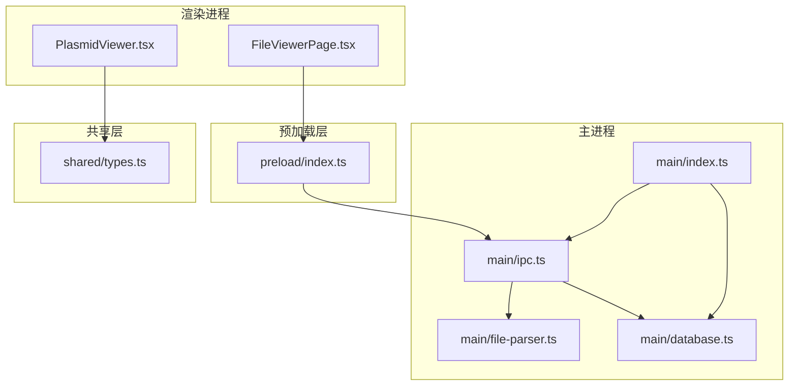
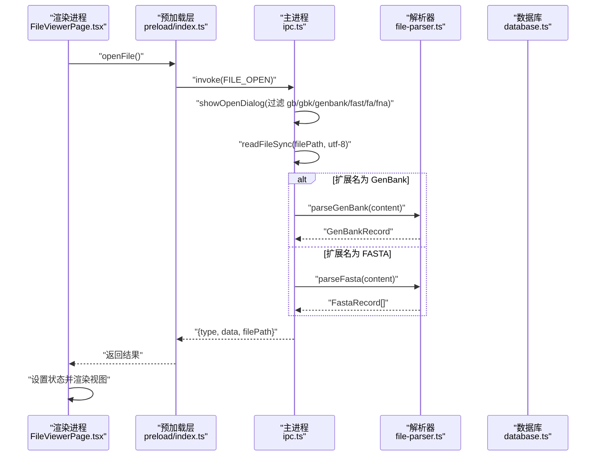
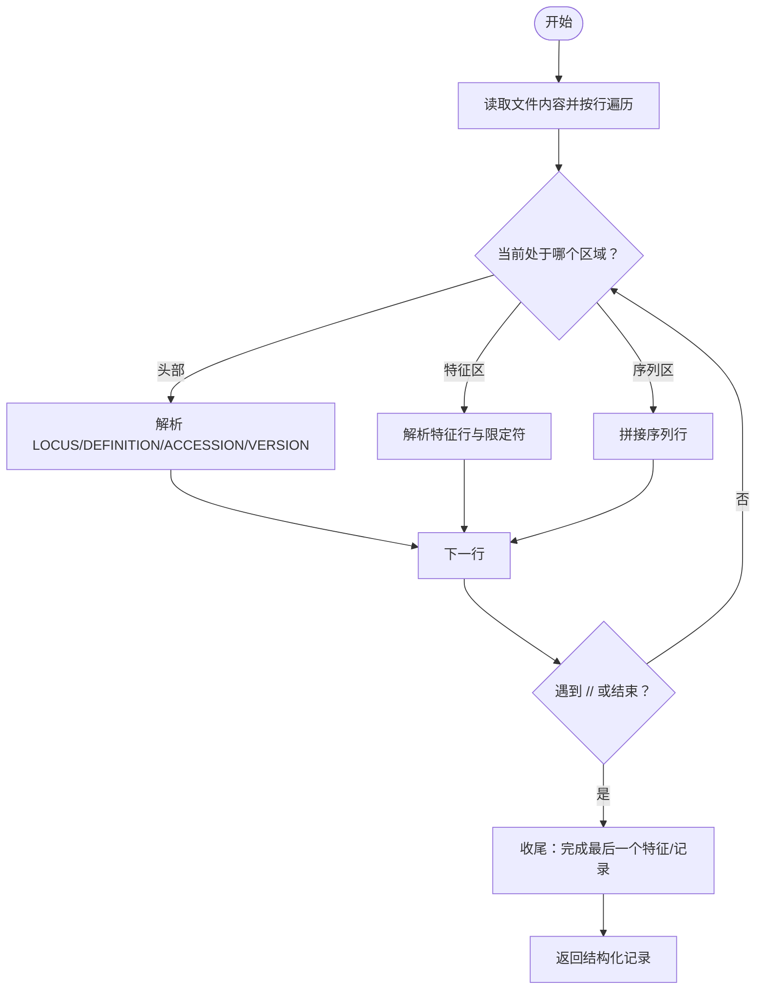
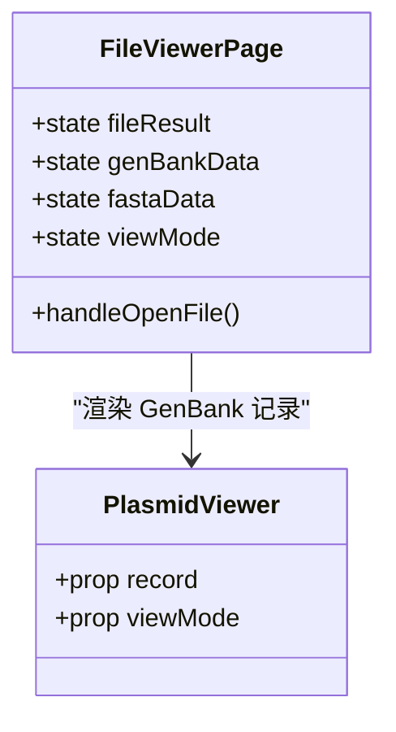
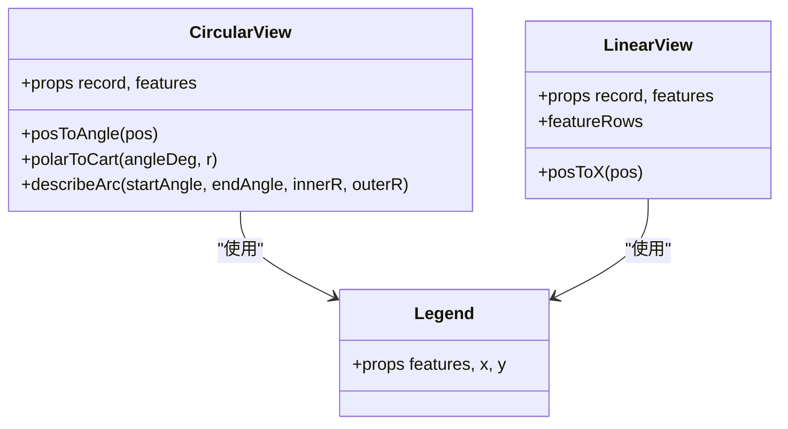
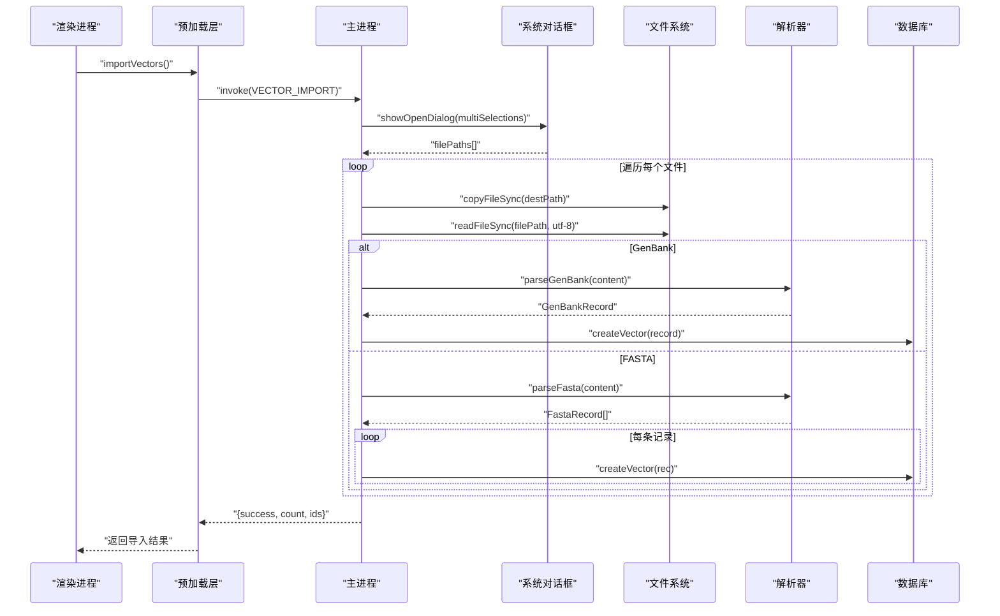
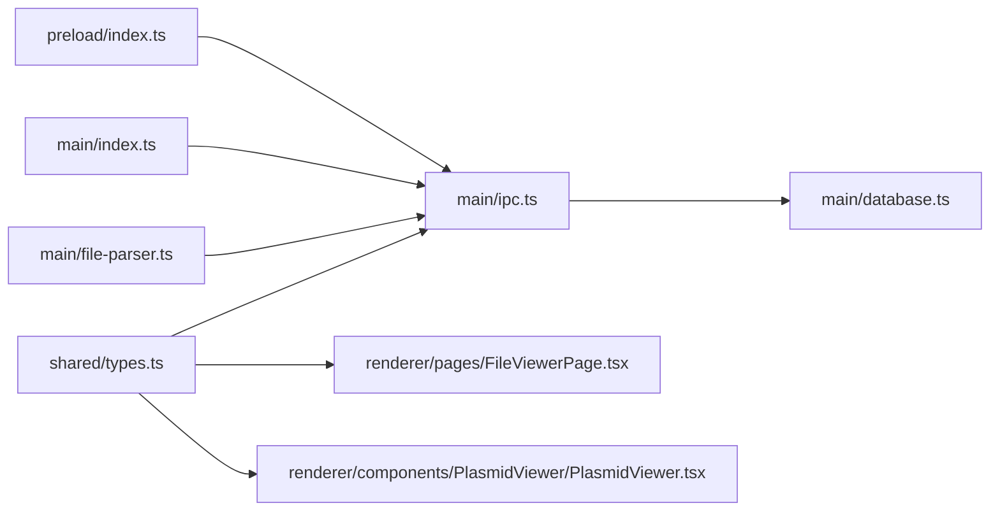

# 文件查看器

<cite>
**本文引用的文件**   
- [file-parser.ts](file://src/main/file-parser.ts)
- [FileViewerPage.tsx](file://src/renderer/pages/FileViewerPage.tsx)
- [PlasmidViewer.tsx](file://src/renderer/components/PlasmidViewer/PlasmidViewer.tsx)
- [ipc.ts](file://src/main/ipc.ts)
- [index.ts](file://src/main/index.ts)
- [types.ts](file://src/shared/types.ts)
- [preload/index.ts](file://preload/index.ts)
</cite>

## 目录
1. [简介](#简介)
2. [项目结构](#项目结构)
3. [核心组件](#核心组件)
4. [架构总览](#架构总览)
5. [详细组件分析](#详细组件分析)
6. [依赖关系分析](#依赖关系分析)
7. [性能与可扩展性](#性能与可扩展性)
8. [故障排除指南](#故障排除指南)
9. [结论](#结论)
10. [附录：格式示例与操作清单](#附录格式示例与操作清单)

## 简介
本文件查看器用于在桌面应用中打开、解析并可视化展示 GenBank 与 FASTA 格式的序列文件。主要能力包括：
- 支持 .gb/.gbk/.genbank 的 GenBank 文件解析，提取名称、描述、拓扑（线性/环形）、长度、特征元件及序列数据
- 支持 .fasta/.fa/.fna 的 FASTA 文件解析，支持多记录批量导入
- 提供环形与线性两种可视化视图，便于快速浏览载体结构与元件分布
- 提供单文件打开与批量导入流程，并将结果持久化到本地数据库
- 通过 IPC 通道实现渲染进程与主进程的通信，确保安全的文件系统访问与解析逻辑执行

## 项目结构
与文件查看器相关的代码分布在以下模块：
- 主进程：负责文件对话框、读取文件、调用解析器、写入数据库、暴露 IPC 接口
- 预加载脚本：将安全 API 暴露给渲染进程
- 渲染进程：页面交互、状态管理、SVG 可视化
- 共享类型：统一数据结构定义与 IPC 通道常量

图表来源
- [index.ts:1-59](file://src/main/index.ts#L1-L59)
- [ipc.ts:1-227](file://src/main/ipc.ts#L1-L227)
- [file-parser.ts:1-243](file://src/main/file-parser.ts#L1-L243)
- [FileViewerPage.tsx:1-152](file://src/renderer/pages/FileViewerPage.tsx#L1-L152)
- [PlasmidViewer.tsx:1-362](file://src/renderer/components/PlasmidViewer/PlasmidViewer.tsx#L1-L362)
- [types.ts:1-154](file://src/shared/types.ts#L1-L154)
- [preload/index.ts:1-47](file://preload/index.ts#L1-L47)

章节来源
- [index.ts:1-59](file://src/main/index.ts#L1-L59)
- [ipc.ts:1-227](file://src/main/ipc.ts#L1-L227)
- [file-parser.ts:1-243](file://src/main/file-parser.ts#L1-L243)
- [FileViewerPage.tsx:1-152](file://src/renderer/pages/FileViewerPage.tsx#L1-L152)
- [PlasmidViewer.tsx:1-362](file://src/renderer/components/PlasmidViewer/PlasmidViewer.tsx#L1-L362)
- [types.ts:1-154](file://src/shared/types.ts#L1-L154)
- [preload/index.ts:1-47](file://preload/index.ts#L1-L47)

## 核心组件
- 文件解析器（主进程）
  - 解析 GenBank：按行扫描 LOCUS/DEFINITION/ACCESSION/VERSION/FEATURES/ORIGIN 等关键字段，提取元信息与特征列表，并拼接序列
  - 解析 FASTA：识别以 > 开头的标题行，拆分 id 与 description，合并后续序列行
- 文件查看页面（渲染进程）
  - 提供“选择文件”入口，接收主进程返回的解析结果
  - 根据文件类型切换显示模式：GenBank 使用 PlasmidViewer 进行可视化；FASTA 以文本方式逐条展示
- 质粒/序列可视化组件（渲染进程）
  - 环形视图：基于 SVG 绘制环状骨架与特征弧段，标注刻度、方向箭头与图例
  - 线性视图：基于 SVG 绘制线性骨架与分层排列的特征条，避免重叠
- IPC 通道与预加载桥接
  - 暴露 openFile、parseGenBank、parseFasta 等方法供渲染进程调用
  - 主进程处理 FILE_OPEN、FILE_PARSE_GENBANK、FILE_PARSE_FASTA 等通道请求

章节来源
- [file-parser.ts:1-243](file://src/main/file-parser.ts#L1-L243)
- [FileViewerPage.tsx:1-152](file://src/renderer/pages/FileViewerPage.tsx#L1-L152)
- [PlasmidViewer.tsx:1-362](file://src/renderer/components/PlasmidViewer/PlasmidViewer.tsx#L1-L362)
- [ipc.ts:1-227](file://src/main/ipc.ts#L1-L227)
- [preload/index.ts:1-47](file://preload/index.ts#L1-L47)
- [types.ts:1-154](file://src/shared/types.ts#L1-L154)

## 架构总览
文件查看器的整体交互流程如下：
- 用户在渲染进程点击“选择文件”，触发 window.api.openFile()
- 预加载层转发至主进程 FILE_OPEN 处理器
- 主进程弹出系统文件对话框，读取文件内容并根据扩展名调用对应解析函数
- 解析完成后返回结构化数据给渲染进程
- 渲染进程根据数据类型更新状态并渲染视图

图表来源
- [FileViewerPage.tsx:13-45](file://src/renderer/pages/FileViewerPage.tsx#L13-L45)
- [preload/index.ts:38-41](file://preload/index.ts#L38-L41)
- [ipc.ts:192-217](file://src/main/ipc.ts#L192-L217)
- [file-parser.ts:6-130](file://src/main/file-parser.ts#L6-L130)
- [file-parser.ts:199-242](file://src/main/file-parser.ts#L199-L242)

## 详细组件分析

### 文件解析器（GenBank 与 FASTA）
- GenBank 解析要点
  - 关键字段定位：LOCUS、DEFINITION、ACCESSION、VERSION、FEATURES、ORIGIN、//
  - 特征解析：支持 join()、complement()、范围与单点位置，自动计算 start/end 与 strand
  - 序列拼接：去除空白字符并转为小写，最终 size 优先采用 LOCUS 声明，否则回退为序列长度
- FASTA 解析要点
  - 标题行以 > 开头，首个空格前为 id，其后为 description
  - 后续非空行拼接为 sequence，支持多记录连续出现
- 错误处理策略
  - 未匹配到有效字段时，保持默认值（如 name/description/accession/version 为空字符串）
  - 位置解析失败时回退为 {start:0,end:0,strand:1}
  - 无显式抛出异常，但可通过返回结构的完整性判断是否成功

图表来源
- [file-parser.ts:6-130](file://src/main/file-parser.ts#L6-L130)
- [file-parser.ts:132-173](file://src/main/file-parser.ts#L132-L173)
- [file-parser.ts:199-242](file://src/main/file-parser.ts#L199-L242)

章节来源
- [file-parser.ts:6-130](file://src/main/file-parser.ts#L6-L130)
- [file-parser.ts:132-173](file://src/main/file-parser.ts#L132-L173)
- [file-parser.ts:199-242](file://src/main/file-parser.ts#L199-L242)

### 文件查看页面（渲染进程）
- 功能职责
  - 监听侧边栏按钮触发的文件打开事件
  - 调用 window.api.openFile() 获取解析结果
  - 根据 result.type 切换显示：GenBank 使用 PlasmidViewer；FASTA 以文本形式逐条展示
  - 提供“环形视图/线性视图”切换开关
- 交互细节
  - 工具栏显示文件名与类型标签
  - 右侧面板列出 GenBank 特征项，包含类型、区间与链信息
  - 对 FASTA 每条记录显示 id、description、序列块与长度单位（bp/aa）

图表来源
- [FileViewerPage.tsx:6-134](file://src/renderer/pages/FileViewerPage.tsx#L6-L134)
- [PlasmidViewer.tsx:32-67](file://src/renderer/components/PlasmidViewer/PlasmidViewer.tsx#L32-L67)

章节来源
- [FileViewerPage.tsx:1-152](file://src/renderer/pages/FileViewerPage.tsx#L1-L152)

### 可视化组件（环形与线性视图）
- 环形视图
  - 基于 SVG 绘制背景圆环作为骨架
  - 动态生成刻度（根据序列长度自适应间隔）
  - 将每个特征映射为扇形弧段，标注方向箭头与颜色
  - 中心显示名称、长度与拓扑类型，底部显示图例
- 线性视图
  - 基于 SVG 绘制水平骨架线
  - 自动分配行以避免特征重叠，连接虚线指向骨架
  - 根据 strand 绘制方向箭头，短特征不显示标签
  - 底部显示图例与悬停提示

图表来源
- [PlasmidViewer.tsx:70-204](file://src/renderer/components/PlasmidViewer/PlasmidViewer.tsx#L70-L204)
- [PlasmidViewer.tsx:207-331](file://src/renderer/components/PlasmidViewer/PlasmidViewer.tsx#L207-L331)
- [PlasmidViewer.tsx:334-347](file://src/renderer/components/PlasmidViewer/PlasmidViewer.tsx#L334-L347)

章节来源
- [PlasmidViewer.tsx:1-362](file://src/renderer/components/PlasmidViewer/PlasmidViewer.tsx#L1-L362)

### IPC 通道与批量导入
- 单文件打开
  - 渲染进程调用 FILE_OPEN，主进程弹出对话框，读取并解析后返回
- 批量导入（载体库）
  - 渲染进程调用 VECTOR_IMPORT，主进程允许多选文件
  - 将文件复制到应用用户数据目录下的 vectors 文件夹
  - 根据扩展名分别调用 parseGenBank 或 parseFasta，并将结果写入数据库
  - 返回成功计数与新增记录的 ID 列表
- 直接解析（可选）
  - 提供 FILE_PARSE_GENBANK 与 FILE_PARSE_FASTA 通道，可直接传入文本内容进行解析

图表来源
- [ipc.ts:61-139](file://src/main/ipc.ts#L61-L139)
- [ipc.ts:192-217](file://src/main/ipc.ts#L192-L217)
- [file-parser.ts:6-130](file://src/main/file-parser.ts#L6-L130)
- [file-parser.ts:199-242](file://src/main/file-parser.ts#L199-L242)

章节来源
- [ipc.ts:61-139](file://src/main/ipc.ts#L61-L139)
- [ipc.ts:192-217](file://src/main/ipc.ts#L192-L217)

## 依赖关系分析
- 组件耦合
  - FileViewerPage 依赖 preload 暴露的 API 与 shared types
  - PlasmidViewer 仅依赖 shared types 中的 GenBankRecord/Feature
  - ipc.ts 依赖 file-parser.ts 与 database.ts
  - index.ts 初始化数据库、注册 IPC 并创建窗口
- 外部依赖
  - Electron 提供 BrowserWindow、dialog、fs 等能力
  - SQL.js 与 electron-store 用于数据存储（由 database.ts 封装）
  - React、Tailwind、Lucide 图标用于界面渲染

图表来源
- [types.ts:1-154](file://src/shared/types.ts#L1-L154)
- [ipc.ts:1-227](file://src/main/ipc.ts#L1-L227)
- [file-parser.ts:1-243](file://src/main/file-parser.ts#L1-L243)
- [index.ts:1-59](file://src/main/index.ts#L1-L59)
- [preload/index.ts:1-47](file://preload/index.ts#L1-L47)

章节来源
- [types.ts:1-154](file://src/shared/types.ts#L1-L154)
- [ipc.ts:1-227](file://src/main/ipc.ts#L1-L227)
- [file-parser.ts:1-243](file://src/main/file-parser.ts#L1-L243)
- [index.ts:1-59](file://src/main/index.ts#L1-L59)
- [preload/index.ts:1-47](file://preload/index.ts#L1-L47)

## 性能与可扩展性
- 大文件处理
  - 当前实现一次性读取整个文件到内存，适合中小型序列文件；对于超大文件建议引入流式读取与分块解析
- 解析复杂度
  - GenBank 与 FASTA 均为 O(n) 线性扫描，n 为行数；特征解析与位置计算为常数时间操作
- 可视化渲染
  - SVG 元素数量与特征数成正比；当特征过多时可考虑按需渲染或虚拟化
- 可扩展点
  - 增加更多文件格式（如 EMBL、GFF/GTF）
  - 增强错误恢复与诊断日志
  - 添加导出功能（如导出为 PDF/SVG/PNG）

[本节为通用指导，无需具体文件引用]

## 故障排除指南
- 无法打开文件或结果为 null
  - 检查文件扩展名是否在过滤器内（gb/gbk/genbank/fast/fa/fna）
  - 确认文件路径可被主进程读取（权限问题）
- 解析结果为空或缺失字段
  - 检查 GenBank 文件是否包含必要关键字段（LOCUS、FEATURES、ORIGIN）
  - 检查 FASTA 文件是否以 > 开头且存在序列行
- 特征显示异常或未显示
  - 确认特征 start/end 已正确解析，且 end > start
  - 某些类型为 source 的特征会被过滤掉（属于预期行为）
- 批量导入未写入数据库
  - 检查应用用户数据目录是否存在 vectors 子目录（首次导入会自动创建）
  - 确认数据库初始化成功（应用启动时会初始化并填充基础数据）

章节来源
- [ipc.ts:192-217](file://src/main/ipc.ts#L192-L217)
- [ipc.ts:61-139](file://src/main/ipc.ts#L61-L139)
- [file-parser.ts:6-130](file://src/main/file-parser.ts#L6-L130)
- [file-parser.ts:199-242](file://src/main/file-parser.ts#L199-L242)
- [PlasmidViewer.tsx:39-42](file://src/renderer/components/PlasmidViewer/PlasmidViewer.tsx#L39-L42)

## 结论
文件查看器通过清晰的模块化设计实现了 GenBank 与 FASTA 文件的解析、导入与可视化。其优势在于：
- 解析逻辑集中、类型定义统一，便于维护与扩展
- 渲染与业务解耦，可视化组件可独立优化
- IPC 通道明确，安全性与可测试性良好
未来可在大文件处理、错误诊断与导出方面进一步增强用户体验。

[本节为总结性内容，无需具体文件引用]

## 附录：格式示例与操作清单

### 支持的扩展名与用途
- GenBank：.gb、.gbk、.genbank
- FASTA：.fasta、.fa、.fna

### 单文件打开流程
- 在“文件查看器”页面点击“选择文件”
- 在弹出的对话框中选择目标文件
- 系统自动解析并展示结果（GenBank 进入可视化视图，FASTA 进入文本视图）

章节来源
- [FileViewerPage.tsx:33-45](file://src/renderer/pages/FileViewerPage.tsx#L33-L45)
- [ipc.ts:192-217](file://src/main/ipc.ts#L192-L217)

### 批量导入流程（载体库）
- 在侧边栏或相关入口选择“导入载体文件”
- 在对话框中勾选多个 .gb/.gbk/.genbank 或 .fasta/.fa/.fna 文件
- 系统将复制文件到应用数据目录，解析并写入数据库
- 返回导入成功计数与新增记录 ID 列表

章节来源
- [ipc.ts:61-139](file://src/main/ipc.ts#L61-L139)

### 常见文件格式处理示例（说明性）
- GenBank 示例要点
  - LOCUS 行包含名称、长度与拓扑（circular/linear）
  - FEATURES 区块包含各元件的位置与限定符（如 label/gene/product）
  - ORIGIN 区块为序列数据，需去除空白并拼接
- FASTA 示例要点
  - 每段序列以 > 开头，第一个空格前为 id，其后为 description
  - 后续行拼接为 sequence，支持多条记录

章节来源
- [file-parser.ts:6-130](file://src/main/file-parser.ts#L6-L130)
- [file-parser.ts:199-242](file://src/main/file-parser.ts#L199-L242)

### 可视化展示方式
- 环形视图：适合展示环状载体，直观呈现元件分布与方向
- 线性视图：适合长片段或线性分子，清晰展示元件顺序与相对位置
- 交互特性：悬停显示详细信息（名称、类型、区间），图例帮助识别不同元件类型

章节来源
- [PlasmidViewer.tsx:70-204](file://src/renderer/components/PlasmidViewer/PlasmidViewer.tsx#L70-L204)
- [PlasmidViewer.tsx:207-331](file://src/renderer/components/PlasmidViewer/PlasmidViewer.tsx#L207-L331)

### 转换与导出选项（现状与建议）
- 现状
  - 当前未实现直接的导出功能（如导出为图片/文档）
  - 解析结果可用于进一步处理（例如写入数据库、参与其他计算）
- 建议
  - 增加导出为 SVG/PNG 的能力，便于分享与报告
  - 支持将 GenBank 转换为 FASTA（或反之），以满足不同下游工具需求

[本节为通用建议，无需具体文件引用]