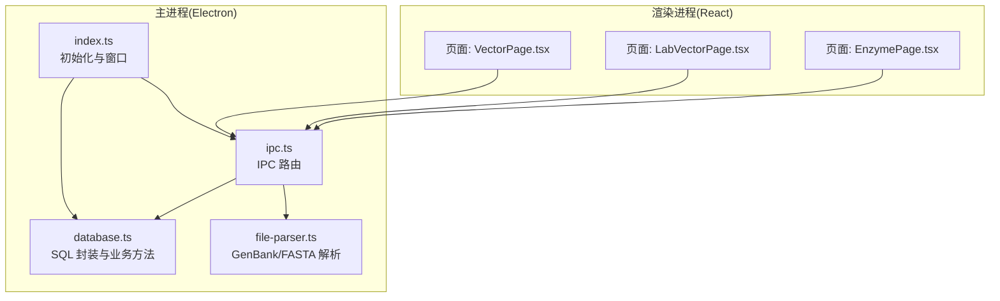
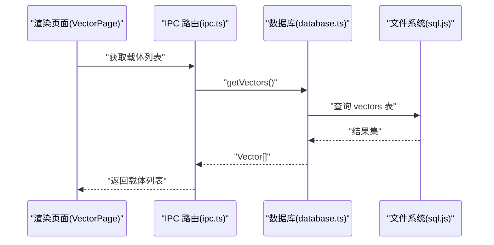
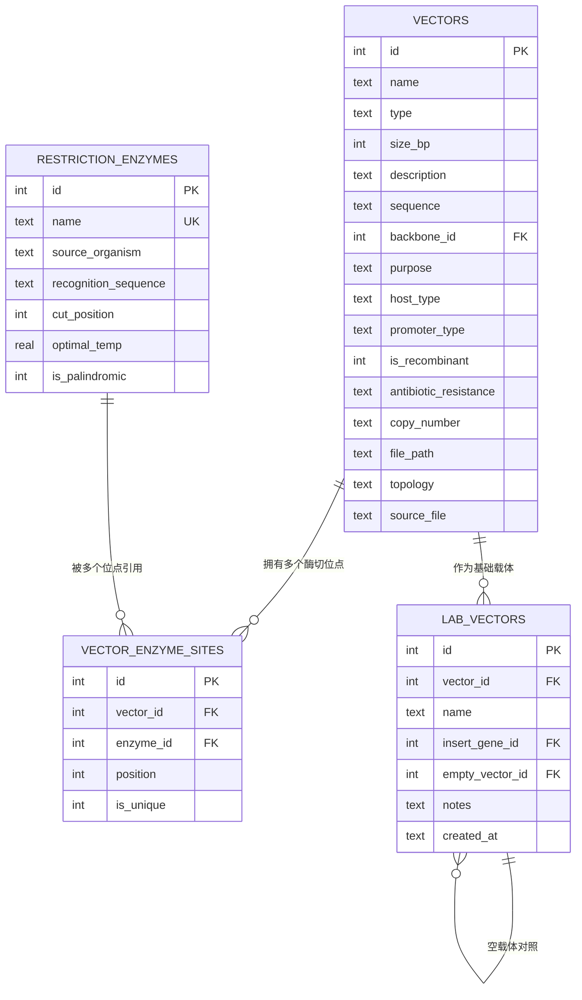
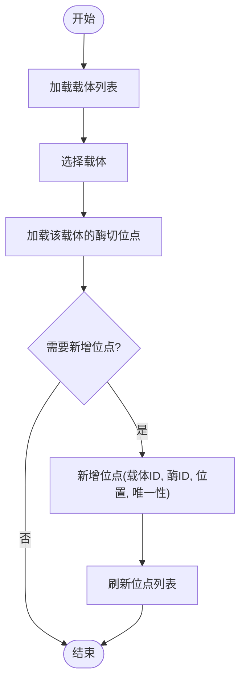
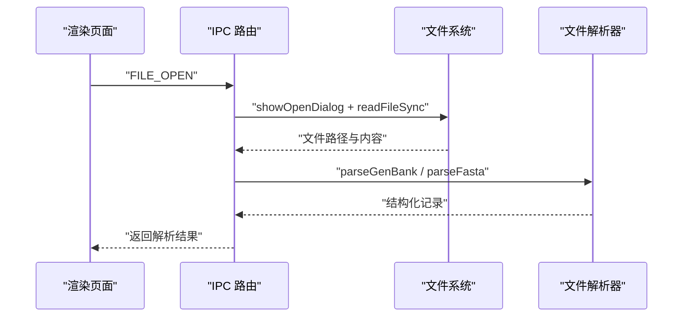
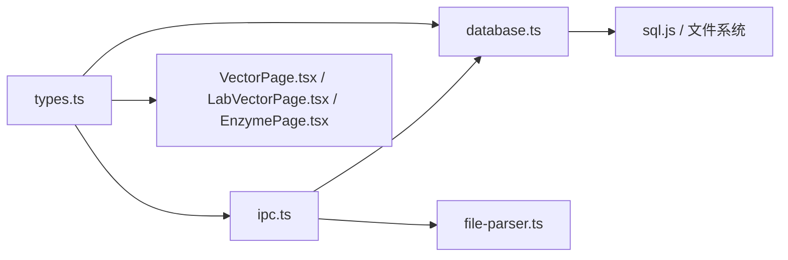

# 载体数据库管理

<cite>
**本文引用的文件**   
- [src/main/database.ts](file://gene-engineering-tool/src/main/database.ts)
- [src/main/ipc.ts](file://gene-engineering-tool/src/main/ipc.ts)
- [src/main/index.ts](file://gene-engineering-tool/src/main/index.ts)
- [src/shared/types.ts](file://gene-engineering-tool/src/shared/types.ts)
- [src/renderer/pages/VectorPage.tsx](file://gene-engineering-tool/src/renderer/pages/VectorPage.tsx)
- [src/renderer/pages/LabVectorPage.tsx](file://gene-engineering-tool/src/renderer/pages/LabVectorPage.tsx)
- [src/renderer/pages/EnzymePage.tsx](file://gene-engineering-tool/src/renderer/pages/EnzymePage.tsx)
- [src/main/file-parser.ts](file://gene-engineering-tool/src/main/file-parser.ts)
</cite>

## 目录
1. [简介](#简介)
2. [项目结构](#项目结构)
3. [核心组件](#核心组件)
4. [架构总览](#架构总览)
5. [详细组件分析](#详细组件分析)
6. [依赖关系分析](#依赖关系分析)
7. [性能与扩展性](#性能与扩展性)
8. [故障排查指南](#故障排查指南)
9. [结论](#结论)
10. [附录：导入导出与最佳实践](#附录导入导出与最佳实践)

## 简介
本文件为“载体数据库管理”模块的功能文档，面向使用基因工程辅助软件的研究人员与工程师。内容覆盖：
- 支持的载体类型及其特点
- 载体的增删改查（CRUD）与酶切位点管理
- 载体骨架关系的建立与维护
- 载体与限制性内切酶的关联关系
- 载体数据的导入导出能力
- 载体设计最佳实践与工作流程示例

## 项目结构
本项目采用 Electron + React 的桌面应用架构，数据层基于 sql.js 的 SQLite 内存数据库持久化到本地文件；前端通过 IPC 通道调用后端服务完成数据操作。

图表来源
- [src/main/index.ts:41-52](file://gene-engineering-tool/src/main/index.ts#L41-L52)
- [src/main/ipc.ts:9-146](file://gene-engineering-tool/src/main/ipc.ts#L9-L146)
- [src/main/database.ts:53-153](file://gene-engineering-tool/src/main/database.ts#L53-L153)
- [src/main/file-parser.ts:6-130](file://gene-engineering-tool/src/main/file-parser.ts#L6-L130)

章节来源
- [src/main/index.ts:1-59](file://gene-engineering-tool/src/main/index.ts#L1-L59)
- [src/main/ipc.ts:1-146](file://gene-engineering-tool/src/main/ipc.ts#L1-L146)
- [src/main/database.ts:1-490](file://gene-engineering-tool/src/main/database.ts#L1-L490)
- [src/main/file-parser.ts:1-243](file://gene-engineering-tool/src/main/file-parser.ts#L1-L243)
- [src/shared/types.ts:1-154](file://gene-engineering-tool/src/shared/types.ts#L1-L154)
- [src/renderer/pages/VectorPage.tsx:1-191](file://gene-engineering-tool/src/renderer/pages/VectorPage.tsx#L1-L191)
- [src/renderer/pages/LabVectorPage.tsx:1-172](file://gene-engineering-tool/src/renderer/pages/LabVectorPage.tsx#L1-L172)
- [src/renderer/pages/EnzymePage.tsx:1-252](file://gene-engineering-tool/src/renderer/pages/EnzymePage.tsx#L1-L252)

## 核心组件
- 数据类型定义：集中定义了载体、酶、基因序列、实验室载体、文件记录等接口与枚举，统一前后端契约。
- 数据库层：提供表结构创建、迁移、索引、种子数据注入以及各实体的 CRUD 方法。
- IPC 层：将前端请求映射到后端数据库方法，并处理文件选择与解析。
- 页面组件：提供载体、实验室载体、限制性内切酶的管理界面。
- 文件解析器：支持 GenBank 与 FASTA 格式解析，用于导入序列与注释信息。

章节来源
- [src/shared/types.ts:12-106](file://gene-engineering-tool/src/shared/types.ts#L12-L106)
- [src/main/database.ts:71-153](file://gene-engineering-tool/src/main/database.ts#L71-L153)
- [src/main/ipc.ts:35-108](file://gene-engineering-tool/src/main/ipc.ts#L35-L108)
- [src/renderer/pages/VectorPage.tsx:1-191](file://gene-engineering-tool/src/renderer/pages/VectorPage.tsx#L1-L191)
- [src/renderer/pages/LabVectorPage.tsx:1-172](file://gene-engineering-tool/src/renderer/pages/LabVectorPage.tsx#L1-L172)
- [src/renderer/pages/EnzymePage.tsx:1-252](file://gene-engineering-tool/src/renderer/pages/EnzymePage.tsx#L1-L252)
- [src/main/file-parser.ts:6-130](file://gene-engineering-tool/src/main/file-parser.ts#L6-L130)

## 架构总览
系统采用分层架构：
- 渲染层（React 页面）负责用户交互与展示
- IPC 路由层负责跨进程通信
- 数据访问层（database.ts）封装 SQL 操作与业务逻辑
- 文件解析层（file-parser.ts）提供标准生物序列文件格式解析

图表来源
- [src/main/ipc.ts:36-38](file://gene-engineering-tool/src/main/ipc.ts#L36-L38)
- [src/main/database.ts:220-222](file://gene-engineering-tool/src/main/database.ts#L220-L222)
- [src/main/database.ts:27-41](file://gene-engineering-tool/src/main/database.ts#L27-L41)

## 详细组件分析

### 载体类型与特点
- 质粒（plasmid）：常用克隆与表达载体，通常为环状拓扑
- 噬菌体（phage）：以病毒颗粒包装 DNA，适合高转导效率
- 黏粒（cosmid）：结合质粒与 cos 位点，可承载较大片段
- BAC（bac）：细菌人工染色体，适合大片段基因组克隆
- YAC（yac）：酵母人工染色体，适合超大片段克隆
- 其他（other）：自定义或特殊用途载体

以上类型在类型定义中明确，并在载体页面中以中文标签显示。

章节来源
- [src/shared/types.ts:13](file://gene-engineering-tool/src/shared/types.ts#L13)
- [src/renderer/pages/VectorPage.tsx:59-61](file://gene-engineering-tool/src/renderer/pages/VectorPage.tsx#L59-L61)

### 载体数据结构与关系
- 载体实体包含名称、类型、大小、描述、序列、骨架引用、目的、宿主、启动子类型、重组标记、抗性、拷贝数、拓扑、源文件等字段
- 酶切位点实体维护载体与酶的关联及位置、是否唯一等信息
- 实验室载体实体用于记录实验中的具体构建物，包括插入基因与空载体对照

图表来源
- [src/main/database.ts:71-153](file://gene-engineering-tool/src/main/database.ts#L71-L153)
- [src/shared/types.ts:24-51](file://gene-engineering-tool/src/shared/types.ts#L24-L51)

章节来源
- [src/shared/types.ts:24-85](file://gene-engineering-tool/src/shared/types.ts#L24-L85)
- [src/main/database.ts:71-153](file://gene-engineering-tool/src/main/database.ts#L71-L153)

### 载体 CRUD 与酶切位点管理
- 载体列表、详情、创建、更新、删除
- 酶切位点查询、添加、移除
- 页面侧提供表单与列表交互，支持搜索与筛选

图表来源
- [src/main/ipc.ts:56-58](file://gene-engineering-tool/src/main/ipc.ts#L56-L58)
- [src/main/database.ts:269-289](file://gene-engineering-tool/src/main/database.ts#L269-L289)
- [src/renderer/pages/VectorPage.tsx:18-22](file://gene-engineering-tool/src/renderer/pages/VectorPage.tsx#L18-L22)

章节来源
- [src/main/database.ts:220-289](file://gene-engineering-tool/src/main/database.ts#L220-L289)
- [src/main/ipc.ts:35-58](file://gene-engineering-tool/src/main/ipc.ts#L35-L58)
- [src/renderer/pages/VectorPage.tsx:1-191](file://gene-engineering-tool/src/renderer/pages/VectorPage.tsx#L1-L191)

### 载体骨架关系建立与维护
- 骨架关系通过载体的 backbone_id 字段指向另一个载体（通常为空载体），实现“衍生载体 → 空载体”的层级关系
- 数据库启用外键约束，删除父载体时子载体的骨架引用置空（ON DELETE SET NULL）
- 页面右侧面板会提示是否已关联空载体

章节来源
- [src/main/database.ts:84-101](file://gene-engineering-tool/src/main/database.ts#L84-L101)
- [src/renderer/pages/VectorPage.tsx:124-127](file://gene-engineering-tool/src/renderer/pages/VectorPage.tsx#L124-L127)

### 载体与限制性内切酶的关联关系
- 通过 vector_enzyme_sites 表建立多对多关系，记录每个位点的精确位置与是否唯一
- 查询时联表返回酶的名称、识别序列、切割位置、最适温度、回文属性等元信息
- 页面侧按位置排序展示位点，并以“唯一/多位点”标识

章节来源
- [src/main/database.ts:103-110](file://gene-engineering-tool/src/main/database.ts#L103-L110)
- [src/main/database.ts:269-277](file://gene-engineering-tool/src/main/database.ts#L269-L277)
- [src/renderer/pages/VectorPage.tsx:129-143](file://gene-engineering-tool/src/renderer/pages/VectorPage.tsx#L129-L143)

### 导入与导出功能说明
- 导入
  - 支持打开 GenBank 与 FASTA 文件，主进程通过对话框选择文件并读取内容
  - 根据扩展名调用对应解析器，返回结构化记录（含名称、描述、序列、拓扑、特征等）
  - 前端可将解析结果用于创建载体或基因序列条目（由上层流程决定）
- 导出
  - 当前未提供直接导出载体为文件的入口；可通过复制序列文本或导出数据库文件（sql.js 支持导出二进制）进行备份

图表来源
- [src/main/ipc.ts:111-144](file://gene-engineering-tool/src/main/ipc.ts#L111-L144)
- [src/main/file-parser.ts:6-130](file://gene-engineering-tool/src/main/file-parser.ts#L6-L130)
- [src/main/file-parser.ts:199-242](file://gene-engineering-tool/src/main/file-parser.ts#L199-L242)

章节来源
- [src/main/ipc.ts:110-145](file://gene-engineering-tool/src/main/ipc.ts#L110-L145)
- [src/main/file-parser.ts:1-243](file://gene-engineering-tool/src/main/file-parser.ts#L1-L243)

### 实验室载体与空载体对照
- 实验室载体记录实际构建产物，支持关联基础载体、插入基因与空载体对照
- 便于对比实验组与对照组，追踪构建历史与备注

章节来源
- [src/main/database.ts:131-140](file://gene-engineering-tool/src/main/database.ts#L131-L140)
- [src/renderer/pages/LabVectorPage.tsx:1-172](file://gene-engineering-tool/src/renderer/pages/LabVectorPage.tsx#L1-L172)

## 依赖关系分析
- 渲染页面依赖 IPC 通道进行数据交互
- IPC 路由依赖数据库方法与文件解析器
- 数据库层依赖 sql.js 与操作系统文件系统
- 类型定义贯穿前后端，确保一致性

图表来源
- [src/shared/types.ts:114-153](file://gene-engineering-tool/src/shared/types.ts#L114-L153)
- [src/main/ipc.ts:1-8](file://gene-engineering-tool/src/main/ipc.ts#L1-L8)
- [src/main/database.ts:1-17](file://gene-engineering-tool/src/main/database.ts#L1-L17)

章节来源
- [src/shared/types.ts:1-154](file://gene-engineering-tool/src/shared/types.ts#L1-L154)
- [src/main/ipc.ts:1-146](file://gene-engineering-tool/src/main/ipc.ts#L1-L146)
- [src/main/database.ts:1-490](file://gene-engineering-tool/src/main/database.ts#L1-L490)

## 性能与扩展性
- 数据库配置
  - 启用 WAL 模式提升并发读写性能
  - 启用外键约束保证数据一致性
  - 针对常用字段建立索引（如酶名称、识别序列、载体名称、基因名称与类型、实验室载体名称）
- 查询优化
  - 批量查询与联表查询减少往返次数
  - 按名称与类型过滤，避免全表扫描
- 可扩展建议
  - 引入分页与懒加载以提升大数据量下的列表性能
  - 对序列字段考虑压缩存储或分片读取
  - 增加事务封装复杂写入场景，提高一致性与恢复能力

章节来源
- [src/main/database.ts:66-68](file://gene-engineering-tool/src/main/database.ts#L66-L68)
- [src/main/database.ts:142-147](file://gene-engineering-tool/src/main/database.ts#L142-L147)

## 故障排查指南
- 常见问题
  - 无法打开文件：检查文件扩展名是否在过滤器列表中
  - 解析失败：确认 GenBank/FASTA 格式是否符合规范
  - 外键冲突：删除被引用的载体前需先解除关联或允许置空策略
- 定位步骤
  - 查看 IPC 日志与返回值，确认请求是否到达后端
  - 检查数据库表结构与索引是否存在
  - 验证序列长度与编码是否正确

章节来源
- [src/main/ipc.ts:111-136](file://gene-engineering-tool/src/main/ipc.ts#L111-L136)
- [src/main/database.ts:71-153](file://gene-engineering-tool/src/main/database.ts#L71-L153)

## 结论
载体数据库管理模块提供了完整的载体生命周期管理能力，涵盖类型定义、CRUD、酶切位点管理、骨架关系、导入解析以及与限制性内切酶的关联。通过清晰的层次化架构与完善的索引与约束，系统在易用性与可靠性之间取得良好平衡。后续可在导入导出、可视化与协作方面进一步增强。

## 附录：导入导出与最佳实践

### 导入工作流示例
- 从 GenBank 导入
  - 使用“打开文件”选择 .gb/.gbk/.genbank
  - 解析后获得名称、描述、序列、拓扑与特征
  - 根据需求创建载体或基因序列条目，并补充酶切位点
- 从 FASTA 导入
  - 选择 .fasta/.fa/.fna
  - 解析得到多条记录，逐条创建载体或基因序列

章节来源
- [src/main/ipc.ts:111-144](file://gene-engineering-tool/src/main/ipc.ts#L111-L144)
- [src/main/file-parser.ts:6-130](file://gene-engineering-tool/src/main/file-parser.ts#L6-L130)
- [src/main/file-parser.ts:199-242](file://gene-engineering-tool/src/main/file-parser.ts#L199-L242)

### 载体设计最佳实践
- 命名规范
  - 载体名称简洁明确，体现用途与关键元件
- 骨架管理
  - 优先维护空载体作为骨架，衍生载体通过 backbone_id 引用
- 酶切位点标注
  - 准确记录所有位点位置与唯一性，避免意外切割
- 拓扑与宿主
  - 正确设置拓扑（环状/线性）与宿主类型，指导后续实验
- 版本与溯源
  - 使用实验室载体记录构建历史与备注，便于追溯

章节来源
- [src/shared/types.ts:24-42](file://gene-engineering-tool/src/shared/types.ts#L24-L42)
- [src/main/database.ts:84-101](file://gene-engineering-tool/src/main/database.ts#L84-L101)
- [src/renderer/pages/VectorPage.tsx:124-127](file://gene-engineering-tool/src/renderer/pages/VectorPage.tsx#L124-L127)