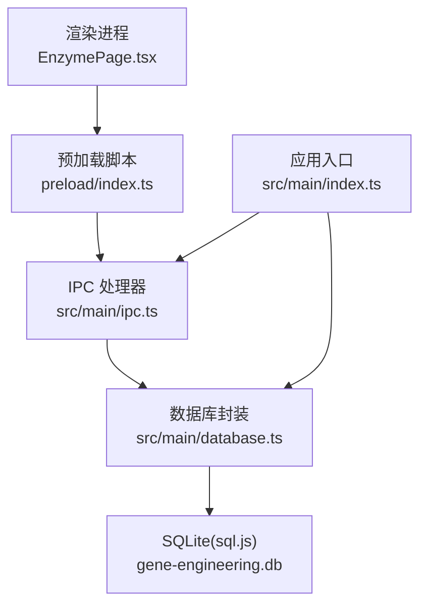
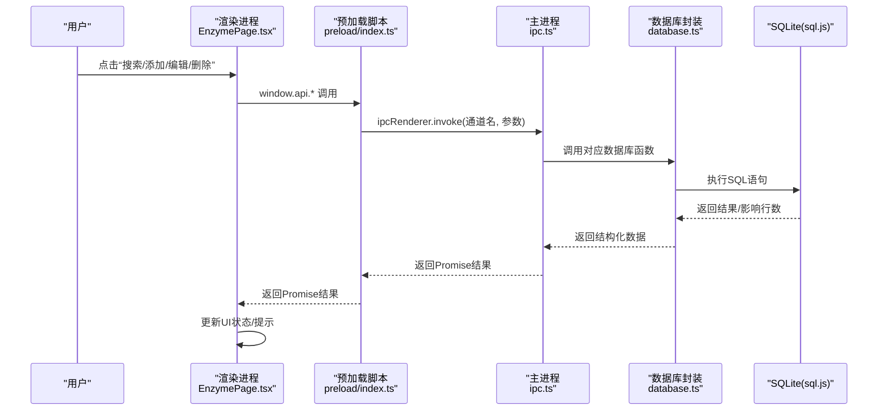
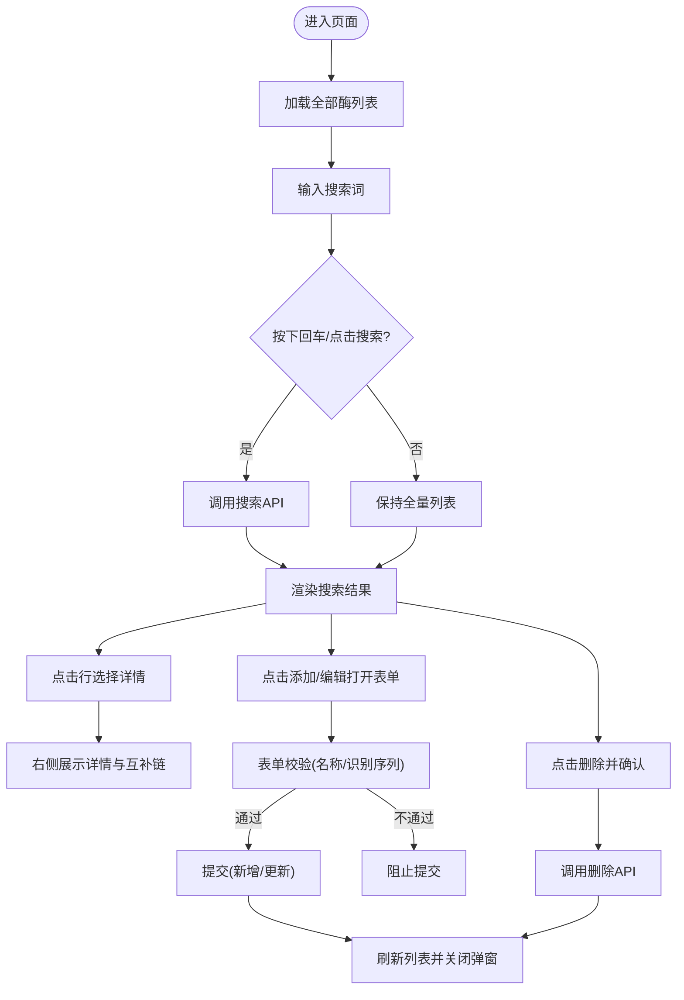
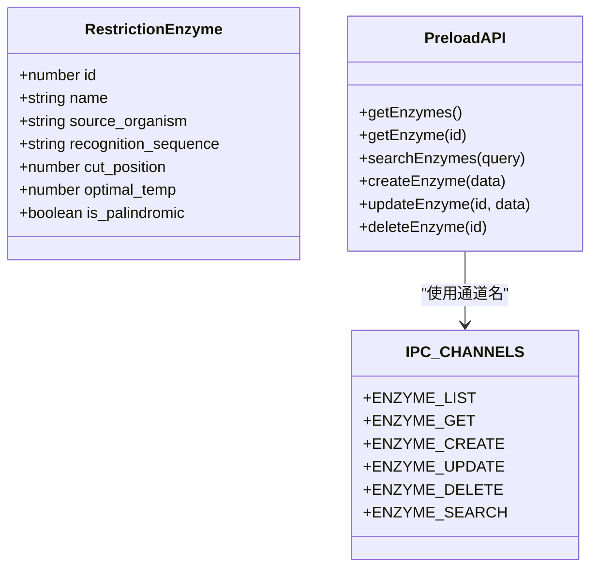
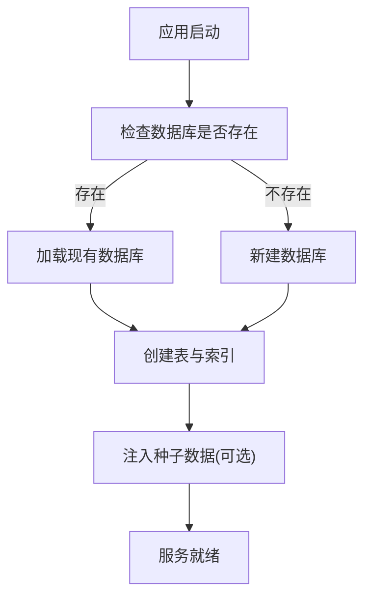
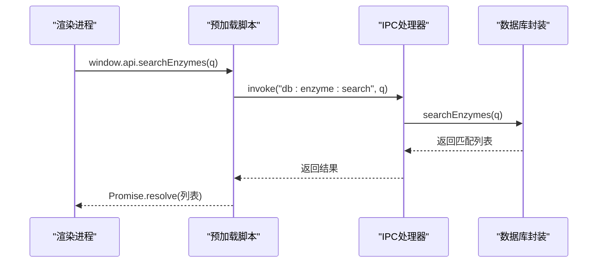
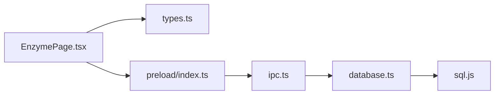

# 限制性内切酶管理

<cite>
**本文引用的文件**
- [EnzymePage.tsx](file://src/renderer/pages/EnzymePage.tsx)
- [types.ts](file://src/shared/types.ts)
- [database.ts](file://src/main/database.ts)
- [ipc.ts](file://src/main/ipc.ts)
- [index.ts](file://src/main/index.ts)
- [preload/index.ts](file://preload/index.ts)
- [package.json](file://package.json)
</cite>

## 目录
1. [简介](#简介)
2. [项目结构](#项目结构)
3. [核心组件](#核心组件)
4. [架构总览](#架构总览)
5. [详细组件分析](#详细组件分析)
6. [依赖关系分析](#依赖关系分析)
7. [性能与可用性建议](#性能与可用性建议)
8. [故障排查指南](#故障排查指南)
9. [结论](#结论)
10. [附录：使用示例与最佳实践](#附录使用示例与最佳实践)

## 简介
本文件为“限制性内切酶管理系统”的功能文档，面向用户与开发者，覆盖酶的浏览、搜索、添加、编辑、删除等完整CRUD流程；详细说明识别序列的可视化展示（切割位置高亮、互补链自动生成）；解释详细信息页面中来源物种、最适温度、回文序列等属性的呈现方式；并给出搜索功能按名称、物种或识别序列进行模糊匹配的实现说明。文末提供实际使用示例与最佳实践建议。

## 项目结构
系统采用 Electron + React 的前后端分离架构：
- 渲染进程（React）负责界面交互与数据展示
- 主进程（Electron）通过 IPC 暴露数据库操作接口
- SQLite（sql.js）作为本地持久化存储
- 共享类型定义位于 shared 层，前后端共用

图表来源
- [EnzymePage.tsx:1-252](file://src/renderer/pages/EnzymePage.tsx#L1-L252)
- [preload/index.ts:1-46](file://preload/index.ts#L1-L46)
- [ipc.ts:1-145](file://src/main/ipc.ts#L1-L145)
- [database.ts:1-439](file://src/main/database.ts#L1-L439)
- [index.ts:1-59](file://src/main/index.ts#L1-L59)

章节来源
- [index.ts:1-59](file://src/main/index.ts#L1-L59)
- [package.json:1-37](file://package.json#L1-L37)

## 核心组件
- 页面组件 EnzymePage：实现酶的列表展示、搜索、详情查看、表单新增/编辑、删除确认与刷新。
- 类型定义 types：统一 RestrictionEnzyme 数据结构及 IPC 通道常量。
- 数据库 database：基于 sql.js 的 SQLite 封装，提供酶的 CRUD 与种子数据初始化。
- IPC ipc：将前端 API 调用映射到后端数据库方法。
- 预加载 preload：通过 contextBridge 向渲染进程暴露安全 API。
- 入口 index：启动时初始化数据库、注入种子数据、注册 IPC 并创建窗口。

章节来源
- [EnzymePage.tsx:1-252](file://src/renderer/pages/EnzymePage.tsx#L1-L252)
- [types.ts:1-153](file://src/shared/types.ts#L1-L153)
- [database.ts:1-439](file://src/main/database.ts#L1-L439)
- [ipc.ts:1-145](file://src/main/ipc.ts#L1-L145)
- [preload/index.ts:1-46](file://preload/index.ts#L1-L46)
- [index.ts:1-59](file://src/main/index.ts#L1-L59)

## 架构总览
从用户操作到数据落盘的端到端流程如下：

图表来源
- [EnzymePage.tsx:19-68](file://src/renderer/pages/EnzymePage.tsx#L19-L68)
- [preload/index.ts:4-41](file://preload/index.ts#L4-L41)
- [ipc.ts:8-32](file://src/main/ipc.ts#L8-L32)
- [database.ts:139-180](file://src/main/database.ts#L139-L180)

## 详细组件分析

### 页面组件 EnzymePage
- 列表与搜索
  - 支持输入关键词后回车或点击按钮触发搜索；空查询时恢复全量列表。
  - 搜索结果包含名称、来源物种、识别序列字段模糊匹配。
- 详情面板
  - 展示来源物种、识别序列（含切割位置高亮）、最适温度、是否回文序列。
  - 自动计算并显示互补链（反向互补）。
- 表单弹窗
  - 新增/编辑复用同一弹窗；必填项校验（名称、识别序列）。
  - 提交后刷新列表并关闭弹窗。
- 删除确认
  - 二次确认后删除，若当前选中项被删则清空详情。

图表来源
- [EnzymePage.tsx:19-68](file://src/renderer/pages/EnzymePage.tsx#L19-L68)
- [EnzymePage.tsx:70-82](file://src/renderer/pages/EnzymePage.tsx#L70-L82)
- [EnzymePage.tsx:154-201](file://src/renderer/pages/EnzymePage.tsx#L154-L201)
- [EnzymePage.tsx:204-248](file://src/renderer/pages/EnzymePage.tsx#L204-L248)

章节来源
- [EnzymePage.tsx:1-252](file://src/renderer/pages/EnzymePage.tsx#L1-L252)

### 数据类型与IPC通道
- RestrictionEnzyme 字段
  - id、name、source_organism、recognition_sequence、cut_position、optimal_temp、is_palindromic
- IPC_CHANNELS
  - ENZYME_LIST、ENZYME_GET、ENZYME_CREATE、ENZYME_UPDATE、ENZYME_DELETE、ENZYME_SEARCH

图表来源
- [types.ts:1-153](file://src/shared/types.ts#L1-L153)
- [preload/index.ts:4-41](file://preload/index.ts#L4-L41)

章节来源
- [types.ts:1-153](file://src/shared/types.ts#L1-L153)
- [preload/index.ts:1-46](file://preload/index.ts#L1-L46)

### 数据库与持久化
- 表结构 restriction_enzymes
  - 字段：id、name(唯一)、source_organism、recognition_sequence、cut_position、optimal_temp、is_palindromic
  - 索引：name、recognition_sequence
- 关键方法
  - getEnzymes、getEnzyme、searchEnzymes、createEnzyme、updateEnzyme、deleteEnzyme
  - seedEnzymes：首次启动时插入常用酶种子数据
- 事务与保存
  - 所有写操作后持久化到磁盘文件 gene-engineering.db

图表来源
- [database.ts:49-137](file://src/main/database.ts#L49-L137)
- [database.ts:374-438](file://src/main/database.ts#L374-L438)

章节来源
- [database.ts:1-439](file://src/main/database.ts#L1-L439)

### IPC 桥接
- 主进程监听 IPC 通道，转发至数据库封装方法
- 预加载脚本在渲染进程暴露 window.api，屏蔽底层细节

图表来源
- [ipc.ts:18-20](file://src/main/ipc.ts#L18-L20)
- [preload/index.ts:8](file://preload/index.ts#L8)

章节来源
- [ipc.ts:1-145](file://src/main/ipc.ts#L1-L145)
- [preload/index.ts:1-46](file://preload/index.ts#L1-L46)

## 依赖关系分析
- 模块耦合
  - EnzymePage 仅依赖 window.api 与类型定义，低耦合
  - IPC 与 database 解耦良好，便于扩展其他实体
- 外部依赖
  - sql.js：嵌入式SQLite，避免安装外部数据库
  - electron-store、zustand：当前未在本模块直接引用，可后续用于状态管理或配置
  - lucide-react：图标库

图表来源
- [EnzymePage.tsx:1-252](file://src/renderer/pages/EnzymePage.tsx#L1-L252)
- [types.ts:1-153](file://src/shared/types.ts#L1-L153)
- [preload/index.ts:1-46](file://preload/index.ts#L1-L46)
- [ipc.ts:1-145](file://src/main/ipc.ts#L1-L145)
- [database.ts:1-439](file://src/main/database.ts#L1-L439)

章节来源
- [package.json:1-37](file://package.json#L1-L37)

## 性能与可用性建议
- 搜索优化
  - 当前使用 LIKE 模糊匹配，适合中小规模数据；当酶数量增长时可考虑全文索引或分词检索。
- 渲染优化
  - 列表较长时可引入虚拟滚动或分页加载，减少DOM节点数量。
- 交互体验
  - 表单提交后可增加成功/失败反馈；删除前可增加批量删除能力。
- 数据一致性
  - 对唯一性约束（如 name）可在前端做重复提示，提升用户体验。

[本节为通用建议，不直接分析具体文件]

## 故障排查指南
- 无法加载数据库
  - 检查 sqlite wasm 路径是否正确，确保打包产物中包含 sql-wasm.wasm。
- 搜索无结果
  - 确认搜索词非空且数据库中存在匹配记录；注意大小写与空格。
- 表单提交无效
  - 检查名称与识别序列是否为空；确认 IPC 通道与方法签名一致。
- 删除后详情未清空
  - 确认删除成功后重置 selectedEnzyme 状态。

章节来源
- [EnzymePage.tsx:33-38](file://src/renderer/pages/EnzymePage.tsx#L33-L38)
- [EnzymePage.tsx:59-68](file://src/renderer/pages/EnzymePage.tsx#L59-L68)
- [database.ts:49-65](file://src/main/database.ts#L49-L65)

## 结论
本系统以轻量、易部署为目标，利用 Electron + React + sql.js 实现了限制性内切酶的完整管理功能。界面直观、交互流畅，具备识别序列可视化与互补链自动生成功能，满足日常实验设计与教学演示需求。后续可按需扩展更多高级检索与可视化能力。

[本节为总结性内容，不直接分析具体文件]

## 附录：使用示例与最佳实践

- 浏览与搜索
  - 打开页面即加载全部酶列表；在搜索框输入关键词（名称、物种或识别序列），回车或点击“搜索”即可过滤。
  - 示例：输入 “EcoRI” 可快速定位该酶；输入 “coli” 可筛选来源于大肠杆菌的酶。
- 查看详情
  - 点击任意一行，右侧面板展示详细信息，包括来源物种、识别序列（带切割位置高亮）、最适温度、是否回文序列以及互补链。
- 添加新酶
  - 点击“添加”，填写名称、来源物种、识别序列（必填），设置切割位置、最适温度、是否回文序列，点击“保存”。
- 编辑已有酶
  - 点击行内“编辑”按钮，修改字段后保存。
- 删除酶
  - 点击行内“删除”按钮，确认后即可移除。

最佳实践
- 命名规范：酶名称建议使用标准命名（如 EcoRI、BamHI），避免重复。
- 识别序列：仅输入 A/T/G/C 字符，系统会自动转为大写。
- 切割位置：从第1位开始计数，表示在该位之后切割。
- 回文序列：若不确定，可先标记为“是”，后续根据权威资料修正。
- 备份数据：定期备份用户目录下的 gene-engineering.db 文件，防止数据丢失。

章节来源
- [EnzymePage.tsx:89-107](file://src/renderer/pages/EnzymePage.tsx#L89-L107)
- [EnzymePage.tsx:154-201](file://src/renderer/pages/EnzymePage.tsx#L154-L201)
- [EnzymePage.tsx:204-248](file://src/renderer/pages/EnzymePage.tsx#L204-L248)
- [database.ts:374-438](file://src/main/database.ts#L374-L438)