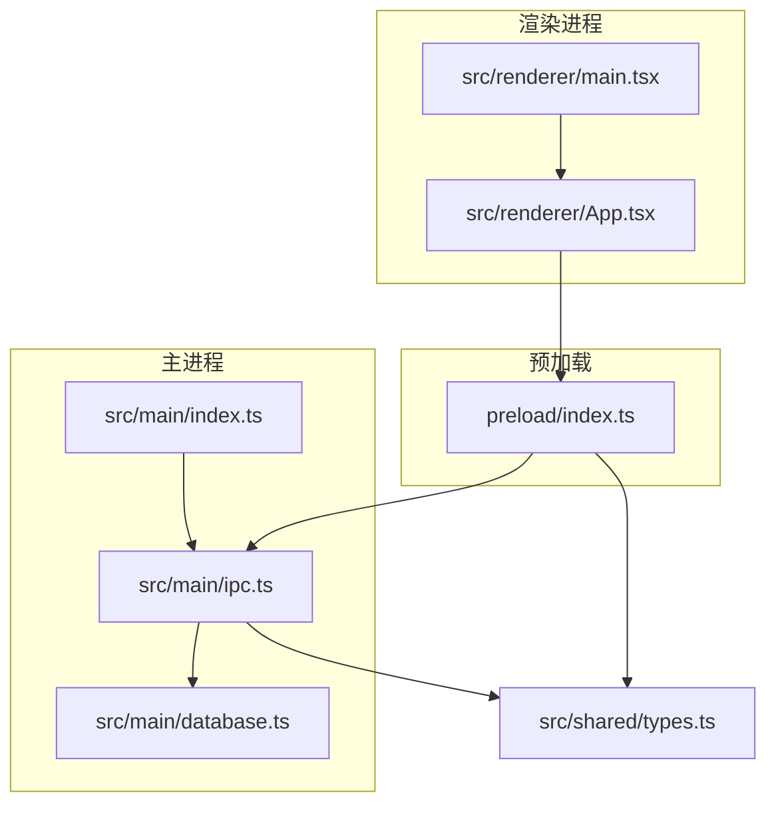
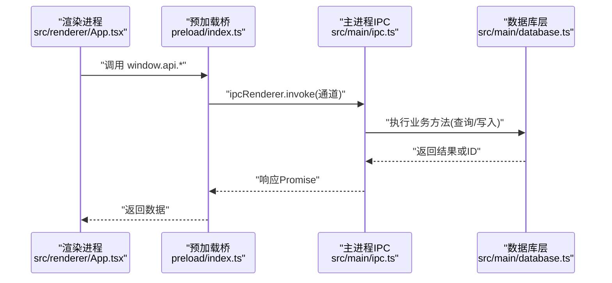
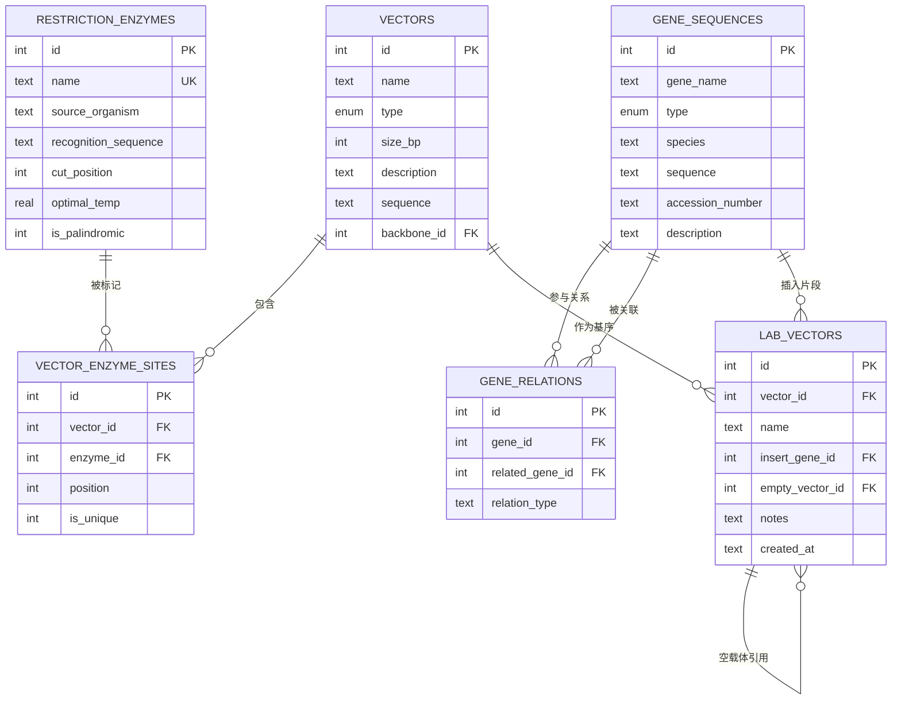
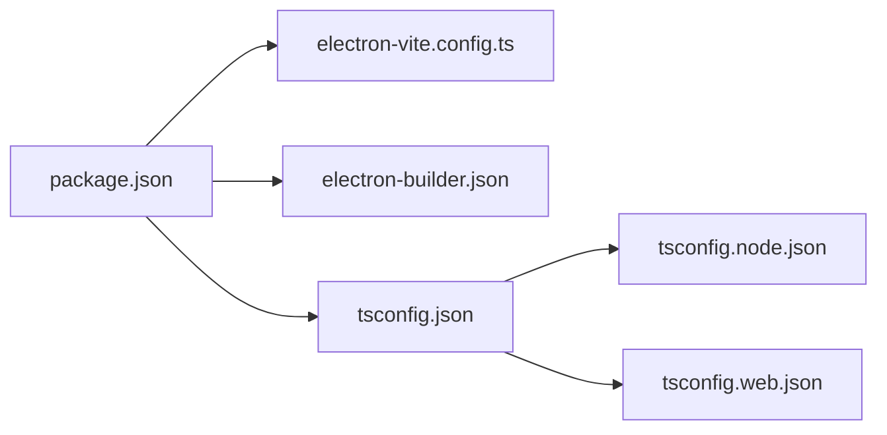

# 开发指南

<cite>
**本文引用的文件**
- [package.json](file://gene-engineering-tool/package.json)
- [tsconfig.json](file://gene-engineering-tool/tsconfig.json)
- [tsconfig.node.json](file://gene-engineering-tool/tsconfig.node.json)
- [tsconfig.web.json](file://gene-engineering-tool/tsconfig.web.json)
- [electron.vite.config.ts](file://gene-engineering-tool/electron.vite.config.ts)
- [src/main/index.ts](file://gene-engineering-tool/src/main/index.ts)
- [src/main/database.ts](file://gene-engineering-tool/src/main/database.ts)
- [src/main/ipc.ts](file://gene-engineering-tool/src/main/ipc.ts)
- [preload/index.ts](file://gene-engineering-tool/preload/index.ts)
- [src/shared/types.ts](file://gene-engineering-tool/src/shared/types.ts)
- [src/renderer/main.tsx](file://gene-engineering-tool/src/renderer/main.tsx)
- [src/renderer/App.tsx](file://gene-engineering-tool/src/renderer/App.tsx)
- [electron-builder.json](file://gene-engineering-tool/electron-builder.json)
</cite>

## 目录
1. [简介](#简介)
2. [项目结构](#项目结构)
3. [核心组件](#核心组件)
4. [架构总览](#架构总览)
5. [详细组件分析](#详细组件分析)
6. [依赖分析](#依赖分析)
7. [性能考虑](#性能考虑)
8. [故障排查指南](#故障排查指南)
9. [结论](#结论)
10. [附录](#附录)

## 简介
本指南面向基因工程辅助软件的开发者，覆盖从环境搭建、目录结构与代码组织、开发与调试工作流、TypeScript 配置与编译、构建打包、代码规范与贡献流程，到常见问题排查与性能优化建议。目标是帮助新贡献者快速上手并高效协作。

## 项目结构
本项目采用 Electron + Vite + React + TypeScript 的现代化桌面应用架构，主进程负责数据库与系统能力，渲染进程提供 React UI，预加载脚本桥接两者并通过 IPC 通信。共享类型定义位于 shared 目录，供主/渲染两端复用。

图表来源
- [src/main/index.ts:1-59](file://gene-engineering-tool/src/main/index.ts#L1-L59)
- [src/main/ipc.ts:1-145](file://gene-engineering-tool/src/main/ipc.ts#L1-L145)
- [src/main/database.ts:1-439](file://gene-engineering-tool/src/main/database.ts#L1-L439)
- [preload/index.ts:1-46](file://gene-engineering-tool/preload/index.ts#L1-L46)
- [src/renderer/main.tsx:1-11](file://gene-engineering-tool/src/renderer/main.tsx#L1-L11)
- [src/renderer/App.tsx:1-106](file://gene-engineering-tool/src/renderer/App.tsx#L1-L106)
- [src/shared/types.ts:1-132](file://gene-engineering-tool/src/shared/types.ts#L1-L132)

章节来源
- [package.json:1-37](file://gene-engineering-tool/package.json#L1-L37)
- [electron.vite.config.ts:1-52](file://gene-engineering-tool/electron.vite.config.ts#L1-L52)

## 核心组件
- 主进程入口：创建窗口、初始化数据库、注册 IPC 处理器、处理应用生命周期事件。
- IPC 层：集中暴露前端可调用的 API 通道，转发至数据库与文件系统操作。
- 数据持久化：基于 sql.js（WASM）在用户数据目录维护 SQLite 数据库，包含内切酶、载体、基因序列、实验室载体等表及索引。
- 预加载桥：通过 contextBridge 将受控 API 暴露给渲染进程，避免直接访问 Node/Electron 能力。
- 渲染应用：React + Tailwind 布局，侧边导航切换页面，调用 window.api 完成业务交互。

章节来源
- [src/main/index.ts:1-59](file://gene-engineering-tool/src/main/index.ts#L1-L59)
- [src/main/ipc.ts:1-145](file://gene-engineering-tool/src/main/ipc.ts#L1-L145)
- [src/main/database.ts:1-439](file://gene-engineering-tool/src/main/database.ts#L1-L439)
- [preload/index.ts:1-46](file://gene-engineering-tool/preload/index.ts#L1-L46)
- [src/renderer/App.tsx:1-106](file://gene-engineering-tool/src/renderer/App.tsx#L1-L106)

## 架构总览
下图展示从渲染进程发起请求到主进程执行业务逻辑并返回结果的完整链路。

图表来源
- [src/renderer/App.tsx:1-106](file://gene-engineering-tool/src/renderer/App.tsx#L1-L106)
- [preload/index.ts:1-46](file://gene-engineering-tool/preload/index.ts#L1-L46)
- [src/main/ipc.ts:1-145](file://gene-engineering-tool/src/main/ipc.ts#L1-L145)
- [src/main/database.ts:1-439](file://gene-engineering-tool/src/main/database.ts#L1-L439)

## 详细组件分析

### 主进程与应用启动
- 窗口与安全策略：启用上下文隔离、禁用 Node 集成、指定 preload 路径；外部链接交由系统浏览器打开。
- 开发模式：当存在环境变量时优先加载远程渲染地址，便于热重载。
- 生命周期：首次 ready 时初始化数据库、注入种子数据、注册 IPC、创建窗口；macOS 下支持激活重建窗口；非 macOS 平台关闭所有窗口退出。

章节来源
- [src/main/index.ts:1-59](file://gene-engineering-tool/src/main/index.ts#L1-L59)

### IPC 通信与文件解析
- 通道管理：统一在共享类型中声明 IPC_CHANNELS，前后端共用，避免硬编码字符串。
- 资源开放：仅暴露必要 API，包括内切酶、载体、基因、实验室载体 CRUD 以及文件选择与解析。
- 文件解析：根据扩展名自动识别 GenBank 或 FASTA，调用对应解析器返回结构化数据。

章节来源
- [src/shared/types.ts:94-132](file://gene-engineering-tool/src/shared/types.ts#L94-L132)
- [src/main/ipc.ts:1-145](file://gene-engineering-tool/src/main/ipc.ts#L1-L145)

### 数据持久化与模型
- 存储引擎：使用 sql.js 在用户数据目录下维护 .db 文件，开启 WAL 模式与外键约束。
- 表结构：内切酶、载体、载体-酶位点、基因序列、基因关系、实验室载体，均建立常用索引以提升查询性能。
- 种子数据：首次启动时若内切酶表为空则批量插入常用酶信息。
- 通用封装：提供 queryAll/queryOne/run/lastInsertId 等基础方法，CRUD 函数统一走 run 以触发持久化。

图表来源
- [src/main/database.ts:67-137](file://gene-engineering-tool/src/main/database.ts#L67-L137)

章节来源
- [src/main/database.ts:1-439](file://gene-engineering-tool/src/main/database.ts#L1-L439)

### 预加载桥与类型安全
- 暴露 API：将 IPC 调用封装为 window.api，按模块分组（酶、载体、基因、实验室载体、文件）。
- 类型导出：同时导出 ElectronAPI 类型，便于在渲染端获得智能提示与类型检查。

章节来源
- [preload/index.ts:1-46](file://gene-engineering-tool/preload/index.ts#L1-L46)
- [src/shared/types.ts:1-132](file://gene-engineering-tool/src/shared/types.ts#L1-L132)

### 渲染应用与页面路由
- 根入口：React 18 StrictMode 挂载 App。
- 布局与导航：左侧可折叠导航栏，右侧内容区根据当前页渲染不同页面组件。
- 文件入口：底部“打开文件”按钮通过 window.api.openFile 触发主进程对话框并跳转至文件查看页。

章节来源
- [src/renderer/main.tsx:1-11](file://gene-engineering-tool/src/renderer/main.tsx#L1-L11)
- [src/renderer/App.tsx:1-106](file://gene-engineering-tool/src/renderer/App.tsx#L1-L106)

## 依赖分析
- 运行时依赖：React、React DOM、React Router、状态库、图标库、SQLite WASM、Electron Store。
- 开发依赖：Electron、Vite、electron-vite、electron-builder、Tailwind、PostCSS、Autoprefixer、TypeScript、React 类型。
- 构建产物：主进程与预加载输出至 out，渲染产物由 electron-vite 管理。

图表来源
- [package.json:1-37](file://gene-engineering-tool/package.json#L1-L37)
- [electron.vite.config.ts:1-52](file://gene-engineering-tool/electron.vite.config.ts#L1-L52)
- [electron-builder.json:1-22](file://gene-engineering-tool/electron-builder.json#L1-L22)
- [tsconfig.json:1-18](file://gene-engineering-tool/tsconfig.json#L1-L18)
- [tsconfig.node.json:1-20](file://gene-engineering-tool/tsconfig.node.json#L1-L20)
- [tsconfig.web.json:1-23](file://gene-engineering-tool/tsconfig.web.json#L1-L23)

章节来源
- [package.json:1-37](file://gene-engineering-tool/package.json#L1-L37)

## 性能考虑
- 数据库
  - 已开启 WAL 模式与外键约束，提升并发写与一致性。
  - 对高频查询字段建立索引（名称、识别序列、类型等），减少全表扫描。
  - 批量插入种子数据时使用 INSERT OR IGNORE，避免重复写入。
- 渲染
  - 使用 React 18 并发特性与 StrictMode 辅助定位副作用问题。
  - 列表与搜索建议使用防抖/节流，避免频繁重渲染。
- 构建
  - 主进程使用 externalizeDepsPlugin 将原生依赖外置，减小包体并加速冷启动。
  - 按需引入图标与样式，避免冗余资源。

[本节为通用性能建议，不直接分析具体文件]

## 故障排查指南
- 无法连接数据库或找不到 wasm 文件
  - 确认 sql.js 的 wasm 二进制路径正确且随应用分发。
  - 检查用户数据目录是否存在且可写。
- IPC 调用无响应
  - 核对通道名是否一致（集中在共享类型中定义）。
  - 确认主进程已注册对应 handle，且参数顺序与类型匹配。
- 渲染进程无法访问 window.api
  - 确保 preload 脚本路径正确且在 BrowserWindow 中启用 contextIsolation。
  - 检查是否在沙箱模式下错误访问了 Node API。
- 构建失败
  - 清理缓存后重试；确认 node_modules 与平台工具链安装完整。
  - 检查 electron-builder 目标平台与签名配置。

章节来源
- [src/main/index.ts:1-59](file://gene-engineering-tool/src/main/index.ts#L1-L59)
- [src/main/ipc.ts:1-145](file://gene-engineering-tool/src/main/ipc.ts#L1-L145)
- [preload/index.ts:1-46](file://gene-engineering-tool/preload/index.ts#L1-L46)
- [src/main/database.ts:1-439](file://gene-engineering-tool/src/main/database.ts#L1-L439)

## 结论
本项目以清晰的职责分层与严格的类型约束为基础，结合 Electron 的安全默认值与 Vite 的高效开发体验，适合持续迭代与团队协作。遵循本指南的环境与流程要求，可显著提升开发效率与交付质量。

[本节为总结性内容，不直接分析具体文件]

## 附录

### 开发环境搭建
- 前置要求
  - Node.js：建议使用与包管理器兼容的稳定版本（参考 package.json 中的依赖生态）。
  - 操作系统：Windows/macOS/Linux（构建目标含 Windows NSIS）。
- 安装依赖
  - 在项目根目录执行依赖安装命令。
- 运行开发模式
  - 使用开发脚本启动 Electron + Vite 热重载。
- 预览构建产物
  - 使用预览脚本验证生产构建效果。

章节来源
- [package.json:1-37](file://gene-engineering-tool/package.json#L1-L37)

### 目录结构与代码组织原则
- src/main：主进程逻辑（窗口、IPC、数据库、文件解析）。
- src/renderer：渲染进程（React 应用、页面、样式）。
- src/shared：跨进程共享的类型与常量。
- preload：安全桥接，仅暴露最小 API。
- 配置文件：Vite/Electron 构建、TS 多项目引用、Tailwind/PostCSS。

章节来源
- [electron.vite.config.ts:1-52](file://gene-engineering-tool/electron.vite.config.ts#L1-L52)
- [tsconfig.json:1-18](file://gene-engineering-tool/tsconfig.json#L1-L18)
- [tsconfig.node.json:1-20](file://gene-engineering-tool/tsconfig.node.json#L1-L20)
- [tsconfig.web.json:1-23](file://gene-engineering-tool/tsconfig.web.json#L1-L23)

### 开发工作流程
- 热重载开发
  - 修改渲染代码即时刷新；修改主进程需重启或等待重新加载。
- 调试技巧
  - 渲染进程：使用浏览器 DevTools。
  - 主进程：在 IDE 中附加 Node 调试器或使用控制台日志。
- 测试策略
  - 单元测试：针对数据库封装与解析逻辑编写用例。
  - 集成测试：模拟 IPC 调用与文件解析流程。
  - 端到端测试：使用 Playwright/Electron 测试框架进行 UI 自动化。

[本节为通用实践建议，不直接分析具体文件]

### TypeScript 配置与编译选项
- 顶层 tsconfig 启用严格模式、ESNext 模块解析与 isolatedModules。
- 分项目配置：
  - tsconfig.node.json：主进程、预加载、共享类型与构建脚本。
  - tsconfig.web.json：渲染进程，启用 react-jsx 与路径别名。
- 路径别名：@shared 与 @ 分别指向共享与渲染目录，便于跨模块引用。

章节来源
- [tsconfig.json:1-18](file://gene-engineering-tool/tsconfig.json#L1-L18)
- [tsconfig.node.json:1-20](file://gene-engineering-tool/tsconfig.node.json#L1-L20)
- [tsconfig.web.json:1-23](file://gene-engineering-tool/tsconfig.web.json#L1-L23)
- [electron.vite.config.ts:1-52](file://gene-engineering-tool/electron.vite.config.ts#L1-L52)

### 构建系统与打包配置
- 构建入口
  - 主进程入口：src/main/index.ts
  - 预加载入口：preload/index.ts
  - 渲染入口：src/renderer/index.html
- 打包产物
  - 输出目录：dist
  - 包含 out/**/*，排除 node_modules
  - 额外资源：data 目录映射到应用资源
  - Windows 目标：NSIS 安装包

章节来源
- [electron.vite.config.ts:1-52](file://gene-engineering-tool/electron.vite.config.ts#L1-L52)
- [electron-builder.json:1-22](file://gene-engineering-tool/electron-builder.json#L1-L22)

### 代码规范与贡献指南
- 命名与风格
  - 变量与函数使用小驼峰，类型与接口使用大驼峰。
  - 常量使用大写蛇形，通道名集中在共享类型中定义。
- 类型安全
  - 所有 IPC 入参/出参必须具类型，禁止 any。
  - 共享类型变更需同步更新前后端使用处。
- 提交规范
  - 使用语义化提交信息（feat/fix/docs/chore 等）。
  - 每次提交聚焦单一变更，附带必要说明。
- 审查清单
  - 是否新增敏感权限？是否通过 preload 暴露？
  - 数据库变更是否添加迁移或回滚方案？
  - 是否补充必要的注释与文档？

[本节为通用规范建议，不直接分析具体文件]

### 常见问题排查
- 端口占用导致开发模式启动失败
  - 释放端口或更换端口后重试。
- 构建时报错缺少原生模块
  - 重新安装依赖并清理缓存；必要时重装平台工具链。
- 数据库损坏
  - 备份用户数据目录下的 .db 文件后尝试重建。
- 文件解析异常
  - 校验输入文件格式与编码；增加边界条件与错误提示。

章节来源
- [src/main/ipc.ts:1-145](file://gene-engineering-tool/src/main/ipc.ts#L1-L145)
- [src/main/database.ts:1-439](file://gene-engineering-tool/src/main/database.ts#L1-L439)