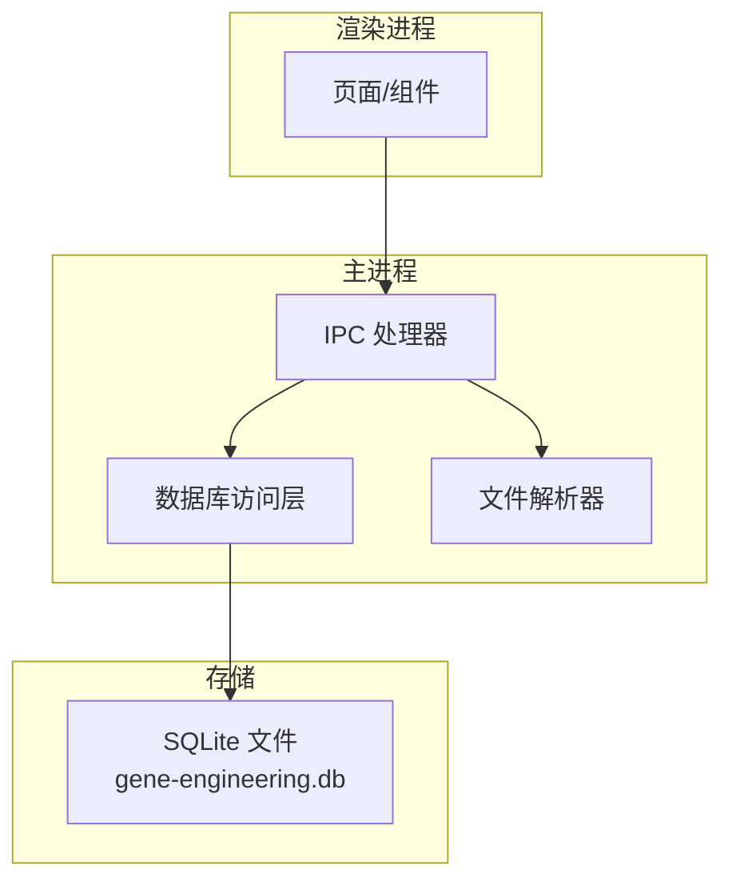
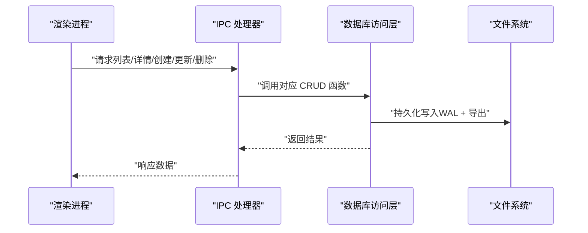
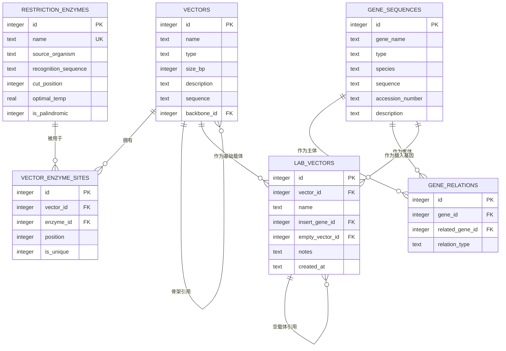
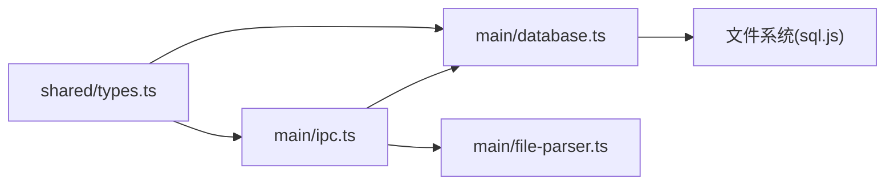
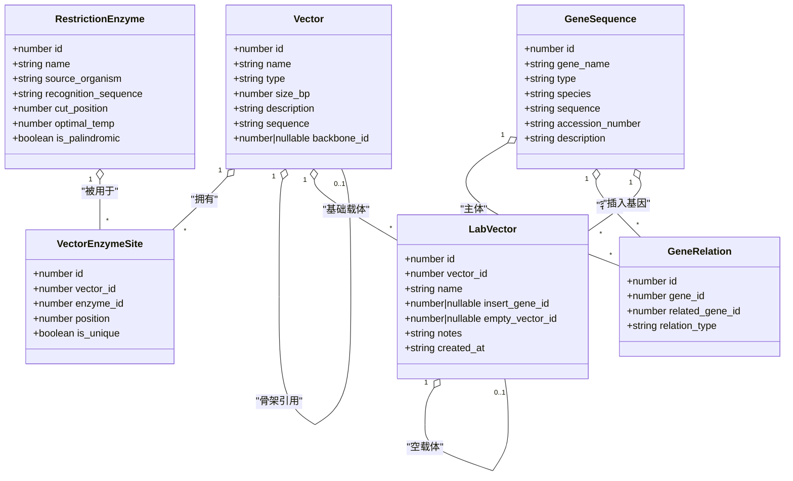

# 数据模型

<cite>
**本文引用的文件**   
- [src/shared/types.ts](file://src/shared/types.ts)
- [src/main/database.ts](file://src/main/database.ts)
- [src/main/ipc.ts](file://src/main/ipc.ts)
- [src/main/file-parser.ts](file://src/main/file-parser.ts)
</cite>

## 目录
1. [简介](#简介)
2. [项目结构](#项目结构)
3. [核心组件](#核心组件)
4. [架构总览](#架构总览)
5. [详细组件分析](#详细组件分析)
6. [依赖关系分析](#依赖关系分析)
7. [性能考量](#性能考量)
8. [故障排查指南](#故障排查指南)
9. [结论](#结论)
10. [附录](#附录)

## 简介
本文件为基因工程辅助软件的数据模型文档，覆盖以下目标：
- 定义并解释所有实体类型与字段含义、数据类型及业务规则约束
- 描述实体间关系映射（如载体与酶切位点、基因序列层次等）
- 提供数据库表结构设计图与ER图
- 说明数据验证规则与完整性约束
- 给出示例数据与常用查询模式
- 解释数据迁移策略与版本兼容性考虑

## 项目结构
本项目采用前后端分离的桌面应用架构（Electron），数据层基于内存/文件型 SQLite（sql.js）。核心数据模型定义在共享类型文件中，数据库初始化与CRUD逻辑在主进程实现，IPC通道负责渲染进程与主进程通信。

图表来源
- [src/main/ipc.ts:1-145](file://src/main/ipc.ts#L1-L145)
- [src/main/database.ts:49-137](file://src/main/database.ts#L49-L137)
- [src/main/file-parser.ts:1-243](file://src/main/file-parser.ts#L1-L243)

章节来源
- [src/main/ipc.ts:1-145](file://src/main/ipc.ts#L1-L145)
- [src/main/database.ts:49-137](file://src/main/database.ts#L49-L137)
- [src/main/file-parser.ts:1-243](file://src/main/file-parser.ts#L1-L243)

## 核心组件
本节概述核心实体及其职责：
- RestrictionEnzyme（限制性内切酶）：记录酶的名称、来源、识别序列、切割位置、最适温度、是否回文等信息
- Vector（载体）：记录载体名称、类型、大小、描述、序列以及可能的骨架引用
- VectorEnzymeSite（载体-酶切位点关联）：记录载体上某酶的切点位置与唯一性标记
- GeneSequence（基因序列）：记录基因名、类型（mRNA/cDNA/genomic/protein）、物种、序列、登录号、描述
- GeneRelation（基因关系）：记录基因之间的关联关系（多对多）
- LabVector（实验室载体）：记录实验中的具体载体实例，包含基础载体、插入基因、空载体引用与备注

章节来源
- [src/shared/types.ts:1-64](file://src/shared/types.ts#L1-L64)

## 架构总览
数据流从渲染进程通过 IPC 调用主进程的数据库操作，最终落盘到 SQLite 文件。文件导入流程由 IPC 触发文件选择与解析，返回结构化记录供后续入库或展示。

图表来源
- [src/main/ipc.ts:1-145](file://src/main/ipc.ts#L1-L145)
- [src/main/database.ts:18-47](file://src/main/database.ts#L18-L47)

## 详细组件分析

### 实体与字段定义
- RestrictionEnzyme
  - id: 自增主键
  - name: 酶名，非空且唯一
  - source_organism: 来源生物，非空
  - recognition_sequence: 识别序列，非空
  - cut_position: 切割位置，整数，非空
  - optimal_temp: 最适温度，实数，默认 37.0
  - is_palindromic: 是否回文，布尔（存储为整型）
- Vector
  - id: 自增主键
  - name: 载体名，非空
  - type: 载体类型，枚举（质粒/噬菌体/柯斯米德/BAC/YAC/其他）
  - size_bp: 大小（bp），整数，默认 0
  - description: 描述，文本，默认空串
  - sequence: 序列，文本，默认空串
  - backbone_id: 骨架引用，可空，外键指向 vectors(id)，删除时置空
- VectorEnzymeSite
  - id: 自增主键
  - vector_id: 载体ID，外键，级联删除
  - enzyme_id: 酶ID，外键，级联删除
  - position: 切点位置，整数，非空
  - is_unique: 是否唯一切点，布尔（存储为整型），默认是
- GeneSequence
  - id: 自增主键
  - gene_name: 基因名，非空
  - type: 类型，枚举（mrna/cdna/genomic/protein）
  - species: 物种，文本，默认空串
  - sequence: 序列，文本，默认空串
  - accession_number: 登录号，文本，默认空串
  - description: 描述，文本，默认空串
- GeneRelation
  - id: 自增主键
  - gene_id: 基因ID，外键，级联删除
  - related_gene_id: 相关基因ID，外键，级联删除
  - relation_type: 关系类型，文本，非空
- LabVector
  - id: 自增主键
  - vector_id: 基础载体ID，外键，删除时置空
  - name: 实验室载体名，非空
  - insert_gene_id: 插入基因ID，外键，删除时置空
  - empty_vector_id: 空载体ID，自引用外键，删除时置空
  - notes: 备注，文本，默认空串
  - created_at: 创建时间，默认当前时间

章节来源
- [src/shared/types.ts:1-64](file://src/shared/types.ts#L1-L64)
- [src/main/database.ts:67-137](file://src/main/database.ts#L67-L137)

### 关系映射与业务规则
- 载体与酶切位点
  - 一对多：一个载体可拥有多个酶切位点
  - 多对一：每个位点属于一个载体和一个酶
  - 业务规则：位点位置为非负整数；is_unique 用于标识是否为唯一切点
- 基因序列关系
  - 自引用多对多：通过 gene_relations 表表达任意两个基因之间的关系
  - 业务规则：relation_type 用于区分关系语义（如“同源”、“前体-产物”等）
- 实验室载体
  - 多对一：lab_vectors.vector_id -> vectors.id
  - 多对一：lab_vectors.insert_gene_id -> gene_sequences.id
  - 自引用：lab_vectors.empty_vector_id -> lab_vectors.id（表示该载体对应的空载体）
  - 业务规则：created_at 自动填充；notes 用于记录实验信息

章节来源
- [src/main/database.ts:79-127](file://src/main/database.ts#L79-L127)

### ER 图

图表来源
- [src/main/database.ts:67-137](file://src/main/database.ts#L67-L137)

### 数据验证与完整性约束
- 列级约束
  - NOT NULL：name、source_organism、recognition_sequence、cut_position、type、position、gene_name、relation_type 等关键字段
  - DEFAULT：optimal_temp=37.0、size_bp=0、is_unique=1、created_at=datetime('now') 等
  - CHECK：type 取值限定（载体类型与基因类型）
  - UNIQUE：restriction_enzymes.name 唯一
- 外键约束
  - PRAGMA foreign_keys = ON 已启用
  - 级联策略：vector_enzyme_sites 删除时 CASCADE；lab_vectors 与 vectors/gene_sequences 的关联删除时 SET NULL；vectors.backbone_id 删除时 SET NULL
- 索引优化
  - restriction_enzymes(name, recognition_sequence)
  - vectors(name)
  - gene_sequences(gene_name, type)
  - lab_vectors(name)

章节来源
- [src/main/database.ts:62-137](file://src/main/database.ts#L62-L137)

### 示例数据与常用查询模式
- 示例数据
  - 种子数据：系统启动时若 restriction_enzymes 为空，则批量插入常见限制酶（EcoRI、BamHI、HindIII 等）
  - 建议：在首次运行后，可通过导入 GenBank/FASTA 文件生成初始载体与基因序列
- 常用查询模式
  - 列出所有酶并按名称排序
  - 按名称/来源/识别序列模糊搜索酶
  - 获取指定载体的全部酶切位点（含酶详细信息）
  - 按类型筛选基因序列
  - 模糊搜索基因（支持名称/物种/登录号/描述）
  - 获取某基因的所有关系（双向）
  - 列出实验室载体并附带基础载体名、插入基因名、空载体名

章节来源
- [src/main/database.ts:141-180](file://src/main/database.ts#L141-L180)
- [src/main/database.ts:218-238](file://src/main/database.ts#L218-L238)
- [src/main/database.ts:242-317](file://src/main/database.ts#L242-L317)
- [src/main/database.ts:321-370](file://src/main/database.ts#L321-L370)
- [src/main/database.ts:374-438](file://src/main/database.ts#L374-L438)

### 数据迁移策略与版本兼容性
- 现状
  - 使用 CREATE TABLE IF NOT EXISTS 保证表存在即跳过创建
  - 使用 CREATE INDEX IF NOT EXISTS 保证索引存在即跳过创建
  - 未实现显式版本号与 ALTER TABLE 迁移脚本
- 建议方案
  - 引入 schema_version 表或元数据字段，记录当前数据库版本
  - 每次升级时检查版本，执行增量迁移（ALTER TABLE、新增索引、数据清洗）
  - 保留旧版兼容读取逻辑，确保向后兼容
  - 在 initDatabase 中集中管理迁移步骤，失败时回滚或提示用户备份

章节来源
- [src/main/database.ts:67-137](file://src/main/database.ts#L67-L137)

## 依赖关系分析
- 模块耦合
  - shared/types.ts 定义类型，被 database.ts 与 ipc.ts 引用
  - ipc.ts 将前端请求路由到 database.ts 的具体方法
  - file-parser.ts 提供 GenBank/FASTA 解析能力，ipc.ts 在文件打开时调用
- 外部依赖
  - sql.js（WASM 版 SQLite）用于本地数据库
  - Electron 的 fs/app/dialog 用于文件读写与对话框

图表来源
- [src/shared/types.ts:1-132](file://src/shared/types.ts#L1-L132)
- [src/main/database.ts:1-137](file://src/main/database.ts#L1-L137)
- [src/main/ipc.ts:1-145](file://src/main/ipc.ts#L1-L145)
- [src/main/file-parser.ts:1-243](file://src/main/file-parser.ts#L1-L243)

章节来源
- [src/shared/types.ts:1-132](file://src/shared/types.ts#L1-L132)
- [src/main/database.ts:1-137](file://src/main/database.ts#L1-L137)
- [src/main/ipc.ts:1-145](file://src/main/ipc.ts#L1-L145)
- [src/main/file-parser.ts:1-243](file://src/main/file-parser.ts#L1-L243)

## 性能考量
- WAL 模式：提升并发读性能与崩溃恢复能力
- 索引：对高频查询字段建立索引（名称、类型、识别序列等）
- 查询优化：避免全表扫描，尽量使用 WHERE 条件与 LIKE 参数化
- 大对象处理：sequence 字段可能较大，建议分页加载或按需读取
- 批量操作：导入大量数据时使用事务包裹以减少磁盘写入次数

[本节为通用指导，不直接分析具体文件]

## 故障排查指南
- 外键约束失败
  - 现象：插入/删除时报外键冲突
  - 排查：确认外键已开启（PRAGMA foreign_keys = ON），检查父子记录是否存在
- 唯一约束冲突
  - 现象：插入酶名重复报错
  - 排查：确认 name 唯一性，必要时先查询再决定更新或忽略
- 类型校验失败
  - 现象：CHECK 约束报错
  - 排查：确认 type 值在允许集合内
- 文件解析异常
  - 现象：GenBank/FASTA 解析结果不完整
  - 排查：检查文件格式是否符合标准，关注 LOCUS/FEATURES/ORIGIN 等关键行

章节来源
- [src/main/database.ts:62-137](file://src/main/database.ts#L62-L137)
- [src/main/file-parser.ts:6-130](file://src/main/file-parser.ts#L6-L130)

## 结论
本数据模型围绕限制性内切酶、载体、基因序列与实验室载体展开，通过外键与约束保障数据一致性，并通过索引与 WAL 模式提升性能。建议在后续迭代中引入显式的版本管理与迁移机制，以增强系统的可维护性与兼容性。

[本节为总结性内容，不直接分析具体文件]

## 附录

### 类图（TypeScript 接口与关系）

图表来源
- [src/shared/types.ts:1-64](file://src/shared/types.ts#L1-L64)

### 文件解析数据结构
- GenBankRecord：包含名称、描述、序列、大小、特征列表、登录号、版本、拓扑（线性/环状）
- GenBankFeature：特征类型、位置字符串、起止位置、链方向、限定符字典
- FastaRecord：记录ID、描述、序列

章节来源
- [src/shared/types.ts:66-91](file://src/shared/types.ts#L66-L91)
- [src/main/file-parser.ts:6-130](file://src/main/file-parser.ts#L6-L130)
- [src/main/file-parser.ts:199-242](file://src/main/file-parser.ts#L199-L242)