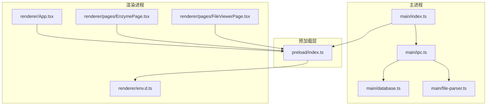
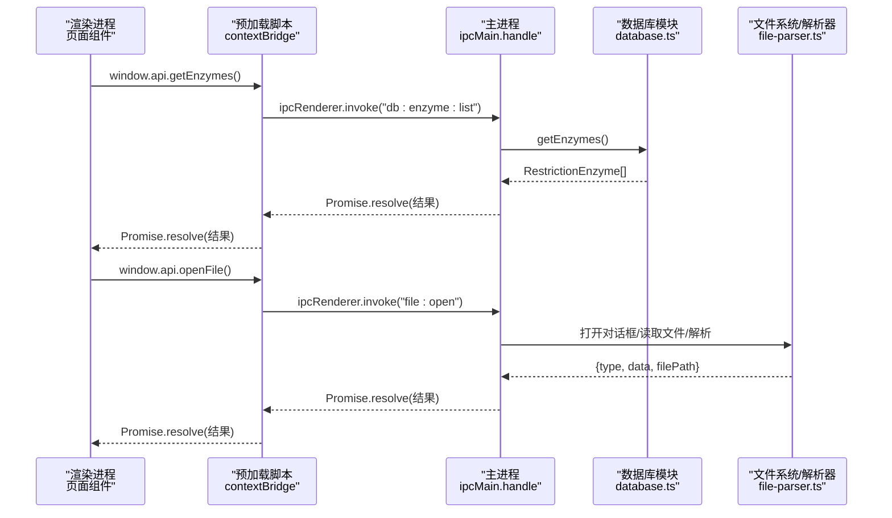
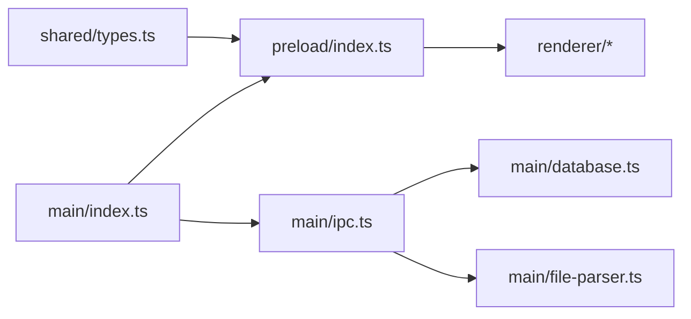

# IPC通信机制

<cite>
**本文引用的文件**   
- [preload/index.ts](file://preload/index.ts)
- [src/main/ipc.ts](file://src/main/ipc.ts)
- [src/shared/types.ts](file://src/shared/types.ts)
- [src/main/index.ts](file://src/main/index.ts)
- [src/renderer/App.tsx](file://src/renderer/App.tsx)
- [src/renderer/pages/EnzymePage.tsx](file://src/renderer/pages/EnzymePage.tsx)
- [src/renderer/pages/FileViewerPage.tsx](file://src/renderer/pages/FileViewerPage.tsx)
- [src/renderer/env.d.ts](file://src/renderer/env.d.ts)
</cite>

## 目录
1. [简介](#简介)
2. [项目结构](#项目结构)
3. [核心组件](#核心组件)
4. [架构总览](#架构总览)
5. [详细组件分析](#详细组件分析)
6. [依赖关系分析](#依赖关系分析)
7. [性能与异步处理](#性能与异步处理)
8. [错误处理策略](#错误处理策略)
9. [类型安全与共享类型](#类型安全与共享类型)
10. [API调用示例与最佳实践](#api调用示例与最佳实践)
11. [调试方法与工具推荐](#调试方法与工具推荐)
12. [结论](#结论)

## 简介
本文件围绕该Electron项目的IPC通信机制进行深入技术说明，重点包括：
- 预加载脚本的安全桥接作用与数据暴露机制
- IPC通道定义规范与消息格式标准
- 请求-响应模式的实现原理与错误处理策略
- 类型安全的IPC设计（TypeScript类型共享）
- 完整的API调用示例与最佳实践
- 异步操作处理模式与性能考虑
- 调试IPC通信的方法与工具推荐

## 项目结构
本项目采用Electron + Vite + React + TypeScript的架构。IPC相关的关键位置如下：
- 主进程入口：负责初始化数据库、注册IPC处理器、创建窗口并启用预加载脚本
- 预加载脚本：通过contextBridge向渲染进程暴露受限API
- 共享类型：集中定义业务类型与IPC通道常量
- 渲染进程：通过window.api调用IPC方法完成业务交互

图表来源
- [src/main/index.ts:1-59](file://src/main/index.ts#L1-L59)
- [src/main/ipc.ts:1-227](file://src/main/ipc.ts#L1-L227)
- [preload/index.ts:1-47](file://preload/index.ts#L1-L47)
- [src/renderer/App.tsx:1-106](file://src/renderer/App.tsx#L1-L106)
- [src/renderer/pages/EnzymePage.tsx:1-252](file://src/renderer/pages/EnzymePage.tsx#L1-L252)
- [src/renderer/pages/FileViewerPage.tsx:1-152](file://src/renderer/pages/FileViewerPage.tsx#L1-L152)
- [src/renderer/env.d.ts:1-7](file://src/renderer/env.d.ts#L1-L7)

章节来源
- [src/main/index.ts:1-59](file://src/main/index.ts#L1-L59)
- [preload/index.ts:1-47](file://preload/index.ts#L1-L47)
- [src/shared/types.ts:114-154](file://src/shared/types.ts#L114-L154)

## 核心组件
- 预加载脚本（安全桥接）
  - 使用contextBridge.exposeInMainWorld将受控API对象挂载到window.api
  - 所有IPC调用统一通过ipcRenderer.invoke发送，避免直接暴露ipcRenderer
- 主进程IPC处理器
  - 使用ipcMain.handle注册各通道的处理器，返回Promise以支持请求-响应
  - 根据通道名路由到具体业务逻辑（数据库或文件系统）
- 共享类型与通道常量
  - 集中定义IPC_CHANNELS常量与业务数据结构，保证两端类型一致
- 渲染进程API消费
  - 通过window.api进行调用，结合env.d.ts获得完整类型提示

章节来源
- [preload/index.ts:1-47](file://preload/index.ts#L1-L47)
- [src/main/ipc.ts:1-227](file://src/main/ipc.ts#L1-L227)
- [src/shared/types.ts:1-154](file://src/shared/types.ts#L1-L154)
- [src/renderer/env.d.ts:1-7](file://src/renderer/env.d.ts#L1-L7)

## 架构总览
下图展示了从渲染进程发起调用到主进程执行业务逻辑的完整流程。

图表来源
- [src/renderer/pages/EnzymePage.tsx:19-31](file://src/renderer/pages/EnzymePage.tsx#L19-L31)
- [preload/index.ts:4-46](file://preload/index.ts#L4-L46)
- [src/main/ipc.ts:10-33](file://src/main/ipc.ts#L10-L33)
- [src/main/ipc.ts:192-217](file://src/main/ipc.ts#L192-L217)
- [src/main/database.ts:177-179](file://src/main/database.ts#L177-L179)

## 详细组件分析

### 预加载脚本：安全桥接与数据暴露
- 职责
  - 封装所有对外暴露的API方法，内部统一使用ipcRenderer.invoke
  - 通过contextBridge.exposeInMainWorld('api', api)将受控接口暴露给渲染进程
- 安全要点
  - 禁用nodeIntegration与沙箱，仅通过contextBridge暴露最小必要能力
  - 不直接暴露ipcRenderer，防止渲染进程绕过限制访问Node API
- 数据暴露
  - 每个方法对应一个IPC通道，参数与返回值由共享类型约束

章节来源
- [preload/index.ts:1-47](file://preload/index.ts#L1-L47)
- [src/main/index.ts:17-23](file://src/main/index.ts#L17-L23)

### 主进程IPC处理器：请求-响应路由
- 职责
  - 使用ipcMain.handle为每个IPC通道注册处理器
  - 处理器接收事件与参数，调用数据库或文件解析模块，返回Promise
- 典型模式
  - 列表/查询：无参或少量参数，返回数组或对象
  - 增删改：返回新ID或void
  - 文件操作：打开对话框、读取文件、解析内容后返回结构化数据
- 错误处理
  - 当前未显式try/catch，异常会沿Promise链传播至渲染端

章节来源
- [src/main/ipc.ts:1-227](file://src/main/ipc.ts#L1-L227)

### 共享类型与通道常量：类型安全基础
- 通道命名规范
  - 采用“领域:资源:动作”的分段命名，如“db:enzyme:list”、“file:open”
  - 集中维护在IPC_CHANNELS常量中，避免硬编码字符串
- 数据类型
  - 酶、载体、基因序列、实验室载体、GenBank/FASTA解析结果等均在共享类型中定义
  - 渲染端与主进程共享同一份类型定义，确保编译期类型检查

章节来源
- [src/shared/types.ts:114-154](file://src/shared/types.ts#L114-L154)
- [src/shared/types.ts:1-113](file://src/shared/types.ts#L1-L113)

### 渲染进程：API消费与类型声明
- 类型声明
  - env.d.ts扩展Window类型，使window.api具备完整类型提示
- 使用方式
  - 页面组件通过await window.api.xxx(...)调用IPC方法
  - 根据返回结果更新状态或驱动视图

章节来源
- [src/renderer/env.d.ts:1-7](file://src/renderer/env.d.ts#L1-L7)
- [src/renderer/pages/EnzymePage.tsx:19-31](file://src/renderer/pages/EnzymePage.tsx#L19-L31)
- [src/renderer/App.tsx:75-86](file://src/renderer/App.tsx#L75-L86)

## 依赖关系分析
- 主进程依赖
  - database.ts：提供CRUD与种子数据
  - file-parser.ts：解析GenBank与FASTA
  - electron内置模块：dialog、app、fs、path
- 预加载依赖
  - electron的contextBridge与ipcRenderer
  - shared/types中的IPC_CHANNELS常量
- 渲染进程依赖
  - window.api（由预加载注入）
  - 共享类型用于界面展示与校验

图表来源
- [src/shared/types.ts:114-154](file://src/shared/types.ts#L114-L154)
- [preload/index.ts:1-47](file://preload/index.ts#L1-L47)
- [src/main/ipc.ts:1-227](file://src/main/ipc.ts#L1-L227)
- [src/main/index.ts:1-59](file://src/main/index.ts#L1-L59)

章节来源
- [src/main/index.ts:1-59](file://src/main/index.ts#L1-L59)
- [src/main/ipc.ts:1-227](file://src/main/ipc.ts#L1-L227)
- [preload/index.ts:1-47](file://preload/index.ts#L1-L47)
- [src/shared/types.ts:114-154](file://src/shared/types.ts#L114-L154)

## 性能与异步处理
- 异步模型
  - 全部IPC调用基于ipcRenderer.invoke与ipcMain.handle，返回Promise，天然支持async/await
- I/O与解析
  - 文件导入与解析在主进程执行，避免阻塞渲染线程
  - 大文件解析建议分块或流式处理（当前实现为一次性读取）
- 数据库
  - 使用sql.js（WASM），读写在内存中进行，保存时写入磁盘
  - 批量操作可考虑合并多次写入以减少磁盘IO
- 并发与队列
  - 当前未实现IPC调用队列，大量并发invoke可能导致频繁磁盘写入
  - 建议在需要时引入轻量级队列或节流策略

[本节为通用性能建议，不直接分析具体代码文件]

## 错误处理策略
- 现状
  - 主进程处理器未显式捕获异常，错误将作为Promise拒绝传递到渲染端
- 建议
  - 在每个handle中增加try/catch，返回统一错误结构（如{success:false, error}）
  - 对文件操作与数据库操作设置超时与重试策略
  - 在渲染端统一包装调用，显示友好的错误提示

章节来源
- [src/main/ipc.ts:1-227](file://src/main/ipc.ts#L1-L227)

## 类型安全与共享类型
- 通道常量
  - IPC_CHANNELS集中管理所有通道字符串，避免拼写错误
- 类型共享
  - 业务实体与解析结果类型在shared/types.ts中统一定义
  - 预加载导出ElectronAPI类型，供渲染端env.d.ts引用，获得完整类型提示
- 优势
  - 编译期即可发现参数/返回值类型不一致问题
  - 重构时自动提示受影响范围

章节来源
- [src/shared/types.ts:1-154](file://src/shared/types.ts#L1-L154)
- [preload/index.ts:44-47](file://preload/index.ts#L44-L47)
- [src/renderer/env.d.ts:1-7](file://src/renderer/env.d.ts#L1-L7)

## API调用示例与最佳实践
以下为常用API调用示例路径（不包含具体代码内容）：
- 获取内切酶列表
  - 渲染端：在页面组件中调用window.api.getEnzymes()
  - 参考路径：[src/renderer/pages/EnzymePage.tsx:19-22](file://src/renderer/pages/EnzymePage.tsx#L19-L22)
- 搜索内切酶
  - 渲染端：await window.api.searchEnzymes(query)
  - 参考路径：[src/renderer/pages/EnzymePage.tsx:24-31](file://src/renderer/pages/EnzymePage.tsx#L24-L31)
- 删除内切酶
  - 渲染端：await window.api.deleteEnzyme(id)
  - 参考路径：[src/renderer/pages/EnzymePage.tsx:33-38](file://src/renderer/pages/EnzymePage.tsx#L33-L38)
- 打开文件并解析
  - 渲染端：const result = await window.api.openFile()
  - 参考路径：[src/renderer/App.tsx:75-86](file://src/renderer/App.tsx#L75-L86)、[src/renderer/pages/FileViewerPage.tsx:33-45](file://src/renderer/pages/FileViewerPage.tsx#L33-L45)
- 导入载体文件
  - 渲染端：await window.api.importVectors()
  - 参考路径：[preload/index.ts:20](file://preload/index.ts#L20)

最佳实践
- 始终使用await处理IPC调用，避免忘记处理Promise
- 对可能失败的操作（文件选择、数据库写入）添加用户反馈与错误提示
- 保持通道命名一致，新增功能时在IPC_CHANNELS中补充常量
- 在预加载中严格限定暴露的API，遵循最小权限原则

章节来源
- [src/renderer/pages/EnzymePage.tsx:19-38](file://src/renderer/pages/EnzymePage.tsx#L19-L38)
- [src/renderer/App.tsx:75-86](file://src/renderer/App.tsx#L75-L86)
- [src/renderer/pages/FileViewerPage.tsx:33-45](file://src/renderer/pages/FileViewerPage.tsx#L33-L45)
- [preload/index.ts:4-46](file://preload/index.ts#L4-L46)

## 调试方法与工具推荐
- Electron DevTools
  - 在开发模式下启用DevTools，查看网络面板、控制台日志与断点
- 主进程调试
  - 在ipcMain.handle中插入console.log输出关键参数与返回值
- 渲染进程调试
  - 在调用window.api前后打印入参与出参，确认类型与值
- 文件与数据库
  - 检查userData目录下的数据库文件与向量文件是否按预期生成
- 常见问题定位
  - 通道名不一致：确认IPC_CHANNELS与handle注册一致
  - 类型不匹配：检查shared/types.ts与预加载导出类型
  - 权限与安全：确认contextIsolation=true且nodeIntegration=false

[本节为通用调试建议，不直接分析具体代码文件]

## 结论
本项目通过预加载脚本建立安全、可控的IPC桥接，配合共享类型实现了端到端的类型安全通信。主进程集中注册IPC处理器，清晰地将渲染进程的业务请求路由到数据库与文件系统模块。整体架构简洁明了，便于扩展与维护。建议在后续迭代中完善错误处理、性能优化与监控埋点，进一步提升稳定性与用户体验。