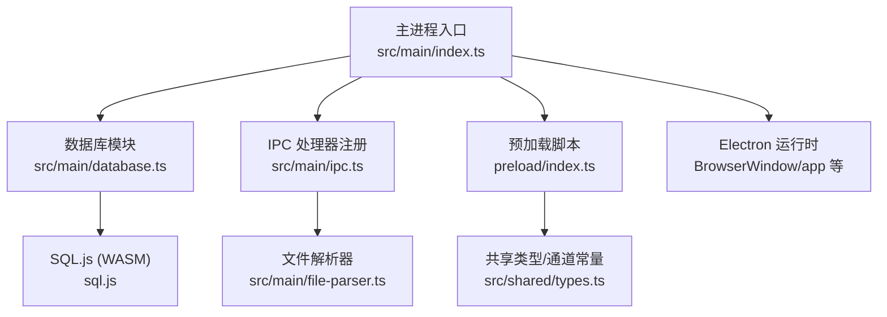
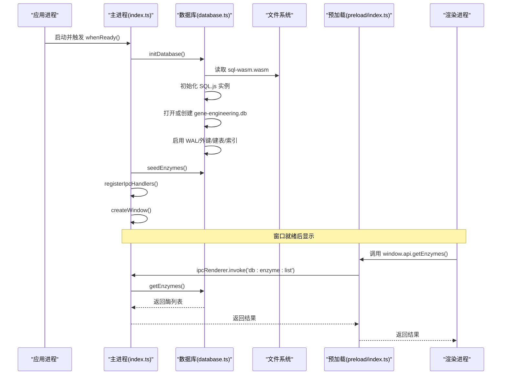
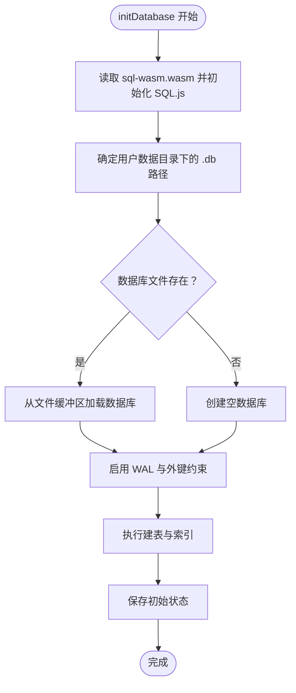
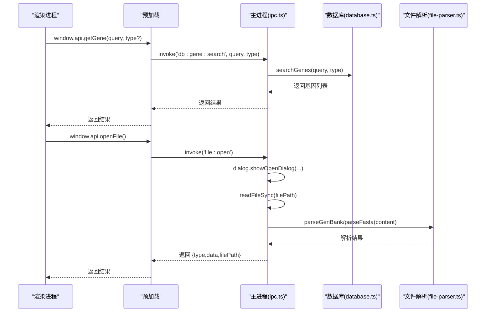
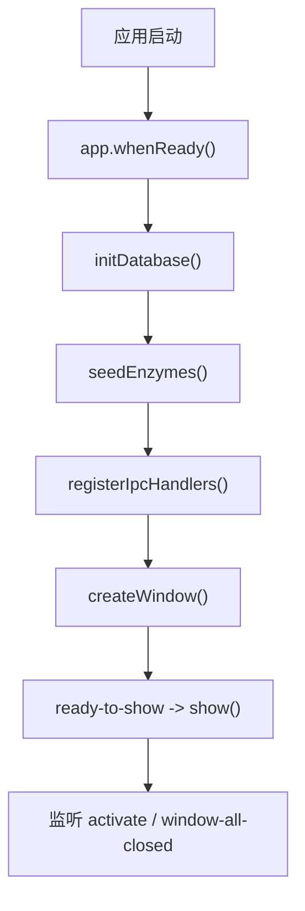
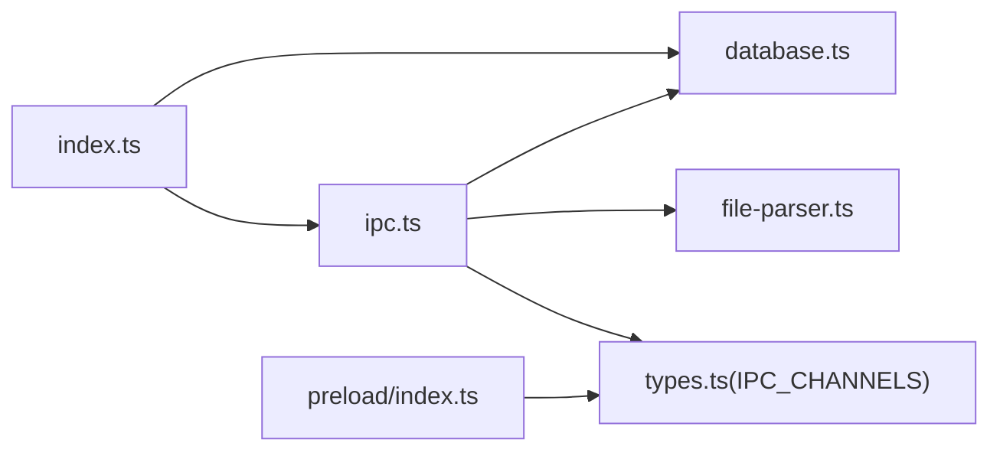

# 主进程架构

<cite>
**本文引用的文件**   
- [src/main/index.ts](file://gene-engineering-tool/src/main/index.ts)
- [src/main/database.ts](file://gene-engineering-tool/src/main/database.ts)
- [src/main/ipc.ts](file://gene-engineering-tool/src/main/ipc.ts)
- [preload/index.ts](file://gene-engineering-tool/preload/index.ts)
- [src/shared/types.ts](file://gene-engineering-tool/src/shared/types.ts)
- [src/main/file-parser.ts](file://gene-engineering-tool/src/main/file-parser.ts)
- [package.json](file://gene-engineering-tool/package.json)
</cite>

## 目录
1. [简介](#简介)
2. [项目结构](#项目结构)
3. [核心组件](#核心组件)
4. [架构总览](#架构总览)
5. [详细组件分析](#详细组件分析)
6. [依赖关系分析](#依赖关系分析)
7. [性能考量](#性能考量)
8. [故障排查指南](#故障排查指南)
9. [结论](#结论)
10. [附录：主进程扩展开发指南](#附录主进程扩展开发指南)

## 简介
本文件面向 Electron 主进程的架构与实现，聚焦以下目标：
- 解释主进程作为应用入口的职责：窗口管理、生命周期控制、系统资源访问。
- 详细说明数据库初始化流程：SQL.js 集成、WASM 加载、持久化路径、表结构与种子数据。
- 描述 IPC 处理器注册与消息路由机制：通道命名、渲染进程桥接、安全隔离。
- 解释安全配置选项 contextIsolation 与 nodeIntegration 的设置原理与影响。
- 提供主进程启动流程图与关键事件处理机制。
- 说明错误处理与异常恢复策略。
- 给出主进程扩展开发的指导原则。

## 项目结构
主进程代码位于 src/main，预加载脚本位于 preload，共享类型定义位于 src/shared，解析器位于 src/main/file-parser.ts。打包产物入口在 package.json 的 main 字段指向 out/main/index.js（由构建工具生成）。

图表来源
- [src/main/index.ts:1-59](file://gene-engineering-tool/src/main/index.ts#L1-L59)
- [src/main/database.ts:1-70](file://gene-engineering-tool/src/main/database.ts#L1-L70)
- [src/main/ipc.ts:1-145](file://gene-engineering-tool/src/main/ipc.ts#L1-L145)
- [preload/index.ts:1-46](file://gene-engineering-tool/preload/index.ts#L1-L46)
- [src/shared/types.ts:114-154](file://gene-engineering-tool/src/shared/types.ts#L114-L154)
- [src/main/file-parser.ts:1-243](file://gene-engineering-tool/src/main/file-parser.ts#L1-L243)
- [package.json:1-37](file://gene-engineering-tool/package.json#L1-L37)

章节来源
- [src/main/index.ts:1-59](file://gene-engineering-tool/src/main/index.ts#L1-L59)
- [package.json:1-37](file://gene-engineering-tool/package.json#L1-L37)

## 核心组件
- 主进程入口 index.ts：负责应用生命周期、窗口创建、安全策略、外部链接拦截、开发/生产环境加载逻辑，并在 ready 时执行数据库初始化、种子数据注入、IPC 处理器注册。
- 数据库模块 database.ts：基于 SQL.js 的 SQLite 内存/WASM 数据库，负责建表、索引、CRUD 操作、WAL 模式与外键约束、持久化到用户数据目录、种子数据填充。
- IPC 处理器 ipc.ts：集中注册所有 IPC 通道处理器，将渲染进程请求路由至数据库或文件系统能力。
- 预加载脚本 preload/index.ts：通过 contextBridge 暴露受限 API，屏蔽底层细节，仅暴露必要方法给渲染进程。
- 文件解析器 file-parser.ts：解析 GenBank 与 FASTA 格式，供 IPC 调用。
- 共享类型 types.ts：定义数据结构与 IPC_CHANNELS 常量，确保主/渲染端一致性。

章节来源
- [src/main/index.ts:1-59](file://gene-engineering-tool/src/main/index.ts#L1-L59)
- [src/main/database.ts:1-443](file://gene-engineering-tool/src/main/database.ts#L1-L443)
- [src/main/ipc.ts:1-145](file://gene-engineering-tool/src/main/ipc.ts#L1-L145)
- [preload/index.ts:1-46](file://gene-engineering-tool/preload/index.ts#L1-L46)
- [src/main/file-parser.ts:1-243](file://gene-engineering-tool/src/main/file-parser.ts#L1-L243)
- [src/shared/types.ts:1-154](file://gene-engineering-tool/src/shared/types.ts#L1-L154)

## 架构总览
下图展示了从应用启动到渲染进程发起一次数据库查询的完整链路，包括安全上下文、IPC 路由与数据库层。

图表来源
- [src/main/index.ts:41-52](file://gene-engineering-tool/src/main/index.ts#L41-L52)
- [src/main/database.ts:53-69](file://gene-engineering-tool/src/main/database.ts#L53-L69)
- [src/main/ipc.ts:10-12](file://gene-engineering-tool/src/main/ipc.ts#L10-L12)
- [preload/index.ts:6-7](file://gene-engineering-tool/preload/index.ts#L6-L7)

## 详细组件分析

### 主进程入口与窗口管理
- 职责
  - 监听 app.whenReady，按顺序执行数据库初始化、种子数据、IPC 注册、窗口创建。
  - 设置 BrowserWindow 的安全偏好：contextIsolation=true、nodeIntegration=false、sandbox=false，并通过 preload 暴露受限 API。
  - 拦截新窗口打开，统一使用 shell.openExternal 打开外部链接，避免内部页面被劫持。
  - 处理 activate 与 window-all-closed 生命周期事件，保证跨平台行为一致。
- 关键点
  - 开发模式下优先加载 ELECTRON_RENDERER_URL，生产模式加载本地 HTML。
  - show: false 配合 ready-to-show 事件，避免白屏闪烁。
- 建议
  - 如需多窗口，应在独立函数中封装窗口创建逻辑，并维护窗口集合。
  - 对外部 URL 可加入白名单校验，增强安全性。

章节来源
- [src/main/index.ts:9-39](file://gene-engineering-tool/src/main/index.ts#L9-L39)
- [src/main/index.ts:41-58](file://gene-engineering-tool/src/main/index.ts#L41-L58)

### 数据库初始化与种子数据
- 初始化流程
  - 定位并读取 sql.js 的 WASM 二进制，初始化 SQL.js。
  - 确定数据库文件路径为 app.getPath('userData') + 'gene-engineering.db'。
  - 若文件存在则从缓冲区加载，否则新建空库。
  - 启用 PRAGMA journal_mode=WAL 提升并发写入性能；启用 foreign_keys=ON 保障引用完整性。
  - 执行建表与索引，随后保存初始状态。
- 表结构与索引
  - restriction_enzymes、vectors、vector_enzyme_sites、gene_sequences、gene_relations、lab_vectors 等表。
  - 针对常用查询字段建立索引，如酶名、识别序列、载体名、基因名与类型等。
- 种子数据
  - 首次启动且 restriction_enzymes 为空时，批量插入内置限制酶数据，使用 INSERT OR IGNORE 避免重复。
- 持久化
  - 每次写操作后调用 saveDb 将内存中的数据库导出为二进制并写入磁盘，确保重启后可恢复。
- 复杂度与性能
  - 读操作 O(n) 遍历结果集；写操作包含 SQL 执行与磁盘 I/O。
  - WAL 模式减少锁竞争，适合频繁写入场景。
- 风险与建议
  - 大体积序列存储可能使数据库膨胀，建议对长序列采用分片或对象存储。
  - 可在事务中批量写入以减少多次 saveDb 开销。

图表来源
- [src/main/database.ts:53-69](file://gene-engineering-tool/src/main/database.ts#L53-L69)
- [src/main/database.ts:71-141](file://gene-engineering-tool/src/main/database.ts#L71-L141)
- [src/main/database.ts:22-25](file://gene-engineering-tool/src/main/database.ts#L22-L25)

章节来源
- [src/main/database.ts:53-69](file://gene-engineering-tool/src/main/database.ts#L53-L69)
- [src/main/database.ts:71-141](file://gene-engineering-tool/src/main/database.ts#L71-L141)
- [src/main/database.ts:378-442](file://gene-engineering-tool/src/main/database.ts#L378-L442)
- [src/main/database.ts:22-25](file://gene-engineering-tool/src/main/database.ts#L22-L25)

### IPC 处理器注册与消息路由
- 通道设计
  - 所有通道名称集中在 types.ts 的 IPC_CHANNELS 常量中，主/渲染端共享同一份定义，避免硬编码不一致。
- 注册方式
  - 主进程在 registerIpcHandlers 中使用 ipcMain.handle 绑定各通道，参数经 _event 与后续位置传递。
  - 渲染进程通过 preload 暴露的 window.api 调用 ipcRenderer.invoke，传入对应通道名与参数。
- 典型流程
  - 渲染进程调用 window.api.getEnzymes() -> 预加载转发 'db:enzyme:list' -> 主进程处理器调用 db.getEnzymes() -> 返回数组。
- 文件操作
  - FILE_OPEN 通过 dialog.showOpenDialog 选择文件，读取内容并根据扩展名调用 parseGenBank 或 parseFasta。
- 可扩展性
  - 新增功能应先在 types.ts 添加通道常量，再在主进程注册处理器，最后在 preload 暴露 API。

图表来源
- [src/main/ipc.ts:10-12](file://gene-engineering-tool/src/main/ipc.ts#L10-L12)
- [src/main/ipc.ts:68-70](file://gene-engineering-tool/src/main/ipc.ts#L68-L70)
- [src/main/ipc.ts:110-135](file://gene-engineering-tool/src/main/ipc.ts#L110-L135)
- [src/main/file-parser.ts:6-130](file://gene-engineering-tool/src/main/file-parser.ts#L6-L130)
- [src/main/file-parser.ts:199-242](file://gene-engineering-tool/src/main/file-parser.ts#L199-L242)
- [preload/index.ts:22-28](file://gene-engineering-tool/preload/index.ts#L22-L28)
- [preload/index.ts:38-40](file://gene-engineering-tool/preload/index.ts#L38-L40)

章节来源
- [src/main/ipc.ts:1-145](file://gene-engineering-tool/src/main/ipc.ts#L1-145)
- [src/shared/types.ts:114-154](file://gene-engineering-tool/src/shared/types.ts#L114-L154)
- [preload/index.ts:1-46](file://gene-engineering-tool/preload/index.ts#L1-46)

### 安全配置与上下文隔离
- 关键配置
  - contextIsolation: true，隔离渲染进程与 Node.js 全局作用域。
  - nodeIntegration: false，禁止渲染进程直接访问 Node 模块。
  - sandbox: false，允许预加载脚本访问有限 Node 能力（如 fs、dialog），但需通过预加载桥接。
- 影响
  - 渲染进程无法直接 require 或访问 process，必须通过 window.api 调用。
  - 预加载脚本是唯一受信任的桥接层，应最小化暴露接口。
- 最佳实践
  - 严格限定 contextBridge.exposeInMainWorld 暴露的方法。
  - 对所有输入进行校验与白名单过滤，防止注入。
  - 对外部 URL 打开统一走 shell.openExternal，避免导航劫持。

章节来源
- [src/main/index.ts:17-23](file://gene-engineering-tool/src/main/index.ts#L17-L23)
- [src/main/index.ts:29-32](file://gene-engineering-tool/src/main/index.ts#L29-L32)
- [preload/index.ts:43-43](file://gene-engineering-tool/preload/index.ts#L43-L43)

### 启动流程与关键事件
- 启动顺序
  - app.whenReady -> initDatabase -> seedEnzymes -> registerIpcHandlers -> createWindow。
  - 窗口 ready-to-show 后显示。
- 关键事件
  - activate：当 Dock 点击或无窗口时重建窗口。
  - window-all-closed：非 macOS 平台退出应用。
- 外部链接
  - setWindowOpenHandler 拦截新窗口，统一用 shell.openExternal 打开。

图表来源
- [src/main/index.ts:41-52](file://gene-engineering-tool/src/main/index.ts#L41-L52)
- [src/main/index.ts:25-27](file://gene-engineering-tool/src/main/index.ts#L25-L27)
- [src/main/index.ts:47-51](file://gene-engineering-tool/src/main/index.ts#L47-L51)
- [src/main/index.ts:54-58](file://gene-engineering-tool/src/main/index.ts#L54-L58)

章节来源
- [src/main/index.ts:41-58](file://gene-engineering-tool/src/main/index.ts#L41-L58)

### 错误处理与异常恢复策略
- 现状
  - 当前未显式捕获异步异常与文件系统错误，例如 WASM 读取失败、数据库损坏、文件不存在等。
- 建议
  - 在 initDatabase 中增加 try/catch，记录日志并提供降级方案（如回退到内存库或提示用户修复）。
  - 对 writeFileSync 与 readFileSync 包裹异常处理，避免崩溃。
  - 在 IPC 处理器中对业务异常进行包装，返回结构化错误信息给渲染端。
  - 考虑引入统一的错误码与日志上报机制。

章节来源
- [src/main/database.ts:53-69](file://gene-engineering-tool/src/main/database.ts#L53-L69)
- [src/main/ipc.ts:110-135](file://gene-engineering-tool/src/main/ipc.ts#L110-L135)

## 依赖关系分析
- 模块耦合
  - index.ts 依赖 database.ts、ipc.ts、electron 运行时。
  - ipc.ts 依赖 database.ts、file-parser.ts、shared/types.ts。
  - preload/index.ts 依赖 shared/types.ts 的 IPC_CHANNELS。
- 外部依赖
  - sql.js：SQLite 的 WebAssembly 实现，用于嵌入式数据库。
  - electron-store、zustand 等：当前未在 main 中直接使用，属于整体项目依赖。
- 潜在循环
  - 当前未见循环依赖，模块边界清晰。

图表来源
- [src/main/index.ts:1-6](file://gene-engineering-tool/src/main/index.ts#L1-L6)
- [src/main/ipc.ts:1-6](file://gene-engineering-tool/src/main/ipc.ts#L1-L6)
- [preload/index.ts:1-3](file://gene-engineering-tool/preload/index.ts#L1-L3)
- [src/shared/types.ts:114-154](file://gene-engineering-tool/src/shared/types.ts#L114-L154)

章节来源
- [src/main/index.ts:1-6](file://gene-engineering-tool/src/main/index.ts#L1-L6)
- [src/main/ipc.ts:1-6](file://gene-engineering-tool/src/main/ipc.ts#L1-L6)
- [preload/index.ts:1-3](file://gene-engineering-tool/preload/index.ts#L1-L3)
- [src/shared/types.ts:114-154](file://gene-engineering-tool/src/shared/types.ts#L114-L154)

## 性能考量
- 数据库
  - 使用 WAL 模式提升并发写入性能。
  - 批量写入建议使用事务，减少多次 saveDb 带来的 I/O 压力。
  - 对高频查询字段已建立索引，注意索引维护成本。
- 文件解析
  - 大文件解析应避免阻塞主线程，必要时可拆分任务或使用 Worker（主进程侧可用 child_process）。
- 窗口与渲染
  - 保持 preload 暴露的最小 API 集，减少 IPC 往返次数，合并数据返回。

[本节为通用性能建议，不直接分析具体文件]

## 故障排查指南
- 常见问题
  - 启动时报错找不到 sql-wasm.wasm：检查打包产物是否包含 sql.js/dist/sql-wasm.wasm，或调整 wasmBinary 路径。
  - 数据库损坏：尝试删除用户数据目录下的 gene-engineering.db，应用将重建。
  - 文件打开失败：确认所选文件格式与扩展名匹配，或检查文件权限。
- 定位步骤
  - 在主进程关键路径增加日志输出，记录异常堆栈与上下文。
  - 在 IPC 处理器中捕获异常并返回结构化错误，便于前端展示。
  - 验证 IPC_CHANNELS 是否与 preload 保持一致。

章节来源
- [src/main/database.ts:53-69](file://gene-engineering-tool/src/main/database.ts#L53-L69)
- [src/main/ipc.ts:110-135](file://gene-engineering-tool/src/main/ipc.ts#L110-L135)

## 结论
该 Electron 主进程采用清晰的模块化设计：入口负责生命周期与安全策略，数据库模块封装 SQL.js 与持久化，IPC 处理器集中路由，预加载脚本提供最小化 API。通过 contextIsolation 与 nodeIntegration=false 的组合，实现了安全的渲染进程隔离。建议在现有基础上完善异常处理与日志体系，并对大文件解析与批量写入进行进一步优化。

[本节为总结性内容，不直接分析具体文件]

## 附录：主进程扩展开发指南
- 新增数据模型
  - 在 types.ts 中定义接口与 IPC_CHANNELS。
  - 在 database.ts 中新增建表语句、索引与 CRUD 方法。
  - 在 ipc.ts 中注册 handle 处理器，调用 database.ts 方法。
  - 在 preload/index.ts 中暴露对应 API。
- 新增文件解析器
  - 在 file-parser.ts 中添加解析函数，并在 ipc.ts 中注册相应通道。
- 安全与健壮性
  - 对所有输入进行校验，拒绝非法值。
  - 对文件系统与数据库操作增加 try/catch，返回明确错误信息。
  - 对外部 URL 打开进行白名单校验。
- 测试与调试
  - 使用单元测试覆盖解析器与数据库方法。
  - 在主进程关键路径打印日志，结合 Electron DevTools 调试。

章节来源
- [src/shared/types.ts:1-154](file://gene-engineering-tool/src/shared/types.ts#L1-L154)
- [src/main/database.ts:71-141](file://gene-engineering-tool/src/main/database.ts#L71-L141)
- [src/main/ipc.ts:1-145](file://gene-engineering-tool/src/main/ipc.ts#L1-L145)
- [preload/index.ts:1-46](file://gene-engineering-tool/preload/index.ts#L1-L46)