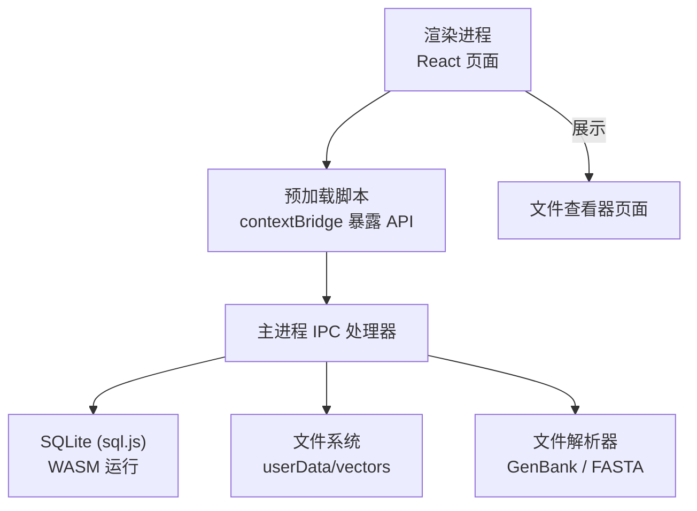
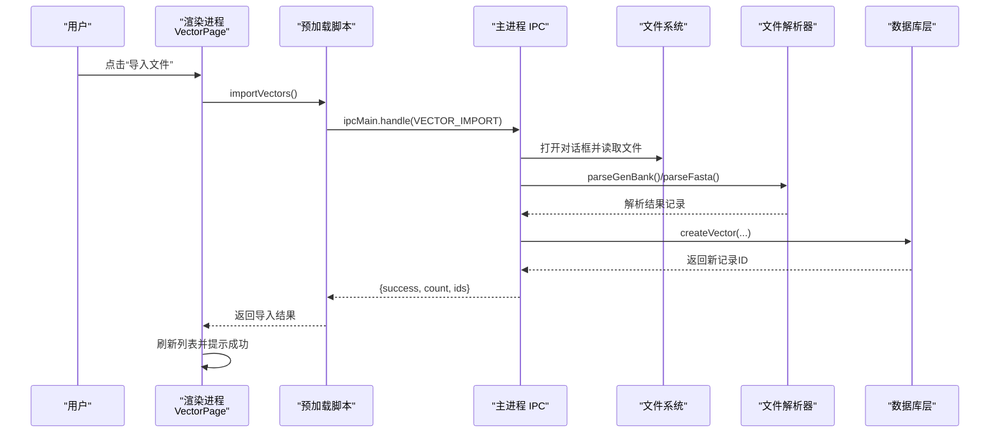
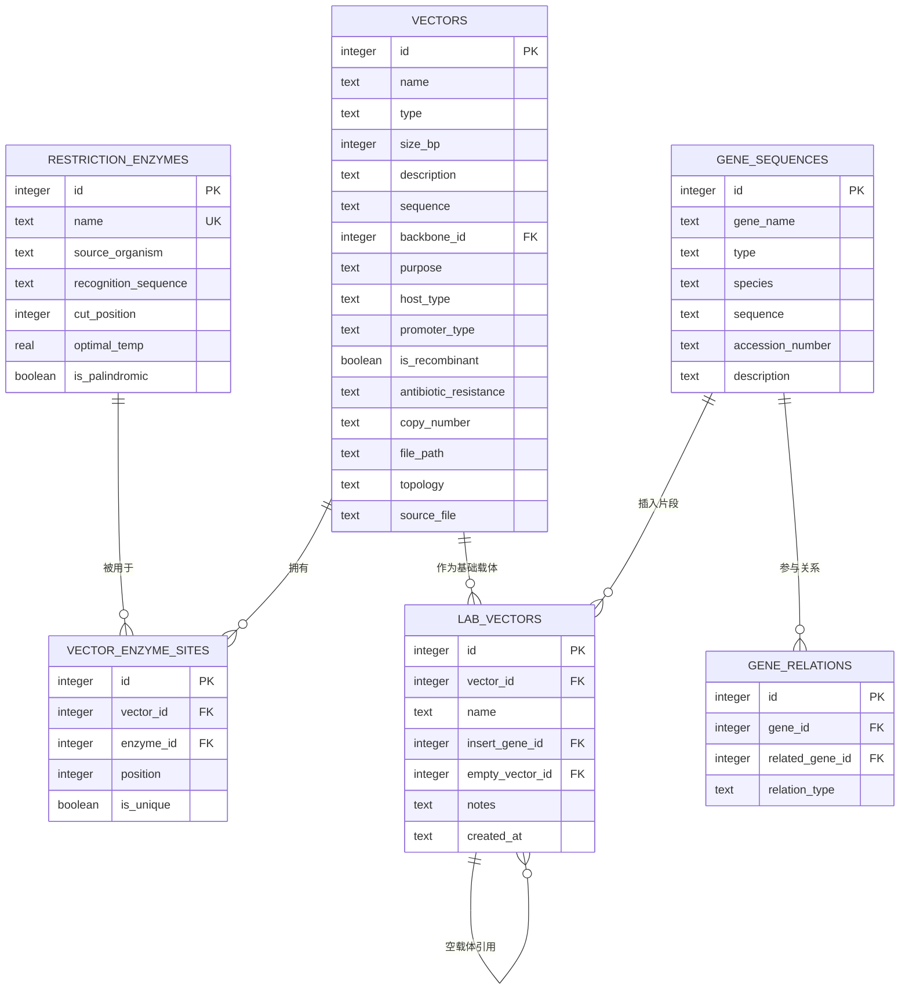
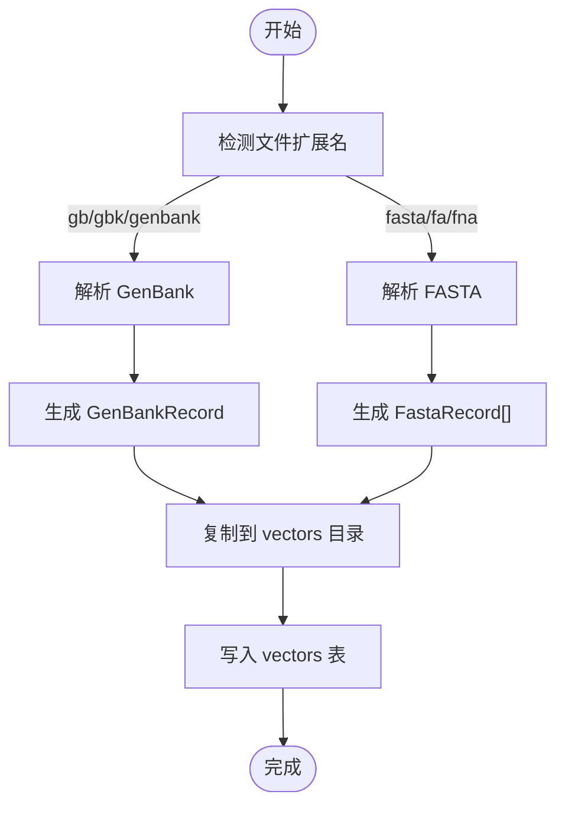
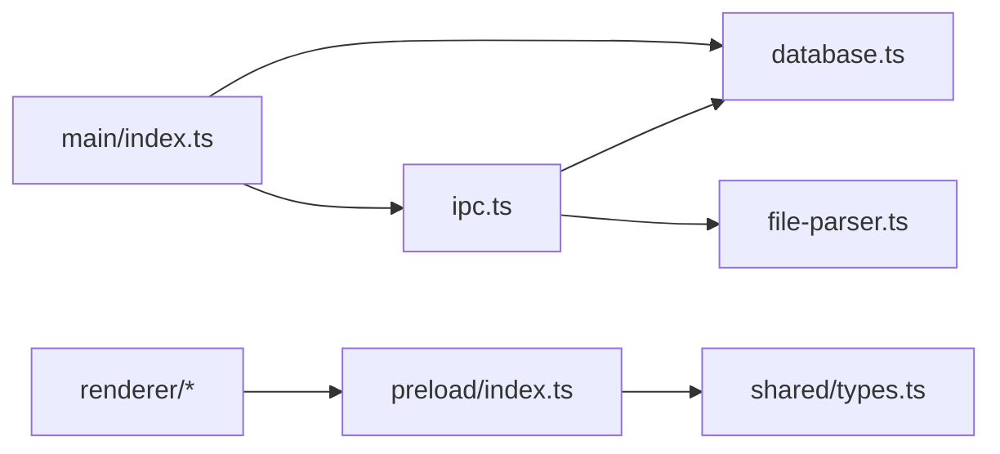

# 数据流设计

<cite>
**本文引用的文件**   
- [src/main/index.ts](file://src/main/index.ts)
- [src/main/database.ts](file://src/main/database.ts)
- [src/main/file-parser.ts](file://src/main/file-parser.ts)
- [src/main/ipc.ts](file://src/main/ipc.ts)
- [src/shared/types.ts](file://src/shared/types.ts)
- [preload/index.ts](file://preload/index.ts)
- [src/renderer/App.tsx](file://src/renderer/App.tsx)
- [src/renderer/pages/VectorPage.tsx](file://src/renderer/pages/VectorPage.tsx)
- [src/renderer/pages/FileViewerPage.tsx](file://src/renderer/pages/FileViewerPage.tsx)
</cite>

## 目录
1. [简介](#简介)
2. [项目结构](#项目结构)
3. [核心组件](#核心组件)
4. [架构总览](#架构总览)
5. [详细组件分析](#详细组件分析)
6. [依赖关系分析](#依赖关系分析)
7. [性能与缓存策略](#性能与缓存策略)
8. [数据迁移与版本管理](#数据迁移与版本管理)
9. [备份与恢复机制](#备份与恢复机制)
10. [一致性保证与事务处理](#一致性保证与事务处理)
11. [故障排查指南](#故障排查指南)
12. [结论](#结论)

## 简介
本文件面向“基因工程辅助软件”的数据流设计，系统化阐述从用户交互到数据存储的完整路径、数据模型与实体关系、文件解析器在导入流程中的作用与处理逻辑、数据验证与完整性约束的实现方式、缓存与性能优化方案、数据迁移与版本管理、备份与恢复机制，以及一致性与事务处理的实现思路。文档以代码为依据，提供可视化图示与可追溯来源，帮助读者快速理解并扩展系统。

## 项目结构
本项目采用 Electron 多进程架构：
- 主进程负责应用生命周期、数据库初始化、IPC 路由、文件系统访问与持久化。
- 预加载脚本通过 contextBridge 暴露安全的 API 给渲染进程。
- 渲染进程（React）提供页面与交互，调用 window.api 进行数据操作与文件打开。
- 共享类型定义统一前后端数据结构与 IPC 通道名。

图表来源
- [src/main/index.ts:41-52](file://src/main/index.ts#L41-L52)
- [src/main/ipc.ts:9-227](file://src/main/ipc.ts#L9-L227)
- [src/main/database.ts:53-69](file://src/main/database.ts#L53-L69)
- [src/main/file-parser.ts:6-130](file://src/main/file-parser.ts#L6-L130)
- [preload/index.ts:4-46](file://preload/index.ts#L4-L46)
- [src/renderer/App.tsx:75-86](file://src/renderer/App.tsx#L75-L86)

章节来源
- [src/main/index.ts:1-59](file://src/main/index.ts#L1-L59)
- [src/main/ipc.ts:1-227](file://src/main/ipc.ts#L1-L227)
- [src/main/database.ts:1-490](file://src/main/database.ts#L1-L490)
- [src/main/file-parser.ts:1-243](file://src/main/file-parser.ts#L1-L243)
- [src/shared/types.ts:1-154](file://src/shared/types.ts#L1-L154)
- [preload/index.ts:1-47](file://preload/index.ts#L1-L47)
- [src/renderer/App.tsx:1-106](file://src/renderer/App.tsx#L1-L106)
- [src/renderer/pages/VectorPage.tsx:1-346](file://src/renderer/pages/VectorPage.tsx#L1-L346)
- [src/renderer/pages/FileViewerPage.tsx:1-152](file://src/renderer/pages/FileViewerPage.tsx#L1-L152)

## 核心组件
- 应用入口与窗口管理：初始化数据库、种子数据、注册 IPC、创建窗口。
- 数据库层：基于 sql.js 的 SQLite 封装，包含表结构、索引、CRUD、迁移与种子数据。
- IPC 层：将前端请求映射到后端方法，处理文件选择、导入与解析。
- 文件解析器：支持 GenBank 与 FASTA 格式解析，提取元信息与序列。
- 预加载桥接：为渲染进程暴露安全 API。
- 渲染页面：载体库、文件查看器等页面驱动数据流。

章节来源
- [src/main/index.ts:41-52](file://src/main/index.ts#L41-L52)
- [src/main/database.ts:53-173](file://src/main/database.ts#L53-L173)
- [src/main/ipc.ts:60-139](file://src/main/ipc.ts#L60-L139)
- [src/main/file-parser.ts:6-130](file://src/main/file-parser.ts#L6-L130)
- [preload/index.ts:4-46](file://preload/index.ts#L4-L46)
- [src/renderer/pages/VectorPage.tsx:57-64](file://src/renderer/pages/VectorPage.tsx#L57-L64)
- [src/renderer/pages/FileViewerPage.tsx:12-45](file://src/renderer/pages/FileViewerPage.tsx#L12-L45)

## 架构总览
下图展示了从用户点击“导入文件”到数据落盘的端到端数据流。

图表来源
- [src/renderer/pages/VectorPage.tsx:57-64](file://src/renderer/pages/VectorPage.tsx#L57-L64)
- [preload/index.ts:20](file://preload/index.ts#L20)
- [src/main/ipc.ts:60-139](file://src/main/ipc.ts#L60-L139)
- [src/main/file-parser.ts:6-130](file://src/main/file-parser.ts#L6-L130)
- [src/main/database.ts:228-240](file://src/main/database.ts#L228-L240)

## 详细组件分析

### 数据模型与实体关系
- 限制性内切酶：名称唯一、识别序列、切割位点、最适温度、是否回文等。
- 载体：名称、类型、拓扑、大小、描述、序列、骨架引用、目的、宿主、启动子、重组标记、抗性、拷贝数、源文件路径等。
- 载体-酶切位点：多对一关联至载体与酶，记录位置与唯一性。
- 基因序列：名称、类型、物种、序列、登录号、描述。
- 基因关系：自引用关系表，表达基因间关系。
- 实验室载体：组合载体与插入基因、空载体，便于实验记录。

图表来源
- [src/main/database.ts:71-153](file://src/main/database.ts#L71-L153)
- [src/shared/types.ts:2-85](file://src/shared/types.ts#L2-L85)

章节来源
- [src/main/database.ts:71-153](file://src/main/database.ts#L71-L153)
- [src/shared/types.ts:2-85](file://src/shared/types.ts#L2-L85)

### 文件解析器在导入流程中的作用与处理逻辑
- GenBank 解析：按行状态机解析 LOCUS/DEFINITION/ACCESSION/VERSION/FEATURES/ORIGIN 等段，提取名称、描述、拓扑、大小、特征及序列；支持互补链与 join 区间定位。
- FASTA 解析：按 > 头分割记录，提取 ID、描述与序列。
- 导入流程：根据扩展名选择解析器，复制文件到 userData/vectors，写入 vectors 表并记录 file_path/source_file/topology 等信息。

图表来源
- [src/main/ipc.ts:84-139](file://src/main/ipc.ts#L84-L139)
- [src/main/file-parser.ts:6-130](file://src/main/file-parser.ts#L6-L130)
- [src/main/file-parser.ts:199-242](file://src/main/file-parser.ts#L199-L242)

章节来源
- [src/main/file-parser.ts:6-130](file://src/main/file-parser.ts#L6-L130)
- [src/main/file-parser.ts:199-242](file://src/main/file-parser.ts#L199-L242)
- [src/main/ipc.ts:84-139](file://src/main/ipc.ts#L84-L139)

### 数据验证规则与完整性约束
- 数据库级约束：
  - 外键启用：PRAGMA foreign_keys = ON，确保跨表引用完整性。
  - 删除策略：CASCADE 或 SET NULL，避免悬挂引用。
  - 检查约束：如基因类型限定为 mrna/cdna/genomic/protein。
  - 唯一性：酶名称唯一。
- 字段默认值与非空约束：多数字段具备默认值，减少无效数据。
- 前端校验：表单必填项（如载体名称）在前端阻止提交。

章节来源
- [src/main/database.ts:66-68](file://src/main/database.ts#L66-L68)
- [src/main/database.ts:116-121](file://src/main/database.ts#L116-L121)
- [src/main/database.ts:73-81](file://src/main/database.ts#L73-L81)
- [src/renderer/pages/VectorPage.tsx:97-99](file://src/renderer/pages/VectorPage.tsx#L97-L99)

### 缓存策略与性能优化方案
- 查询层封装：统一的 queryAll/queryOne/run 简化 SQL 执行与对象转换。
- 索引优化：针对常用搜索字段建立索引（酶名、识别序列、载体名、基因名/类型、实验室载体名）。
- WAL 模式：开启 PRAGMA journal_mode = WAL，提升并发读写性能。
- 批量导入：导入时逐条写入，后续可扩展事务包裹以提升吞吐。
- 前端展示优化：列表分页与过滤在渲染层实现，减少不必要的数据传输。

章节来源
- [src/main/database.ts:27-46](file://src/main/database.ts#L27-L46)
- [src/main/database.ts:142-147](file://src/main/database.ts#L142-L147)
- [src/main/database.ts:66](file://src/main/database.ts#L66)

### 数据迁移与版本管理
- 运行时迁移：启动时检查 vectors 表结构，若缺少新增列则动态 ALTER TABLE 添加，并提供默认值，兼容旧数据库。
- 向后兼容：迁移函数仅在不存在的列上执行 ADD COLUMN，避免重复变更。
- 建议：未来引入显式版本号与迁移脚本集合，集中管理 schema 演进。

章节来源
- [src/main/database.ts:149-173](file://src/main/database.ts#L149-L173)

### 备份与恢复机制
- 当前实现：每次写操作后导出数据库二进制并覆盖保存，确保内存与磁盘一致。
- 备份建议：
  - 定期导出 .db 文件到用户指定目录或云盘。
  - 提供“导出/导入数据库”功能，支持增量或全量备份。
  - 导入前校验文件完整性（哈希），失败则拒绝恢复。
- 恢复流程：关闭应用 -> 替换 .db 文件 -> 重启应用 -> 验证种子数据与索引。

章节来源
- [src/main/database.ts:22-25](file://src/main/database.ts#L22-L25)
- [src/main/database.ts:43-46](file://src/main/database.ts#L43-L46)

### 一致性保证与事务处理
- 当前状态：单条 run 操作后直接 saveDb，未显式使用事务包裹复杂写入。
- 改进建议：
  - 导入多个载体时使用 BEGIN/COMMIT 包裹，确保原子性。
  - 关键更新（如批量删除与重建索引）使用事务，失败自动回滚。
  - 结合 WAL 模式与外键约束，保障并发与引用一致性。

章节来源
- [src/main/database.ts:43-46](file://src/main/database.ts#L43-L46)
- [src/main/database.ts:66-68](file://src/main/database.ts#L66-L68)

## 依赖关系分析
- 主进程入口依赖数据库初始化与 IPC 注册。
- IPC 处理器依赖数据库模块与文件解析器。
- 预加载脚本依赖共享类型中的 IPC_CHANNELS。
- 渲染页面通过 window.api 调用 IPC，间接依赖数据库与文件系统。

图表来源
- [src/main/index.ts:41-45](file://src/main/index.ts#L41-L45)
- [src/main/ipc.ts:1-8](file://src/main/ipc.ts#L1-L8)
- [preload/index.ts:1-3](file://preload/index.ts#L1-L3)

章节来源
- [src/main/index.ts:41-45](file://src/main/index.ts#L41-L45)
- [src/main/ipc.ts:1-8](file://src/main/ipc.ts#L1-L8)
- [preload/index.ts:1-3](file://preload/index.ts#L1-L3)

## 性能与缓存策略
- 数据库层面：
  - 启用 WAL 模式提升并发读性能。
  - 为高频查询字段建立索引，降低 LIKE 与 JOIN 开销。
  - 使用参数化语句防止注入与提高执行计划复用。
- 应用层面：
  - 导入流程中先复制文件再解析，避免重复 I/O。
  - 前端按需加载详情（如酶切位点），减少初始负载。
- 扩展建议：
  - 对大序列进行分块读取与懒加载。
  - 引入内存缓存（LRU）存储热点酶与载体元信息。

[本节为通用指导，不直接分析具体文件]

## 数据迁移与版本管理
- 现有方案：运行时检测并补齐缺失列，提供默认值，保证旧库可用。
- 最佳实践：
  - 维护迁移脚本清单，按版本号顺序执行。
  - 迁移前备份数据库，失败可回退。
  - 对破坏性变更（重命名列、删列）提供降级策略。

章节来源
- [src/main/database.ts:149-173](file://src/main/database.ts#L149-L173)

## 备份与恢复机制
- 当前实现：每次写操作后导出数据库二进制并覆盖保存，确保内存与磁盘一致。
- 建议增强：
  - 提供“导出数据库”按钮，生成带时间戳的备份文件。
  - 提供“导入数据库”功能，支持校验与冲突解决（跳过/覆盖）。
  - 在导入前校验文件格式与完整性，避免损坏数据入库。

章节来源
- [src/main/database.ts:22-25](file://src/main/database.ts#L22-L25)
- [src/main/database.ts:43-46](file://src/main/database.ts#L43-L46)

## 一致性保证与事务处理
- 当前实现：单条写入后立即持久化，未显式使用事务。
- 改进方案：
  - 导入多记录时使用 BEGIN/COMMIT 包裹，失败则回滚。
  - 删除与重建索引等操作使用事务，确保中间状态不可见。
  - 保持外键约束开启，避免脏引用。

章节来源
- [src/main/database.ts:66-68](file://src/main/database.ts#L66-L68)
- [src/main/database.ts:43-46](file://src/main/database.ts#L43-L46)

## 故障排查指南
- 导入失败：
  - 检查文件扩展名与内容是否符合 GenBank/FASTA 规范。
  - 确认 userData/vectors 目录存在且可写。
  - 查看 IPC 返回值，确认解析与写入阶段错误。
- 数据不一致：
  - 检查外键约束是否生效（foreign_keys = ON）。
  - 核对删除策略（CASCADE/SET NULL）是否符合预期。
- 性能问题：
  - 确认已启用 WAL 模式。
  - 检查相关字段是否建立索引。
  - 评估前端是否一次性加载过多数据。

章节来源
- [src/main/ipc.ts:60-139](file://src/main/ipc.ts#L60-L139)
- [src/main/database.ts:66-68](file://src/main/database.ts#L66-L68)
- [src/main/database.ts:142-147](file://src/main/database.ts#L142-L147)

## 结论
该项目的数据流设计围绕 Electron 主进程与 SQLite（sql.js）展开，通过 IPC 连接渲染界面与底层数据层，实现了从文件导入到数据库落盘的完整链路。数据模型清晰、约束完善，具备基本的迁移能力与性能优化措施。建议在导入与批量操作中引入事务、完善备份恢复工具链，并逐步引入显式的版本化迁移脚本，进一步提升系统的健壮性与可维护性。