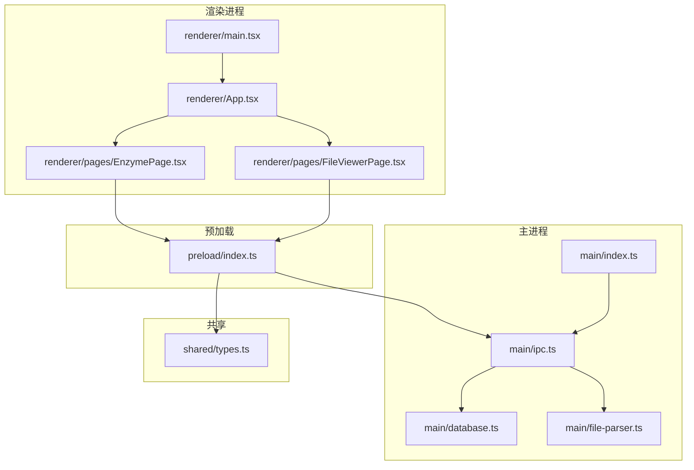
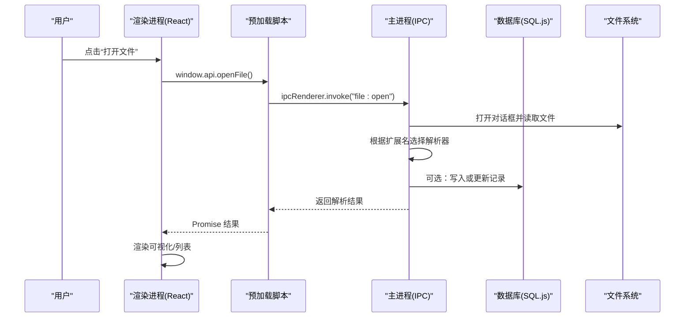
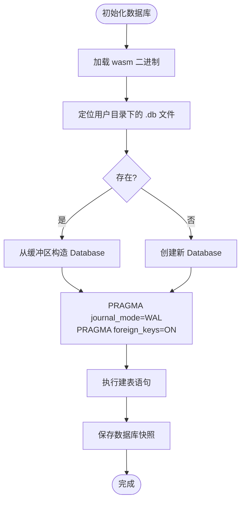
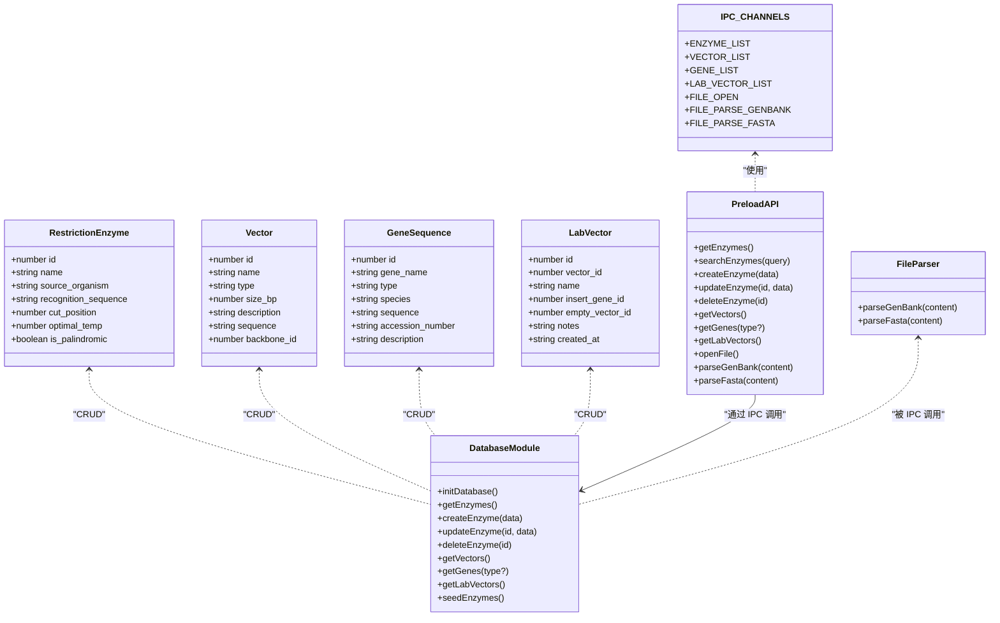
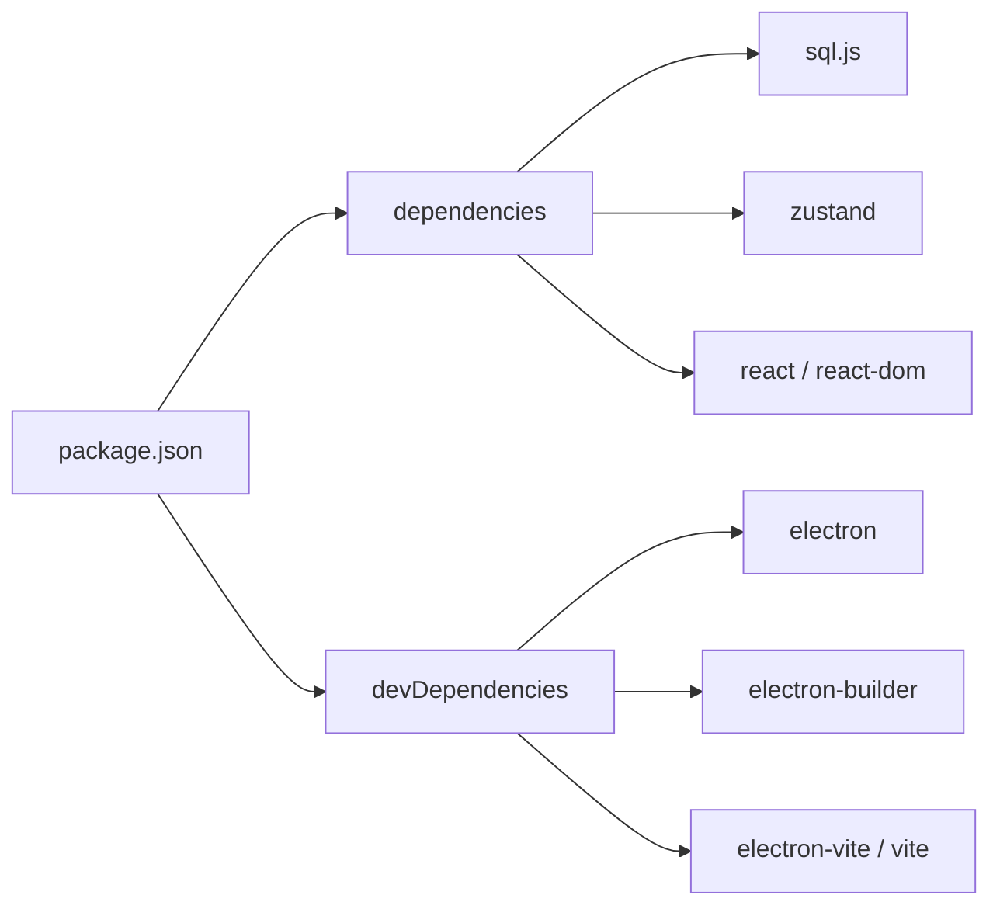

# 架构设计

<cite>
**本文引用的文件**   
- [src/main/index.ts](file://gene-engineering-tool/src/main/index.ts)
- [preload/index.ts](file://gene-engineering-tool/preload/index.ts)
- [src/renderer/main.tsx](file://gene-engineering-tool/src/renderer/main.tsx)
- [src/main/database.ts](file://gene-engineering-tool/src/main/database.ts)
- [src/main/ipc.ts](file://gene-engineering-tool/src/main/ipc.ts)
- [src/shared/types.ts](file://gene-engineering-tool/src/shared/types.ts)
- [src/main/file-parser.ts](file://gene-engineering-tool/src/main/file-parser.ts)
- [src/renderer/App.tsx](file://gene-engineering-tool/src/renderer/App.tsx)
- [src/renderer/pages/EnzymePage.tsx](file://gene-engineering-tool/src/renderer/pages/EnzymePage.tsx)
- [src/renderer/pages/FileViewerPage.tsx](file://gene-engineering-tool/src/renderer/pages/FileViewerPage.tsx)
- [package.json](file://gene-engineering-tool/package.json)
</cite>

## 目录
1. [简介](#简介)
2. [项目结构](#项目结构)
3. [核心组件](#核心组件)
4. [架构总览](#架构总览)
5. [详细组件分析](#详细组件分析)
6. [依赖关系分析](#依赖关系分析)
7. [性能考量](#性能考量)
8. [故障排查指南](#故障排查指南)
9. [结论](#结论)
10. [附录](#附录)

## 简介
本文件为基因工程辅助软件的架构设计文档，面向开发者与产品人员。文档聚焦于 Electron 主进程、预加载脚本与 React 渲染进程的职责分离；IPC 通信机制的设计模式与实现原理；从用户交互到数据库操作的完整数据流；分层架构（UI 层、业务逻辑层、数据访问层）的职责划分；技术选型权衡（如选择 SQL.js 的原因）；以及安全考虑与最佳实践。

## 项目结构
仓库采用“按功能域 + 分层”的组织方式：
- 主进程（Electron Main）：负责应用生命周期、窗口管理、数据库初始化、IPC 路由与文件系统操作。
- 预加载脚本（Preload）：通过 contextBridge 暴露受限 API，隔离渲染进程对 Node/Electron 的直接访问。
- 渲染进程（React）：基于 Vite 构建的 React 应用，提供页面与组件，调用 window.api 完成跨进程通信。
- 共享类型（Shared Types）：前后端共享的数据结构与 IPC 通道常量，保证类型一致。
- 工具模块：文件解析器（GenBank/FASTA）、数据库封装（SQL.js）。

图表来源
- [src/main/index.ts:1-59](file://gene-engineering-tool/src/main/index.ts#L1-L59)
- [src/main/ipc.ts:1-145](file://gene-engineering-tool/src/main/ipc.ts#L1-L145)
- [src/main/database.ts:1-439](file://gene-engineering-tool/src/main/database.ts#L1-L439)
- [src/main/file-parser.ts:1-243](file://gene-engineering-tool/src/main/file-parser.ts#L1-L243)
- [preload/index.ts:1-46](file://gene-engineering-tool/preload/index.ts#L1-L46)
- [src/renderer/main.tsx:1-11](file://gene-engineering-tool/src/renderer/main.tsx#L1-L11)
- [src/renderer/App.tsx:1-106](file://gene-engineering-tool/src/renderer/App.tsx#L1-L106)
- [src/renderer/pages/EnzymePage.tsx:1-252](file://gene-engineering-tool/src/renderer/pages/EnzymePage.tsx#L1-L252)
- [src/renderer/pages/FileViewerPage.tsx:1-152](file://gene-engineering-tool/src/renderer/pages/FileViewerPage.tsx#L1-L152)
- [src/shared/types.ts:1-132](file://gene-engineering-tool/src/shared/types.ts#L1-L132)

章节来源
- [src/main/index.ts:1-59](file://gene-engineering-tool/src/main/index.ts#L1-L59)
- [src/main/ipc.ts:1-145](file://gene-engineering-tool/src/main/ipc.ts#L1-L145)
- [src/main/database.ts:1-439](file://gene-engineering-tool/src/main/database.ts#L1-L439)
- [src/main/file-parser.ts:1-243](file://gene-engineering-tool/src/main/file-parser.ts#L1-L243)
- [preload/index.ts:1-46](file://gene-engineering-tool/preload/index.ts#L1-L46)
- [src/renderer/main.tsx:1-11](file://gene-engineering-tool/src/renderer/main.tsx#L1-L11)
- [src/renderer/App.tsx:1-106](file://gene-engineering-tool/src/renderer/App.tsx#L1-L106)
- [src/renderer/pages/EnzymePage.tsx:1-252](file://gene-engineering-tool/src/renderer/pages/EnzymePage.tsx#L1-L252)
- [src/renderer/pages/FileViewerPage.tsx:1-152](file://gene-engineering-tool/src/renderer/pages/FileViewerPage.tsx#L1-L152)
- [src/shared/types.ts:1-132](file://gene-engineering-tool/src/shared/types.ts#L1-L132)

## 核心组件
- 主进程入口：创建窗口、设置安全策略（contextIsolation=true、nodeIntegration=false）、初始化数据库与种子数据、注册 IPC 处理器。
- 预加载脚本：集中暴露 window.api，将 IPC 通道与方法名映射为 Promise 化 API，供渲染进程使用。
- 渲染进程：React 应用，包含导航与多个页面（内切酶库、载体数据库、基因序列库、实验室载体、文件查看器），通过 window.api 发起请求。
- 数据访问层：基于 SQL.js 的 SQLite 封装，提供 CRUD 与复杂查询方法，持久化到本地文件。
- 文件解析器：解析 GenBank 与 FASTA 格式，返回结构化记录。
- 共享类型：定义实体接口与 IPC_CHANNELS 常量，确保前后端契约一致。

章节来源
- [src/main/index.ts:1-59](file://gene-engineering-tool/src/main/index.ts#L1-L59)
- [preload/index.ts:1-46](file://gene-engineering-tool/preload/index.ts#L1-L46)
- [src/renderer/App.tsx:1-106](file://gene-engineering-tool/src/renderer/App.tsx#L1-L106)
- [src/main/database.ts:1-439](file://gene-engineering-tool/src/main/database.ts#L1-L439)
- [src/main/file-parser.ts:1-243](file://gene-engineering-tool/src/main/file-parser.ts#L1-L243)
- [src/shared/types.ts:1-132](file://gene-engineering-tool/src/shared/types.ts#L1-L132)

## 架构总览
系统采用三层架构与清晰的进程边界：
- UI 层（渲染进程）：React 页面与组件，仅通过 window.api 与主进程通信。
- 业务逻辑层（主进程 IPC 处理）：接收 IPC 消息，执行业务编排（如打开文件、解析、组合查询）。
- 数据访问层（主进程数据库模块）：封装 SQL.js 操作，维护表结构、索引与持久化。

图表来源
- [src/renderer/App.tsx:75-86](file://gene-engineering-tool/src/renderer/App.tsx#L75-L86)
- [src/renderer/pages/FileViewerPage.tsx:14-45](file://gene-engineering-tool/src/renderer/pages/FileViewerPage.tsx#L14-L45)
- [preload/index.ts:38-40](file://gene-engineering-tool/preload/index.ts#L38-L40)
- [src/main/ipc.ts:110-143](file://gene-engineering-tool/src/main/ipc.ts#L110-L143)
- [src/main/file-parser.ts:1-243](file://gene-engineering-tool/src/main/file-parser.ts#L1-L243)
- [src/main/database.ts:1-439](file://gene-engineering-tool/src/main/database.ts#L1-L439)

## 详细组件分析

### 主进程与窗口管理
- 启动流程：应用就绪后初始化数据库、注入种子数据、注册 IPC 处理器、创建窗口。
- 安全配置：启用 contextIsolation，禁用 nodeIntegration，限制外部链接在新窗口打开。
- 资源加载：开发环境加载远程 URL，生产环境加载打包后的 HTML。

章节来源
- [src/main/index.ts:1-59](file://gene-engineering-tool/src/main/index.ts#L1-L59)

### 预加载脚本与 IPC 桥接
- 设计模式：集中式 API 门面，将 IPC 通道与方法一一对应，统一返回 Promise。
- 安全性：通过 contextBridge.exposeInMainWorld 暴露最小必要能力，避免直接暴露 ipcRenderer。
- 可维护性：新增功能时仅需在 shared/types 中追加通道常量，并在 preload 与 main 两侧同步添加。

章节来源
- [preload/index.ts:1-46](file://gene-engineering-tool/preload/index.ts#L1-L46)
- [src/shared/types.ts:94-131](file://gene-engineering-tool/src/shared/types.ts#L94-L131)

### 渲染进程与页面组织
- 应用壳：侧边栏导航 + 顶部标题 + 内容区，支持折叠与动态切换页面。
- 页面示例：
  - 内切酶库：列表、搜索、增删改查，详情展示识别序列与切割位点高亮。
  - 文件查看器：支持 GenBank 环形/线性视图与 FASTA 文本展示。
- 状态管理：当前版本使用组件级 useState，后续可扩展至全局状态管理。

章节来源
- [src/renderer/App.tsx:1-106](file://gene-engineering-tool/src/renderer/App.tsx#L1-L106)
- [src/renderer/pages/EnzymePage.tsx:1-252](file://gene-engineering-tool/src/renderer/pages/EnzymePage.tsx#L1-L252)
- [src/renderer/pages/FileViewerPage.tsx:1-152](file://gene-engineering-tool/src/renderer/pages/FileViewerPage.tsx#L1-L152)

### 数据访问层（SQL.js 封装）
- 初始化：加载 sql-wasm.wasm，定位用户数据目录下的 .db 文件，若不存在则新建。
- 事务与持久化：每次写操作后导出二进制并落盘，开启 WAL 模式提升并发读性能。
- 表结构：内切酶、载体、载体酶切位点、基因序列、基因关系、实验室载体，含外键约束与索引。
- 种子数据：首次启动时注入常用内切酶，避免空库体验差。

图表来源
- [src/main/database.ts:49-65](file://gene-engineering-tool/src/main/database.ts#L49-L65)
- [src/main/database.ts:67-137](file://gene-engineering-tool/src/main/database.ts#L67-L137)
- [src/main/database.ts:18-21](file://gene-engineering-tool/src/main/database.ts#L18-L21)

章节来源
- [src/main/database.ts:1-439](file://gene-engineering-tool/src/main/database.ts#L1-L439)

### 文件解析器（GenBank/FASTA）
- GenBank：逐行扫描 LOCUS/DEFINITION/ACCESSION/VERSION/FEATURES/ORIGIN 等段，提取元信息与特征片段，解析位置与链方向。
- FASTA：按 > 头分割记录，聚合多行序列，生成记录数组。
- 集成：IPC 层根据文件扩展名选择解析器，返回统一结构给渲染进程。

章节来源
- [src/main/file-parser.ts:1-243](file://gene-engineering-tool/src/main/file-parser.ts#L1-L243)
- [src/main/ipc.ts:110-143](file://gene-engineering-tool/src/main/ipc.ts#L110-L143)

### 关键类与接口关系（代码级）

图表来源
- [src/shared/types.ts:1-132](file://gene-engineering-tool/src/shared/types.ts#L1-L132)
- [src/main/database.ts:1-439](file://gene-engineering-tool/src/main/database.ts#L1-L439)
- [src/main/file-parser.ts:1-243](file://gene-engineering-tool/src/main/file-parser.ts#L1-L243)
- [preload/index.ts:1-46](file://gene-engineering-tool/preload/index.ts#L1-L46)

## 依赖关系分析
- 运行时依赖：sql.js（SQLite in WASM）、electron-store（可选配置存储）、zustand（可选状态管理）、react/react-dom、lucide-react（图标）。
- 开发依赖：electron、electron-builder、electron-vite、tailwindcss、postcss、autoprefixer、typescript、vite。
- 构建产物：主进程输出到 out/main，渲染进程由 electron-vite 构建。

图表来源
- [package.json:1-37](file://gene-engineering-tool/package.json#L1-L37)

章节来源
- [package.json:1-37](file://gene-engineering-tool/package.json#L1-L37)

## 性能考量
- 数据库 I/O：
  - 使用 WAL 模式减少写阻塞，提高并发读性能。
  - 频繁 writeFileSync 可能导致磁盘抖动，建议批量写合并或使用事务包裹多次写入。
- 大文件解析：
  - GenBank/FASTA 解析为纯字符串处理，内存占用与文件大小成正比，建议对超大文件进行分块或流式处理。
- 前端渲染：
  - 长列表（如基因列表）建议使用虚拟滚动或分页加载。
  - 图形化展示（质粒环图）可考虑 Canvas/WebGL 优化。
- 进程间通信：
  - 合理拆分 IPC 通道，避免单次传输过大对象；必要时采用分片或只传 ID 再按需拉取。

[本节为通用指导，不直接分析具体文件]

## 故障排查指南
- 无法打开文件或解析失败：
  - 检查 IPC 通道是否注册正确，确认文件扩展名匹配解析器分支。
  - 验证文件编码与换行符是否符合预期。
- 数据库未持久化或丢失：
  - 确认 userData 路径可写，检查 saveDb 是否在每次写操作后执行。
  - 检查 WAL 日志与主数据库文件一致性。
- 权限与安全错误：
  - 确认 contextIsolation=true 且 nodeIntegration=false，避免渲染进程直接访问 Node。
  - 外部链接需通过 shell.openExternal 打开，防止恶意跳转。
- 性能问题：
  - 观察数据库文件体积增长，定期清理无用数据或归档历史。
  - 对高频查询建立合适索引，避免全表扫描。

章节来源
- [src/main/ipc.ts:110-143](file://gene-engineering-tool/src/main/ipc.ts#L110-L143)
- [src/main/database.ts:18-21](file://gene-engineering-tool/src/main/database.ts#L18-L21)
- [src/main/index.ts:17-22](file://gene-engineering-tool/src/main/index.ts#L17-L22)

## 结论
本架构以 Electron 多进程模型为基础，结合 React 与 SQL.js，实现了轻量、可移植的桌面端基因工程辅助工具。通过预加载脚本的安全桥接与统一的 IPC 通道约定，保证了前后端解耦与类型一致。分层清晰、职责明确，便于后续扩展与重构。建议在后续迭代中引入更完善的状态管理、错误边界与单元测试，并对大数据场景进行性能优化。

[本节为总结性内容，不直接分析具体文件]

## 附录

### 技术决策权衡：为何选择 SQL.js
- 优势
  - 零安装、跨平台：无需安装外部数据库服务，适合单机桌面应用。
  - 强类型与标准 SQL：利用 SQLite 生态，迁移成本低。
  - 易于备份与分发：数据库即文件，便于用户迁移与分享。
- 劣势与应对
  - 并发写性能有限：通过 WAL 模式与事务批处理缓解。
  - 大对象存储：序列字段较大，建议压缩或分表存储。
  - 内存占用：WASM 初始化与数据库载入有开销，可在应用冷启动时异步加载。

[本节为概念性说明，不直接分析具体文件]