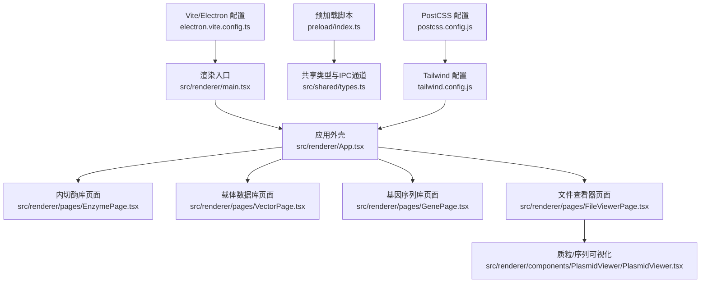
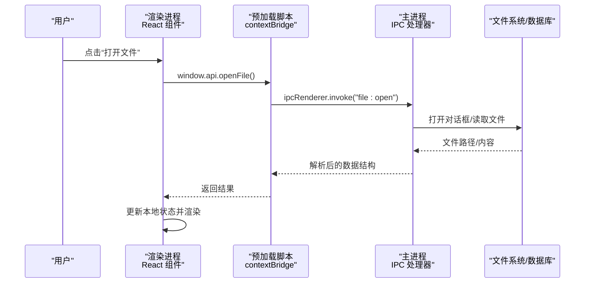
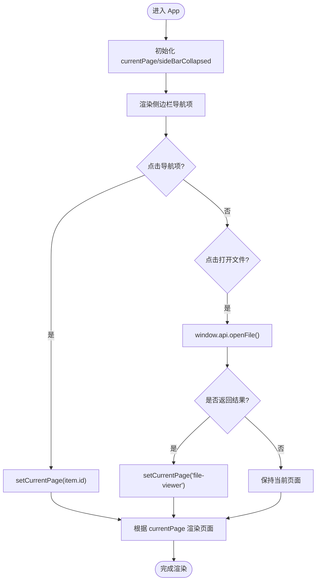
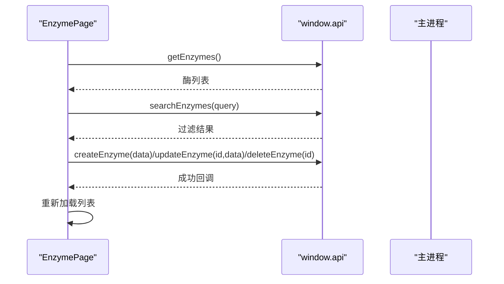
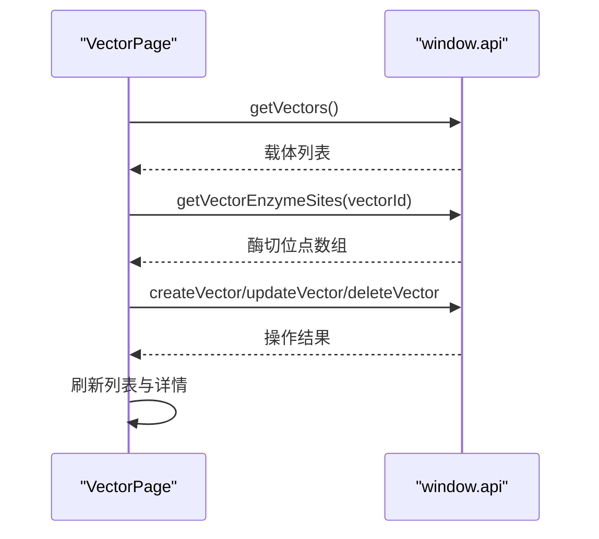
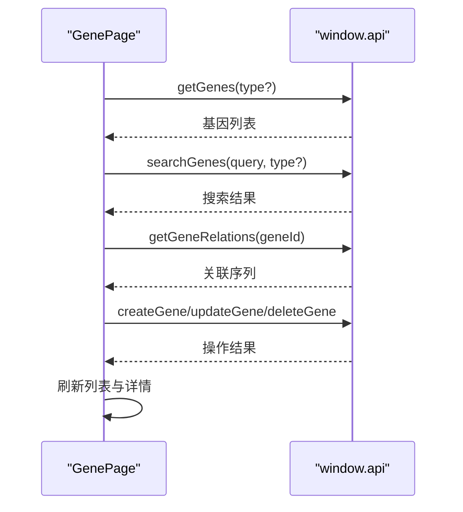
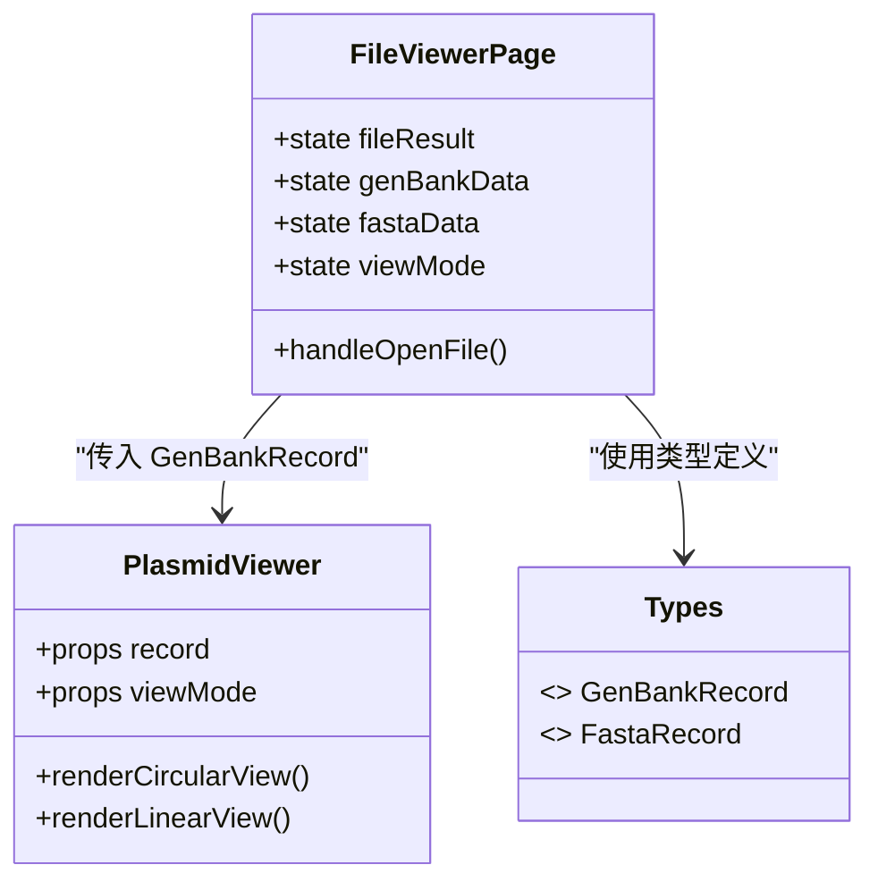
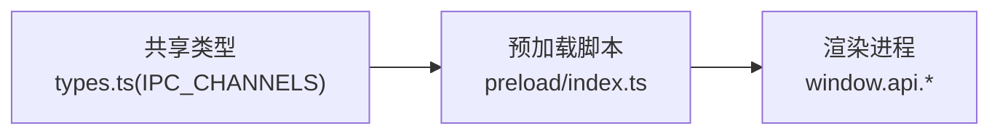
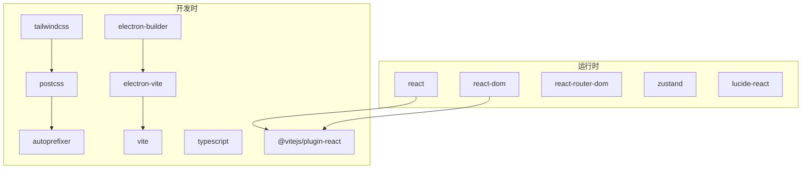

# 渲染进程架构

<cite>
**本文引用的文件**   
- [package.json](file://gene-engineering-tool/package.json)
- [electron.vite.config.ts](file://gene-engineering-tool/electron.vite.config.ts)
- [postcss.config.js](file://gene-engineering-tool/postcss.config.js)
- [tailwind.config.js](file://gene-engineering-tool/tailwind.config.js)
- [tsconfig.json](file://gene-engineering-tool/tsconfig.json)
- [electron-builder.json](file://gene-engineering-tool/electron-builder.json)
- [preload/index.ts](file://gene-engineering-tool/preload/index.ts)
- [src/shared/types.ts](file://gene-engineering-tool/src/shared/types.ts)
- [src/renderer/main.tsx](file://gene-engineering-tool/src/renderer/main.tsx)
- [src/renderer/App.tsx](file://gene-engineering-tool/src/renderer/App.tsx)
- [src/renderer/pages/EnzymePage.tsx](file://gene-engineering-tool/src/renderer/pages/EnzymePage.tsx)
- [src/renderer/pages/VectorPage.tsx](file://gene-engineering-tool/src/renderer/pages/VectorPage.tsx)
- [src/renderer/pages/GenePage.tsx](file://gene-engineering-tool/src/renderer/pages/GenePage.tsx)
- [src/renderer/pages/FileViewerPage.tsx](file://gene-engineering-tool/src/renderer/pages/FileViewerPage.tsx)
- [src/renderer/components/PlasmidViewer/PlasmidViewer.tsx](file://gene-engineering-tool/src/renderer/components/PlasmidViewer/PlasmidViewer.tsx)
</cite>

## 目录
1. [简介](#简介)
2. [项目结构](#项目结构)
3. [核心组件](#核心组件)
4. [架构总览](#架构总览)
5. [详细组件分析](#详细组件分析)
6. [依赖关系分析](#依赖关系分析)
7. [性能考量](#性能考量)
8. [故障排查指南](#故障排查指南)
9. [结论](#结论)
10. [附录](#附录)

## 简介
本文件面向 React 渲染进程的架构设计与实现，覆盖以下方面：
- React 应用初始化流程与组件层次结构
- 页面路由与导航管理（当前采用状态驱动的路由）
- 状态管理模式的选择与实现原理
- UI 组件组织与复用策略
- 与主进程的通信接口设计（IPC）
- 前端构建配置与开发环境设置
- 样式系统与主题定制方案
- 性能优化建议与最佳实践

## 项目结构
渲染进程基于 Electron + Vite + React + TypeScript 技术栈。关键入口与职责如下：
- 渲染入口：main.tsx 挂载根组件 App
- 应用外壳：App.tsx 提供侧边栏导航、顶部标题与内容区
- 页面模块：pages 下按功能划分页面（内切酶库、载体数据库、基因序列库、实验室载体、文件查看器）
- 可视化组件：components/PlasmidViewer 用于 GenBank 序列的环形/线性视图
- 预加载脚本：preload/index.ts 暴露安全的 window.api 给渲染进程
- 共享类型：src/shared/types.ts 定义数据模型与 IPC 通道常量
- 构建与样式：electron-vite 配置、TailwindCSS、PostCSS、TypeScript 多配置

图示来源
- [src/renderer/main.tsx:1-11](file://gene-engineering-tool/src/renderer/main.tsx#L1-L11)
- [src/renderer/App.tsx:1-106](file://gene-engineering-tool/src/renderer/App.tsx#L1-L106)
- [src/renderer/pages/EnzymePage.tsx:1-252](file://gene-engineering-tool/src/renderer/pages/EnzymePage.tsx#L1-L252)
- [src/renderer/pages/VectorPage.tsx:1-191](file://gene-engineering-tool/src/renderer/pages/VectorPage.tsx#L1-L191)
- [src/renderer/pages/GenePage.tsx:1-219](file://gene-engineering-tool/src/renderer/pages/GenePage.tsx#L1-L219)
- [src/renderer/pages/FileViewerPage.tsx:1-152](file://gene-engineering-tool/src/renderer/pages/FileViewerPage.tsx#L1-L152)
- [src/renderer/components/PlasmidViewer/PlasmidViewer.tsx:1-362](file://gene-engineering-tool/src/renderer/components/PlasmidViewer/PlasmidViewer.tsx#L1-L362)
- [preload/index.ts:1-46](file://gene-engineering-tool/preload/index.ts#L1-L46)
- [src/shared/types.ts:1-154](file://gene-engineering-tool/src/shared/types.ts#L1-L154)
- [electron.vite.config.ts:1-52](file://gene-engineering-tool/electron.vite.config.ts#L1-L52)
- [tailwind.config.js:1-30](file://gene-engineering-tool/tailwind.config.js#L1-L30)
- [postcss.config.js:1-7](file://gene-engineering-tool/postcss.config.js#L1-L7)

章节来源
- [src/renderer/main.tsx:1-11](file://gene-engineering-tool/src/renderer/main.tsx#L1-L11)
- [src/renderer/App.tsx:1-106](file://gene-engineering-tool/src/renderer/App.tsx#L1-L106)
- [electron.vite.config.ts:1-52](file://gene-engineering-tool/electron.vite.config.ts#L1-L52)
- [tailwind.config.js:1-30](file://gene-engineering-tool/tailwind.config.js#L1-L30)
- [postcss.config.js:1-7](file://gene-engineering-tool/postcss.config.js#L1-L7)

## 核心组件
- 渲染入口 main.tsx：创建 React 根节点并挂载 App，启用 StrictMode
- 应用外壳 App.tsx：维护当前页面状态、侧边栏折叠状态；根据状态动态渲染对应页面；集成打开文件按钮触发主进程文件选择
- 页面组件：
  - EnzymePage.tsx：内切酶的增删改查、搜索、详情展示与识别序列高亮
  - VectorPage.tsx：载体的增删改查、酶切位点列表与序列片段展示
  - GenePage.tsx：基因序列的分页筛选（mRNA/cDNA/genomic/protein）、搜索、详情与关联信息
  - FileViewerPage.tsx：GenBank/FASTA 文件打开与解析结果展示，支持环形/线性视图切换
- 可视化组件 PlasmidViewer.tsx：基于 SVG 的环形/线性序列图，包含刻度、特征条、方向箭头、图例与悬浮提示

章节来源
- [src/renderer/main.tsx:1-11](file://gene-engineering-tool/src/renderer/main.tsx#L1-L11)
- [src/renderer/App.tsx:1-106](file://gene-engineering-tool/src/renderer/App.tsx#L1-L106)
- [src/renderer/pages/EnzymePage.tsx:1-252](file://gene-engineering-tool/src/renderer/pages/EnzymePage.tsx#L1-L252)
- [src/renderer/pages/VectorPage.tsx:1-191](file://gene-engineering-tool/src/renderer/pages/VectorPage.tsx#L1-L191)
- [src/renderer/pages/GenePage.tsx:1-219](file://gene-engineering-tool/src/renderer/pages/GenePage.tsx#L1-L219)
- [src/renderer/pages/FileViewerPage.tsx:1-152](file://gene-engineering-tool/src/renderer/pages/FileViewerPage.tsx#L1-L152)
- [src/renderer/components/PlasmidViewer/PlasmidViewer.tsx:1-362](file://gene-engineering-tool/src/renderer/components/PlasmidViewer/PlasmidViewer.tsx#L1-L362)

## 架构总览
渲染进程通过预加载脚本暴露安全 API，页面组件调用 window.api 进行 IPC 调用，主进程处理数据库与文件系统操作后返回结果。UI 层使用 TailwindCSS 快速构建界面，SVG 组件负责复杂可视化。

图示来源
- [preload/index.ts:1-46](file://gene-engineering-tool/preload/index.ts#L1-L46)
- [src/renderer/App.tsx:75-86](file://gene-engineering-tool/src/renderer/App.tsx#L75-L86)
- [src/shared/types.ts:114-154](file://gene-engineering-tool/src/shared/types.ts#L114-L154)

## 详细组件分析

### 应用外壳与导航（App.tsx）
- 导航模式：基于 useState 的 Page 枚举与 switch 分支渲染，未引入 react-router-dom
- 侧边栏：可折叠，显示图标与标签，选中态高亮
- 文件打开：在侧边栏底部按钮直接调用 window.api.openFile()，成功后跳转到文件查看器页面

图示来源
- [src/renderer/App.tsx:19-32](file://gene-engineering-tool/src/renderer/App.tsx#L19-L32)
- [src/renderer/App.tsx:75-86](file://gene-engineering-tool/src/renderer/App.tsx#L75-L86)

章节来源
- [src/renderer/App.tsx:1-106](file://gene-engineering-tool/src/renderer/App.tsx#L1-L106)

### 内切酶库页面（EnzymePage.tsx）
- 数据流：useEffect 初始化加载 -> 搜索/新增/编辑/删除 -> 刷新列表
- 交互：表格行点击选中 -> 右侧详情面板展示识别序列高亮与互补链
- IPC：getEnzymes/searchEnzymes/createEnzyme/updateEnzyme/deleteEnzyme

图示来源
- [src/renderer/pages/EnzymePage.tsx:15-68](file://gene-engineering-tool/src/renderer/pages/EnzymePage.tsx#L15-L68)
- [preload/index.ts:4-11](file://gene-engineering-tool/preload/index.ts#L4-L11)
- [src/shared/types.ts:115-122](file://gene-engineering-tool/src/shared/types.ts#L115-L122)

章节来源
- [src/renderer/pages/EnzymePage.tsx:1-252](file://gene-engineering-tool/src/renderer/pages/EnzymePage.tsx#L1-L252)

### 载体数据库页面（VectorPage.tsx）
- 数据流：加载载体列表 -> 选择载体 -> 获取其酶切位点 -> 展示序列片段
- 交互：增删改表单弹窗，类型下拉映射中文标签
- IPC：getVectors/getVectorEnzymeSites/createVector/updateVector/deleteVector

图示来源
- [src/renderer/pages/VectorPage.tsx:16-57](file://gene-engineering-tool/src/renderer/pages/VectorPage.tsx#L16-L57)
- [preload/index.ts:13-19](file://gene-engineering-tool/preload/index.ts#L13-L19)
- [src/shared/types.ts:124-131](file://gene-engineering-tool/src/shared/types.ts#L124-L131)

章节来源
- [src/renderer/pages/VectorPage.tsx:1-191](file://gene-engineering-tool/src/renderer/pages/VectorPage.tsx#L1-L191)

### 基因序列库页面（GenePage.tsx）
- 数据流：Tab 切换类型 -> 加载对应列表 -> 搜索 -> 选择记录 -> 加载关联序列
- 交互：类型标签、搜索框、增删改弹窗
- IPC：getGenes(type)/searchGenes(query,type)/createGene/updateGene/deleteGene/getGeneRelations

图示来源
- [src/renderer/pages/GenePage.tsx:25-71](file://gene-engineering-tool/src/renderer/pages/GenePage.tsx#L25-L71)
- [preload/index.ts:21-28](file://gene-engineering-tool/preload/index.ts#L21-L28)
- [src/shared/types.ts:133-140](file://gene-engineering-tool/src/shared/types.ts#L133-L140)

章节来源
- [src/renderer/pages/GenePage.tsx:1-219](file://gene-engineering-tool/src/renderer/pages/GenePage.tsx#L1-L219)

### 文件查看器与可视化（FileViewerPage.tsx + PlasmidViewer.tsx）
- 文件打开：从侧边栏或页面内按钮触发 openFile，根据返回类型切换 GenBank/FASTA 视图
- 可视化：PlasmidViewer 支持环形/线性两种模式，计算刻度、绘制特征条、方向箭头、图例与悬浮提示
- 数据模型：GenBankRecord/FastaRecord 来自共享类型

图示来源
- [src/renderer/pages/FileViewerPage.tsx:1-152](file://gene-engineering-tool/src/renderer/pages/FileViewerPage.tsx#L1-L152)
- [src/renderer/components/PlasmidViewer/PlasmidViewer.tsx:1-362](file://gene-engineering-tool/src/renderer/components/PlasmidViewer/PlasmidViewer.tsx#L1-L362)
- [src/shared/types.ts:87-112](file://gene-engineering-tool/src/shared/types.ts#L87-L112)

章节来源
- [src/renderer/pages/FileViewerPage.tsx:1-152](file://gene-engineering-tool/src/renderer/pages/FileViewerPage.tsx#L1-L152)
- [src/renderer/components/PlasmidViewer/PlasmidViewer.tsx:1-362](file://gene-engineering-tool/src/renderer/components/PlasmidViewer/PlasmidViewer.tsx#L1-L362)
- [src/shared/types.ts:87-112](file://gene-engineering-tool/src/shared/types.ts#L87-L112)

### 预加载脚本与 IPC 接口（preload/index.ts + types.ts）
- 预加载脚本集中封装所有 IPC 调用，统一命名空间 window.api
- IPC 通道常量集中在 shared/types.ts，保证前后端一致
- 渲染进程无需直接访问 ipcRenderer，安全性更高

图示来源
- [preload/index.ts:1-46](file://gene-engineering-tool/preload/index.ts#L1-L46)
- [src/shared/types.ts:114-154](file://gene-engineering-tool/src/shared/types.ts#L114-L154)

章节来源
- [preload/index.ts:1-46](file://gene-engineering-tool/preload/index.ts#L1-L46)
- [src/shared/types.ts:114-154](file://gene-engineering-tool/src/shared/types.ts#L114-L154)

## 依赖关系分析
- 运行时依赖：react、react-dom、react-router-dom（已安装但未在当前路由中使用）、zustand（已安装但未在当前状态管理中启用）、lucide-react（图标库）
- 开发依赖：electron-vite、vite、@vitejs/plugin-react、typescript、tailwindcss、autoprefixer、postcss、electron-builder
- 构建产物：electron-builder 打包 out/**/* 与 data 资源

图示来源
- [package.json:1-37](file://gene-engineering-tool/package.json#L1-L37)
- [electron-builder.json:1-22](file://gene-engineering-tool/electron-builder.json#L1-L22)

章节来源
- [package.json:1-37](file://gene-engineering-tool/package.json#L1-L37)
- [electron-builder.json:1-22](file://gene-engineering-tool/electron-builder.json#L1-L22)

## 性能考量
- 列表渲染优化
  - 对大列表使用虚拟滚动或分页加载（当前为全量渲染，建议在数据量大时引入）
  - 避免在 map 中生成不稳定 key，确保唯一且稳定
- 计算密集型任务
  - 将特征排序与行分配等逻辑用 useMemo/useCallback 包裹（PlasmidViewer 已部分使用）
  - 对长序列文本仅截取前 N 个字符展示，避免 DOM 过大
- 事件与重绘
  - 减少不必要的 state 更新，合并相关状态变更
  - 在 SVG 视图中合理控制 tick 密度，依据 size 自适应间隔
- 网络与磁盘 IO
  - 对 IPC 调用增加错误处理与超时重试机制
  - 文件解析在主进程执行，避免阻塞渲染线程

[本节为通用指导，不直接分析具体文件]

## 故障排查指南
- 无法打开文件
  - 检查侧边栏按钮是否正确调用 window.api.openFile()
  - 确认 preload 已正确注入 contextBridge 并暴露 api
  - 核对 IPC 通道名称是否与主进程一致
- 数据加载失败
  - 检查 IPC 通道是否存在、参数顺序是否正确
  - 查看主进程日志与数据库连接状态
- 页面不跳转
  - 当前使用状态驱动导航，确认 setCurrentPage 被正确调用
  - 若后续引入 react-router-dom，需同步迁移到路由方案
- 样式异常
  - 确认 Tailwind 扫描路径包含 renderer 下的 tsx/html
  - 检查 PostCSS 插件链是否正常加载

章节来源
- [src/renderer/App.tsx:75-86](file://gene-engineering-tool/src/renderer/App.tsx#L75-L86)
- [preload/index.ts:1-46](file://gene-engineering-tool/preload/index.ts#L1-L46)
- [tailwind.config.js:1-30](file://gene-engineering-tool/tailwind.config.js#L1-L30)
- [postcss.config.js:1-7](file://gene-engineering-tool/postcss.config.js#L1-L7)

## 结论
本项目渲染进程采用简洁的状态驱动导航与模块化页面组织，结合预加载脚本的安全 IPC 接口，实现了内切酶、载体、基因序列管理与 GenBank/FASTA 文件可视化的完整工作流。样式系统基于 TailwindCSS 与 PostCSS，构建工具链使用 electron-vite 与 electron-builder。未来可在路由、状态管理与性能优化方面进一步演进。

[本节为总结性内容，不直接分析具体文件]

## 附录

### 构建与开发环境设置
- 开发命令：npm run dev（electron-vite dev）
- 构建命令：npm run build（electron-vite build）
- 预览命令：npm run preview（electron-vite preview）
- 打包产物：dist 目录，包含 out/**/* 与 data 资源
- 别名配置：@shared 指向 src/shared，@ 指向 src/renderer

章节来源
- [package.json:6-11](file://gene-engineering-tool/package.json#L6-L11)
- [electron.vite.config.ts:1-52](file://gene-engineering-tool/electron.vite.config.ts#L1-L52)
- [electron-builder.json:1-22](file://gene-engineering-tool/electron-builder.json#L1-L22)

### 样式系统与主题定制
- Tailwind 主题扩展：定义 primary/accent 色板，便于统一品牌色
- PostCSS 插件：tailwindcss 与 autoprefixer 组合
- 自定义类名：在组件中直接使用 Tailwind 原子类，提升开发效率

章节来源
- [tailwind.config.js:1-30](file://gene-engineering-tool/tailwind.config.js#L1-L30)
- [postcss.config.js:1-7](file://gene-engineering-tool/postcss.config.js#L1-L7)

### TypeScript 配置要点
- 目标 ES2020，模块解析 bundler，严格模式开启
- 多项目引用：tsconfig.node.json 与 tsconfig.web.json 分离 Node/Web 编译选项

章节来源
- [tsconfig.json:1-18](file://gene-engineering-tool/tsconfig.json#L1-L18)