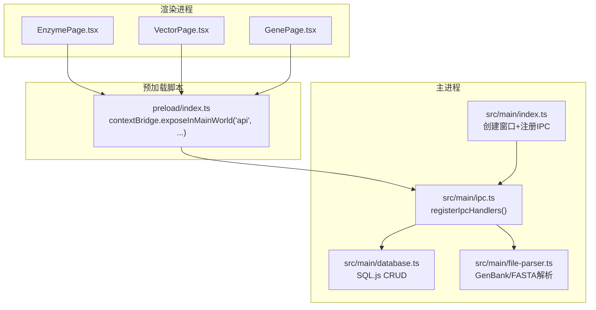
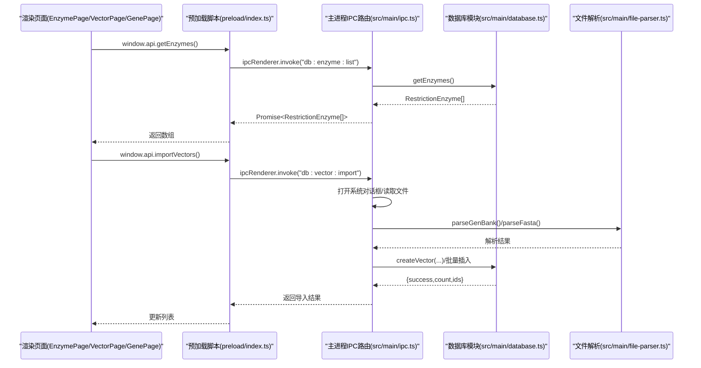
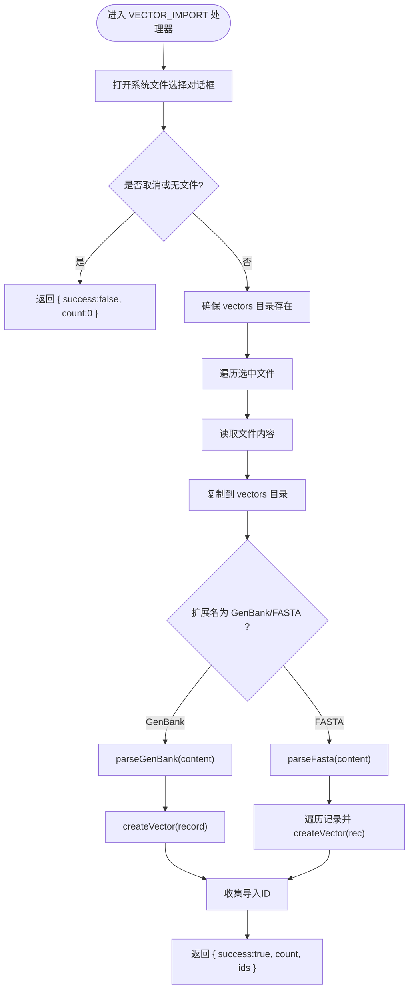
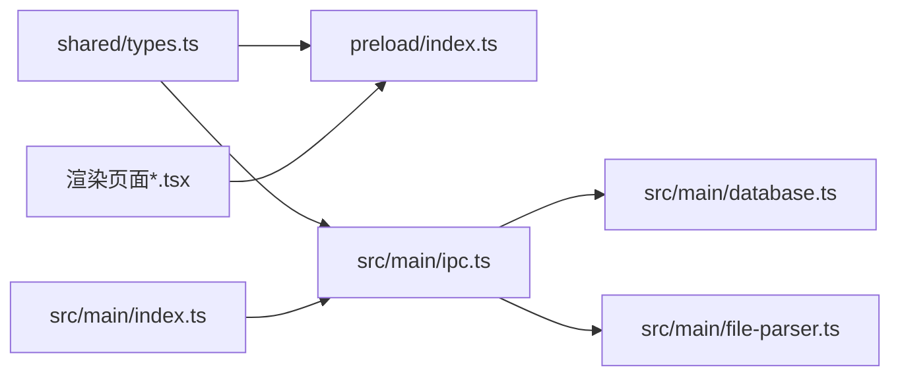

# IPC通信层

<cite>
**本文引用的文件**
- [preload/index.ts](file://preload/index.ts)
- [src/main/ipc.ts](file://src/main/ipc.ts)
- [src/main/index.ts](file://src/main/index.ts)
- [src/shared/types.ts](file://src/shared/types.ts)
- [src/main/database.ts](file://src/main/database.ts)
- [src/main/file-parser.ts](file://src/main/file-parser.ts)
- [src/renderer/pages/EnzymePage.tsx](file://src/renderer/pages/EnzymePage.tsx)
- [src/renderer/pages/VectorPage.tsx](file://src/renderer/pages/VectorPage.tsx)
- [src/renderer/pages/GenePage.tsx](file://src/renderer/pages/GenePage.tsx)
</cite>

## 目录
1. [简介](#简介)
2. [项目结构](#项目结构)
3. [核心组件](#核心组件)
4. [架构总览](#架构总览)
5. [详细组件分析](#详细组件分析)
6. [依赖关系分析](#依赖关系分析)
7. [性能与异步最佳实践](#性能与异步最佳实践)
8. [错误处理与日志](#错误处理与日志)
9. [安全边界与权限控制](#安全边界与权限控制)
10. [故障排查指南](#故障排查指南)
11. [结论](#结论)
12. [附录：新增IPC通道示例](#附录新增ipc通道示例)

## 简介
本技术文档聚焦于该基因工程辅助软件的IPC通信层，系统性阐述Electron主进程与渲染进程之间的通信机制、预加载脚本的安全桥接实现、消息处理器模式、类型安全保障、错误处理策略、性能优化与安全边界设计。文档旨在帮助开发者快速理解并扩展IPC能力，同时确保前后端数据结构一致性与应用安全性。

## 项目结构
IPC相关代码主要分布在以下位置：
- 预加载脚本：定义对外暴露的API集合，通过contextBridge将受限方法暴露给渲染进程
- 主进程入口：初始化数据库、注册IPC处理器、创建窗口并配置安全选项
- IPC路由与业务调用：集中注册所有IPC通道，转发到数据库或文件系统操作
- 共享类型：统一的数据结构与IPC通道常量，保证前后端类型一致
- 渲染页面：通过window.api调用IPC接口完成CRUD与文件解析等交互

图表来源
- [preload/index.ts:1-47](file://preload/index.ts#L1-L47)
- [src/main/index.ts:1-59](file://src/main/index.ts#L1-L59)
- [src/main/ipc.ts:1-227](file://src/main/ipc.ts#L1-L227)
- [src/main/database.ts:1-490](file://src/main/database.ts#L1-L490)
- [src/main/file-parser.ts:1-243](file://src/main/file-parser.ts#L1-L243)

章节来源
- [preload/index.ts:1-47](file://preload/index.ts#L1-L47)
- [src/main/index.ts:1-59](file://src/main/index.ts#L1-L59)
- [src/main/ipc.ts:1-227](file://src/main/ipc.ts#L1-L227)
- [src/shared/types.ts:1-154](file://src/shared/types.ts#L1-L154)

## 核心组件
- 预加载脚本（安全桥）
  - 使用contextBridge.exposeInMainWorld将受控API对象挂载到全局window.api
  - 每个API方法内部通过ipcRenderer.invoke调用对应IPC通道，参数按通道约定传递
- 主进程IPC路由
  - registerIpcHandlers集中注册所有handle监听器，基于IPC_CHANNELS常量进行路由分发
  - 处理器直接调用database模块或file-parser模块执行具体逻辑
- 共享类型与通道常量
  - IPC_CHANNELS为只读常量映射，避免字符串硬编码导致的路由不一致
  - 数据模型类型在shared中统一定义，供主进程与渲染进程共同引用
- 渲染进程调用
  - 页面组件通过window.api.xxx(...)发起请求，await返回Promise结果
  - 典型流程：列表加载、搜索、增删改查、关联查询、文件导入与解析

章节来源
- [preload/index.ts:1-47](file://preload/index.ts#L1-L47)
- [src/main/ipc.ts:1-227](file://src/main/ipc.ts#L1-L227)
- [src/shared/types.ts:114-154](file://src/shared/types.ts#L114-L154)
- [src/renderer/pages/EnzymePage.tsx:1-252](file://src/renderer/pages/EnzymePage.tsx#L1-L252)
- [src/renderer/pages/VectorPage.tsx:1-191](file://src/renderer/pages/VectorPage.tsx#L1-L191)
- [src/renderer/pages/GenePage.tsx:1-219](file://src/renderer/pages/GenePage.tsx#L1-L219)

## 架构总览
IPC通信采用“请求-响应”模式，渲染进程通过预加载脚本暴露的window.api调用主进程处理器，处理器再委托数据库或文件解析模块完成业务逻辑。

图表来源
- [preload/index.ts:1-47](file://preload/index.ts#L1-L47)
- [src/main/ipc.ts:60-139](file://src/main/ipc.ts#L60-L139)
- [src/main/database.ts:228-240](file://src/main/database.ts#L228-L240)
- [src/main/file-parser.ts:6-130](file://src/main/file-parser.ts#L6-L130)
- [src/main/file-parser.ts:199-243](file://src/main/file-parser.ts#L199-L243)

## 详细组件分析

### 预加载脚本安全桥
- 职责
  - 聚合所有对外API，封装ipcRenderer.invoke调用
  - 通过contextBridge.exposeInMainWorld暴露唯一入口window.api
- 设计要点
  - 仅暴露必要方法，不直接暴露ipcRenderer实例，降低安全风险
  - 参数顺序与主进程处理器保持一致，便于维护
- 扩展建议
  - 新增API时，先在shared中定义通道常量，再在preload中添加方法，最后在主进程注册处理器

章节来源
- [preload/index.ts:1-47](file://preload/index.ts#L1-L47)

### 主进程IPC路由与处理器
- 职责
  - 集中注册所有IPC通道监听器
  - 根据通道名分派到对应的数据库或文件解析函数
- 关键路径
  - 酶：列表、详情、搜索、增删改
  - 载体：列表、详情、增删改、酶切位点查询、批量导入
  - 基因序列：列表、详情、搜索、增删改、关系查询
  - 实验室载体：列表、详情、增删改
  - 文件操作：打开文件、解析GenBank/FASTA
- 导入流程（以VECTOR_IMPORT为例）
  - 打开系统选择对话框，支持多文件
  - 复制文件至用户数据目录下的vectors文件夹
  - 根据扩展名选择解析器，写入数据库，返回成功计数与ID列表

图表来源
- [src/main/ipc.ts:60-139](file://src/main/ipc.ts#L60-L139)
- [src/main/file-parser.ts:6-130](file://src/main/file-parser.ts#L6-L130)
- [src/main/file-parser.ts:199-243](file://src/main/file-parser.ts#L199-L243)
- [src/main/database.ts:228-240](file://src/main/database.ts#L228-L240)

章节来源
- [src/main/ipc.ts:1-227](file://src/main/ipc.ts#L1-L227)

### 数据库模块与持久化
- 职责
  - 提供统一的CRUD接口，封装SQL语句与参数绑定
  - 管理WAL模式、外键约束、索引与表迁移
  - 种子数据初始化（常用内切酶库）
- 关键点
  - queryAll/queryOne/run封装了SQL执行与结果转换
  - lastInsertId用于获取自增ID
  - migrateVectorsTable对已有表结构进行增量升级
- 性能
  - 使用WAL提升并发读写性能
  - 针对常用字段建立索引（名称、识别序列、类型等）

章节来源
- [src/main/database.ts:1-490](file://src/main/database.ts#L1-L490)

### 文件解析模块
- 职责
  - 解析GenBank格式：提取LOCUS、DEFINITION、ACCESSION、VERSION、FEATURES、ORIGIN等段，构建结构化记录
  - 解析FASTA格式：按>头分割，提取id、description与sequence
- 关键点
  - 支持线性/环状拓扑识别
  - 特征位置解析支持complement、join、单点与范围
  - 清理引号与空白字符，规范化序列大小写

章节来源
- [src/main/file-parser.ts:1-243](file://src/main/file-parser.ts#L1-L243)

### 渲染进程调用示例
- 酶管理页面
  - 加载列表、搜索、编辑、删除均通过window.api调用
- 载体管理页面
  - 列表、详情、增删改、酶切位点查询
- 基因序列页面
  - 分类标签切换、搜索、增删改、关系查询

章节来源
- [src/renderer/pages/EnzymePage.tsx:1-252](file://src/renderer/pages/EnzymePage.tsx#L1-L252)
- [src/renderer/pages/VectorPage.tsx:1-191](file://src/renderer/pages/VectorPage.tsx#L1-L191)
- [src/renderer/pages/GenePage.tsx:1-219](file://src/renderer/pages/GenePage.tsx#L1-L219)

## 依赖关系分析
- 预加载脚本依赖共享类型中的IPC_CHANNELS常量
- 主进程IPC路由依赖共享类型与数据库、文件解析模块
- 渲染页面依赖预加载脚本暴露的window.api
- 主进程入口负责初始化数据库、种子数据、注册IPC处理器并创建窗口

图表来源
- [src/shared/types.ts:114-154](file://src/shared/types.ts#L114-L154)
- [preload/index.ts:1-47](file://preload/index.ts#L1-L47)
- [src/main/ipc.ts:1-227](file://src/main/ipc.ts#L1-L227)
- [src/main/index.ts:1-59](file://src/main/index.ts#L1-L59)

章节来源
- [src/shared/types.ts:1-154](file://src/shared/types.ts#L1-L154)
- [preload/index.ts:1-47](file://preload/index.ts#L1-L47)
- [src/main/ipc.ts:1-227](file://src/main/ipc.ts#L1-L227)
- [src/main/index.ts:1-59](file://src/main/index.ts#L1-L59)

## 性能与异步最佳实践
- 异步处理
  - 所有IPC调用均为异步Promise，渲染侧应使用async/await避免阻塞UI
  - 复杂任务（如批量导入）应在主进程中串行处理，避免频繁跨进程同步开销
- 批量操作优化
  - 导入流程已采用循环逐条插入；若数据量较大，可考虑事务包裹减少磁盘落盘次数
  - 对于大量读取场景，可在数据库层增加分页或过滤条件，减少传输体积
- 内存与序列化
  - 大序列数据（如完整质粒序列）谨慎跨进程传输，必要时采用流式或分块策略
  - 避免在IPC中传递不必要的冗余字段
- 并发与锁
  - SQL.js默认单线程，注意避免长时间占用主线程导致界面卡顿
  - 可将耗时解析放入Web Worker（需结合主进程协调），但当前实现已在主进程处理，保持简单性

[本节为通用指导，无需特定文件来源]

## 错误处理与日志
- 当前实现特点
  - 未显式捕获异常，错误会沿Promise链向上抛出
  - 文件导入失败时返回结构化结果（包含success标志与计数）
- 建议改进
  - 在主进程处理器中增加try/catch，统一包装错误信息，返回标准化错误对象
  - 在预加载脚本中对invoke结果进行校验，区分成功与失败分支
  - 引入日志模块（如electron-log）记录关键操作与异常堆栈
  - 对非法输入进行前置校验（如空ID、缺失必填字段）

章节来源
- [src/main/ipc.ts:60-139](file://src/main/ipc.ts#L60-L139)

## 安全边界与权限控制
- 安全配置
  - 启用contextIsolation与nodeIntegration=false，禁用沙箱以避免渲染进程直接访问Node API
  - 通过preload脚本最小化暴露API，仅开放必要方法
- 权限原则
  - 所有敏感操作（文件IO、数据库写入）均在主进程执行
  - 渲染进程仅能调用白名单内的API，无法绕过预加载脚本
- 外部链接控制
  - 设置新窗口打开策略，强制使用系统浏览器打开外部URL，防止恶意跳转

章节来源
- [src/main/index.ts:17-32](file://src/main/index.ts#L17-L32)
- [preload/index.ts:1-47](file://preload/index.ts#L1-L47)

## 故障排查指南
- 常见问题定位
  - 通道未注册：检查IPC_CHANNELS常量与registerIpcHandlers是否匹配
  - 参数不匹配：核对预加载方法与主进程处理器参数顺序与类型
  - 文件导入失败：确认文件格式与扩展名是否在过滤器与解析器支持范围内
  - 数据库迁移问题：查看migrateVectorsTable是否覆盖新增字段
- 调试建议
  - 在主进程处理器中加入console.log输出关键变量
  - 在渲染侧打印Promise结果与错误信息
  - 使用Electron DevTools查看网络与IPC调用

章节来源
- [src/main/ipc.ts:1-227](file://src/main/ipc.ts#L1-L227)
- [src/main/database.ts:155-173](file://src/main/database.ts#L155-L173)

## 结论
本IPC通信层通过预加载脚本安全桥接、集中式路由与共享类型保障，实现了清晰的前后端分离与类型一致性。当前实现覆盖了酶、载体、基因序列及文件解析的核心功能，具备较好的可扩展性。后续可在错误处理、日志记录、批量事务与大数据传输方面进一步优化，以提升稳定性与性能。

[本节为总结性内容，无需特定文件来源]

## 附录：新增IPC通道示例
以下步骤展示如何添加一个新的IPC通道与处理函数：

- 步骤一：在共享类型中定义通道常量
  - 在IPC_CHANNELS中添加新的通道名（例如：'db:example:create'）
  - 如需新增数据结构，请在shared/types.ts中定义相应接口
- 步骤二：在预加载脚本中暴露API
  - 在preload/index.ts的api对象中添加新方法，使用ipcRenderer.invoke调用新通道
  - 确保参数顺序与主进程处理器一致
- 步骤三：在主进程注册处理器
  - 在src/main/ipc.ts的registerIpcHandlers中添加ipcMain.handle监听器
  - 在处理器中调用数据库或文件解析模块完成业务逻辑
- 步骤四：在渲染页面中使用
  - 在页面组件中通过window.api.newMethod(...)发起调用
  - 使用async/await处理返回结果与错误

章节来源
- [src/shared/types.ts:114-154](file://src/shared/types.ts#L114-L154)
- [preload/index.ts:1-47](file://preload/index.ts#L1-L47)
- [src/main/ipc.ts:1-227](file://src/main/ipc.ts#L1-L227)
- [src/renderer/pages/EnzymePage.tsx:1-252](file://src/renderer/pages/EnzymePage.tsx#L1-L252)