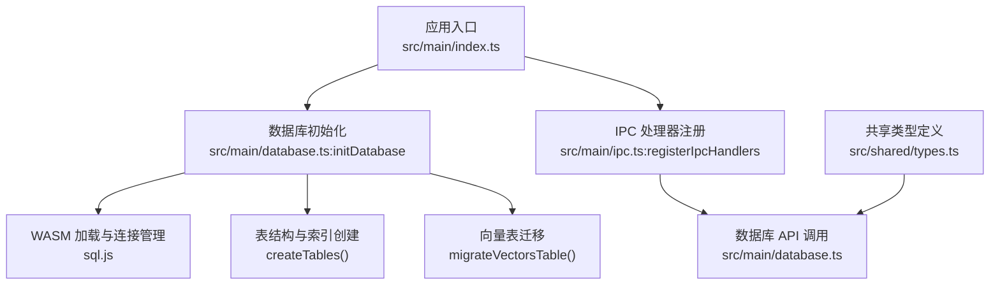
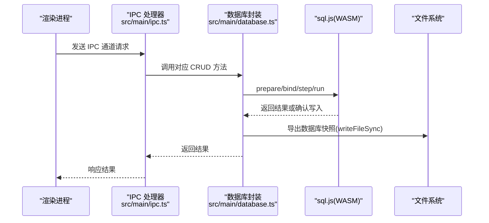
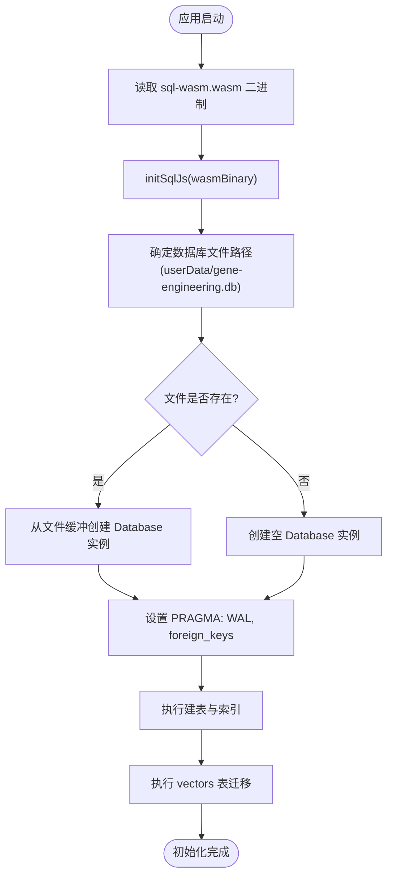
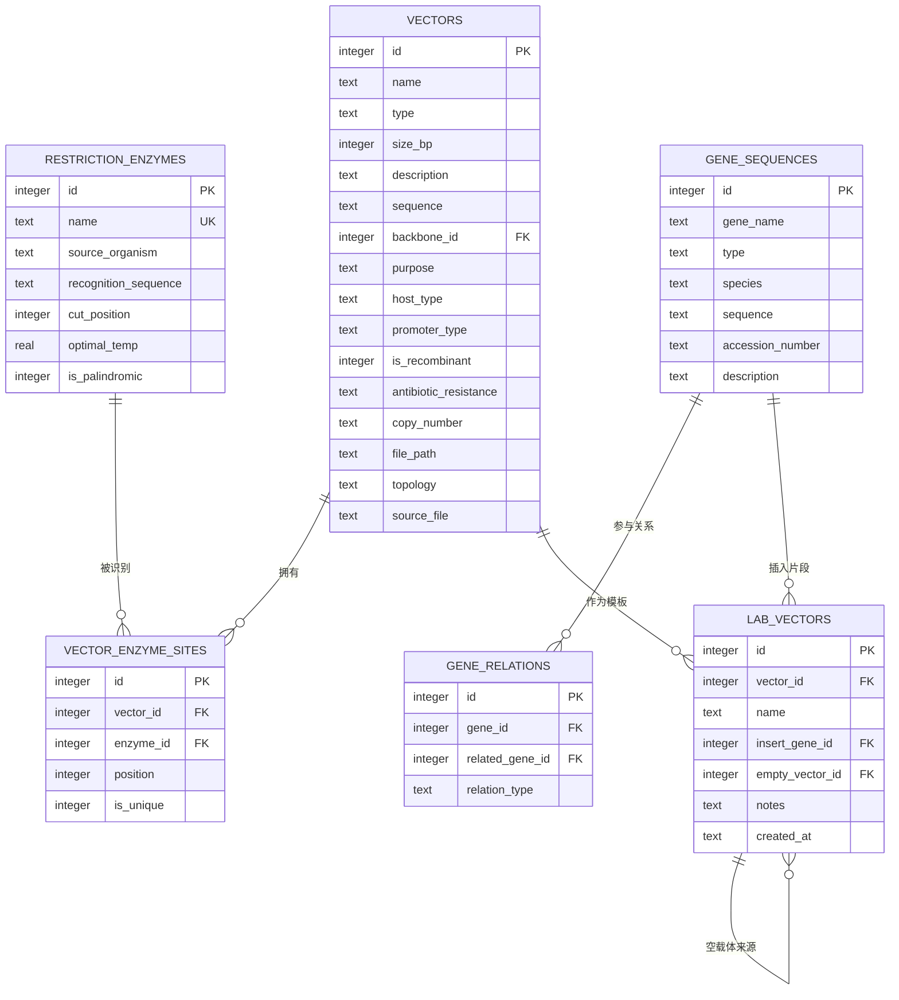
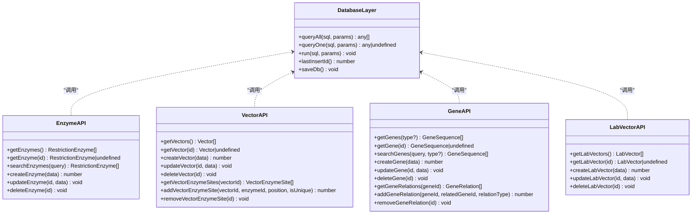
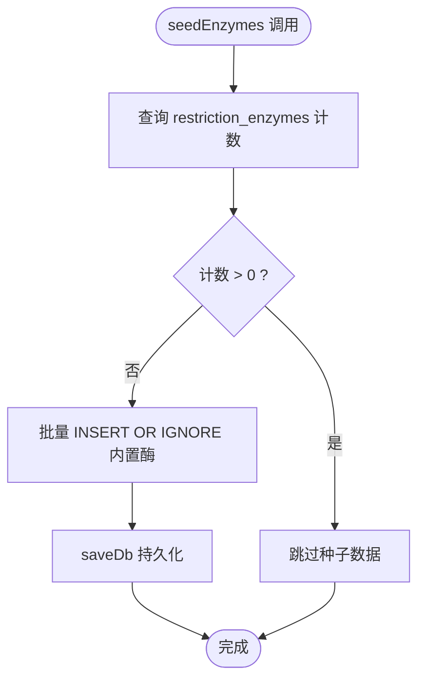
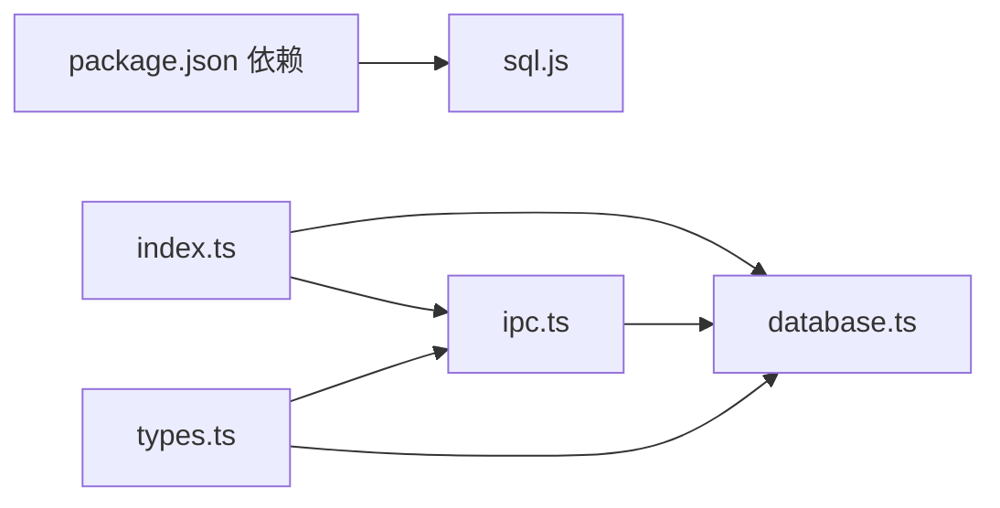

# 数据库管理层

<cite>
**本文引用的文件**   
- [database.ts](file://src/main/database.ts)
- [types.ts](file://src/shared/types.ts)
- [index.ts](file://src/main/index.ts)
- [ipc.ts](file://src/main/ipc.ts)
- [package.json](file://package.json)
</cite>

## 目录
1. [简介](#简介)
2. [项目结构](#项目结构)
3. [核心组件](#核心组件)
4. [架构总览](#架构总览)
5. [详细组件分析](#详细组件分析)
6. [依赖关系分析](#依赖关系分析)
7. [性能考虑](#性能考虑)
8. [故障排查指南](#故障排查指南)
9. [结论](#结论)
10. [附录](#附录)

## 简介
本技术文档聚焦于基因工程辅助软件的数据库管理层，围绕 SQLite（通过 sql.js）在 Electron 主进程中的初始化、表结构设计、CRUD 封装、种子数据机制、事务与错误处理、备份恢复与迁移策略进行系统化说明。文档旨在帮助开发者快速理解并扩展数据库层能力，同时提供可操作的优化建议与最佳实践。

## 项目结构
数据库相关代码主要位于主进程模块中，采用“单例连接 + 持久化导出”的模式：
- 初始化入口：应用启动时加载 WASM 二进制、创建或打开数据库文件、启用 WAL 模式与外键约束、建表与迁移、注入种子数据。
- 数据访问层：统一封装 queryAll、queryOne、run 等基础方法，并提供各业务域（酶、载体、基因序列、实验室载体）的 CRUD 函数。
- IPC 桥接：将渲染进程的请求映射到主进程数据库操作。
- 类型定义：共享 TypeScript 接口用于前后端类型一致。

图表来源
- [index.ts:41-52](file://src/main/index.ts#L41-L52)
- [database.ts:53-69](file://src/main/database.ts#L53-L69)
- [database.ts:71-153](file://src/main/database.ts#L71-L153)
- [ipc.ts:8-144](file://src/main/ipc.ts#L8-L144)
- [types.ts:1-154](file://src/shared/types.ts#L1-L154)

章节来源
- [index.ts:41-52](file://src/main/index.ts#L41-L52)
- [database.ts:53-69](file://src/main/database.ts#L53-L69)
- [ipc.ts:8-144](file://src/main/ipc.ts#L8-L144)
- [types.ts:1-154](file://src/shared/types.ts#L1-L154)

## 核心组件
- 数据库初始化与连接管理
  - 加载 sql.js 的 WASM 二进制文件，构造 SQL 实例。
  - 根据用户数据目录生成数据库文件路径，若存在则从磁盘读取缓冲区初始化，否则新建空库。
  - 设置 PRAGMA：开启 WAL 日志模式与外键约束。
  - 执行建表与迁移逻辑，确保结构一致性。
- 基础查询封装
  - queryAll：准备语句、绑定参数、逐行迭代结果集、释放语句对象。
  - queryOne：复用 queryAll 取首条记录。
  - run：执行写操作后自动持久化导出到磁盘。
  - lastInsertId：获取最近插入自增 ID。
- 业务域 CRUD
  - 限制性内切酶：列表、详情、搜索、新增、更新、删除。
  - 载体：列表、详情、新增、更新、删除；关联酶切位点查询与增删。
  - 基因序列：列表（可按类型过滤）、详情、搜索、新增、更新、删除；关系查询与增删。
  - 实验室载体：列表（含多表 JOIN 展示）、详情、新增、更新、删除。
- 种子数据
  - 首次启动时检查限制酶表是否为空，为空则批量插入内置常用酶数据。

章节来源
- [database.ts:22-51](file://src/main/database.ts#L22-L51)
- [database.ts:53-69](file://src/main/database.ts#L53-L69)
- [database.ts:175-406](file://src/main/database.ts#L175-L406)
- [database.ts:408-474](file://src/main/database.ts#L408-L474)

## 架构总览
下图展示了从渲染进程发起请求到数据库落盘的完整流程，包括 IPC 路由、数据库封装、WASM 引擎与文件系统交互。

图表来源
- [ipc.ts:8-144](file://src/main/ipc.ts#L8-L144)
- [database.ts:27-51](file://src/main/database.ts#L27-L51)
- [database.ts:22-25](file://src/main/database.ts#L22-L25)

## 详细组件分析

### 数据库初始化与连接管理
- WASM 二进制加载
  - 定位 sql.js 的 dist/sql-wasm.wasm 路径，读取为二进制缓冲，传入 initSqlJs 初始化。
- 数据库文件路径配置
  - 使用 app.getPath('userData') 拼接固定文件名，作为持久化存储位置。
- 连接管理
  - 若文件存在，以文件内容缓冲初始化；否则创建新库。
  - 设置 PRAGMA journal_mode=WAL 提升并发读写性能；PRAGMA foreign_keys=ON 保证引用完整性。
  - 执行 createTables 与 migrateVectorsTable，确保表结构与字段演进兼容。
- 持久化策略
  - 每次写操作后调用 saveDb，将内存中的数据库导出为字节数组并写回磁盘。

图表来源
- [database.ts:53-69](file://src/main/database.ts#L53-L69)
- [database.ts:71-153](file://src/main/database.ts#L71-L153)
- [database.ts:155-173](file://src/main/database.ts#L155-L173)

章节来源
- [database.ts:53-69](file://src/main/database.ts#L53-L69)
- [database.ts:71-153](file://src/main/database.ts#L71-L153)
- [database.ts:155-173](file://src/main/database.ts#L155-L173)

### 表结构设计
以下为核心表的字段定义、约束条件与索引优化要点。所有表均使用 AUTOINCREMENT 主键，部分字段具备默认值与外键约束。

- restriction_enzymes（限制性内切酶）
  - 字段：id(主键)、name(唯一非空)、source_organism(非空)、recognition_sequence(非空)、cut_position(非空)、optimal_temp(默认37.0)、is_palindromic(默认1)。
  - 索引：idx_enzyme_name(name)、idx_enzyme_seq(recognition_sequence)。
  - 用途：存储常用限制酶信息，供载体酶切位点分析与检索。

- vectors（载体）
  - 字段：id(主键)、name(非空)、type(枚举文本，默认plasmid)、size_bp(默认0)、description(默认空串)、sequence(默认空串)、backbone_id(外键自引用，ON DELETE SET NULL)、purpose/host_type/promoter_type/is_recombinant/antibiotic_resistance/copy_number/file_path/topology/source_file(均为新增分类与元数据字段，带默认值)。
  - 索引：idx_vector_name(name)。
  - 用途：存储载体基本信息与拓扑、宿主、启动子等分类属性。

- vector_enzyme_sites（载体酶切位点）
  - 字段：id(主键)、vector_id(外键vectors，ON DELETE CASCADE)、enzyme_id(外键restriction_enzymes，ON DELETE CASCADE)、position(非空)、is_unique(默认1)。
  - 用途：记录载体上每个酶的切割位置及是否唯一。

- gene_sequences（基因序列）
  - 字段：id(主键)、gene_name(非空)、type(受限枚举：mrna/cdna/genomic/protein)、species(默认空串)、sequence(默认空串)、accession_number(默认空串)、description(默认空串)。
  - 索引：idx_gene_name(gene_name)、idx_gene_type(type)。
  - 用途：存储各类基因序列及其元数据。

- gene_relations（基因关系）
  - 字段：id(主键)、gene_id(外键gene_sequences，ON DELETE CASCADE)、related_gene_id(外键gene_sequences，ON DELETE CASCADE)、relation_type(非空)。
  - 用途：表达基因之间的关联关系（如同源、上下游等）。

- lab_vectors（实验室载体）
  - 字段：id(主键)、vector_id(外键vectors，ON DELETE SET NULL)、name(非空)、insert_gene_id(外键gene_sequences，ON DELETE SET NULL)、empty_vector_id(自引用lab_vectors，ON DELETE SET NULL)、notes(默认空串)、created_at(默认当前时间)。
  - 索引：idx_lab_vector_name(name)。
  - 用途：记录实验室内实际构建的载体实体，包含插入片段与空载体来源等信息。

图表来源
- [database.ts:71-153](file://src/main/database.ts#L71-L153)

章节来源
- [database.ts:71-153](file://src/main/database.ts#L71-L153)

### CRUD 封装实现
- 基础方法
  - queryAll<T>(sql, params): 使用 prepare/bind/step 遍历结果集，返回 T[]。
  - queryOne<T>(sql, params): 基于 queryAll 取第一条。
  - run(sql, params): 执行写操作后立即保存数据库快照。
  - lastInsertId(): 查询 last_insert_rowid() 获取自增 ID。
- 封装模式
  - 所有写操作统一走 run，确保每次修改都触发 saveDb，避免数据丢失。
  - 读操作通过 queryAll/queryOne 返回强类型对象，便于前端消费。
  - 动态更新：update* 方法根据 Partial 输入动态拼装 SET 子句，减少冗余字段写入。

图表来源
- [database.ts:27-51](file://src/main/database.ts#L27-L51)
- [database.ts:175-406](file://src/main/database.ts#L175-L406)

章节来源
- [database.ts:27-51](file://src/main/database.ts#L27-L51)
- [database.ts:175-406](file://src/main/database.ts#L175-L406)

### 种子数据初始化机制
- 触发时机：应用启动后，初始化数据库完成后立即执行 seedEnzymes。
- 去重策略：先查询 restriction_enzymes 计数，若已有数据则跳过；否则批量 INSERT OR IGNORE 内置酶数据。
- 覆盖范围：包含常见 I 型、II 型、IIS 型等限制酶，涵盖不同识别序列长度与最优温度。

图表来源
- [database.ts:408-474](file://src/main/database.ts#L408-L474)

章节来源
- [database.ts:408-474](file://src/main/database.ts#L408-L474)

### 扩展新数据表与操作方法示例
- 步骤概览
  - 在 types.ts 中新增接口定义，保持与表结构一致。
  - 在 database.ts 的 createTables 中添加 CREATE TABLE IF NOT EXISTS 语句，并为高频查询字段添加索引。
  - 在 database.ts 中新增对应的 CRUD 函数，遵循 queryAll/queryOne/run 封装模式。
  - 在 ipc.ts 中注册新的 IPC 通道，映射渲染进程请求到数据库方法。
  - 如需向后兼容，参考 migrateVectorsTable 实现增量迁移逻辑。
- 注意事项
  - 使用参数化查询防止 SQL 注入。
  - 对布尔字段使用 INTEGER 存储（0/1），在接口层做 boolean 转换。
  - 对外键约束谨慎设计 ON DELETE 行为，避免误删重要数据。
  - 对大文本字段（如 sequence）注意磁盘大小与导入性能。

章节来源
- [types.ts:1-154](file://src/shared/types.ts#L1-L154)
- [database.ts:71-153](file://src/main/database.ts#L71-L153)
- [database.ts:175-406](file://src/main/database.ts#L175-L406)
- [ipc.ts:8-144](file://src/main/ipc.ts#L8-L144)
- [database.ts:155-173](file://src/main/database.ts#L155-L173)

## 依赖关系分析
- 外部依赖
  - sql.js：提供 SQLite 的 WASM 实现，支持内存数据库与导出到 ArrayBuffer。
  - electron-store：包中声明但未在当前数据库层直接使用，可用于后续配置持久化。
- 内部依赖
  - index.ts：负责应用生命周期、数据库初始化与种子数据注入。
  - ipc.ts：将渲染进程 IPC 请求路由到数据库层。
  - types.ts：跨进程共享的类型定义，确保前后端数据结构一致。

图表来源
- [package.json:12-20](file://package.json#L12-L20)
- [index.ts:41-52](file://src/main/index.ts#L41-L52)
- [ipc.ts:8-144](file://src/main/ipc.ts#L8-L144)
- [database.ts:1-17](file://src/main/database.ts#L1-L17)
- [types.ts:1-154](file://src/shared/types.ts#L1-L154)

章节来源
- [package.json:12-20](file://package.json#L12-L20)
- [index.ts:41-52](file://src/main/index.ts#L41-L52)
- [ipc.ts:8-144](file://src/main/ipc.ts#L8-L144)
- [database.ts:1-17](file://src/main/database.ts#L1-L17)
- [types.ts:1-154](file://src/shared/types.ts#L1-L154)

## 性能考虑
- WAL 模式
  - 已启用 PRAGMA journal_mode=WAL，提高并发读写性能，减少锁竞争。
- 索引优化
  - 针对高频查询字段建立索引：酶名、识别序列、载体名、基因名与类型、实验室载体名。
- 语句重用
  - 使用 prepare/bind/step/free 模式，避免重复解析 SQL，降低开销。
- 批量写入
  - 种子数据使用循环 INSERT OR IGNORE，建议在大规模导入时改用事务包裹以减少磁盘同步次数。
- 外键约束
  - 已启用 PRAGMA foreign_keys=ON，保证数据一致性，但需注意级联删除的影响。
- 持久化频率
  - 当前每次写操作即 saveDb，适合小规模数据；对于大批量写入建议合并为事务并在结束时一次性导出。

[本节为通用性能指导，不直接分析具体文件]

## 故障排查指南
- 常见问题
  - 找不到 sql-wasm.wasm：检查打包产物路径是否正确，确保 node_modules/sql.js/dist/sql-wasm.wasm 存在。
  - 数据库文件损坏：尝试从备份恢复；检查 saveDb 是否异常中断。
  - 外键约束失败：确认被引用记录存在或允许 SET NULL 的删除策略。
  - 性能退化：评估索引是否命中，避免全表扫描；检查是否频繁触发 saveDb。
- 调试建议
  - 在关键路径增加日志输出（如 IPC 通道、SQL 语句、错误堆栈）。
  - 使用 sqlite 命令行工具附加 .db 文件验证结构与索引。
  - 对比 WAL 文件与主数据库文件状态，确认一致性。

章节来源
- [database.ts:53-69](file://src/main/database.ts#L53-L69)
- [database.ts:22-25](file://src/main/database.ts#L22-L25)
- [database.ts:71-153](file://src/main/database.ts#L71-L153)

## 结论
该数据库管理层以 sql.js 为核心，结合 Electron 主进程实现了轻量、可移植的本地数据存储方案。通过统一的 CRUD 封装、完善的表结构与索引、以及种子数据机制，满足了基因工程辅助软件的基础数据需求。未来可在事务批处理、备份恢复与迁移脚本方面进一步增强，以提升健壮性与可维护性。

[本节为总结性内容，不直接分析具体文件]

## 附录

### 事务处理与错误处理最佳实践
- 事务处理
  - 使用 BEGIN/COMMIT/ROLLBACK 包裹多条写操作，减少磁盘同步次数，提升性能与一致性。
  - 在异常分支显式 ROLLBACK，确保数据库状态回滚。
- 错误处理
  - 捕获 SQL 执行异常，记录错误信息与上下文，向上抛出结构化错误。
  - 对文件 IO 异常（如权限不足、磁盘空间不足）进行友好提示与降级处理。

[本节为通用实践指导，不直接分析具体文件]

### 备份恢复与数据迁移最佳实践
- 备份恢复
  - 定期导出数据库快照（db.export）到独立目录，保留版本历史。
  - 恢复时校验文件大小与完整性，必要时从 WAL 文件重建。
- 数据迁移
  - 参考 migrateVectorsTable 的增量迁移思路，按版本号管理 ALTER TABLE 与数据清洗脚本。
  - 迁移前备份，迁移后校验关键字段与索引有效性。

[本节为通用实践指导，不直接分析具体文件]