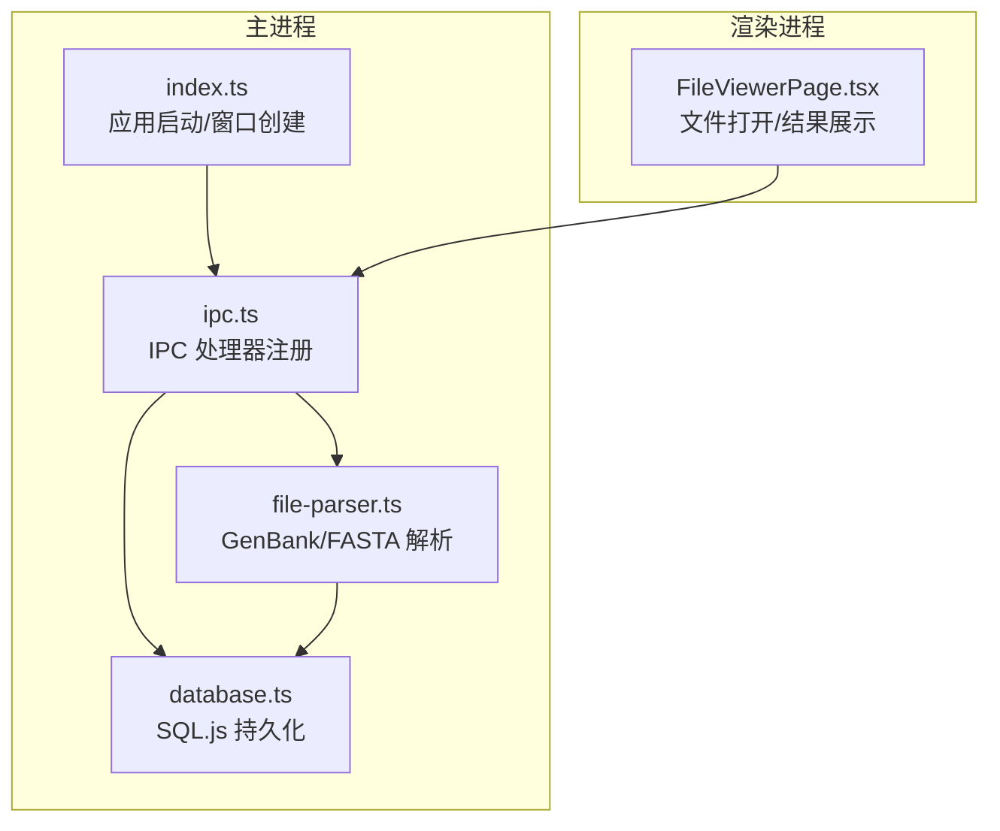
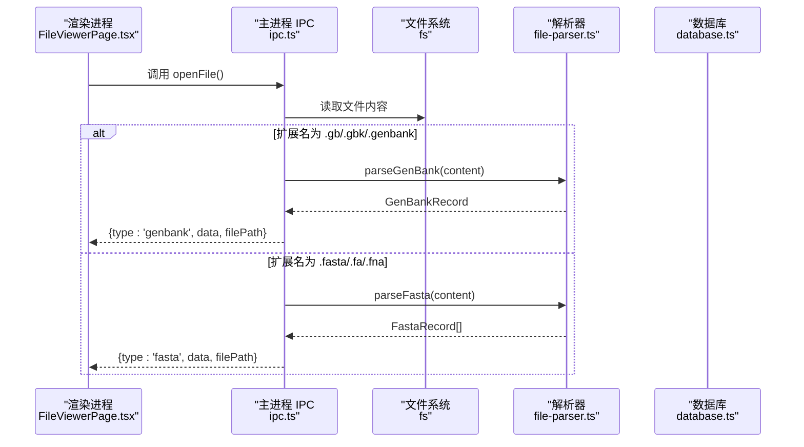
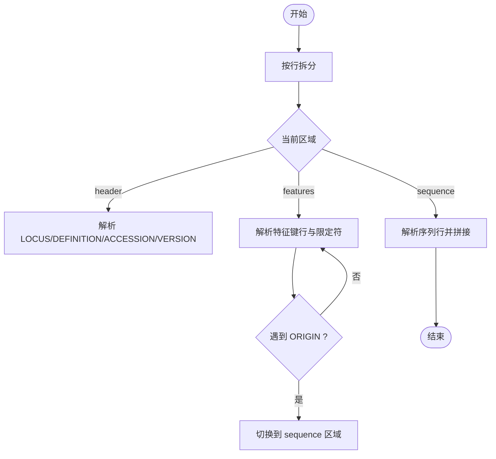
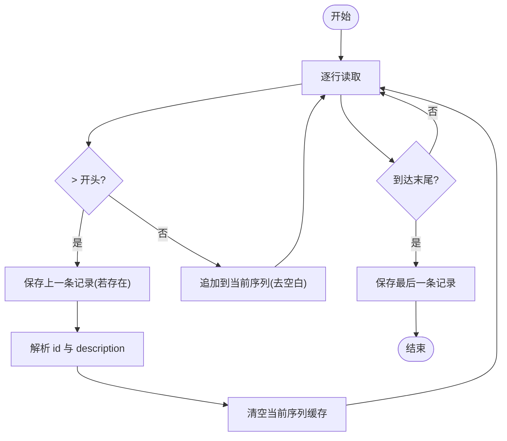
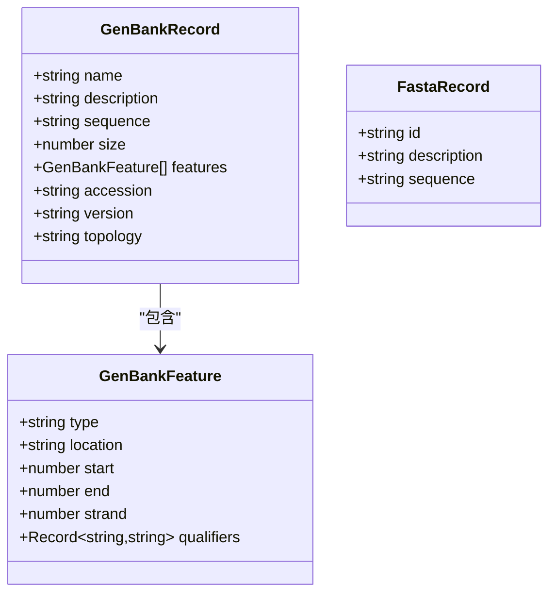
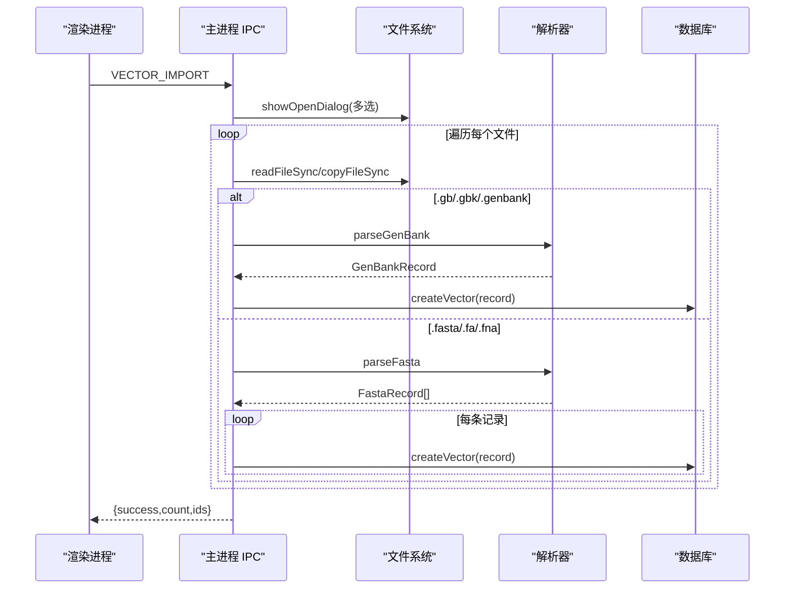
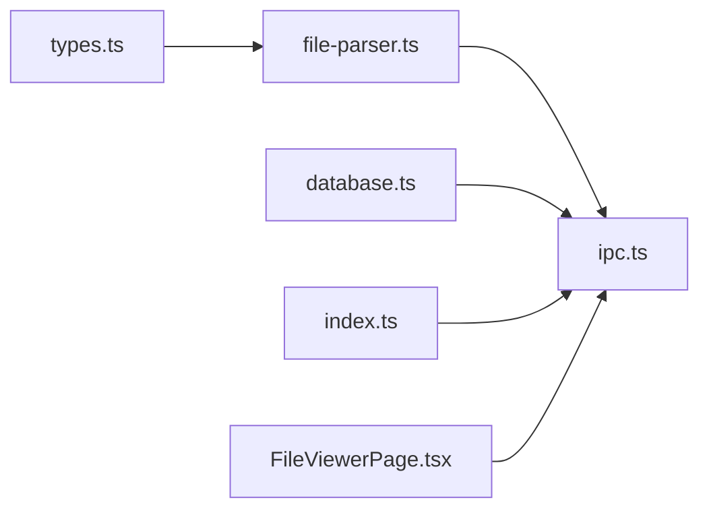

# 文件解析器

<cite>
**本文引用的文件**   
- [file-parser.ts](file://src/main/file-parser.ts)
- [types.ts](file://src/shared/types.ts)
- [ipc.ts](file://src/main/ipc.ts)
- [index.ts](file://src/main/index.ts)
- [database.ts](file://src/main/database.ts)
- [FileViewerPage.tsx](file://src/renderer/pages/FileViewerPage.tsx)
</cite>

## 目录
1. [简介](#简介)
2. [项目结构](#项目结构)
3. [核心组件](#核心组件)
4. [架构总览](#架构总览)
5. [详细组件分析](#详细组件分析)
6. [依赖关系分析](#依赖关系分析)
7. [性能与内存优化](#性能与内存优化)
8. [错误处理与容错](#错误处理与容错)
9. [扩展指南：新增文件格式](#扩展指南新增文件格式)
10. [结论](#结论)
11. [附录：格式规范与参考](#附录格式规范与参考)

## 简介
本技术文档聚焦于基因工程辅助软件中的“文件解析器”，系统性地阐述 GenBank 与 FASTA 两种生物序列格式的解析算法、数据模型映射、IPC 集成方式，以及可扩展性、性能与容错策略。读者无需深厚的编程背景即可理解整体流程，同时为开发者提供深入实现细节与扩展建议。

## 项目结构
本项目采用 Electron + React 的桌面应用架构，主进程负责文件系统访问、数据库操作与 IPC 通信；渲染进程负责 UI 展示。文件解析逻辑集中在主进程的解析模块中，并通过 IPC 暴露给前端调用。

图表来源
- [index.ts:1-59](file://src/main/index.ts#L1-L59)
- [ipc.ts:1-227](file://src/main/ipc.ts#L1-L227)
- [file-parser.ts:1-243](file://src/main/file-parser.ts#L1-L243)
- [database.ts:1-490](file://src/main/database.ts#L1-L490)
- [FileViewerPage.tsx:1-152](file://src/renderer/pages/FileViewerPage.tsx#L1-L152)

章节来源
- [index.ts:1-59](file://src/main/index.ts#L1-L59)
- [ipc.ts:1-227](file://src/main/ipc.ts#L1-L227)
- [file-parser.ts:1-243](file://src/main/file-parser.ts#L1-L243)
- [database.ts:1-490](file://src/main/database.ts#L1-L490)
- [FileViewerPage.tsx:1-152](file://src/renderer/pages/FileViewerPage.tsx#L1-L152)

## 核心组件
- 解析器模块（file-parser.ts）
  - 提供 parseGenBank 与 parseFasta 两个核心函数，分别用于解析 GenBank 与 FASTA 文本内容。
  - 内部包含位置解析、引号剥离等辅助方法。
- 类型定义（types.ts）
  - 定义 GenBankRecord、GenBankFeature、FastaRecord 等数据结构，作为解析结果的统一契约。
  - 定义 IPC_CHANNELS 常量，集中声明 IPC 通道名。
- IPC 层（ipc.ts）
  - 注册文件相关 IPC 处理器：打开文件、导入载体、按内容解析 GenBank/FASTA。
  - 根据文件扩展名选择对应解析器，并将结果写入数据库或返回给渲染进程。
- 数据库层（database.ts）
  - 使用 SQL.js 在本地持久化酶、载体、基因序列等实体。
  - 提供向量导入后落库的接口。
- 入口与窗口（index.ts）
  - 初始化数据库、种子数据、注册 IPC 处理器并创建主窗口。
- 渲染页面（FileViewerPage.tsx）
  - 通过 window.api.openFile 触发主进程打开文件，接收解析后的结构化数据并进行可视化展示。

章节来源
- [file-parser.ts:1-243](file://src/main/file-parser.ts#L1-L243)
- [types.ts:1-154](file://src/shared/types.ts#L1-L154)
- [ipc.ts:1-227](file://src/main/ipc.ts#L1-L227)
- [database.ts:1-490](file://src/main/database.ts#L1-L490)
- [index.ts:1-59](file://src/main/index.ts#L1-L59)
- [FileViewerPage.tsx:1-152](file://src/renderer/pages/FileViewerPage.tsx#L1-L152)

## 架构总览
从用户点击“打开文件”到最终在界面呈现，关键调用链如下：

图表来源
- [ipc.ts:192-227](file://src/main/ipc.ts#L192-L227)
- [file-parser.ts:6-130](file://src/main/file-parser.ts#L6-L130)
- [file-parser.ts:199-242](file://src/main/file-parser.ts#L199-L242)
- [FileViewerPage.tsx:14-45](file://src/renderer/pages/FileViewerPage.tsx#L14-L45)

## 详细组件分析

### GenBank 解析器
- 头部信息提取
  - LOCUS：提取名称、长度、拓扑（线性/环形）。
  - DEFINITION：描述字段。
  - ACCESSION / VERSION：访问号与版本。
- 特征表解析
  - FEATURES 区域逐行识别：
    - 特征键行：以固定缩进起始，解析出 type 与 location 字符串。
    - Qualifier 行：以固定缩进与斜杠开头，解析 key=value 对，支持多行续写。
  - 位置解析：
    - 支持 complement(...) 表示负链。
    - 支持 join(...) 拼接片段，取首段起点与末段终点。
    - 支持单点与区间范围，转换为 0 基索引。
- 序列数据处理
  - ORIGIN 之后为序列区，去除行内空白与换行，统一小写拼接。
- 输出模型
  - 生成 GenBankRecord，包含 name、description、accession、version、topology、size、features、sequence。

图表来源
- [file-parser.ts:6-130](file://src/main/file-parser.ts#L6-L130)
- [file-parser.ts:132-173](file://src/main/file-parser.ts#L132-L173)
- [file-parser.ts:175-194](file://src/main/file-parser.ts#L175-L194)

章节来源
- [file-parser.ts:6-130](file://src/main/file-parser.ts#L6-L130)
- [file-parser.ts:132-173](file://src/main/file-parser.ts#L132-L173)
- [file-parser.ts:175-194](file://src/main/file-parser.ts#L175-L194)

### FASTA 解析器
- 标识符与元数据
  - 以 > 开头的行视为记录头，首个空格前为 id，其后为 description。
- 多行序列拼接
  - 后续非空行均视为序列片段，去除空白后拼接。
- 输出模型
  - 生成 FastaRecord[]，每条记录包含 id、description、sequence。

图表来源
- [file-parser.ts:199-242](file://src/main/file-parser.ts#L199-L242)

章节来源
- [file-parser.ts:199-242](file://src/main/file-parser.ts#L199-L242)

### 数据模型映射
- GenBankRecord
  - 字段：name、description、sequence、size、features、accession、version、topology。
- GenBankFeature
  - 字段：type、location、start、end、strand、qualifiers。
- FastaRecord
  - 字段：id、description、sequence。

图表来源
- [types.ts:87-112](file://src/shared/types.ts#L87-L112)

章节来源
- [types.ts:87-112](file://src/shared/types.ts#L87-L112)

### IPC 集成与导入流程
- 打开文件
  - 渲染进程调用 window.api.openFile()，主进程弹出对话框选择文件，读取内容并按扩展名分发到相应解析器，返回结构化数据。
- 批量导入载体
  - 支持多选文件，复制至专用目录，按扩展名解析并写入 vectors 表，返回成功数量与 ID 列表。

图表来源
- [ipc.ts:61-139](file://src/main/ipc.ts#L61-L139)
- [ipc.ts:192-227](file://src/main/ipc.ts#L192-L227)
- [database.ts:228-240](file://src/main/database.ts#L228-L240)

章节来源
- [ipc.ts:61-139](file://src/main/ipc.ts#L61-L139)
- [ipc.ts:192-227](file://src/main/ipc.ts#L192-L227)
- [database.ts:228-240](file://src/main/database.ts#L228-L240)

## 依赖关系分析
- 模块耦合
  - ipc.ts 依赖 file-parser.ts 与 database.ts，承担路由与持久化职责。
  - file-parser.ts 仅依赖 types.ts 的类型定义，保持低耦合。
  - index.ts 负责初始化与装配，不直接参与解析逻辑。
- 外部依赖
  - sql.js 用于本地 SQLite 能力。
  - electron 提供文件系统与对话框能力。

图表来源
- [types.ts:1-154](file://src/shared/types.ts#L1-L154)
- [file-parser.ts:1-243](file://src/main/file-parser.ts#L1-L243)
- [ipc.ts:1-227](file://src/main/ipc.ts#L1-L227)
- [database.ts:1-490](file://src/main/database.ts#L1-L490)
- [index.ts:1-59](file://src/main/index.ts#L1-L59)
- [FileViewerPage.tsx:1-152](file://src/renderer/pages/FileViewerPage.tsx#L1-L152)

章节来源
- [types.ts:1-154](file://src/shared/types.ts#L1-L154)
- [file-parser.ts:1-243](file://src/main/file-parser.ts#L1-L243)
- [ipc.ts:1-227](file://src/main/ipc.ts#L1-L227)
- [database.ts:1-490](file://src/main/database.ts#L1-L490)
- [index.ts:1-59](file://src/main/index.ts#L1-L59)
- [FileViewerPage.tsx:1-152](file://src/renderer/pages/FileViewerPage.tsx#L1-L152)

## 性能与内存优化
- 流式解析与大文件
  - 当前实现将完整文件读入内存并按行迭代。对于超大文件，可考虑基于 Node 的流式读取（如 fs.createReadStream），分块累积序列片段，避免一次性加载全部文本。
- 正则表达式优化
  - 减少重复编译：可将常用正则提升为模块级常量，或在解析器实例化时预编译。
  - 简化匹配模式：例如针对固定列宽的 GenBank 行，可使用更精确的边界匹配以减少回溯。
- 字符串拼接优化
  - 大量字符串拼接可采用数组 push 并在结束时 join，降低中间对象开销。
- 缓存策略
  - 对频繁使用的解析结果（如常见质粒）可做内存缓存，结合文件名或哈希键进行失效管理。
- I/O 批处理
  - 批量导入时，可对数据库写入做事务包裹，减少磁盘同步次数。

[本节为通用指导，不涉及具体代码片段]

## 错误处理与容错
- 缺失关键字段
  - 当 LOCUS 未提供 size 时，回退为实际序列长度；当缺少某些头部字段时，保留空值。
- 位置解析容错
  - 对无法解析的位置表达式，返回默认区间 [0,0] 与正链，保证解析继续。
- 引号清理
  - 对限定符值进行引号剥离，兼容单双引号。
- 异常捕获建议
  - 建议在 IPC 层对解析过程增加 try/catch，捕获非法输入并返回明确的错误码与消息，便于前端提示。
- 校验建议
  - 可在解析前进行基础格式检查（如 FASTA 是否以 > 开头、GenBank 是否包含 ORIGIN 等），提前失败，减少无效计算。

章节来源
- [file-parser.ts:132-173](file://src/main/file-parser.ts#L132-L173)
- [file-parser.ts:175-194](file://src/main/file-parser.ts#L175-L194)
- [file-parser.ts:6-130](file://src/main/file-parser.ts#L6-L130)

## 扩展指南：新增文件格式
目标：在不破坏现有功能的前提下，新增一种新格式（例如 EMBL）的解析支持。

步骤概览
1. 定义数据模型
   - 在 types.ts 中新增对应的 Record 接口，明确字段与约束。
2. 实现解析函数
   - 在 file-parser.ts 中新增 parseEmbl(content): EmblRecord 函数，遵循现有风格：
     - 状态机驱动（header/features/sequence 等阶段切换）。
     - 使用正则或字符串方法提取字段。
     - 输出符合类型定义的记录。
3. 注册 IPC 处理器
   - 在 ipc.ts 中：
     - 在 FILE_OPEN 分支中增加对新扩展名的判断与解析调用。
     - 在 VECTOR_IMPORT 分支中增加对新扩展名的处理路径。
     - 可选：新增 FILE_PARSE_EMBL 通道，供前端按需解析。
4. 更新前端交互
   - 在 FileViewerPage.tsx 中增加对新类型的展示逻辑（如新增视图或列表项）。
5. 测试与验证
   - 准备典型样例文件，覆盖正常、边界与异常场景。
   - 验证大小写、换行、空白、续行、特殊字符等兼容性。

示例要点（路径引用）
- 新增类型定义：参见 [types.ts:87-112](file://src/shared/types.ts#L87-L112)
- 新增解析函数：参照 [file-parser.ts:199-242](file://src/main/file-parser.ts#L199-L242) 的结构
- 注册 IPC 通道：参见 [ipc.ts:192-227](file://src/main/ipc.ts#L192-L227)、[ipc.ts:61-139](file://src/main/ipc.ts#L61-L139)
- 前端适配：参见 [FileViewerPage.tsx:14-45](file://src/renderer/pages/FileViewerPage.tsx#L14-L45)

[本节为方法论说明，不包含具体代码内容]

## 结论
该文件解析器以简洁的状态机与正则匹配为核心，实现了 GenBank 与 FASTA 的稳定解析，并通过 IPC 与数据库层无缝集成，形成从文件到可视化的完整链路。当前实现具备良好的可读性与扩展性，未来可在流式解析、正则优化、缓存与事务写入等方面进一步提升性能与健壮性。

[本节为总结，不涉及具体代码片段]

## 附录：格式规范与参考
- GenBank 格式
  - 官方规范与示例：NCBI GenBank Flatfile Documentation
  - 关键字段：LOCUS、DEFINITION、ACCESSION、VERSION、FEATURES、ORIGIN、//
- FASTA 格式
  - 基本约定：以 > 开头的描述行，随后为多行序列数据
  - 常见扩展名：.fasta、.fa、.fna（核酸）、.faa（蛋白）

[本节为参考信息，不涉及具体代码片段]