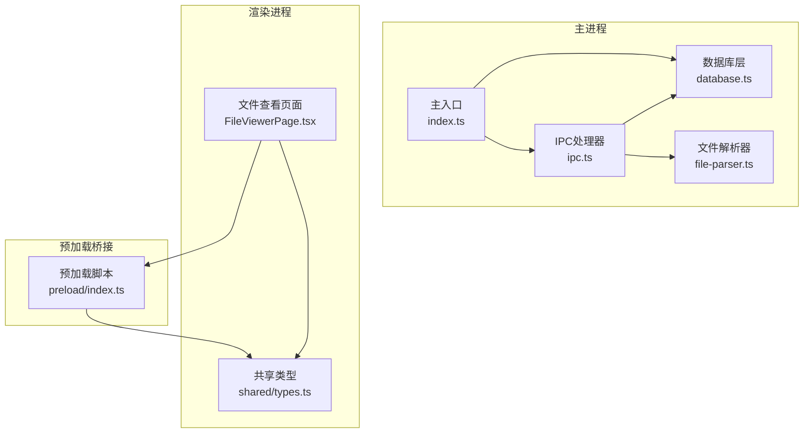
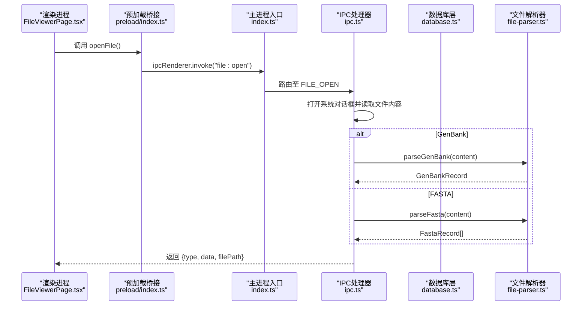
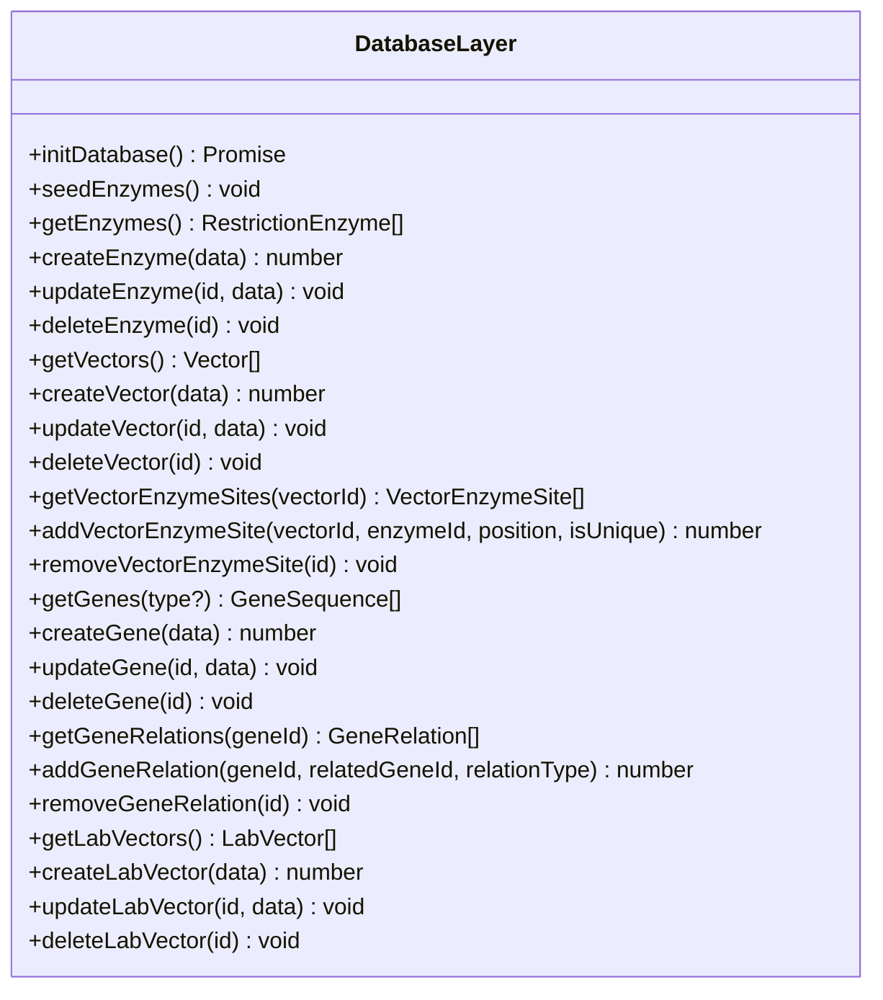
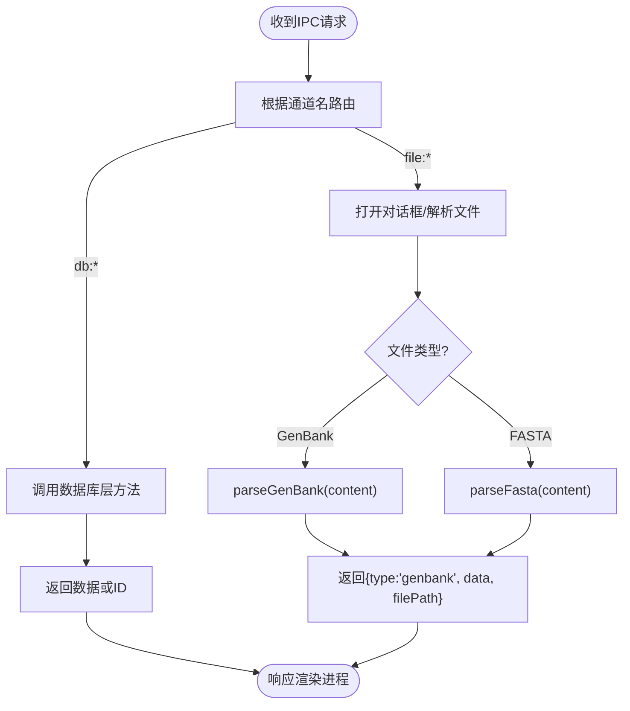
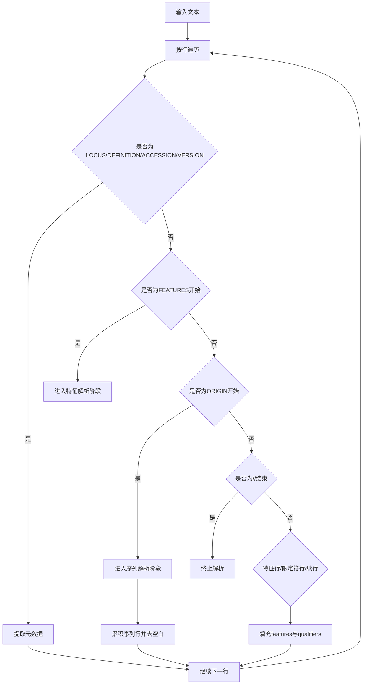
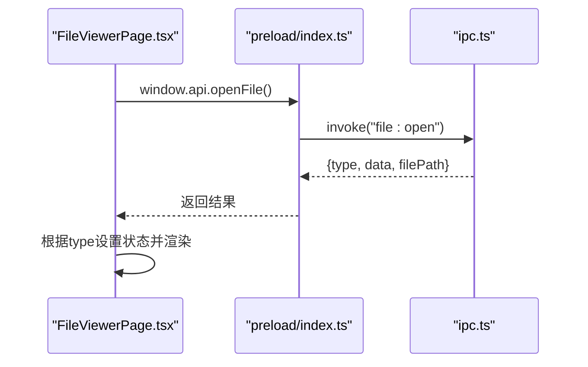
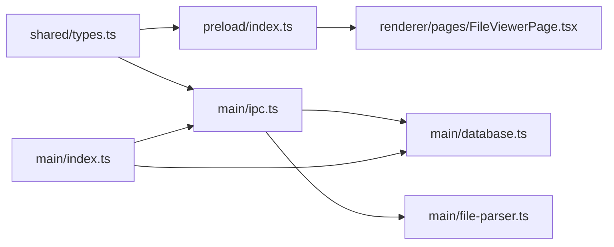

# 核心模块

<cite>
**本文引用的文件**
- [src/main/index.ts](file://src/main/index.ts)
- [src/main/database.ts](file://src/main/database.ts)
- [src/main/ipc.ts](file://src/main/ipc.ts)
- [src/main/file-parser.ts](file://src/main/file-parser.ts)
- [src/shared/types.ts](file://src/shared/types.ts)
- [preload/index.ts](file://preload/index.ts)
- [src/renderer/pages/FileViewerPage.tsx](file://src/renderer/pages/FileViewerPage.tsx)
- [package.json](file://package.json)
</cite>

## 目录
1. [简介](#简介)
2. [项目结构](#项目结构)
3. [核心组件](#核心组件)
4. [架构总览](#架构总览)
5. [详细组件分析](#详细组件分析)
6. [依赖关系分析](#依赖关系分析)
7. [性能考虑](#性能考虑)
8. [故障排除指南](#故障排除指南)
9. [结论](#结论)
10. [附录：使用示例与扩展点](#附录使用示例与扩展点)

## 简介
本技术文档聚焦于基因工程辅助软件的核心模块，覆盖数据库管理层（SQLite、表结构与CRUD封装）、IPC通信层（通道定义、消息处理与错误处理策略）、文件解析器（GenBank与FASTA格式）以及各模块间的依赖与协作模式。文档同时提供可视化图示、具体使用模式、扩展点说明、性能优化建议与故障排除指南，帮助读者快速理解并高效扩展系统。

## 项目结构
本项目采用Electron多进程架构：主进程负责数据持久化、文件系统访问与业务逻辑；渲染进程通过预加载脚本暴露安全API进行交互；共享类型定义贯穿前后端。

图表来源
- [src/main/index.ts:1-59](file://src/main/index.ts#L1-L59)
- [src/main/database.ts:1-439](file://src/main/database.ts#L1-L439)
- [src/main/ipc.ts:1-145](file://src/main/ipc.ts#L1-L145)
- [src/main/file-parser.ts:1-243](file://src/main/file-parser.ts#L1-L243)
- [preload/index.ts:1-46](file://preload/index.ts#L1-L46)
- [src/shared/types.ts:1-132](file://src/shared/types.ts#L1-L132)
- [src/renderer/pages/FileViewerPage.tsx:1-152](file://src/renderer/pages/FileViewerPage.tsx#L1-L152)

章节来源
- [src/main/index.ts:1-59](file://src/main/index.ts#L1-L59)
- [package.json:1-37](file://package.json#L1-L37)

## 核心组件
- 数据库管理层：基于sql.js的SQLite实现，负责初始化、WAL模式、外键约束、表结构创建、索引优化及CRUD操作封装。
- IPC通信层：集中注册所有主/渲染进程间通道，统一路由到数据库或文件解析器，屏蔽底层细节。
- 文件解析器：支持GenBank与FASTA格式的文本解析，输出结构化记录供前端展示与后续分析。
- 共享类型：统一定义数据结构与IPC通道常量，确保前后端一致。
- 预加载桥接：将主进程能力以Promise风格API暴露给渲染进程，保证安全隔离。

章节来源
- [src/main/database.ts:1-439](file://src/main/database.ts#L1-L439)
- [src/main/ipc.ts:1-145](file://src/main/ipc.ts#L1-L145)
- [src/main/file-parser.ts:1-243](file://src/main/file-parser.ts#L1-L243)
- [src/shared/types.ts:1-132](file://src/shared/types.ts#L1-L132)
- [preload/index.ts:1-46](file://preload/index.ts#L1-L46)

## 架构总览
下图展示了从渲染进程发起请求到主进程执行业务逻辑并返回结果的完整调用链。

图表来源
- [src/renderer/pages/FileViewerPage.tsx:1-152](file://src/renderer/pages/FileViewerPage.tsx#L1-L152)
- [preload/index.ts:1-46](file://preload/index.ts#L1-L46)
- [src/main/index.ts:1-59](file://src/main/index.ts#L1-L59)
- [src/main/ipc.ts:1-145](file://src/main/ipc.ts#L1-L145)
- [src/main/file-parser.ts:1-243](file://src/main/file-parser.ts#L1-L243)

## 详细组件分析

### 数据库管理层（SQLite + sql.js）
- 初始化流程
  - 加载sql.js的WASM二进制，创建内存数据库实例。
  - 根据应用用户数据目录生成持久化路径，若存在则从磁盘恢复，否则新建。
  - 启用WAL日志模式与外键约束，随后执行建表与索引。
- 表结构设计
  - restriction_enzymes：限制性内切酶信息，含名称、来源、识别序列、切割位点、最适温度、是否回文等字段，并对name与recognition_sequence建立索引。
  - vectors：载体基础信息，包含类型枚举校验、大小、描述、序列与骨架引用。
  - vector_enzyme_sites：载体上的酶切位点，关联载体与酶，支持唯一性标记。
  - gene_sequences：基因序列，支持mRNA/cDNA/genomic/protein类型，含物种、登录号与描述。
  - gene_relations：基因间关系，双向查询时通过UNION合并结果。
  - lab_vectors：实验室载体库，可关联载体、插入基因与空载体，记录创建时间。
- CRUD封装
  - 通用查询函数queryAll/queryOne/run/lastInsertId简化SQL执行与结果收集。
  - 每个实体提供列表、获取、搜索、创建、更新、删除方法，更新采用动态字段拼接避免无变更写入。
  - 种子数据：首次启动时批量插入常用限制酶，避免重复插入。
- 事务与一致性
  - 当前未显式使用事务，但WAL模式提升并发读性能；外键约束保障引用完整性。
- 错误处理
  - 未捕获异常直接上抛；建议在IPC层增加try/catch包装，返回标准化错误对象。

图表来源
- [src/main/database.ts:1-439](file://src/main/database.ts#L1-L439)

章节来源
- [src/main/database.ts:1-439](file://src/main/database.ts#L1-L439)

### IPC通信层（通道定义与消息处理）
- 通道定义
  - 在共享类型中集中声明所有通道名，涵盖酶、载体、基因、实验室载体与文件操作。
- 处理器注册
  - 主进程集中注册所有handle，按通道名路由到数据库或文件解析器。
  - 文件打开流程：弹出系统对话框，读取文件内容，依据扩展名选择解析器，返回统一结构。
- 错误处理策略
  - 当前未对异常进行捕获与转换；建议为每个handle包裹try/catch，返回{error: true, message}结构，便于渲染层提示。
- 安全性
  - 通过contextBridge仅暴露必要API，避免直接访问Node API。

图表来源
- [src/main/ipc.ts:1-145](file://src/main/ipc.ts#L1-L145)
- [src/shared/types.ts:93-132](file://src/shared/types.ts#L93-L132)

章节来源
- [src/main/ipc.ts:1-145](file://src/main/ipc.ts#L1-L145)
- [src/shared/types.ts:93-132](file://src/shared/types.ts#L93-L132)

### 文件解析器（GenBank与FASTA）
- GenBank解析
  - 逐行扫描，识别LOCUS/DEFINITION/ACCESSION/VERSION/FEATURES/ORIGIN/结束符//等关键段。
  - 解析特征行与限定符，支持join/complement位置表达式，提取start/end/strand。
  - 聚合序列行，去除空白并小写化，计算size。
- FASTA解析
  - 以“>”开头的头行作为记录分隔，拆分id与description，累积后续序列行。
- 复杂度与健壮性
  - 线性扫描O(n)，正则匹配用于定位关键结构；对缺失字段提供默认值。
  - 可扩展支持更多限定符与复杂位置语法。

图表来源
- [src/main/file-parser.ts:1-243](file://src/main/file-parser.ts#L1-L243)

章节来源
- [src/main/file-parser.ts:1-243](file://src/main/file-parser.ts#L1-L243)

### 预加载桥接与渲染进程集成
- 预加载脚本
  - 将主进程能力以Promise风格的API暴露给渲染进程，包括数据库CRUD与文件操作。
- 渲染进程使用
  - 文件查看页面通过window.api.openFile触发主进程对话框与解析流程，并根据返回类型切换视图。
  - 其他页面可通过相同方式调用数据库接口。

图表来源
- [preload/index.ts:1-46](file://preload/index.ts#L1-L46)
- [src/renderer/pages/FileViewerPage.tsx:1-152](file://src/renderer/pages/FileViewerPage.tsx#L1-L152)
- [src/main/ipc.ts:1-145](file://src/main/ipc.ts#L1-L145)

章节来源
- [preload/index.ts:1-46](file://preload/index.ts#L1-L46)
- [src/renderer/pages/FileViewerPage.tsx:1-152](file://src/renderer/pages/FileViewerPage.tsx#L1-L152)

## 依赖关系分析
- 模块耦合
  - 主入口依赖数据库与IPC注册；IPC依赖数据库与文件解析器；预加载依赖共享类型；渲染页面依赖预加载API与共享类型。
- 外部依赖
  - sql.js提供SQLite的WASM实现；electron提供进程通信与文件系统访问；react生态用于渲染层。
- 潜在循环依赖
  - 当前未发现循环导入；IPC与数据库单向依赖，类型定义被多处引用但不反向依赖。

图表来源
- [src/shared/types.ts:1-132](file://src/shared/types.ts#L1-L132)
- [preload/index.ts:1-46](file://preload/index.ts#L1-L46)
- [src/main/ipc.ts:1-145](file://src/main/ipc.ts#L1-L145)
- [src/main/database.ts:1-439](file://src/main/database.ts#L1-L439)
- [src/main/file-parser.ts:1-243](file://src/main/file-parser.ts#L1-L243)
- [src/main/index.ts:1-59](file://src/main/index.ts#L1-L59)
- [src/renderer/pages/FileViewerPage.tsx:1-152](file://src/renderer/pages/FileViewerPage.tsx#L1-L152)

章节来源
- [package.json:1-37](file://package.json#L1-L37)

## 性能考虑
- 数据库层面
  - 已启用WAL模式提升并发读性能；外键约束保障一致性。
  - 针对高频查询字段建立索引（如酶名称、识别序列、载体名称、基因名称与类型）。
  - 建议对大序列字段进行分页或懒加载，避免一次性传输大量数据。
- 解析器层面
  - 解析算法为线性扫描，适合常规文件大小；超大文件可考虑流式解析与分块处理。
- IPC层面
  - 减少不必要的往返调用，可在IPC层聚合多个查询以减少网络开销。
- 渲染层
  - 列表与详情分离，按需加载；对长序列显示进行虚拟滚动或分段渲染。

[本节为通用指导，不直接分析具体文件]

## 故障排除指南
- 常见问题
  - 数据库未初始化：确认应用启动顺序是否正确执行了数据库初始化与种子数据。
  - 通道未注册：检查IPC通道名是否与共享类型一致，且主进程已注册对应处理器。
  - 文件无法解析：确认文件格式与扩展名匹配，必要时扩展解析器支持更多变体。
- 调试建议
  - 在主进程IPC处理器中添加日志输出，记录请求参数与返回值。
  - 在渲染层捕获Promise拒绝，打印错误堆栈以便定位问题。
- 错误处理改进
  - 为每个IPC处理器添加try/catch，返回统一错误结构，并在渲染层展示友好提示。

章节来源
- [src/main/ipc.ts:1-145](file://src/main/ipc.ts#L1-L145)
- [src/main/index.ts:1-59](file://src/main/index.ts#L1-L59)

## 结论
本项目的核心模块围绕数据库、IPC与文件解析三大支柱构建，结构清晰、职责明确。通过统一的类型定义与安全桥接，实现了前后端一致的交互体验。建议在现有基础上增强错误处理与性能优化，逐步引入事务与流式解析，进一步提升系统的稳定性与可扩展性。

[本节为总结性内容，不直接分析具体文件]

## 附录：使用示例与扩展点

### 使用示例（代码片段路径）
- 打开文件并解析
  - 渲染侧调用：[src/renderer/pages/FileViewerPage.tsx:13-45](file://src/renderer/pages/FileViewerPage.tsx#L13-L45)
  - 预加载API：[preload/index.ts:38-40](file://preload/index.ts#L38-L40)
  - 主进程处理：[src/main/ipc.ts:110-135](file://src/main/ipc.ts#L110-L135)
  - 解析器实现：[src/main/file-parser.ts:6-130](file://src/main/file-parser.ts#L6-L130), [src/main/file-parser.ts:199-242](file://src/main/file-parser.ts#L199-L242)
- 数据库CRUD
  - 获取酶列表：[src/main/ipc.ts:10-12](file://src/main/ipc.ts#L10-L12) → [src/main/database.ts:141-143](file://src/main/database.ts#L141-L143)
  - 创建载体：[src/main/ipc.ts:43-45](file://src/main/ipc.ts#L43-L45) → [src/main/database.ts:192-198](file://src/main/database.ts#L192-L198)
  - 查询基因关系：[src/main/ipc.ts:84-86](file://src/main/ipc.ts#L84-L86) → [src/main/database.ts:293-305](file://src/main/database.ts#L293-L305)

### 扩展点与自定义选项
- 新增实体与通道
  - 在共享类型中定义新接口与通道名，在IPC中注册处理器，在数据库层实现CRUD。
- 解析器扩展
  - 在IPC的文件解析通道中增加新的解析分支，实现新的格式解析函数。
- 错误处理策略
  - 在IPC处理器中统一捕获异常，返回标准错误对象；在渲染层集中处理错误提示。
- 性能优化
  - 引入事务批量写入；对大文件采用流式解析；对频繁查询字段增加复合索引。

章节来源
- [src/shared/types.ts:1-132](file://src/shared/types.ts#L1-L132)
- [src/main/ipc.ts:1-145](file://src/main/ipc.ts#L1-L145)
- [src/main/database.ts:1-439](file://src/main/database.ts#L1-L439)
- [src/main/file-parser.ts:1-243](file://src/main/file-parser.ts#L1-L243)
- [preload/index.ts:1-46](file://preload/index.ts#L1-L46)
- [src/renderer/pages/FileViewerPage.tsx:1-152](file://src/renderer/pages/FileViewerPage.tsx#L1-L152)