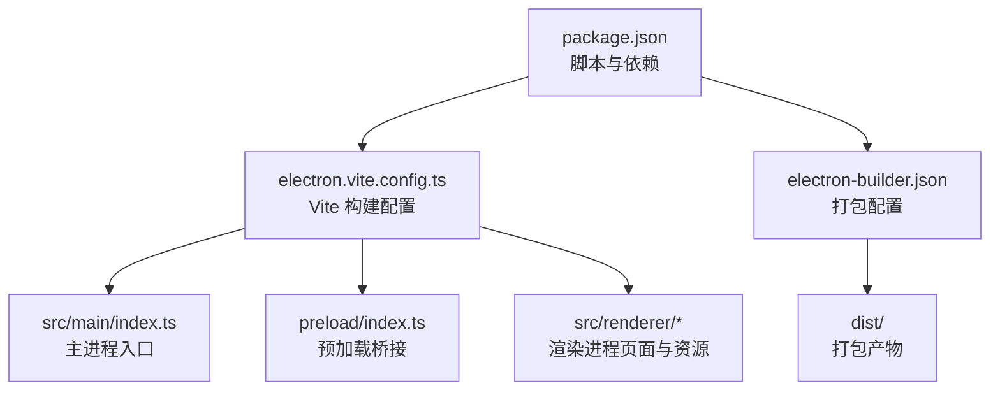
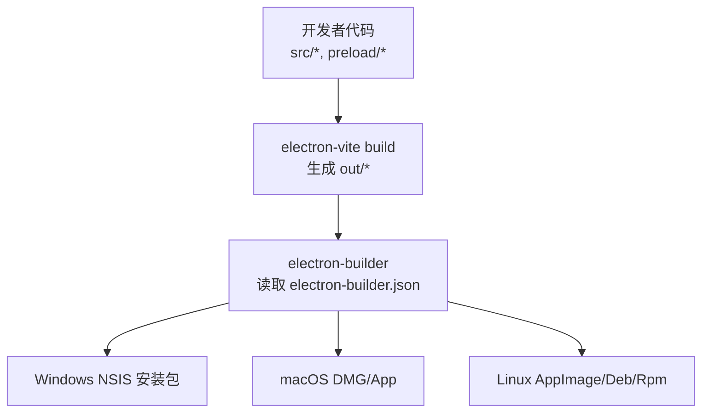
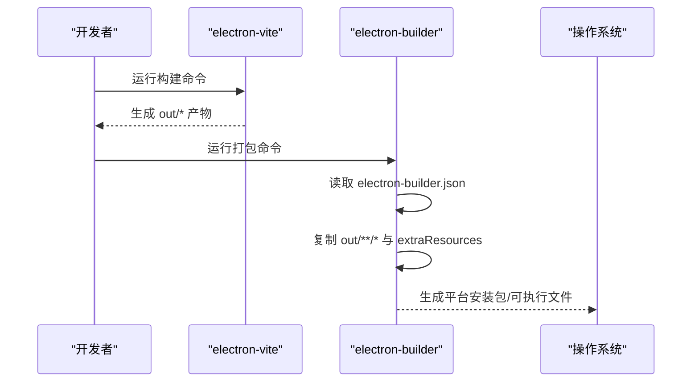
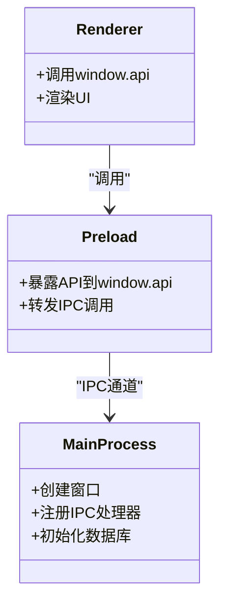
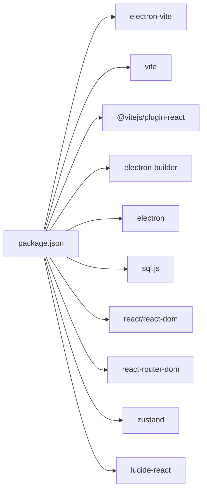

# 部署发布

<cite>
**本文引用的文件**
- [package.json](file://gene-engineering-tool/package.json)
- [electron-builder.json](file://gene-engineering-tool/electron-builder.json)
- [electron.vite.config.ts](file://gene-engineering-tool/electron.vite.config.ts)
- [src/main/index.ts](file://gene-engineering-tool/src/main/index.ts)
- [preload/index.ts](file://gene-engineering-tool/preload/index.ts)
</cite>

## 目录
1. [简介](#简介)
2. [项目结构](#项目结构)
3. [核心组件](#核心组件)
4. [架构总览](#架构总览)
5. [详细组件分析](#详细组件分析)
6. [依赖分析](#依赖分析)
7. [性能考虑](#性能考虑)
8. [故障排除指南](#故障排除指南)
9. [结论](#结论)
10. [附录](#附录)

## 简介
本文件面向“基因工程辅助软件”的跨平台桌面应用（基于 Electron + Vite）的构建、打包与发布。内容覆盖：
- 跨平台构建配置（Windows、macOS、Linux）
- electron-builder 的配置项与打包流程
- 签名与证书配置说明
- 自动化构建脚本使用方式
- 应用分发渠道与更新机制建议
- CI/CD 集成示例
- 生产环境部署最佳实践与性能调优
- 故障排除与日志分析指南

## 项目结构
本项目采用 Electron-Vite 多入口构建，主进程、预加载脚本与渲染进程分别独立编译，并通过 IPC 通信。打包产物输出到 dist 目录，由 electron-builder 生成各平台安装包或可执行文件。

图示来源
- [package.json:1-37](file://gene-engineering-tool/package.json#L1-L37)
- [electron.vite.config.ts:1-52](file://gene-engineering-tool/electron.vite.config.ts#L1-L52)
- [electron-builder.json:1-22](file://gene-engineering-tool/electron-builder.json#L1-L22)

章节来源
- [package.json:1-37](file://gene-engineering-tool/package.json#L1-L37)
- [electron.vite.config.ts:1-52](file://gene-engineering-tool/electron.vite.config.ts#L1-L52)
- [electron-builder.json:1-22](file://gene-engineering-tool/electron-builder.json#L1-L22)

## 核心组件
- 构建工具链
  - electron-vite：负责主进程、预加载与渲染进程的构建与热重载。
  - Vite + React：渲染端构建与开发体验。
- 打包工具
  - electron-builder：将构建产物打包为各平台安装包/可执行文件。
- 运行时
  - Electron：提供原生能力与窗口管理。
  - sql.js：嵌入式数据库用于本地数据持久化。

章节来源
- [package.json:1-37](file://gene-engineering-tool/package.json#L1-L37)
- [electron.vite.config.ts:1-52](file://gene-engineering-tool/electron.vite.config.ts#L1-L52)
- [electron-builder.json:1-22](file://gene-engineering-tool/electron-builder.json#L1-L22)

## 架构总览
下图展示了从源码到最终产物的关键路径：Vite 构建产物进入 electron-builder，后者根据平台目标生成安装包或可执行文件。

图示来源
- [electron.vite.config.ts:1-52](file://gene-engineering-tool/electron.vite.config.ts#L1-L52)
- [electron-builder.json:1-22](file://gene-engineering-tool/electron-builder.json#L1-L22)

## 详细组件分析

### 构建与打包流程
- 构建阶段（electron-vite）
  - 主进程入口：src/main/index.ts
  - 预加载脚本：preload/index.ts
  - 渲染入口：src/renderer/index.html
  - 构建输出目录：out（由 electron-vite 默认约定）
- 打包阶段（electron-builder）
  - 输入：out/**/*（仅包含构建产物）
  - 额外资源：data 目录映射到应用包内 data
  - 输出目录：dist
  - Windows 目标：nsis（安装包）

图示来源
- [electron.vite.config.ts:1-52](file://gene-engineering-tool/electron.vite.config.ts#L1-L52)
- [electron-builder.json:1-22](file://gene-engineering-tool/electron-builder.json#L1-L22)

章节来源
- [electron.vite.config.ts:1-52](file://gene-engineering-tool/electron.vite.config.ts#L1-L52)
- [electron-builder.json:1-22](file://gene-engineering-tool/electron-builder.json#L1-L22)

### 主进程与预加载桥接
- 主进程负责窗口创建、生命周期管理与初始化工作。
- 预加载通过 contextBridge 暴露受限 API，供渲染进程安全调用。
- 渲染进程通过 window.api 访问后端能力。

图示来源
- [src/main/index.ts:1-59](file://gene-engineering-tool/src/main/index.ts#L1-L59)
- [preload/index.ts:1-46](file://gene-engineering-tool/preload/index.ts#L1-L46)

章节来源
- [src/main/index.ts:1-59](file://gene-engineering-tool/src/main/index.ts#L1-L59)
- [preload/index.ts:1-46](file://gene-engineering-tool/preload/index.ts#L1-L46)

### 跨平台构建配置要点
- Windows
  - 目标格式：NSIS 安装包
  - 需要安装 Windows 签名证书以进行代码签名（可选但推荐）
- macOS
  - 目标格式：DMG / App
  - 需要 Apple Developer ID 证书与签名配置
- Linux
  - 目标格式：AppImage / Deb / Rpm（按需启用）
  - 通常无需签名，但可配置 GPG 签名增强可信度

章节来源
- [electron-builder.json:1-22](file://gene-engineering-tool/electron-builder.json#L1-L22)

### 签名与证书配置
- Windows 代码签名
  - 使用企业或第三方 CA 颁发的代码签名证书（PFX/P12）
  - 在打包时传入证书路径与密码参数
- macOS 应用签名与公证
  - 使用 Apple Developer ID Application 证书
  - 对 App 进行签名并上传至 Apple Notary Service 完成公证
- Linux 包签名
  - 可使用 GPG 对包进行签名（如 deb/rpm），提升可信度

注意：具体命令行参数与环境变量名请参考所用 CI 平台的密钥管理方式，确保在生产环境中安全注入。

[本节为通用指导，不直接分析具体文件]

### 自动化构建脚本
- 本地开发
  - 启动开发服务器：使用构建脚本中的开发命令
  - 预览构建产物：使用预览命令
- 本地构建与打包
  - 先执行构建命令生成 out/*
  - 再执行打包命令生成 dist 下的平台产物
- 批量构建多平台
  - 可在同一台机器上切换目标平台后依次打包
  - 或使用 CI 矩阵并行构建不同平台

章节来源
- [package.json:1-37](file://gene-engineering-tool/package.json#L1-L37)

### 应用分发渠道与更新机制
- 分发渠道
  - Windows：NSIS 安装包可通过网站下载、企业内部分发系统或软件商店
  - macOS：DMG 或 App Store（需遵循苹果审核要求）
  - Linux：AppImage 便于免安装分发；deb/rpm 适合包管理器生态
- 自动更新机制
  - 常见方案：Squirrel.Windows（Windows）、Sparkle（macOS）、通用 HTTP 服务端 + 自定义更新逻辑
  - 建议在主进程中实现版本检查与增量更新流程，并在 UI 中提示用户

[本节为通用指导，不直接分析具体文件]

### CI/CD 集成配置示例
- GitHub Actions（概念性示例）
  - 设置 Node.js 环境
  - 缓存 node_modules 加速构建
  - 在矩阵中并行构建 Windows、macOS、Linux
  - 上传构建产物作为工件
  - 可选：触发发布标签时创建 Release 并上传安装包
- GitLab CI（概念性示例）
  - 类似步骤，利用 artifacts 保存产物
  - 结合变量存储签名证书与密钥

[本节为通用指导，不直接分析具体文件]

## 依赖分析
- 构建期依赖
  - electron-vite：多入口构建
  - vite、@vitejs/plugin-react：前端构建与插件
  - electron-builder：打包与平台适配
- 运行期依赖
  - electron：运行时框架
  - sql.js：嵌入式数据库
  - react/react-dom：渲染层
  - zustand、react-router-dom、lucide-react：状态管理与路由、图标库

图示来源
- [package.json:1-37](file://gene-engineering-tool/package.json#L1-L37)

章节来源
- [package.json:1-37](file://gene-engineering-tool/package.json#L1-L37)

## 性能考虑
- 构建优化
  - 使用外部化依赖（externalizeDepsPlugin）减少主进程体积
  - 合理配置别名与入口，避免冗余资源打包
- 运行时优化
  - 启用沙箱与上下文隔离，关闭不必要的 Node 集成
  - 使用 WAL 模式与索引优化数据库读写性能
- 打包优化
  - 仅打包必要文件（out/**/*），排除无关模块
  - 压缩与资源裁剪（按需开启）

章节来源
- [electron.vite.config.ts:1-52](file://gene-engineering-tool/electron.vite.config.ts#L1-L52)
- [src/main/index.ts:1-59](file://gene-engineering-tool/src/main/index.ts#L1-L59)

## 故障排除指南
- 常见问题
  - 构建失败：检查 Node 版本与依赖是否匹配
  - 打包失败：确认平台依赖与签名证书可用
  - 运行异常：验证预加载脚本是否正确暴露 API
- 定位方法
  - 查看控制台日志与错误堆栈
  - 在主进程增加关键路径日志，定位初始化与 IPC 调用问题
  - 使用 electron-builder 的 verbose 模式获取更详细的构建日志
- 恢复策略
  - 清理缓存与 node_modules 后重试
  - 分步执行构建与打包，逐步缩小问题范围

[本节为通用指导，不直接分析具体文件]

## 结论
本项目已具备清晰的构建与打包基础：electron-vite 负责多入口构建，electron-builder 负责跨平台打包。当前配置聚焦于 Windows NSIS 目标，可按需扩展 macOS 与 Linux 目标。建议在生产环境完善签名与公证流程，并结合 CI/CD 实现自动化构建与发布。同时，持续优化构建与运行性能，建立完善的日志与排障体系，以提升交付质量与用户体验。

[本节为总结性内容，不直接分析具体文件]

## 附录
- 常用命令参考
  - 开发：npm run dev
  - 构建：npm run build
  - 预览：npm run preview
- 打包产物位置
  - 构建产物：out
  - 打包产物：dist

章节来源
- [package.json:1-37](file://gene-engineering-tool/package.json#L1-L37)