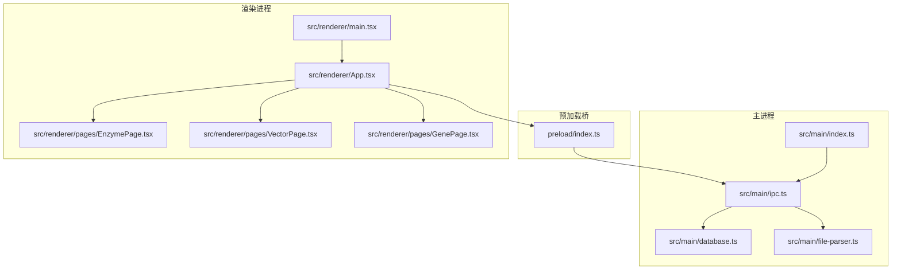
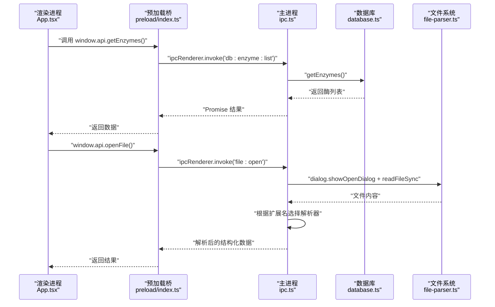
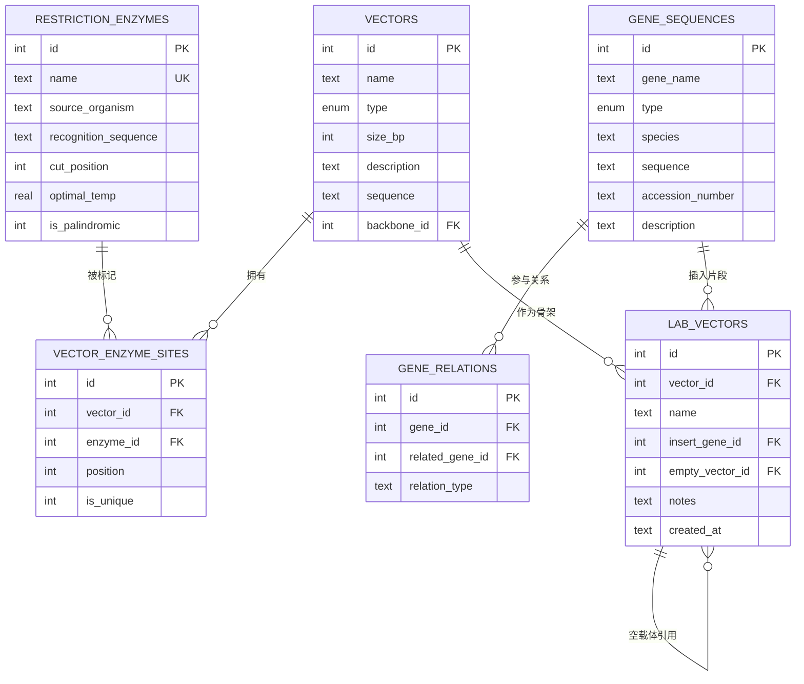
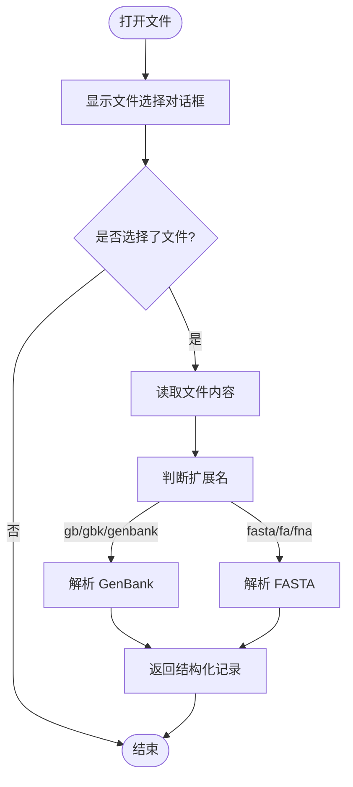
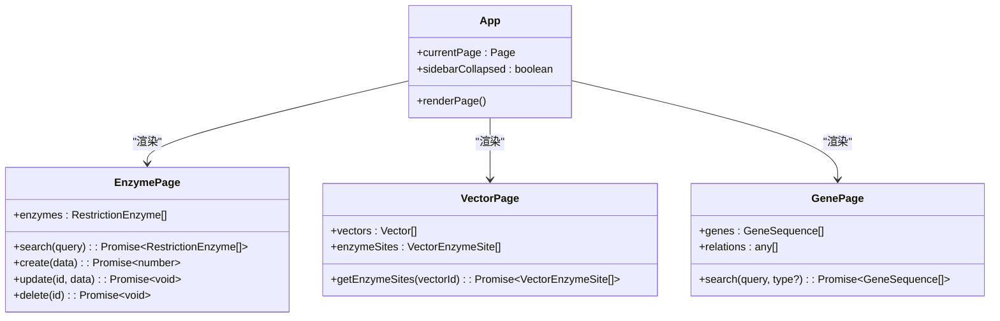
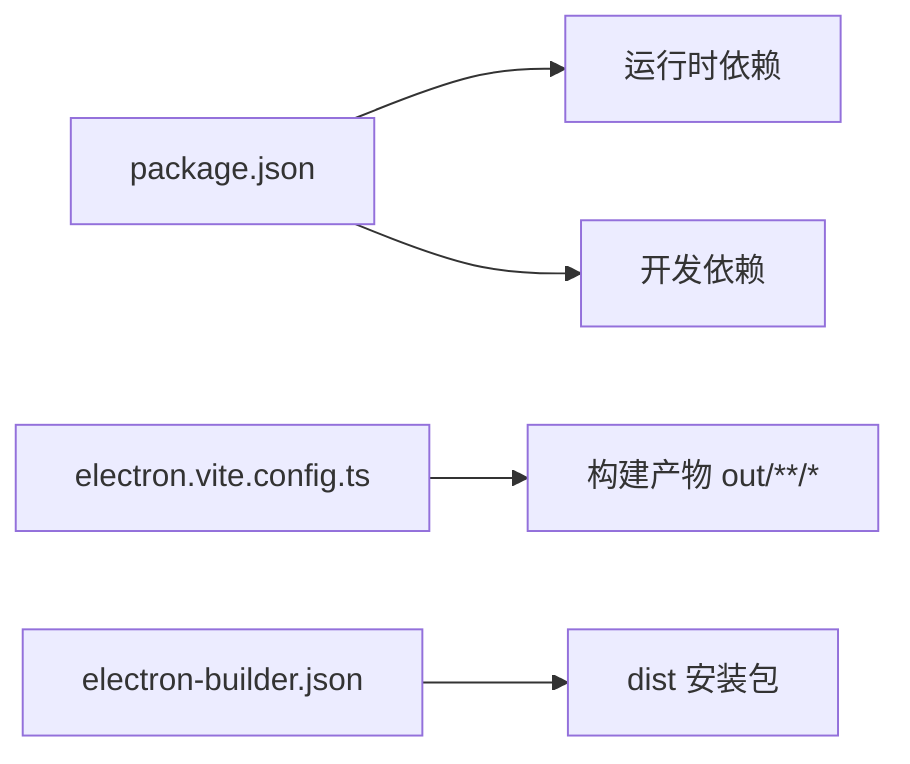

# 项目概述

<cite>
**本文引用的文件**   
- [package.json](file://gene-engineering-tool/package.json)
- [electron.vite.config.ts](file://gene-engineering-tool/electron.vite.config.ts)
- [src/main/index.ts](file://gene-engineering-tool/src/main/index.ts)
- [preload/index.ts](file://gene-engineering-tool/preload/index.ts)
- [src/shared/types.ts](file://gene-engineering-tool/src/shared/types.ts)
- [src/main/database.ts](file://gene-engineering-tool/src/main/database.ts)
- [src/main/ipc.ts](file://gene-engineering-tool/src/main/ipc.ts)
- [src/main/file-parser.ts](file://gene-engineering-tool/src/main/file-parser.ts)
- [src/renderer/main.tsx](file://gene-engineering-tool/src/renderer/main.tsx)
- [src/renderer/App.tsx](file://gene-engineering-tool/src/renderer/App.tsx)
- [src/renderer/pages/EnzymePage.tsx](file://gene-engineering-tool/src/renderer/pages/EnzymePage.tsx)
- [src/renderer/pages/VectorPage.tsx](file://gene-engineering-tool/src/renderer/pages/VectorPage.tsx)
- [src/renderer/pages/GenePage.tsx](file://gene-engineering-tool/src/renderer/pages/GenePage.tsx)
- [electron-builder.json](file://gene-engineering-tool/electron-builder.json)
</cite>

## 目录
1. [简介](#简介)
2. [项目结构](#项目结构)
3. [核心组件](#核心组件)
4. [架构总览](#架构总览)
5. [详细组件分析](#详细组件分析)
6. [依赖关系分析](#依赖关系分析)
7. [性能与可扩展性](#性能与可扩展性)
8. [快速开始](#快速开始)
9. [故障排查](#故障排查)
10. [结论](#结论)

## 简介
本项目是一款面向分子生物学与合成生物学的“基因工程辅助软件”，提供内切酶库、载体数据库、基因序列管理、实验室载体记录以及 GenBank/FASTA 文件解析等能力。应用基于 Electron + React + TypeScript 构建，采用主进程与渲染进程分离模式，使用 SQL.js 在本地持久化数据，并通过 IPC 通道实现前后端安全通信。目标用户包括科研工作者、实验技术人员与生物工程学生，核心价值在于将常用工具整合到桌面应用中，提升实验设计与数据管理的效率与可重复性。

## 项目结构
仓库采用按职责分层与功能域结合的目录组织方式：
- main：Electron 主进程逻辑（窗口、IPC、数据库、文件解析）
- preload：安全桥接层，暴露受限 API 给渲染进程
- renderer：React 渲染进程（页面、组件、样式）
- shared：跨进程共享类型定义
- 构建配置：electron-vite、Tailwind、PostCSS、electron-builder

图表来源
- [src/main/index.ts:1-59](file://gene-engineering-tool/src/main/index.ts#L1-L59)
- [src/main/ipc.ts:1-145](file://gene-engineering-tool/src/main/ipc.ts#L1-L145)
- [src/main/database.ts:1-439](file://gene-engineering-tool/src/main/database.ts#L1-L439)
- [src/main/file-parser.ts:1-243](file://gene-engineering-tool/src/main/file-parser.ts#L1-L243)
- [preload/index.ts:1-46](file://gene-engineering-tool/preload/index.ts#L1-L46)
- [src/renderer/main.tsx:1-11](file://gene-engineering-tool/src/renderer/main.tsx#L1-L11)
- [src/renderer/App.tsx:1-106](file://gene-engineering-tool/src/renderer/App.tsx#L1-L106)
- [src/renderer/pages/EnzymePage.tsx:1-252](file://gene-engineering-tool/src/renderer/pages/EnzymePage.tsx#L1-L252)
- [src/renderer/pages/VectorPage.tsx:1-191](file://gene-engineering-tool/src/renderer/pages/VectorPage.tsx#L1-L191)
- [src/renderer/pages/GenePage.tsx:1-219](file://gene-engineering-tool/src/renderer/pages/GenePage.tsx#L1-L219)

章节来源
- [package.json:1-37](file://gene-engineering-tool/package.json#L1-L37)
- [electron.vite.config.ts:1-52](file://gene-engineering-tool/electron.vite.config.ts#L1-L52)

## 核心组件
- 主进程入口与窗口管理：负责初始化数据库、注入种子数据、注册 IPC 处理器并创建浏览器窗口。
- 预加载桥：通过 contextBridge 暴露受控 API，避免直接访问 Node/Electron 原生模块。
- 数据持久层：基于 SQL.js 的 SQLite 内存数据库，支持 WAL 模式与外键约束，自动持久化到用户目录。
- IPC 路由：集中处理来自渲染进程的请求，转发至数据库或文件解析器。
- 文件解析器：解析 GenBank 与 FASTA 格式，提取元数据、特征区域与序列。
- 渲染界面：基于 React 的多页面应用，包含内切酶库、载体数据库、基因序列库、实验室载体与文件查看器。

章节来源
- [src/main/index.ts:41-52](file://gene-engineering-tool/src/main/index.ts#L41-L52)
- [preload/index.ts:4-43](file://gene-engineering-tool/preload/index.ts#L4-L43)
- [src/main/database.ts:49-65](file://gene-engineering-tool/src/main/database.ts#L49-L65)
- [src/main/ipc.ts:8-144](file://gene-engineering-tool/src/main/ipc.ts#L8-L144)
- [src/main/file-parser.ts:6-130](file://gene-engineering-tool/src/main/file-parser.ts#L6-L130)
- [src/renderer/App.tsx:19-32](file://gene-engineering-tool/src/renderer/App.tsx#L19-L32)

## 架构总览
应用遵循 Electron 标准的主/渲染进程分离架构：
- 主进程：系统资源、文件系统、数据库、IPC 路由
- 预加载：最小权限 API 暴露
- 渲染进程：UI 交互、状态管理、调用 window.api

图表来源
- [src/renderer/App.tsx:75-86](file://gene-engineering-tool/src/renderer/App.tsx#L75-L86)
- [preload/index.ts:38-40](file://gene-engineering-tool/preload/index.ts#L38-L40)
- [src/main/ipc.ts:110-135](file://gene-engineering-tool/src/main/ipc.ts#L110-L135)
- [src/main/database.ts:141-143](file://gene-engineering-tool/src/main/database.ts#L141-L143)

## 详细组件分析

### 主进程与窗口生命周期
- 启动时初始化数据库并写入种子数据，随后注册 IPC 处理器，最后创建主窗口。
- 开发模式下优先加载远程渲染地址，生产环境加载打包后的 index.html。
- 外部链接统一由 shell.openExternal 打开，防止新窗口滥用。

章节来源
- [src/main/index.ts:41-52](file://gene-engineering-tool/src/main/index.ts#L41-L52)
- [src/main/index.ts:34-38](file://gene-engineering-tool/src/main/index.ts#L34-L38)
- [src/main/index.ts:29-32](file://gene-engineering-tool/src/main/index.ts#L29-L32)

### 预加载桥与安全边界
- 仅暴露必要的函数，如 getEnzymes、openFile、parseGenBank 等，避免直接暴露 ipcRenderer。
- 所有方法均通过 IPC_CHANNELS 常量进行通道命名，确保一致性。

章节来源
- [preload/index.ts:4-43](file://gene-engineering-tool/preload/index.ts#L4-L43)
- [src/shared/types.ts:94-131](file://gene-engineering-tool/src/shared/types.ts#L94-L131)

### 数据模型与持久化
- 表结构覆盖内切酶、载体、载体酶切位点、基因序列、基因关系、实验室载体。
- 启用 WAL 日志模式与外键约束，保证并发读写与数据完整性。
- 每次写操作后导出数据库快照到用户目录下的 .db 文件。
- 首次运行自动填充常用内切酶种子数据。

图表来源
- [src/main/database.ts:67-137](file://gene-engineering-tool/src/main/database.ts#L67-L137)
- [src/shared/types.ts:1-92](file://gene-engineering-tool/src/shared/types.ts#L1-L92)

章节来源
- [src/main/database.ts:49-65](file://gene-engineering-tool/src/main/database.ts#L49-L65)
- [src/main/database.ts:139-180](file://gene-engineering-tool/src/main/database.ts#L139-L180)
- [src/main/database.ts:182-238](file://gene-engineering-tool/src/main/database.ts#L182-L238)
- [src/main/database.ts:240-317](file://gene-engineering-tool/src/main/database.ts#L240-L317)
- [src/main/database.ts:319-370](file://gene-engineering-tool/src/main/database.ts#L319-L370)
- [src/main/database.ts:374-438](file://gene-engineering-tool/src/main/database.ts#L374-L438)

### IPC 路由与文件解析
- IPC 路由集中注册，按领域划分通道前缀（db:*、file:*），便于维护与扩展。
- 文件打开流程：渲染进程触发 -> 主进程弹出对话框 -> 读取文件 -> 根据扩展名选择解析器 -> 返回结构化数据。
- GenBank 解析器支持 LOCUS/DEFINITION/ACCESSION/VERSION/FEATURES/ORIGIN 等关键段，提取位置、链方向与限定符；FASTA 解析器支持多记录合并行序列。

图表来源
- [src/main/ipc.ts:110-135](file://gene-engineering-tool/src/main/ipc.ts#L110-L135)
- [src/main/file-parser.ts:6-130](file://gene-engineering-tool/src/main/file-parser.ts#L6-L130)
- [src/main/file-parser.ts:199-242](file://gene-engineering-tool/src/main/file-parser.ts#L199-L242)

章节来源
- [src/main/ipc.ts:8-144](file://gene-engineering-tool/src/main/ipc.ts#L8-L144)
- [src/main/file-parser.ts:132-194](file://gene-engineering-tool/src/main/file-parser.ts#L132-L194)

### 渲染界面与页面
- App 组件提供侧边栏导航与页面切换，当前页标题动态更新。
- EnzymePage：展示内切酶列表、搜索、新增/编辑/删除，右侧详情区高亮识别序列与切割位点。
- VectorPage：载体 CRUD，关联酶切位点信息，支持序列预览。
- GenePage：基因序列分类标签（mRNA/cDNA/genomic/protein）、搜索、CRUD、关联关系展示。

图表来源
- [src/renderer/App.tsx:19-32](file://gene-engineering-tool/src/renderer/App.tsx#L19-L32)
- [src/renderer/pages/EnzymePage.tsx:19-68](file://gene-engineering-tool/src/renderer/pages/EnzymePage.tsx#L19-L68)
- [src/renderer/pages/VectorPage.tsx:18-57](file://gene-engineering-tool/src/renderer/pages/VectorPage.tsx#L18-L57)
- [src/renderer/pages/GenePage.tsx:25-71](file://gene-engineering-tool/src/renderer/pages/GenePage.tsx#L25-L71)

章节来源
- [src/renderer/App.tsx:34-105](file://gene-engineering-tool/src/renderer/App.tsx#L34-L105)
- [src/renderer/pages/EnzymePage.tsx:84-201](file://gene-engineering-tool/src/renderer/pages/EnzymePage.tsx#L84-L201)
- [src/renderer/pages/VectorPage.tsx:63-154](file://gene-engineering-tool/src/renderer/pages/VectorPage.tsx#L63-L154)
- [src/renderer/pages/GenePage.tsx:80-178](file://gene-engineering-tool/src/renderer/pages/GenePage.tsx#L80-L178)

## 依赖关系分析
- 运行时依赖：react、react-dom、react-router-dom、zustand、sql.js、electron-store、lucide-react
- 开发依赖：electron、electron-vite、@vitejs/plugin-react、tailwindcss、postcss、typescript、electron-builder
- 构建配置：electron-vite 分别构建 main、preload、renderer 三个入口，设置别名 @shared 与 @ 指向对应目录。

图表来源
- [package.json:12-35](file://gene-engineering-tool/package.json#L12-L35)
- [electron.vite.config.ts:5-51](file://gene-engineering-tool/electron.vite.config.ts#L5-L51)
- [electron-builder.json:1-22](file://gene-engineering-tool/electron-builder.json#L1-L22)

章节来源
- [package.json:1-37](file://gene-engineering-tool/package.json#L1-L37)
- [electron.vite.config.ts:1-52](file://gene-engineering-tool/electron.vite.config.ts#L1-L52)
- [electron-builder.json:1-22](file://gene-engineering-tool/electron-builder.json#L1-L22)

## 性能与可扩展性
- 数据库性能：WAL 模式提升并发读性能；索引覆盖常用查询字段（名称、识别序列、类型等）。
- 前端渲染：列表分页与虚拟滚动可在数据量增长时引入；序列展示限制长度以避免大文本阻塞。
- IPC 优化：批量接口与按需加载可减少往返次数；对大文件解析建议流式处理。
- 可扩展点：
  - 新增实体：在 types.ts 中定义类型，在 database.ts 中实现 CRUD，在 ipc.ts 中注册通道，在 preload 中暴露 API，最后在渲染页面集成。
  - 文件格式：在 file-parser.ts 增加新的解析器，并在 ipc.ts 的文件打开分支中适配。

[本节为通用指导，不直接分析具体文件]

## 快速开始
- 环境要求
  - Node.js 与 npm（版本以 package.json 为准）
  - 操作系统：Windows/macOS/Linux（构建目标默认 Windows NSIS）
- 安装与运行
  - 进入项目根目录 gene-engineering-tool
  - 执行 npm install
  - 开发模式：npm run dev
  - 构建产物：npm run build
  - 预览构建结果：npm run preview
- 基本使用
  - 启动后左侧导航切换“内切酶库”、“载体数据库”、“基因序列库”、“实验室载体”、“文件查看器”。
  - 在“内切酶库”中可搜索、添加、编辑或删除内切酶；右侧面板展示识别序列与切割位点。
  - 在“载体数据库”中管理载体及其酶切位点，支持序列预览。
  - 在“基因序列库”中按类型筛选、搜索与管理基因序列及关联关系。
  - 点击“打开文件”可选择 GenBank 或 FASTA 文件，应用会解析并展示结构化信息。

章节来源
- [package.json:6-11](file://gene-engineering-tool/package.json#L6-L11)
- [src/renderer/App.tsx:11-17](file://gene-engineering-tool/src/renderer/App.tsx#L11-L17)
- [src/renderer/pages/EnzymePage.tsx:15-31](file://gene-engineering-tool/src/renderer/pages/EnzymePage.tsx#L15-L31)
- [src/renderer/pages/VectorPage.tsx:16-27](file://gene-engineering-tool/src/renderer/pages/VectorPage.tsx#L16-L27)
- [src/renderer/pages/GenePage.tsx:25-44](file://gene-engineering-tool/src/renderer/pages/GenePage.tsx#L25-L44)
- [src/main/ipc.ts:110-135](file://gene-engineering-tool/src/main/ipc.ts#L110-L135)

## 故障排查
- 无法打开文件或解析失败
  - 检查文件扩展名是否为 gb/gbk/genbank 或 fasta/fa/fna。
  - 确认文件编码为 UTF-8，且符合相应格式规范。
- 数据库未保存或丢失
  - 确认用户目录存在 gene-engineering.db 文件。
  - 检查磁盘空间与写入权限。
- 端口或渲染地址问题（开发模式）
  - 确认环境变量 ELECTRON_RENDERER_URL 可用。
  - 若加载失败，回退到本地 index.html。

章节来源
- [src/main/ipc.ts:110-135](file://gene-engineering-tool/src/main/ipc.ts#L110-L135)
- [src/main/database.ts:49-65](file://gene-engineering-tool/src/main/database.ts#L49-L65)
- [src/main/index.ts:34-38](file://gene-engineering-tool/src/main/index.ts#L34-L38)

## 结论
该项目以清晰的 Electron 主/渲染分离架构为基础，结合 React 与 TypeScript 提供了良好的可维护性与开发体验；SQL.js 使得数据本地化与便携性得到保障。通过统一的 IPC 通道与共享类型，前后端契约清晰，易于扩展新功能与文件格式。对于初学者，它提供了一个直观的工具集来管理与分析基因工程相关数据；对于有经验的开发者，其模块化设计与明确的扩展点便于二次开发与定制。